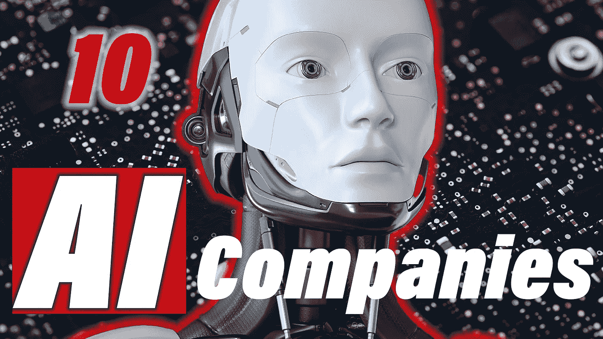
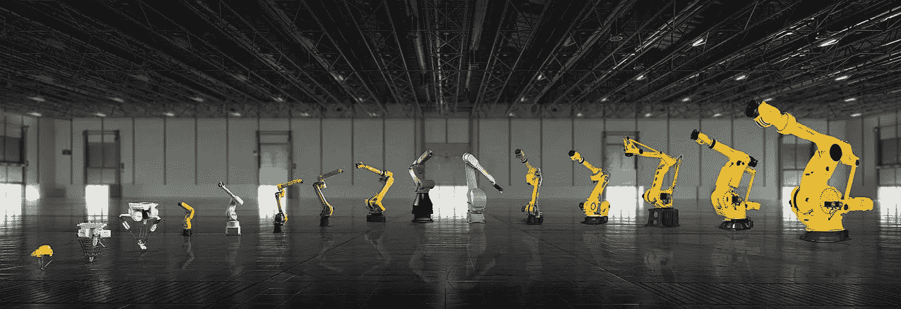
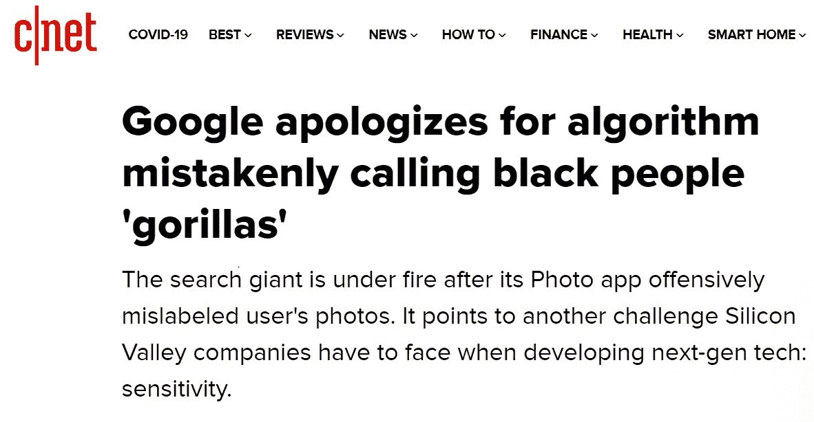

# 2021 年十大人工智能公司

> 原文：<https://pub.towardsai.net/10-biggest-ai-companies-2021-e89ab2ec8cea?source=collection_archive---------1----------------------->

## [技术](https://towardsai.net/p/category/technology)

## 2020 年人工智能专利冠军

由作者创建的图像，使用图像许可证持有通过 [Envato 元素](https://elements.envato.com/photos)

随着 2020 年最终结束，我们可以汇总一些关于人工智能(AI)世界发生的惊人统计数据。这正是[全球数据](https://www.globaldata.com/artificial-intelligence-tops-patent-filings-2020-finds-globaldata/)公司所做的，他们得出了 2020 年 10 大人工智能专利获得者。

我们将按顺序查看它们，并检查它们来自哪里，更重要的是它们正在做什么。

# 10.普通法规

佳能是一家日本公司，成立于 1937 年，拥有大约 20 万名员工，专营照相机、医疗设备、罐头盒、打印机和半导体制造设备。

他们资金充足的研发团队不断创新，使其成为每年申请专利最多的公司之一。然而，他们对人工智能的兴趣远远超出了简单的相机。他们在医学成像领域拥有最大的发展部门之一。

安:正如那些读过我关于医疗保健中的人工智能的文章的人所知道的，在医学领域有大量的想象在进行，许多人都在押注人工智能会使它变得更便宜、更好。

# 9.FANUC

FANUC 于 1958 年在日本成立，现在是世界上最大的工业机器人制造商。正如你可能已经猜到的，机器学习可以帮助他们的客户做一些事情。

FANUC 正在制作的机器人图像

他们专注于机器人技术，推出了几款领先的大型自动化工业机器，如机器人钻孔机、机器人成型机等。

一个有趣的新项目是 FANUC 的新人工智能防错系统。他们用机器人系统自动控制产品的质量。一般步骤是首先在坏的和好的物体的图像上训练 AI，例如，你可以用于生产的那些和你必须修复的那些。在此之后，机器人能够区分好产品和坏产品，并使质量控制变得更加简单。这个系统特别令人感兴趣，因为它也允许非专家训练和利用强大的人工智能系统。

# 8.华为

华为成立于 1987 年，是一家总部位于深圳的中国公司，以其电信和消费电子产品而闻名。虽然大多数中国大公司更关注亚洲市场，但华为也在西方发挥着重要作用。

虽然最近，他们与美国和其他西方当局就 5G 技术发生了一些纠纷，但许多人仍然喜欢他们的产品。

除了核心业务，他们的重点是向交通智能、工业生产、智能金融和我认为最有趣的智能城市扩展。

与发达城市相比，我认为发展中城市在这方面可能有优势，因为它们能够从头开始创造城市。

# 7.大写一

Capital One 是第一家上榜的美国公司，成立仅 26 年。它一开始非常注重信用卡，但现在提供许多银行服务，如汽车贷款。

看到他们出现在这个名单上让我有点吃惊，但是一旦你仔细观察细节，就不会了。他们在欺诈检测、客户支持和隐私领域的研究非常出色。

他们的欺诈检测聚集在 Graph ML 上，他们扫描交易边缘以检测是否有任何可疑的事情发生。正如你们许多人已经知道的，这是未来十年人工智能的最大趋势之一。

他们的客户支持正在使用自然语言处理领域的最新发现来节省成本和提高响应能力。

他们工作的很大一部分是人工智能的可解释性，以确保客户知道他们为什么被拒绝贷款，或者解释神经网络(NN)决策背后的一些其他方面的推理这是必要的。这也有助于他们避免使用神经网络可能导致的一些常见偏见和歧视。

# 6.阿里巴巴

另一个中国巨头是阿里巴巴，成立仅 22 年，但他们已经主导了大部分电子商务和在线零售领域。有趣的是，他们还拥有阿里妈妈的权利。

他们的安全系统对于传统的“芝麻开门”来说确实有点太好了，但除了安全，他们还是领先的人工智能公司，也是世界上最大的风险投资公司/投资合作公司之一。

他们在许多产品中使用人工智能，当然还有许多 it 物流和电子商务。然而，他们也利用自动化的力量开发全新的领域，例如 FlyZoo，一个完全由机器人和人工智能操作的未来概念酒店。虽然目前，这肯定不是最好的行业，但他们的方法很吸引人。

# 5.微软

总部设在雷德蒙的它是一个美国巨人，可能不需要解释。除了是领先的云提供商和科技巨头，他们还是机器学习研究和人工智能开发的主导力量。

虽然不是他们所有的人工智能实验都进行得很顺利，但我们可能会记得有一次他们意外地制造了一个纳粹推特机器人，他们做得对比做得差多了

来自推特的截图

在他们的 Azure 云中，他们提供你可能想要的所有服务，从图像分类到自然语言处理。他们与 OpenAI 的合作也显示了他们对该领域的承诺。

OpenAI 团队为我们带来了一些最壮观的模型，如 GPT-3，微软将独家授权并通过他们的 Azure API 提供。

微软还建造了一台新颖的人工智能超级计算机，供世界各地的研究人员使用。它具有超过 10k 个 GPU 和 285k 个 CPU，可以运行世界上一些最大的模型。

# 4.国际商用机器公司

国际商业机器公司(IBM)是一家美国科技公司，拥有 109 年的历史，是名单上最老的公司。除了在量子计算上下大赌注，他们还有一个庞大的人工智能部门。

他们的大部分人工智能都是在大约 7 年前赢得 Jeopardy 的沃森机器下进行的，这在当时确实引发了对神经网络和人工智能领域的很多兴趣。

与微软类似，他们通过沃森工作室围绕机器学习操作(MLOps)做了大量工作。他们对生命周期的特别强调使它成为更普遍已知的机器学习工具的一个令人耳目一新的替代品。

# 3.美国英特尔公司(财富 500 强公司之一ˌ以生产 CPU 芯片著称)

Intel inside 是我们成长的基础。他们的处理器使世界的数字化成为可能，并在很长一段时间内主导了市场。虽然现在越来越多的玩家正在开发自己的芯片，特别是在移动和可穿戴领域，但他们仍然是全球玩家。

他们对人工智能的兴趣主要是从硬件的角度出发，但他们也提供软件解决方案，以使最常见的机器学习工具，如 Tensorflow 和 Sklearn，在他们的硬件上运行得更好。

当你听说英特尔和人工智能时，大多是因为他们正在研究一些新形式的处理器，预计将改变机器学习的基础。

这正是他们在神经形态计算领域的最新进展试图实现的目标。我们的计算硬件主要基于冯·诺依曼架构，然而，人类大脑的工作方式非常不同，许多人认为，为了让人工智能取得更好的结果，我们需要模仿/复制它。

# 2.字母表

Alphabet 或者你可能知道的 Google 致力于让 AI 成为他们所有服务的核心产品。他们是世界上最大的数据收集者之一，因为机器学习喜欢高质量的数据，我们可以肯定他们将在人工智能领域保持巨大的影响力。

好吧，有一次他们称某人为大猩猩，但除此之外，他们对负责任的人工智能的承诺已经奏效，他们是这个领域的领导者之一。

截图自 Cnet

没有几天没有伟大的新发明形成谷歌实验室，他们给我们带来了谷歌助手和张量流。他们的云充满了人工智能服务，他们开始用数万亿的参数训练模型。

他们继续将人工智能发展到新的高度，因为他们一再证明，例如阿尔法围棋是世界上最好的围棋选手。或者他们用气球(称为 loon)在空中飞行 312 天的新纪录，通过切换到人工智能生成的导航而不是人类精心制作的算法。他们使用这些飞行器将互联网传送到地球上的农村地区或最近发生灾难的地区。

# 1.三星电子

三星集团有着 83 年的历史，是榜单上历史第二悠久的公司，占世界上技术最先进的国家之一韩国 GDP 的近 20%。

他们制造了从核电站到移动电话的所有东西，并且肯定拥有世界上最独特的数据集。对他们来说，在人工智能上下大赌注是很有意义的，很明显，这就是他们一直在做的。

三星研究院在五个国家共建立了七个全球 AI 中心，分别是韩国(首尔)、英国(剑桥)、加拿大(多伦多和蒙特利尔)、俄罗斯(莫斯科)、美国(硅谷和纽约。

他们在 2020 年的人工智能公司名单中遥遥领先，例如，阿里巴巴提交的申请几乎翻了一番。他们可能最酷的新玩意是 Neon，被称为世界上第一个人造人。由三星支持的 Star Labs 开发，我非常兴奋地看到这些 Neons 将如何永远改变游戏和数字化身的世界。

# 结论

这份名单上的公司取得的技术进步是惊人的。他们不同的方法和对技术的兴趣证明了不存在适合所有目的的方法。虽然他们申请的大多数专利永远不会变得重要，但其中许多肯定会对我们和整个社会产生持久的影响。

如果你喜欢这篇文章，我会很高兴在 Twitter 或 LinkedIn 上联系你。

一定要看看我的 [YouTube](https://www.youtube.com/channel/UCHD5o0P16usdF00-ZQVcFog?view_as=subscriber) 频道，我每周都会在那里发布新视频。