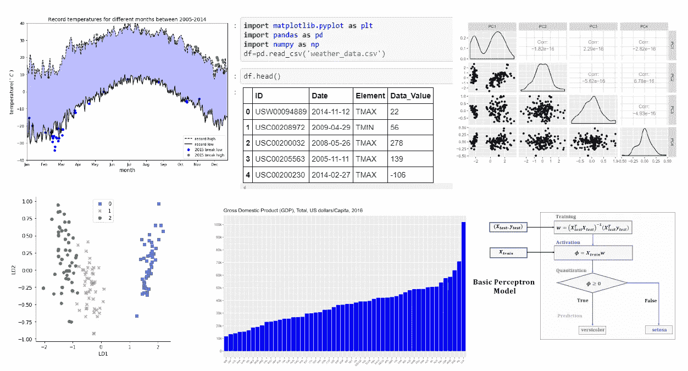

# 在从事数据科学职业之前需要考虑的 10 个问题

> 原文：<https://pub.towardsai.net/10-questions-to-consider-before-pursuing-a-career-in-data-science-9fc6a1c92ba3?source=collection_archive---------0----------------------->

## [职业](https://towardsai.net/p/category/careers)，[数据科学](https://towardsai.net/p/category/data-science)

## 在投身数据科学职业之前分析几个参数和条件

数据科学、机器学习和分析被认为是最热门的职业道路。行业、学术界和政府对熟练数据科学从业者的需求正在快速增长。因此，持续的“数据热潮”吸引了如此多具有不同背景的专业人士，如物理、数学、统计、经济和工程。数据科学家的就业前景非常乐观。IBM 预测到 2020 年对数据科学家的需求将飙升 28%:[https://www . Forbes . com/sites/louiscolombus/2017/05/13/IBM-predicts-demand-for-data-scientists-will-soar-28-by-2020/# 7916 f 3057 e3b](https://www.forbes.com/sites/louiscolumbus/2017/05/13/ibm-predicts-demand-for-data-scientists-will-soar-28-by-2020/#7916f3057e3b)。

本文将讨论对数据科学感兴趣的每个人在从事数据科学家职业之前应该考虑的 10 个重要问题。

## **1。数据科学家是做什么的？**

数据科学是一个如此广阔的领域，包括几个细分领域，如数据准备和探索；数据表示和转换；数据可视化和显示；预测分析；机器学习等。数据科学家处理数据，得出有意义、有见地的结论，推动机构的决策制定。他们的工作职责包括数据收集、数据转换、数据可视化和分析、构建预测模型、根据数据结果提供行动建议。数据科学家在医疗保健、政府、工业、能源、学术、技术、娱乐等不同领域工作。一些雇佣数据科学家的顶级公司是亚马逊、谷歌、微软、脸书、LinkedIn 和 Twitter。

## 2.数据科学家挣多少钱？

作为一名数据科学家，你的收入取决于你工作的组织或公司、你的教育背景、经验年限和你的具体工作角色。数据科学家的收入从 5 万美元到 25 万美元不等，平均工资约为 12 万美元。这篇 [**文章**](https://towardsdatascience.com/how-much-do-data-scientists-make-cbd7ec2b458) 讨论了更多关于数据科学家的薪资问题。

## 3.数据科学家的就业前景如何？

数据科学家的就业前景非常乐观。IBM 预测到 2020 年对数据科学家的需求将飙升 28%:[https://www . Forbes . com/sites/louiscolumbus/2017/05/13/IBM-predicts-demand-for-data-scientists-will-soar-28-by-2020/# 7916 f 3057 e3b](https://www.forbes.com/sites/louiscolumbus/2017/05/13/ibm-predicts-demand-for-data-scientists-will-soar-28-by-2020/#7916f3057e3b)。

## **4。我在数学、物理、计算机科学、工程或经济学等分析学科方面有扎实的背景吗？**

在分析学科方面有很强的背景是有利的。数据科学是高度数学密集型的，需要以下方面的知识:

a.统计和概率

b.多元微积分

c.线性代数

d.优化方法

## **5。我喜欢处理数据和编写程序来分析数据吗？**

数据科学需要扎实的编程功底。大多数数据科学职位列表中提到的**前五大编程语言**([数据科学家最需要的技能——走向数据科学](https://towardsdatascience.com/the-most-in-demand-skills-for-data-scientists-4a4a8db896db))是:

a.计算机编程语言

b.稀有

c.结构化查询语言

d.Hadoop

e.火花

如果你还没有读过这篇文章:**[**十年自学编程**](http://norvig.com/21-days.html)**《Peter nor vig(谷歌机器学习总监)**，我鼓励你这么做。这里的重点是，你不需要十年的时间来学习编程的基础知识，但是匆忙地学习编程肯定是没有帮助的。成为一名优秀的程序员和数据科学家需要时间、努力、精力、耐心和承诺。**

## ****6。我喜欢解决具有挑战性的问题吗？****

**数据科学问题非常具有挑战性。典型的数据科学项目包括以下阶段:**

**a.问题框架**

**b.数据收集和分析**

**c.模型构建、测试和评估**

**d.模型应用**

**从问题框架到模型构建和应用，这个过程可能需要几周甚至几个月，这取决于问题的规模。只有热衷于解决挑战性问题的人才能成为成功的数据科学家。**

## **7.我是否有足够的耐心继续工作，即使项目似乎遇到了障碍？**

**数据科学项目可能会很长，要求也很高。从问题框架到模型构建和应用，这个过程可能需要几周甚至几个月，这取决于问题的规模。作为一名实践数据科学家，项目遇到障碍是不可避免的。耐心、坚韧和毅力是成功的数据科学职业生涯的关键素质。**

## **8.我是否具备商业头脑，能够从模型中得出有意义的结论，从而为我的组织做出重要的数据驱动的决策？**

**数据科学是一个非常实用的领域。请记住，你可能非常擅长处理数据以及构建良好的机器学习算法，但作为一名数据科学家，现实世界的应用才是最重要的。每一个预测模型都必须产生有意义的、可解释的现实生活结果。预测模型必须根据实际情况进行验证，才能被认为是有意义和有用的。作为数据科学家，您的职责是从数据中提取有意义的见解，用于数据驱动的决策，从而提高您公司的效率或改善业务开展方式，或帮助增加利润。**

## **9.成为一名数据科学家需要多久？**

**如果你在**物理学**、**数学**、**工程学**、**计算机科学**、**经济学**，或者**统计学**等分析学科有扎实的功底，基本上可以自学数据科学的基础知识。你可以从像 **edX** 、 **Coursera** 或 **DataCamp** 这样的平台上免费学习在线课程开始。掌握数据科学的基础知识可能需要一两年的深入学习。请记住，仅从课程学习中获得的数据科学概念的坚实基础不会使你成为数据科学家。在建立了数据科学概念的坚实基础后，您可能会寻求实习或参加 Kaggle 竞赛，在那里您可以从事真正的数据科学项目。另一种练习数据科学技能的方法是使用 Github、LinkedIn 等平台展示您的项目，或者在 Medium 上撰写数据科学文章。下面是一些在介质上写数据科学文章的建议: [**在介质上写数据科学博客的初学者指南**](https://medium.com/towards-artificial-intelligence/beginners-guide-to-writing-data-science-blogs-on-medium-a74774cf8f66) **。****

## **10.有哪些学习数据科学的资源？**

**学习数据科学基础知识的资源有很多。以下是一些例子:**

**[**数据科学 101 —包含 R 和 Python 代码的中型平台短期课程**](https://medium.com/towards-artificial-intelligence/data-science-101-a-short-course-on-medium-platform-with-r-and-python-code-included-3cdc9d489c6d)**

****

****[**分析:必备工具和方法(Georgia TechX，through edX)**](https://www.edx.org/micromasters/analytics-essential-tools-methods)****

****[**应用数据科学与 Python 专业化(密歇根大学，通过 Coursera)**](https://www.coursera.org/specializations/data-science-python)****

****总之，我们已经讨论了 10 个重要问题，每个有兴趣从事数据科学职业的人都应该考虑这些问题。****