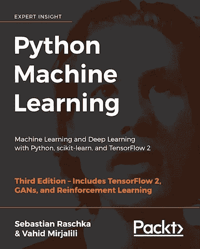

# 数据科学自学的 10 个资源

> 原文：<https://pub.towardsai.net/10-resources-for-data-science-self-study-866f7e07069a?source=collection_archive---------1----------------------->

## [数据科学](https://towardsai.net/p/category/data-science)

## *任何人都可以获得大量免费的数据科学学习资源*

*照片由* [*元素 5 数码*](https://unsplash.com/@element5digital?utm_source=medium&utm_medium=referral) *上* [*不晕*](https://unsplash.com?utm_source=medium&utm_medium=referral) *。*

*数据科学的自学有很多资源。在当今的信息技术时代，任何人都可以获得大量的免费学习资源，通过努力和奉献，您可以掌握数据科学的基础知识。*

T 数据科学有两种基本途径，传统的大学学位途径和自学途径。

**传统的大学学位途径**:一些顶尖大学提供传统的数据科学研究生课程。因为这些是研究生水平的项目，大多数都需要分析领域的本科学位，如物理、数学、会计、商业、计算机科学或工程。这些项目通常为期 3 至 4 个学期，适合全日制学生。传统课程有不同的类型，如:数据科学硕士、数据分析硕士或商业分析硕士。传统面授课程的学费可能在 15，000 美元到 40，000 美元之间，不包括生活费。对于在线数据科学硕士课程，费用可能在 12，000 美元到 40，000 美元之间。下面的链接调查了欧洲和美国/加拿大的顶级在线硕士学位，包括排名、学费等等。

*   [分析、商业分析、数据科学领域的顶级在线大师——更新](https://www.kdnuggets.com/2020/09/best-online-masters-data-science-analytics-online.html)
*   [美国/加拿大最佳分析、商业分析、数据科学硕士](https://www.kdnuggets.com/2019/05/best-masters-data-science-analytics-us-canada.html)
*   [2019 年数据科学与分析最佳硕士——欧洲版](https://www.kdnuggets.com/2019/04/best-masters-data-science-analytics-europe.html)

自学途径:如果你愿意，在大学里读四年(或者在研究生院读更多年)。这将使你对数据科学领域有更深入的了解，但如果你的情况不允许你攻读大学学位，你可以(带着一些激情和奉献精神)通过自学自学数据科学。edX、Coursera、DataCamp、Udacity、Udemy 等平台上有那么多优秀的在线数据科学课程。通过投入一些时间，您可以从这些课程中学习数据科学的基础知识。因此，与大学学位途径相比，自学途径非常实惠。

在这篇博客中，我们将讨论数据科学自学的 10 个资源。这些资源将被分成 3 个主要类别:(A) ***用于构建基础知识的资源***；(B) ***数据科学实践资源***；以及(C) ***用于联网和继续学习的资源。***

## **A.** **建筑基础知识资源**

您迈向数据科学之旅的第一步是在基础数据科学概念方面积累丰富的知识。下面讨论的资源有助于学习基本概念。

***1。*** 海量开放在线课程(MOOCs)

对数据科学从业者不断增长的需求导致了大规模开放在线课程(MOOCs)的激增。最受欢迎的 MOOCs 提供商包括:

*   **EDX**:[https://www.edx.org/](https://www.edx.org/)
*   **Coursera**:[https://www.coursera.org/](https://www.coursera.org/)
*   **数据营**:[https://www.datacamp.com/](https://www.datacamp.com/)
*   **乌迪米**:[https://www.udemy.com/](https://www.udemy.com/)
*   **乌达城**:【https://www.udacity.com/】T42
*   琳达:[https://www.lynda.com/](https://www.lynda.com/)

如果你打算参加这些课程中的一门，请记住，有些 MOOCs 是 100%免费的，而有些则需要你支付订阅费(每门课程可能从 50 美元到 200 美元不等，甚至更多，因平台而异)。请记住，获得任何学科的专业知识都需要大量的时间和精力。所以，不要着急。确保如果你决定注册一门课程，你应该准备好完成整个课程，包括所有的作业和家庭作业问题。一些测验和家庭作业将会很有挑战性。然而，请记住，如果你不挑战自己，你就无法在知识和技能上有所增长。

我自己已经完成了这么多数据科学 MOOCs，下面是我最喜欢的 3 个数据科学专业。

[**数据科学专业证书**](https://www.edx.org/professional-certificate/harvardx-data-science) **(HarvardX，通过 edX)**

包括以下课程，全部使用 R 教授(您可以免费旁听课程或购买认证证书):

数据科学:R 基础；

数据科学:可视化；

数据科学:概率；

数据科学:推理和建模；

数据科学:生产力工具；

数据科学:扯皮；

数据科学:线性回归；

数据科学:机器学习；

数据科学:顶点

[**分析:基本工具和方法**](https://www.edx.org/micromasters/gtx-analytics-essential-tools-and-methods) **(Georgia TechX，through edX)**

包括以下课程，全部使用 R、Python 和 SQL 讲授(您可以免费审计或购买经过验证的证书):

分析建模导论；

数据分析计算导论:

商业数据分析。

[**应用数据科学与 Python 专业化**](https://www.coursera.org/specializations/data-science-python) **(密歇根大学，通过 Coursera)**

包括以下课程，全部使用 python 教授(您可以免费旁听大多数课程，有些课程需要购买认证证书):

Python 中的数据科学导论；

应用 Python 绘图、制图和数据表示；

Python 中的应用机器学习；

Python 中文本挖掘的应用:

Python 中的应用社会网络分析

**②*。从教科书中学习***

从教科书中学习提供了比你从在线课程中获得的更精炼和更深入的知识。这本书对数据科学和机器学习提供了很好的介绍，代码包括:**“Python 机器学习”，作者 Sebastian Raschka** 。[https://github . com/rasbt/python-machine-learning-book-第三版](https://github.com/rasbt/python-machine-learning-book-3rd-edition)

作者以一种非常容易理解的方式解释了机器学习的基本概念。此外，代码也包括在内，因此您实际上可以使用提供的代码来练习和构建您自己的模型。我个人认为这本书在我作为数据科学家的旅程中非常有用。我会向任何数据科学爱好者推荐这本书。你所需要的是基本的线性代数和编程技能，以便能够理解这本书。

还有许多其他优秀的数据科学教科书，如 Wes McKinney 的“ [Python for Data Analysis](https://sushilapalwe.files.wordpress.com/2018/04/python-for-data-analytics-book.pdf) ”、Kuhn & Johnson 的[Applied Predictive Modeling](https://vuquangnguyen2016.files.wordpress.com/2018/03/applied-predictive-modeling-max-kuhn-kjell-johnson_1518.pdf)以及 Ian H. Witten、Eibe Frank & Mark A. Hall 的“[Data Mining:Practical Machine Learning Tools and Techniques](https://www.wi.hs-wismar.de/~cleve/vorl/projects/dm/ss13/HierarClustern/Literatur/WittenFrank-DM-3rd.pdf)”。

***3。******YouTube***

YouTube 包含几个教育视频和教程，可以教你数据科学所需的基本数学和编程技能，以及几个面向初学者的数据科学教程。一个简单的搜索就会产生几个视频教程和讲座。YouTube 上我最喜欢的三门课程是:

吉尔伯特·斯特朗的《线性代数》

[亚力山大阿米尼《深度学习导论》](https://www.youtube.com/playlist?list=PLtBw6njQRU-rwp5__7C0oIVt26ZgjG9NI)

[约翰·古塔格和埃里克·格里姆森的计算思维和数据科学导论](https://www.youtube.com/playlist?list=PLRJdqdXieSHMtmKxr4s78F7U88l-SawAj)

**4。** ***可汗学院***

Khan academy 也是一个学习数据科学所需的基本数学、统计学、微积分和线性代数技能的好网站。对于对数据科学感兴趣但没有必要的定量背景的个人来说，这应该是一个很好的资源。

## **B.** **数据科学实践资源**

由于数据科学是一个实践领域，仅从课程工作中获得的学术知识不会使你成为数据科学家。您需要将您的知识应用到现实世界的数据科学项目中，以获得数据科学从业者的资格。以下平台将使您能够通过将知识应用于实际问题来磨练您的数据科学技能。

***5。***

*[Kaggle](https://www.kaggle.com/) 是世界上最大的数据科学社区，拥有强大的工具和资源来帮助您实现数据科学目标。Kaggle 允许用户查找和发布数据集，在基于网络的数据科学环境中探索和构建模型，与其他数据科学家和机器学习工程师合作，并参加竞赛以解决数据科学挑战。在这个平台上，你可以访问[数据集](https://www.kaggle.com/datasets)、[课程](https://www.kaggle.com/learn/overview)、[笔记本](https://www.kaggle.com/notebooks)和[比赛](https://www.kaggle.com/competitions)。随着您参与 Kaggle 项目和竞赛，您在数据科学方面的知识和经验将不断增长。Kaggle 也是一个与其他数据科学从业者和爱好者交流的伟大平台。*

****6。*** ***实习****

*实习为从事数据科学项目提供了绝佳的机会。一些公司为学生提供实习机会，时间从几个月到一年不等。数据科学实习通常通过 indeed.com 或 LinkedIn Jobs 等平台发布。*

## ***C.** **网络和持续学习资源***

*由于数据科学领域的技术发展，它是一个不断发展的领域，因此持续的学习对数据科学至关重要。创建一个与其他数据科学家合作的网络将使你始终处于游戏的顶端。以下平台是建立关系网和继续学习的绝佳资源。*

****7。*** ***中等****

*[Medium](https://medium.com/) 现在被认为是增长最快的数据科学和网络学习平台之一。如果您有兴趣使用该平台进行数据科学自学，第一步将是创建一个中型帐户。您可以创建一个免费帐户或会员帐户。对于免费帐户，每月可以访问的会员文章数量是有限制的。会员账户需要 5 美元或 50 美元/年的月订阅费。从这里了解更多关于成为中等会员的信息:[**https://medium.com/membership**](https://medium.com/membership)。*

*有了会员帐号，你将可以无限制地访问媒体文章和出版物。Medium 有几个数据科学出版物，可以帮助您了解该领域的新发展，并与其他数据科学家或有志之士建立联系。媒体上排名前两位的数据科学出版物分别是面向数据科学的**和面向人工智能的。每天都有新的文章发表在 medium 上，涵盖数据科学、机器学习、数据可视化、编程、人工智能等主题。使用 medium 网站上的搜索工具，您可以访问如此多的文章和教程，涵盖了从基本概念到高级概念的各种数据科学主题。***

******8。******LinkedIn******

***LinkedIn 是一个极好的社交平台。LinkedIn 上有几个数据科学小组和组织，你可以加入，例如，oriented AI、DataScienceHub、oriented data science、KDnuggets 等。你也可以在这个平台上关注该领域的顶级领导者。***

******9。******KD nuggets******

***KDnuggets 是人工智能、分析、大数据、数据挖掘、数据科学和机器学习领域的领先网站**。**在该网站上，您可以找到数据科学方面的重要教育工具和资源以及职业发展工具:***

***[博客/新闻](https://www.kdnuggets.com/news/index.html)***

***[意见](https://www.kdnuggets.com/opinions/index.html)***

***[教程](https://www.kdnuggets.com/tutorials/index.html)***

***[头条新闻](https://www.kdnuggets.com/news/top-stories.html)***

***[公司](https://www.kdnuggets.com/companies/index.html)***

***[课程](https://www.kdnuggets.com/courses/index.html)***

***[数据集](https://www.kdnuggets.com/datasets/index.html)***

***[教育](https://www.kdnuggets.com/education/index.html)***

***[事件(在线)](https://www.kdnuggets.com/meetings/index.html)***

***[工作岗位](https://www.kdnuggets.com/jobs/index.html)***

***[软件](https://www.kdnuggets.com/software/index.html)***

***[网络研讨会](https://www.kdnuggets.com/webcasts/index.html)***

******10。******GitHub******

***GitHub 包含几个关于数据科学和机器学习的教程和项目。除了作为数据科学教育的优秀资源，GitHub 还是[项目组织](https://towardsdatascience.com/how-to-organize-your-data-science-project-dd6599cf000a)和项目组合构建的优秀平台。有关在 GitHub 上创建数据科学投资组合的更多信息，请参见以下文章:[使用这些平台构建脱颖而出的投资组合](https://www.kdnuggets.com/2021/01/build-data-science-portfolio.html)。***

## *****总结*****

***总之，我们已经讨论了数据科学自学的几种资源。在现代信息技术时代，有大量的免费资源用于数据科学自学。通过一点点努力和奉献，任何人都可以掌握数据科学的基础知识。***

****原载于*[*https://www.kdnuggets.com*](https://www.kdnuggets.com/2021/02/10-resources-data-science-self-study.html)*。****