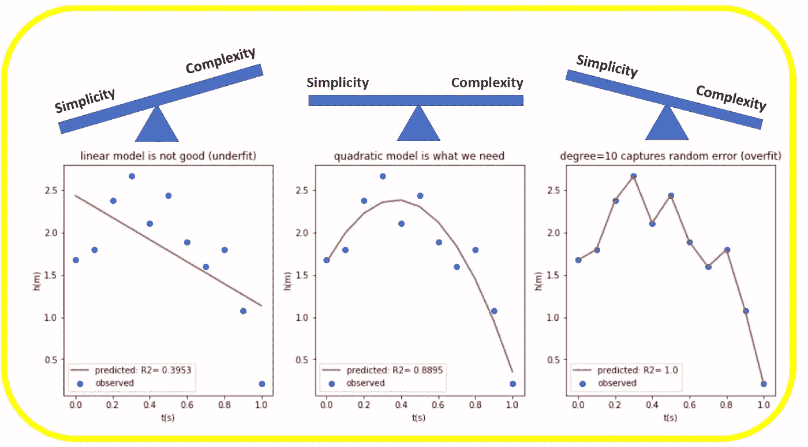
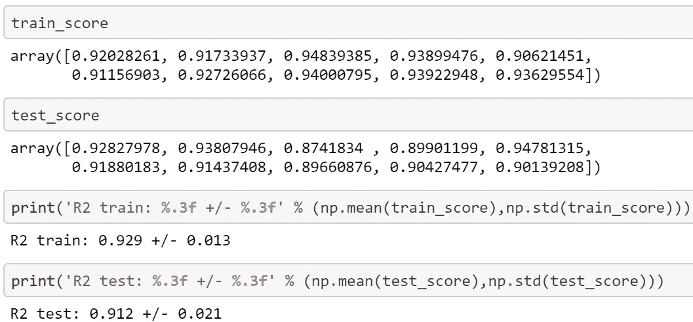

# 机器学习中的 12 个常见错误

> 原文：<https://pub.towardsai.net/12-common-errors-in-machine-learning-729cb9d0952a?source=collection_archive---------0----------------------->

## [机器学习](https://towardsai.net/p/category/machine-learning)

## 检查可能影响模型预测能力的各种类型的错误


照片由[免费使用声音](https://unsplash.com/@freetousesoundscom?utm_source=medium&utm_medium=referral)在 [Unsplash](https://unsplash.com?utm_source=medium&utm_medium=referral)

完美的机器学习模型是不存在的。一个模型的总报告误差已被纳入其贡献的几个来源。因此，模型的预测能力取决于数据科学家处理这些误差源的经验。在这篇博客中，我们讨论了机器学习中的 12 个常见错误。

# 1.数据收集出错

数据收集会在不同层面产生错误。例如，调查可以设计为收集数据。然而，参与调查的个人可能并不总是提供正确的信息。例如，参与者可能会输入错误的年龄、身高、婚姻状况、收入等信息。当在为记录和收集数据而设计的系统中存在错误时，也可能发生数据收集中的错误。例如，温度计中的传感器故障会导致温度计记录错误的温度数据。

# 2.数据存储出错

存储数据可能会导致错误，因为一些数据可能会被错误地保存，或者部分数据可能会在存储过程中丢失。

# 3.数据检索出错

检索数据也会产生错误，因为数据的某些部分可能会丢失或损坏。

# 4.数据插补误差

通常，移除样本或删除整个特征列是不可行的，因为我们可能会丢失太多有价值的数据。在这种情况下，我们可以使用不同的插值技术来估计数据集中其他训练样本的缺失值。最常见的插值技术之一是**均值插补**，我们只需用整个特征列的平均值替换缺失值。用于输入缺失值的其他选项是中间值或最**频繁(模式)**，其中后者用最频繁的值替换缺失值。这对于输入分类特征值很有用。另一种可以使用的插补技术是**中位数插补**。无论您在模型中采用何种插补方法，您都必须记住，插补只是一种近似值，因此可能会在最终模型中产生误差。

# 5.缩放误差

为了使要素具有相同的比例，我们可以决定使用要素的规范化或标准化。大多数情况下，我们假设数据是正态分布的，并默认为标准化的，但事实并非总是如此。在决定是使用标准化还是规范化之前，首先要了解要素是如何分布的，这一点很重要。如果特征趋向于均匀分布，那么我们可以使用归一化( *MinMaxScaler* )。如果特征是近似高斯的，那么我们可以使用标准化( *StandardScaler* )。同样，请注意，无论您采用标准化还是规范化，这些都是近似方法，必然会导致模型的总体误差。

# 6.偏移误差

当训练模型时使用的特征太少时，就会出现这种情况。在这种情况下，模型过于简单或不合适。使用低维数据集构建模型的优势在于，最终的模型将是简单且易于解释的。此外，建立在包含较少特征的低维空间上的模型易于执行(训练、测试和评估所需的计算时间更少)。

# 7.方差误差

当在训练模型时使用了太多的特征，使得模型捕捉到真实的和随机的效果时，就会发生这种情况。通常，在非常高维的数据集上训练的模型过于复杂，难以解释。在偏置误差(欠拟合)和方差误差(过拟合)之间找到恰当的平衡总是好的，如下图所示:



偏差误差(欠拟合)和方差误差(过拟合)的图示。图片来源:[机器学习中的简单性与复杂性——找到正确的平衡](https://towardsdatascience.com/simplicity-vs-complexity-in-machine-learning-finding-the-right-balance-c9000d1726fb)，Benjamin O. Tayo

# 8.随机误差

这种错误源于数据集固有的随机性。随机误差可以使用 k 倍交叉验证来评估。在 k-fold 交叉验证中，数据集被随机划分为训练集和测试集。该模型在训练集上被训练，并在测试集上被评估。该过程重复 k 次。然后，通过对 k 倍进行平均来计算平均训练和测试分数。以下是 k 倍交叉验证伪代码:


k 倍交叉验证伪代码。Benjamin O. Tayo 的照片

以下是 10 倍交叉验证计算的样本输出:



来自 k 倍交叉验证计算的样本 R2 输出。来源:[机器学习模型评估的实践 k-fold 交叉验证—游轮数据集](https://medium.com/towards-artificial-intelligence/hands-on-k-fold-cross-validation-for-machine-learning-model-evaluation-cruise-ship-dataset-27390d58776d)，Benjamin O. Tayo

我们从上面的输出中看到，训练和测试分数的 R2 值非常一致。这意味着数据集中的随机可变性是最小的。

# 9.超参数调谐错误

这个错误是由于在模型中使用了错误的超参数值而产生的。为了确定具有最佳性能的模型，针对所有超参数训练模型是很重要的。一个模型的预测能力如何依赖于超参数的很好的例子可以在下图中找到(来源: [**好坏回归分析**](https://medium.com/towards-artificial-intelligence/bad-and-good-regression-analysis-700ca9b506ff) )。


使用不同学习率参数值的回归分析。来源:[好坏回归分析](https://medium.com/towards-artificial-intelligence/bad-and-good-regression-analysis-700ca9b506ff)，发表于《走向人工智能》2019 年 2 月，作者 Benjamin O. Tayo。

从上图可以看出，我们模型的可靠性取决于超参数调整。如果我们只是为学习率选择一个随机值，比如 eta = 0.1，这将导致一个糟糕的模型。为 eta 选择一个太小的值，比如 eta = 0.00001，也会产生一个不好的模型。我们的分析表明，最佳选择是当 eta = 0.0001 时，从 R 平方值可以看出。

scikit-learn 软件包中使用的超参数的更多示例如下:

```
Perceptron(n_iter=40, eta0=0.1, random_state=0)train_test_split( X, y, test_size=0.4, random_state=0)LogisticRegression(C=1000.0, random_state=0)KNeighborsClassifier(n_neighbors=5, p=2, metric='minkowski')SVC(kernel='linear', C=1.0, random_state=0)DecisionTreeClassifier(criterion='entropy', 
                       max_depth=3, random_state=0)Lasso(alpha = 0.1)PCA(n_components = 4)
```

# 10.模型选择错误

这个错误是由所选择的机器学习算法的类型引起的。例如，假设我们想要建立一个用于二进制分类的机器学习模型。有许多分类算法可供选择，例如:

```
LogisticRegression()KNeighborsClassifier()SVC()DecisionTreeClassifier()RandomForestClassifier()GaussianNB()
```

评估模型选择误差的一种方法是实施上述每种算法，并选择具有最佳性能(例如，最佳 R2 评分或 AUC 值)的算法。另一种方法是执行整体平均，其中可以通过对来自所有使用的分类器的 R2 分数进行平均来计算总的 R2 分数。

# 11.伦理错误

当数据被操纵时，或者当一种方法被用来有意地在结果中产生偏差以达到误导或操纵公众的目的时，就会发生伦理错误。道德和隐私考虑是数据科学中必须的。你需要理解你的项目的含义。对自己诚实。避免操纵数据或使用有意造成结果偏差的方法。从数据收集到分析，再到模型构建、分析、测试和应用，所有阶段都要合乎道德。避免为了误导或操纵你的观众而捏造结果。在解释你的数据科学项目的发现时要合乎道德。

# 12.泛化/反馈误差

这些是在部署机器学习模型并将其投入生产时遇到的错误。由于实验训练数据集不同于真实世界的数据集，因此模型预计会产生错误。从实验模型转换到生产线上的实际性能时遇到的任何错误都必须进行分析。然后，这可以用作微调原始模型的有价值的反馈。

总之，我们已经讨论了机器学习中的 12 个常见错误。通常，模型的预测能力取决于构建模型的个人的经验。在构建模型时，我们要记住可能的误差来源，这一点很重要。减少模型误差的最佳方法是根据所有模型参数和超参数调整模型。然后选择具有最佳性能的参数。没有两个机器学习项目是相同的。因此，请确保仔细研究数据集，并确定可能在模型中产生错误的不同影响。

# 参考

1.  [**机器学习中的简单与复杂——找到正确的平衡**](https://towardsdatascience.com/simplicity-vs-complexity-in-machine-learning-finding-the-right-balance-c9000d1726fb) **。**
2.  [**机器学习模型评估的动手 k 折交叉验证—邮轮数据集**](https://medium.com/towards-artificial-intelligence/hands-on-k-fold-cross-validation-for-machine-learning-model-evaluation-cruise-ship-dataset-27390d58776d) **。**
3.  [**坏与好回归分析**](https://medium.com/towards-artificial-intelligence/bad-and-good-regression-analysis-700ca9b506ff) **。**

# 其他数据科学/机器学习资源

[数据科学最低要求:开始从事数据科学工作需要知道的 10 项基本技能](https://towardsdatascience.com/data-science-minimum-10-essential-skills-you-need-to-know-to-start-doing-data-science-e5a5a9be5991)

[数据科学课程](https://medium.com/towards-artificial-intelligence/data-science-curriculum-bf3bb6805576)

[机器学习的基本数学技能](https://medium.com/towards-artificial-intelligence/4-math-skills-for-machine-learning-12bfbc959c92)

[3 个最佳数据科学 MOOC 专业](https://medium.com/towards-artificial-intelligence/3-best-data-science-mooc-specializations-d58da382f628)

[进入数据科学的 5 个最佳学位](https://towardsdatascience.com/5-best-degrees-for-getting-into-data-science-c3eb067883b1)

[数据科学作品集比简历更有价值](https://towardsdatascience.com/a-data-science-portfolio-is-more-valuable-than-a-resume-2d031d6ce518)

***如有疑问和询问，请发邮件给我***:benjaminobi@gmail.com