# 熊猫入门的 15 个步骤——完全入门指南

> 原文：<https://pub.towardsai.net/15-steps-to-getting-started-with-pandas-complete-beginners-guide-445a71fdd1e?source=collection_archive---------4----------------------->

## 用于处理数据的基本 Pandas 功能——读取、写入和操作数据


由[卡里·谢伊](https://unsplash.com/@karishea?utm_source=medium&utm_medium=referral)在 [Unsplash](https://unsplash.com?utm_source=medium&utm_medium=referral) 拍摄的照片

Pandas 是一个快速、强大、灵活且易于使用的开源数据分析和操作工具，构建于 Python 编程语言之上。掌握 Pandas 将使您的分析技能更上一层楼，了解最佳实践将为您节省大量时间和精力。

在本文中，我们将探索 Pandas 库以及如何使用它来处理您在分析过程中可能会遇到的不同类型的数据。在本教程结束时，您将会更加熟练地使用 Pandas 的功能。

## 本文中使用的数据链接:

要读取数据，您只需粘贴到`pd.read_csv()`函数中:

*   [chiporders.csv](https://raw.githubusercontent.com/fares-ds/data_analysis_in_python_with_pandas/master/pandas_basics/data/chiporders.csv)
*   [uforeports.csv](https://raw.githubusercontent.com/fares-ds/data_analysis_in_python_with_pandas/master/pandas_basics/data/uforeports.csv)
*   [imdbratings.csv](https://raw.githubusercontent.com/fares-ds/data_analysis_in_python_with_pandas/master/pandas_basics/data/imdbratings.csv)
*   [movie user . CSV](https://raw.githubusercontent.com/fares-ds/data_analysis_in_python_with_pandas/master/pandas_basics/data/movieuser.csv)

# 目录

[1。如何使用熊猫读写表格数据文件？](#0192)
[2。如何从数据框中选择熊猫系列？](#cc76)
[3。如何重命名熊猫数据框架中的列？](#c512)
[4。如何从 Pandas 数据框架中删除列？](#23f1)
[5。如何对熊猫数据帧或系列进行排序？](#eaa9)
[6。如何通过列值过滤熊猫数据帧的行？](#3c9e)
[7。我如何在熊猫中使用字符串方法？](#93fa)
[8。如何更改熊猫系列的数据类型？](#212f)
[9。熊猫什么时候该用“groupby”？](#6b72)
[10。我如何处理熊猫中缺失的值？](#93a5)
[11。关于熊猫指数我需要知道什么？](#82c5)
[12。我如何从熊猫数据框中选择多行和多列？](#0a4d)
[13。我如何在熊猫中处理日期和时间？](#0b3a)
[14。如何在 pandas 中找到并删除重复行？](#f48b)
[15。如何对熊猫系列或数据帧应用函数？](#0bb2)

# 1.如何使用熊猫读写表格数据文件？

`pandas.read_csv()`是读取`csv`文件的最好和最简单的方法。它有很多参数可以满足大多数情况。为了只读我们需要的列，传递一个列名列表给`usecols`。我们还可以通过向`nrows`传递一个数字来指定行数。

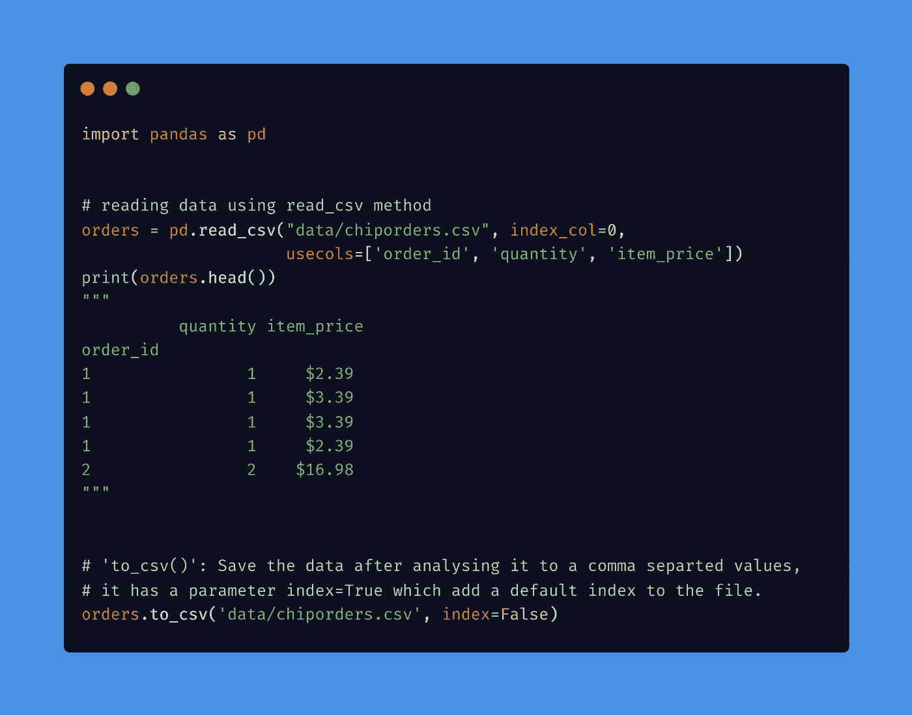

图 1:用熊猫读/写数据

# 2.如何从数据框中选择熊猫系列？

我们可以通过直接访问列来选择熊猫系列，例如:`df[‘City’]`另一种方式是将列作为属性来访问，但是在这种情况下，列的名称必须遵守变量命名的条件(没有空格，以字母开头，…)。

```
City Shape Reported State
0                Ithaca       TRIANGLE    NY
1           Willingboro          OTHER    NJ
2               Holyoke           OVAL    CO
3               Abilene           DISK    KS
4  New York Worlds Fair          LIGHT    NY0                  Ithaca
1             Willingboro
2                 Holyoke
3                 Abilene
4    New York Worlds Fair
Name: City, dtype: object
```

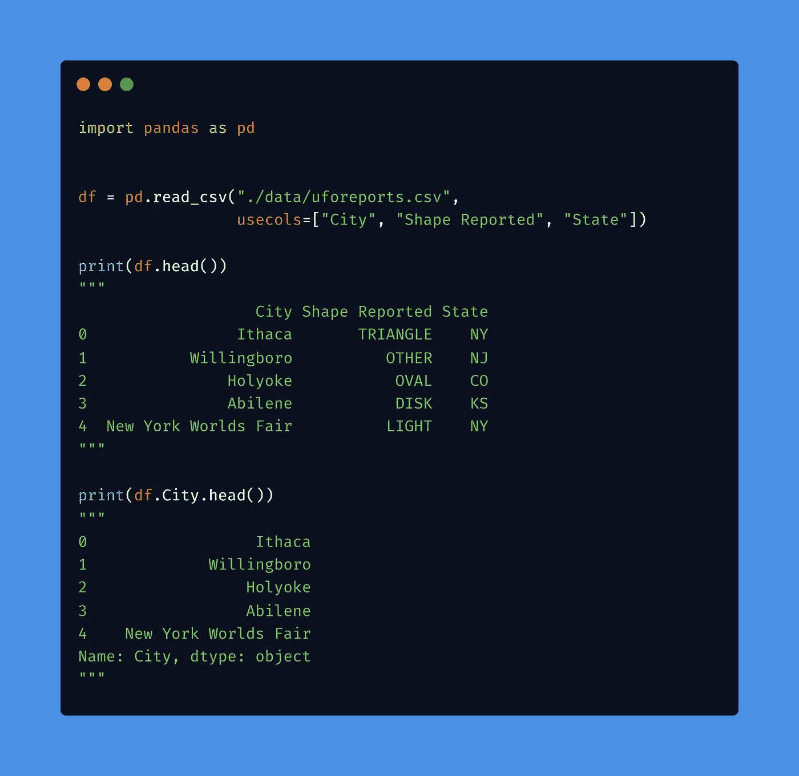

图 2:从数据帧中选择一个系列

# 3.如何重命名熊猫数据框架中的列？

重命名 Pandas `DataFrame` 中的列的一种方法是使用`rename()`函数。当我们需要重命名一些选定的列时，这种方法非常有用，因为我们只需要为要重命名的列指定信息。

```
Index(['City', 'Colors Reported', 'Shape Reported', 'State', 'Time',
       'Location'],
      dtype='object')Index(['City', 'Colors_Reported', 'Shape_Reported', 'State', 'Time',
       'Location'],
      dtype='object')Index(['city', 'colors reported', 'shape reported', 'state', 'time',
       'location'],
      dtype='object')Index(['city', 'colors_reported', 'shape_reported', 'state', 'time',
       'location'],
      dtype='object')
```

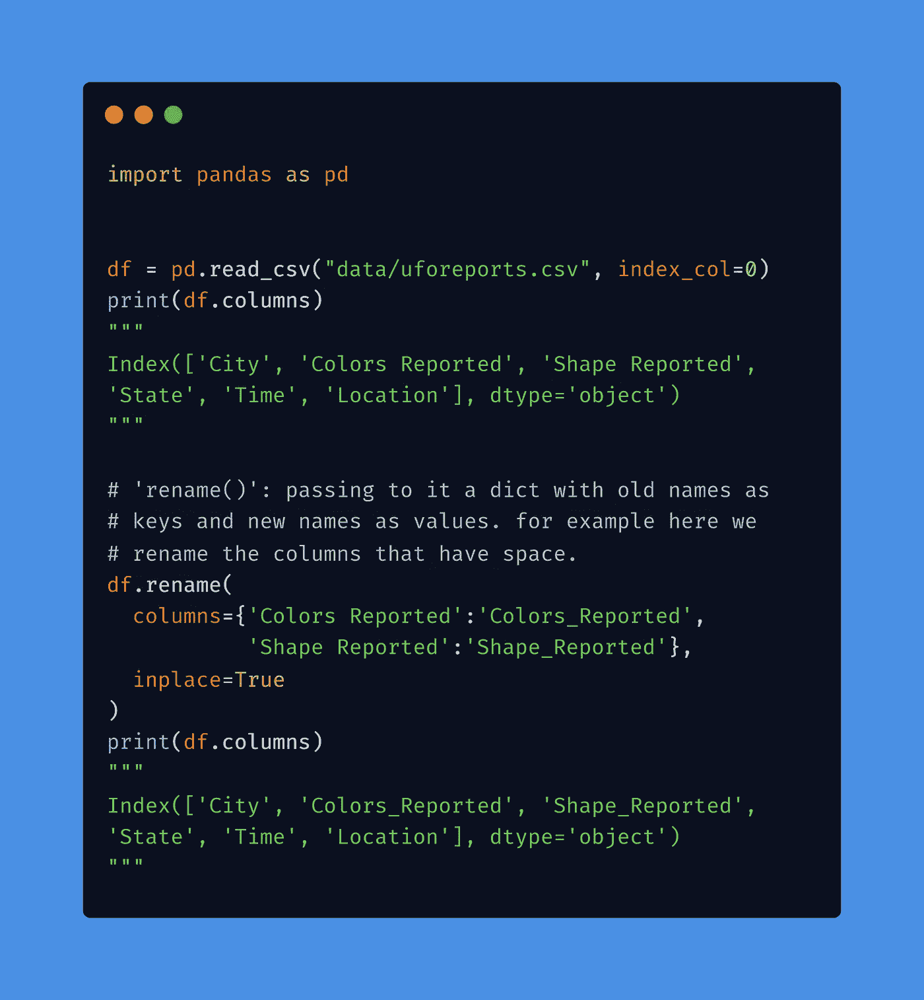

图 3:用熊猫重命名列—第 1 部分

也可以通过将包含新名称的列表直接分配给我们想要重命名列的对象`DataFrame`的`columns`属性来重命名列。这种方法的缺点是，我们需要为所有的列提供新的名称，即使我们只想重命名一些列。

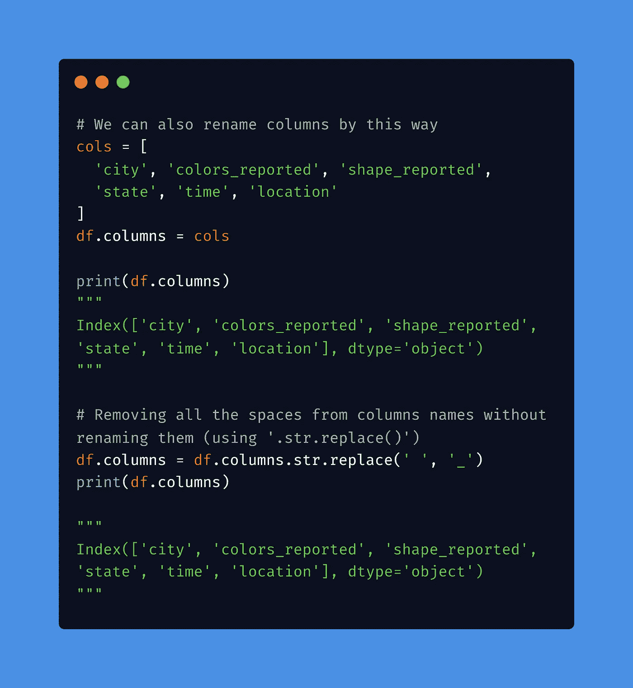

图 4:用熊猫重命名列—第 2 部分

# 4.如何从 Pandas 数据框架中删除列？

从`DataFrame`中删除一列或多列可以通过多种方式实现。`.drop()`法中最常见的一种。使用它，我们可以删除多列或多行。

```
Index(['City', 'Colors Reported', 'Shape Reported', 'State', 'Time',
       'Location'],
      dtype='object')Index(['City', 'Shape Reported', 'State', 'Time', 'Location'], dtype='object')Index(['Shape Reported', 'State', 'Time'], dtype='object')
```

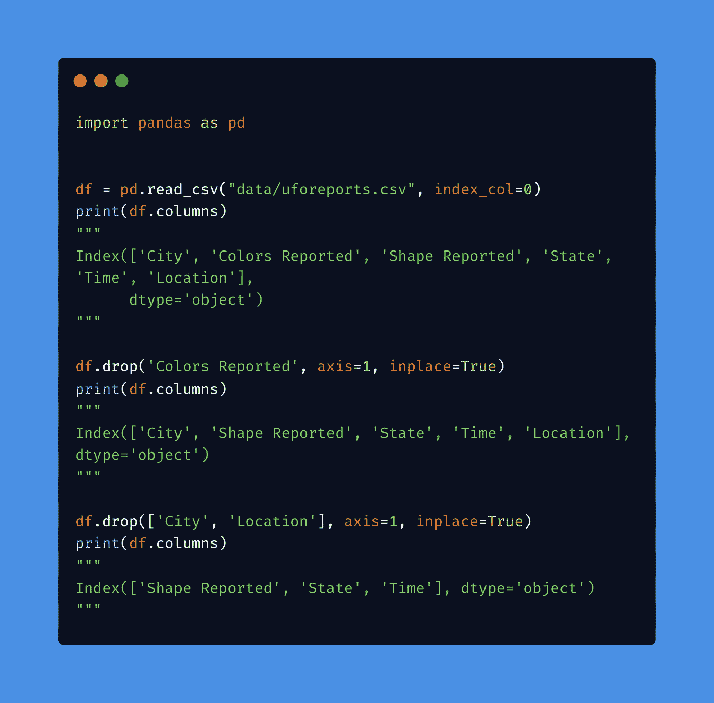

图 5:从 Pandas 数据框架中删除列

# 5.如何对熊猫数据帧或系列进行排序？

为了对熊猫数据帧进行排序，我们使用了`.sort_values()`方法。它可以按升序或降序对值进行排序。

```
star_rating                     title  duration
0          9.3  The Shawshank Redemption       142
1          9.2             The Godfather       175
2          9.1    The Godfather: Part II       200
3          9.0           The Dark Knight       152
4          8.9              Pulp Fiction       154star_rating                        title  duration
941          7.4             A Bridge Too Far       175
938          7.4          Alice in Wonderland        75
975          7.4  Back to the Future Part III       118
933          7.4                  Beetlejuice        92
972          7.4               Blue Valentine       112
```

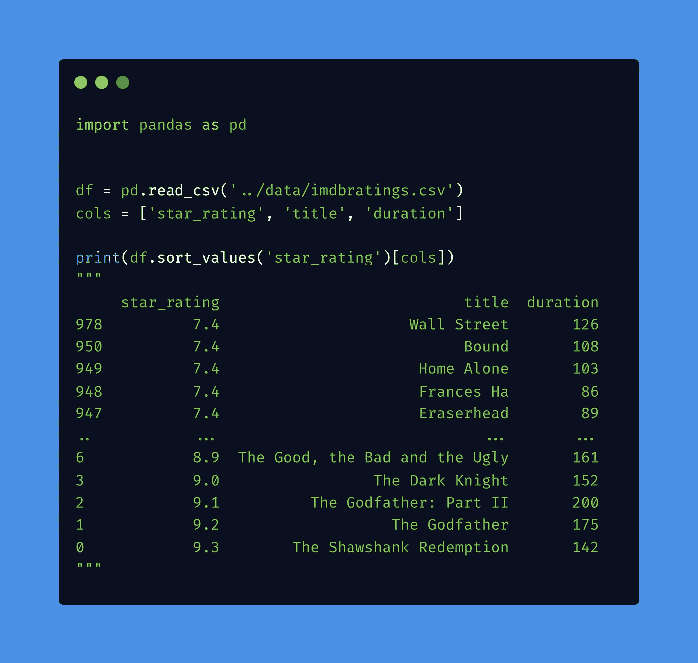

图 6:对熊猫数据帧进行排序—第 1 部分

我们可以通过传递您想要排序的列的列表来按多个标准排序。

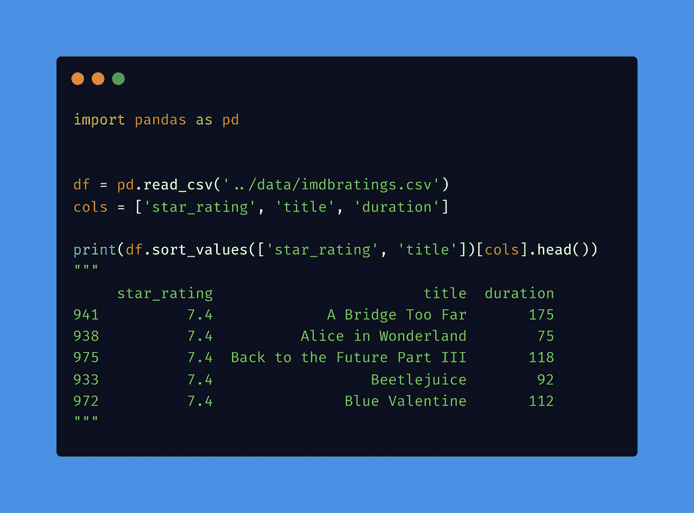

图 7:对熊猫数据帧进行排序—第 2 部分

# 6.如何通过列值过滤熊猫数据帧的行？

过滤是数据分析中的一种常见操作，Pandas 提供了多种方式来过滤数据点。这里我们使用了:逻辑操作符和多个逻辑操作符。还有很多其他的过滤技术，比如:`.isin()`、`.query()` …

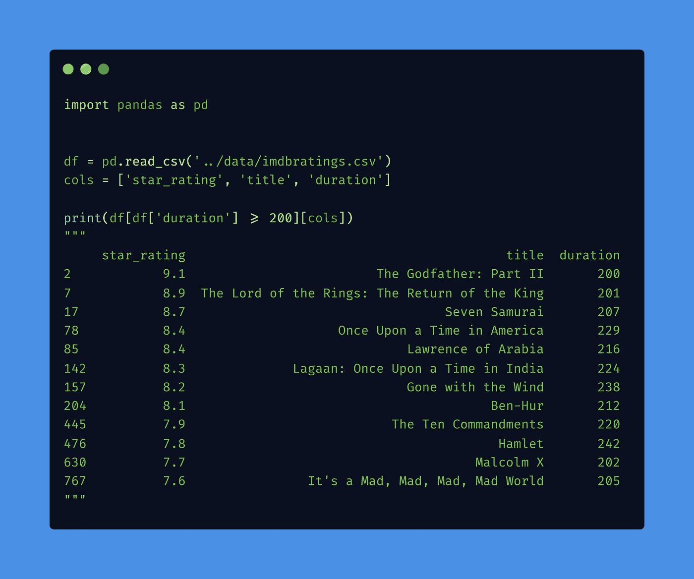

图 8:通过列值过滤熊猫数据帧的行—第 1 部分

要按多个标准应用过滤，请使用'`**&**`'、' T10 '(而不是'`**and**`'、' T12 ')。如果我们有一个像这样的更长的条件，我们可以使用'`**isin**`'方法。

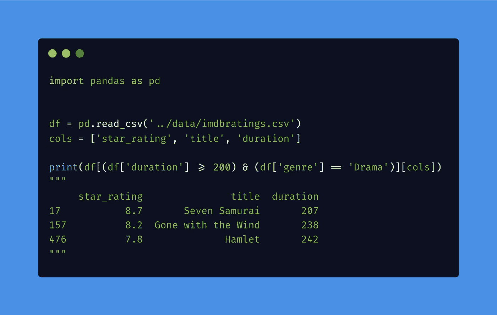

图 9:通过列值过滤熊猫数据帧的行—第 2 部分

# 7.我如何在熊猫中使用字符串方法？

Index 上的 **string** 方法对于清理或转换 **DataFrame** 列特别有用。

```
0             CHIPS AND FRESH TOMATO SALSA
1                                     IZZE
2                         NANTUCKET NECTAR
3    CHIPS AND TOMATILLO-GREEN CHILI SALSA
4                             CHICKEN BOWL
Name: item_name, dtype: object0             chips and fresh tomato salsa
1                                     izze
2                         nantucket nectar
3    chips and tomatillo-green chili salsa
4                             chicken bowl
Name: item_name, dtype: object0    False
1    False
2    False
3    False
4    False
Name: item_name, dtype: bool
```

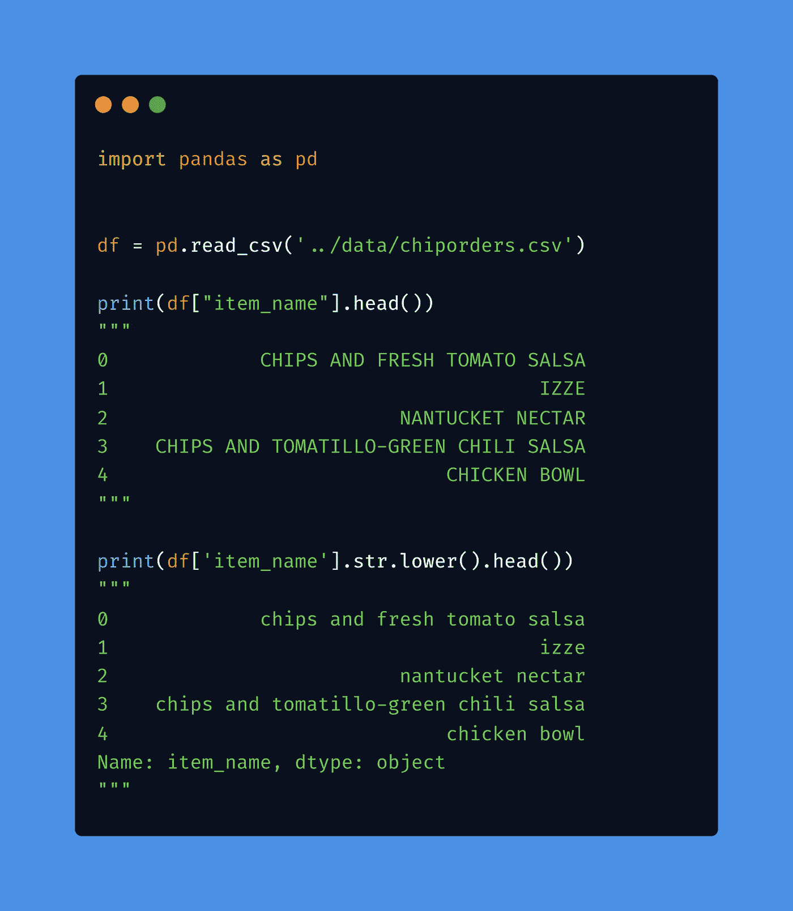

图 10:对数据帧中的文本应用字符串方法

# 8.如何更改熊猫系列的数据类型？

要检查数据的类型，您可以使用`.dtypes`，它将返回一系列与`dtype`相关的列。将 pandas 列数据转换为不同类型的最简单方法是使用`astype()`。

```
order_id               int64
quantity               int64
item_name             object
choice_description    object
item_price            object
dtype: objectdtype('float64')
```

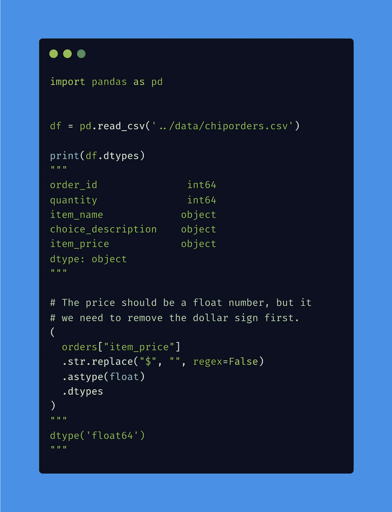

图 11:更改熊猫系列的数据类型

# 9.熊猫什么时候该用“groupby”？

`groupby()`':使用映射器或通过`Series`列将`DataFrame`或`Series`分组。一个`groupby`操作包括分割对象、应用函数和组合结果的某种组合。这可用于对大量数据进行分组，并对这些组进行计算操作。

```
genre
Action       126.485294
Adventure    134.840000
Animation     96.596774
Biography    131.844156
Comedy       107.602564
Crime        122.298387
Drama        126.539568
Family       107.500000
Fantasy      112.000000
Film-Noir     97.333333
History       66.000000
Horror       102.517241
Mystery      115.625000
Sci-Fi       109.000000
Thriller     114.200000
Western      136.666667
Name: duration, dtype: float64count        mean  max  min
genre                                 
Action       136  126.485294  205   80
Adventure     75  134.840000  224   89
Animation     62   96.596774  134   75
Biography     77  131.844156  202   85
Comedy       156  107.602564  187   68
Crime        124  122.298387  229   67
Drama        278  126.539568  242   64
Family         2  107.500000  115  100
Fantasy        1  112.000000  112  112
Film-Noir      3   97.333333  111   88
History        1   66.000000   66   66
Horror        29  102.517241  146   70
Mystery       16  115.625000  160   69
Sci-Fi         5  109.000000  132   91
Thriller       5  114.200000  120  107
Western        9  136.666667  175   85
```

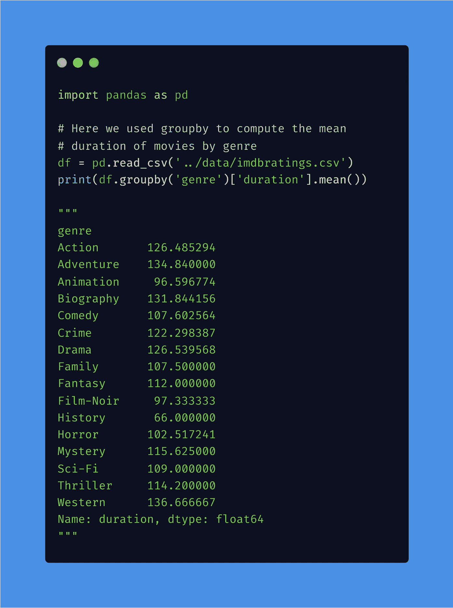

图 12:熊猫的群聚——第一部分

可以同时应用多个聚合函数。

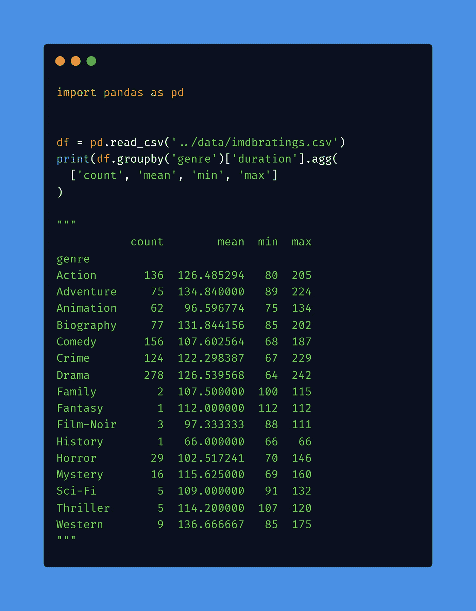

图 12:熊猫的群聚——第二部分

# 10.我如何处理熊猫中缺失的值？

在现实生活中，丢失数据是一个非常大的问题。在 Pandas 中，缺失数据由两个值表示:`NaN`或`None`。帕纳斯有几个有用的函数来检测、删除和替换 Pandas 数据帧中的空值:`.isna()`用于查找`NaN` , `.dropna()`用于删除`NaN`,`.fillna()`用特定值填充`NaN`。

```
(18241, 6)City                  25
Colors Reported    15359
Shape Reported      2644
State                  0
Time                   0
Location              25
dtype: int64(2486, 6)
(2486, 6)
(18237, 6)
2644
0VARIOUS      2977
LIGHT        2803
DISK         2122
TRIANGLE     1889
OTHER        1402
Name: Shape Reported, dtype: int64
```

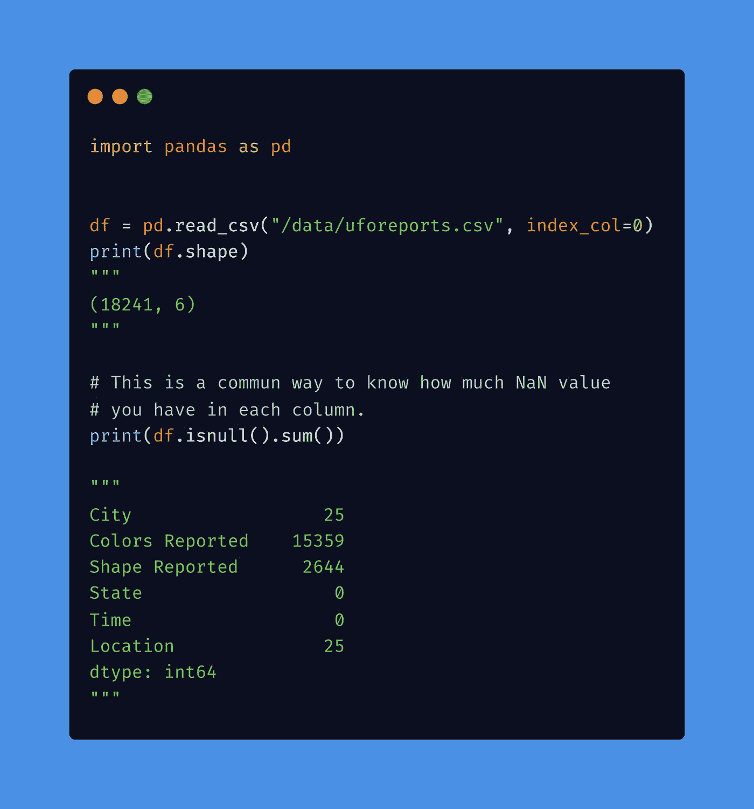

图 13:处理熊猫丢失的值—第 1 部分

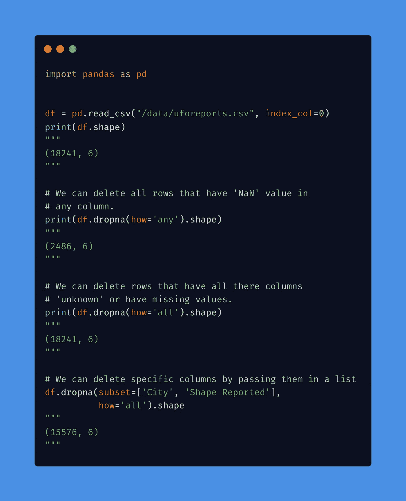

图 14:处理熊猫丢失的值—第 2 部分

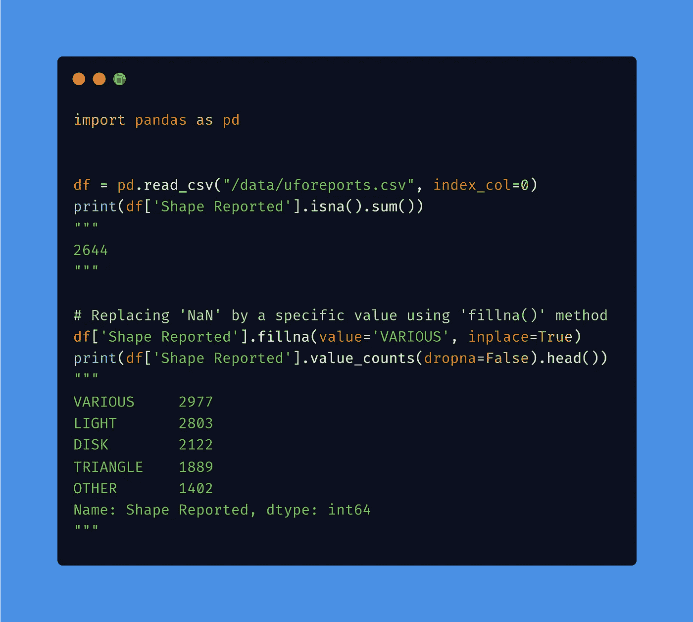

图 15:处理熊猫丢失的值—第 3 部分

# 11.关于熊猫指数我需要知道什么？

在表格数据中，通常使用在`0`到`len(data)`范围内的索引。对于特定的情况(如时间序列数据)，我们需要将索引改为更有意义的内容。要设置索引，我们只需将列传递给`.set_index()`。

```
Int64Index([    0,     1,     2,     3,     4,     5,     6,     7,     8,
                9,
            ...
            18231, 18232, 18233, 18234, 18235, 18236, 18237, 18238, 18239,
            18240],
           dtype='int64', length=18241)Index([              'Ithaca , NY',          'Willingboro , NJ',
                    'Holyoke , CO',              'Abilene , KS',
       'New York Worlds Fair , NY',          'Valley City , ND',
                'Crater Lake , CA',                 'Alma , MI',
                    'Eklutna , AK',              'Hubbard , OR',
       ...
                'Pismo Beach , CA',                 'Lodi , WI',
                  'Anchorage , AK',             'Capitola , CA',
             'Fountain Hills , AZ',           'Grant Park , IL',
                'Spirit Lake , IA',          'Eagle River , WI',
                'Eagle River , WI',                 'Ybor , FL'],
      dtype='object', name='Location', length=18241)
```

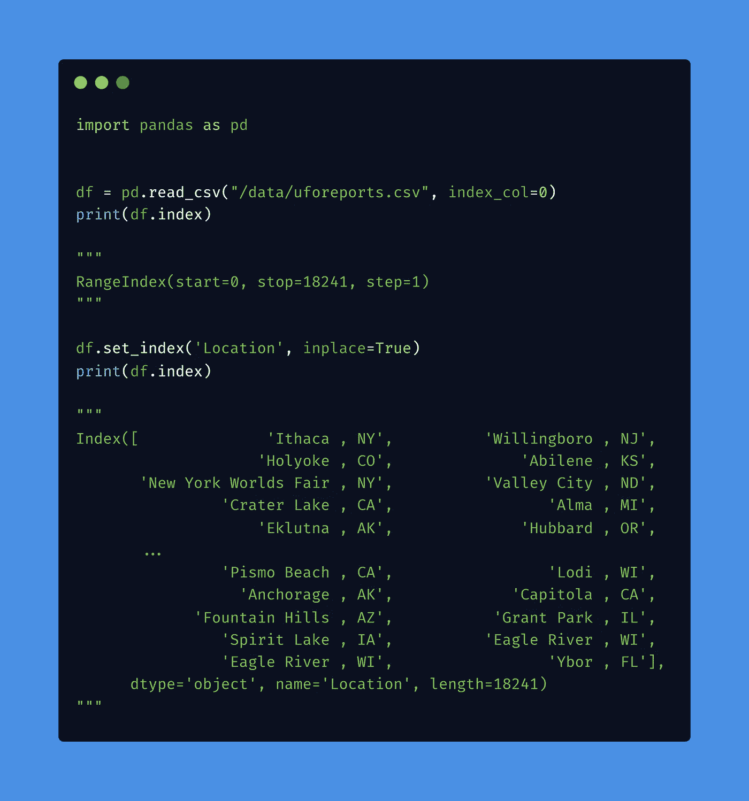

图 16:更改数据帧索引

# 12.我如何从熊猫数据框中选择多行和多列？

熊猫是建立在 NumPy 之上的，所以它试图遵循他关于切片的惯例。虽然'`iloc`'与 numerics 一起工作，但它的构建类似于 NumPy 数组。这不是在其他类型上切片的'`loc`'的情况。

```
City              Holyoke
Shape Reported       OVAL
State                  CO
Name: 2, dtype: objectCity Shape Reported State
0       Ithaca       TRIANGLE    NY
1  Willingboro          OTHER    NJ
2      Holyoke           OVAL    COCity State
0       Ithaca    NY
1  Willingboro    NJ
2      Holyoke    CO
```

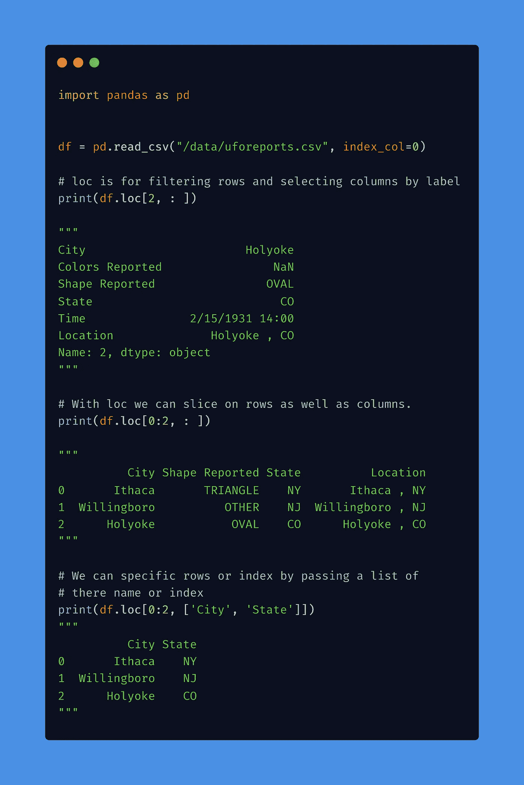

图 17:选择多行和多列

# 13.我如何在熊猫中处理日期和时间？

`DateTime`是日期和时间的集合，格式为`yyyy-mm-dd HH:MM:SS`，其中 `yyyy-mm-dd`是指日期，`HH:MM:SS`是指时间。将我们的日期作为`datetime64`对象将允许我们通过`.dt` API 访问大量的日期和时间信息。

`.to_datetime()`将表示我们数据的字符串转换成`datetime64[ns]`对象。

```
0   1930-06-01 22:00:00
1   1930-06-30 20:00:00
2   1931-02-15 14:00:00
3   1931-06-01 13:00:00
4   1933-04-18 19:00:00
Name: Time, dtype: datetime64[ns]0    22
1    20
2    14
3    13
4    19
Name: Time, dtype: int640     Sunday
1     Monday
2     Sunday
3     Monday
4    Tuesday
Name: Time, dtype: object
```

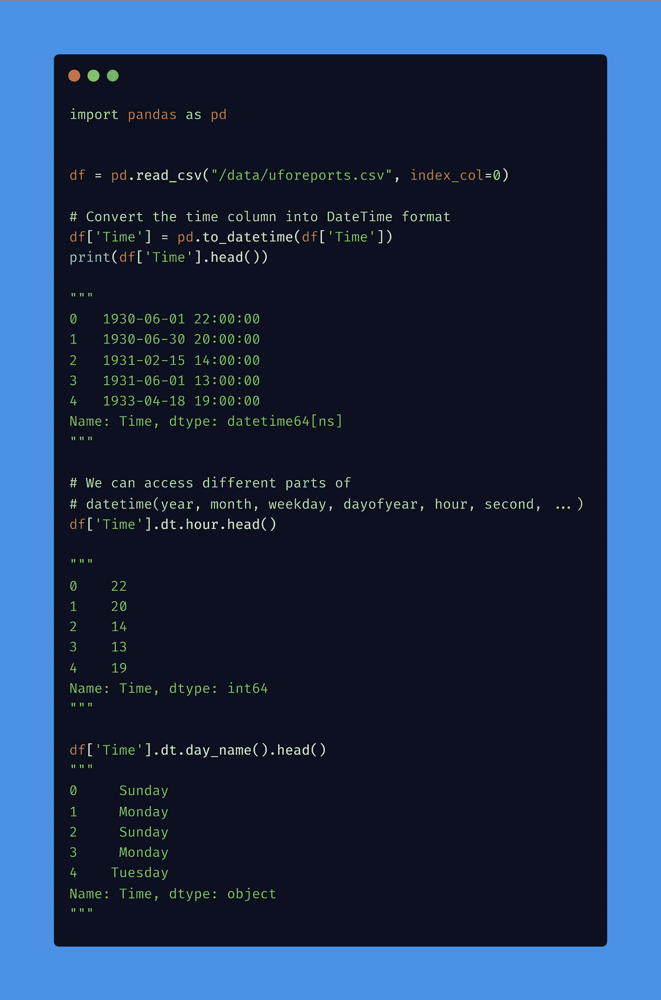

图 18:在 Pandas 中使用日期时间对象

# 14.如何在 pandas 中找到并删除重复行？

数据分析的一个重要部分是分析*重复值*并移除它们。Pandas `duplicated()`方法仅帮助分析重复值。它返回一个布尔序列，该序列仅对于唯一元素是`True`。

```
(943, 4)
148
7
(936, 4)
```

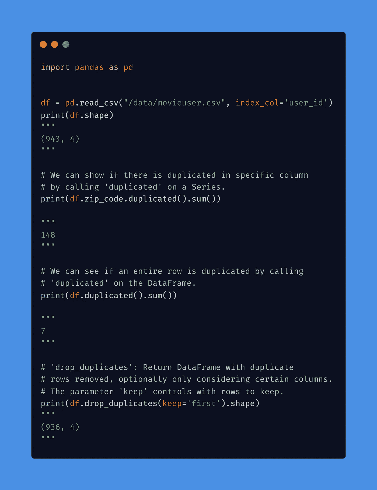

图 19:处理重复行

# 15.如何对熊猫系列或数据帧应用函数？

`Pandas.apply`允许用户传递一个函数，并将其应用于熊猫系列的每个值。

```
age gender  occupation zip_code
user_id                                 
1         24      M  technician    85711
2         53      F       other    94043
3         23      M      writer    32067
4         24      M  technician    43537
5         33      F       other    15213user_id
1    1
2    0
3    1
4    1
5    0
Name: gender, dtype: int64Man      889
Child     54
Name: age, dtype: int64
```

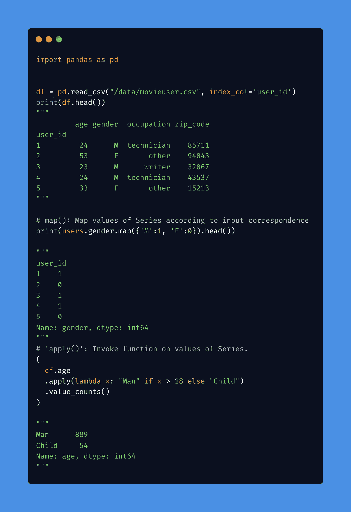

图 20:对熊猫系列应用一个函数

# 结论

掌握 Pandas 将使您的分析技能更上一层楼，了解最佳实践将为您节省大量时间和精力。在本文中，我们讨论了:

*   快速开始使用熊猫的 15 个实用食谱。所有这些都很有用，在特殊情况下会派上用场。
*   Pandas 是一个强大的数据分析和操作库。它提供了许多函数和方法来处理表格形式的数据。和其他工具一样，学习熊猫的最好方法是通过练习。

感谢您的阅读。如果您有任何反馈或建议，请告诉我。

# 参考

*   [本教程中使用的数据](https://github.com/fares-ds/data_analysis_in_python_with_pandas/tree/master/pandas_basics/data)