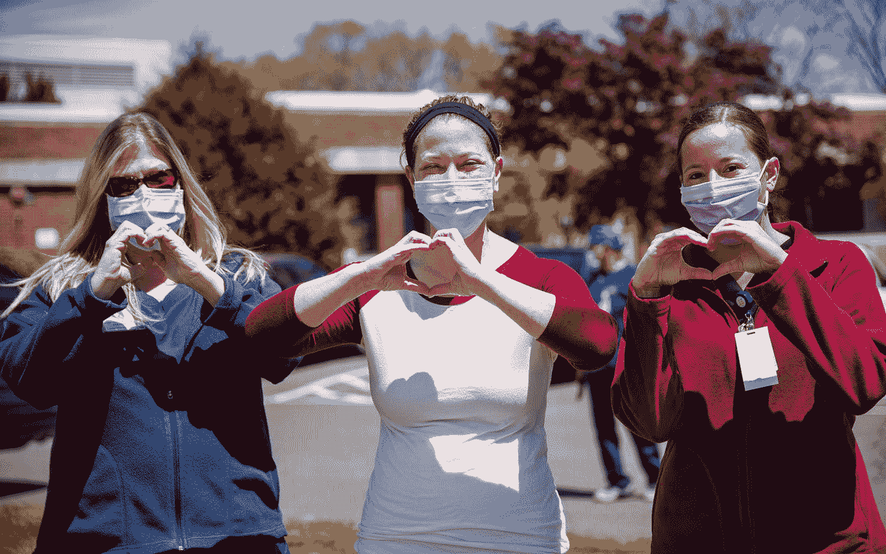

# 2022:chat GPT 年，未来如何？

> 原文：<https://pub.towardsai.net/2022-year-of-chatgpt-what-is-the-future-979b034efdf9?source=collection_archive---------1----------------------->

## 看着水晶球

在过去的几十年里，自然语言处理领域在最近几年取得了巨大的进步。从 Siri 和 Alexa 这样的虚拟助手到 Google Translate 这样的机器翻译工具，NLP 技术在我们的日常生活中越来越普遍。但是，这个不断发展的令人兴奋的领域的未来会怎样呢？

让我心跳有点快的是机器理解和生成类似人类语言的能力越来越强。我用理解这个词作为占位符。这被称为对话式人工智能(现在著名的 chatGPT)，它是许多公司和研究人员的重点关注点。对话式人工智能的目标是创建一个系统，它不仅可以“理解”我们所说的话，还可以以一种自然且适合上下文的方式“响应”。在这里，在一个大的模式中理解和响应是尚未明确定义的概念，所以请有所保留。

来源: [Pixabay](https://pixabay.com/photos/doors-choices-choose-open-decision-1767563/)

## 大型语言模型的兴起

让我们潜入更深的地方。是什么导致了这种从确定性的自然语言处理到某种只能被描述为文本的“生成”的转变？近到可以称之为理解或者回应。为此，需要混合两种化学物质。深度学习就是其中之一。深度学习允许机器从大量数据中“学习”。可以用来提高语言生成的准确性和自然性。例如，一个对话式人工智能系统可能会在一个大型人类对话数据集上进行训练。学习是什么意思？嗯，在这个上下文中，根据上一个单词或句子或段落等的上下文来识别下一个单词或句子。，然后利用这些知识实时生成适当的响应。

LLM 的大部分来自用于训练这些模型的大量文本数据。这种数据也被称为普通爬行，其中在互联网上的爬行被用来收集文本数据。这些模型的主要优势之一是它们可以针对特定的任务或应用进行微调。例如，可以在大型医疗记录数据集上训练语言模型，然后对其进行微调以生成患者就诊摘要。这允许模型包含特定领域的知识，这可以提高生成的文本的准确性和有用性。

 [## 使用大型语言模型训练特定领域模型

### 保留语言并增加你的知识

ithinkbot.com](https://ithinkbot.com/train-domain-specific-model-using-a-large-language-model-c8da29136a36) 

许多公司和组织正在为对话式人工智能开发大型语言模型。OpenAI 是一个致力于开发和推广友好人工智能的研究组织。他们对自然语言处理领域做出了重大贡献，包括开发语言模型，如 GPT(生成性预训练转换器)和 GPT-2，GPT-3，以及现在的 GPT-4。这些模型经过大量数据的训练，能够以令人印象深刻的准确性和自然性生成类似人类的文本。除了 OpenAI，许多老牌公司和初创公司也为人工智能领域做出了贡献:

*   谷歌在 NLP 方面进行了大量投资，并开发了许多语言模型 [BERT](https://cloud.google.com/ai-platform/training/docs/algorithms/bert-start#:~:text=BERT%20is%20a%20method%20of,question%20answering%20and%20sentiment%20analysis.) (变形金刚的双向编码器表示)用于各种应用。
*   脸书开发了 RoBERTa(稳健优化的 BERT 方法)，这是一种 BERT 的变体，旨在提高原始模型的性能。
*   微软:微软在 [NLP](https://learn.microsoft.com/en-us/azure/architecture/data-guide/technology-choices/natural-language-processing) 领域有着很长的研发历史，并且已经开发了许多语言模型用于各种应用。

除了这些大型科技公司，也有很多较小的创业公司和研究机构在从事 NLP 技术，包括[拥抱脸](https://huggingface.co/)、 [Element AI](https://github.com/ElementAI) 和 [DeepMind](https://www.deepmind.com/) 。这些组织通常处于该领域最新发展的前沿，并正在帮助更广泛地推动对话式人工智能和 NLP 领域的创新。

 [## OpenAI 发布嵌入模型:text-embedding-ada-002

### 它功能强大、更便宜、更灵活！

pub.towardsai.net](/openai-releases-embeddings-ai-3380dacfa3c5) 

OpenAI 和其他组织的工作正在以许多令人兴奋的方式帮助推进 NLP 领域。最终，这些步骤为未来更复杂、更像人类的对话式人工智能系统的开发铺平了道路。毫无疑问，这些公司将继续投资开发有朝一日可能通用的模型..

布雷特·乔丹在 [Unsplash](https://unsplash.com?utm_source=medium&utm_medium=referral) 上的照片

## 一段对话不仅限于文字。

NLP 的另一个趋势是越来越多地使用[多模态输入](https://people.ischool.berkeley.edu/~dbamman/nlp21_slides/24_MultiModalNLP.pdf)。根据加州大学伯克利分校的 Jon Gillick 的介绍，NLP 可以通过书面、口头、歌唱、视觉、触觉以及在现实世界中实现。处理各种输入类型，包括音频、视频甚至图像，允许以更自然和直观的方式与机器交互，并开辟了一个全新的应用范围。

例如，从口语文本到任何其他语言的实时翻译的机器翻译可以使人们更容易跨越语言障碍相互交流。类似地，可以处理视频输入的虚拟助理可以用来提供视觉帮助或指导，或者识别和响应手势和其他非语言提示。

 [## 什么是 GPT-4(什么时候？)

### GPT-4 是一个自然语言处理模型，由 openAI 作为 GPT-3 的继承者开发

pub.towardsai.net](/what-is-gpt-4-and-when-9f5073f25a6d) 

多模态模型可以扩展到各种应用中:

*   情绪分析可以扩展到考虑说话者的声调、面部表情和肢体语言，以确定他们的情绪状态。
*   [语音识别](https://www.ibm.com/topics/speech-recognition)可以扩展到情感识别(讽刺)和翻译或文本生成等。这可以极大地改善口语的翻译。
*   [图像识别](https://lens.google/)可以扩展到识别和分类场景中的物体、人和其他元素，并创建新图像，如 DALL-e 等。

总的来说，多通道输入的使用是 NLP 中一个有前途的趋势，并且很可能在未来更复杂和更像人类的对话式 AI 系统的开发中发挥核心作用。

由 [Rusty Watson](https://unsplash.com/@rustyct1?utm_source=medium&utm_medium=referral) 在 [Unsplash](https://unsplash.com?utm_source=medium&utm_medium=referral) 上拍摄的照片

## 逗号拯救生命

NLP 的未来最令人兴奋的可能性之一是它在各种不同领域的应用潜力。从医疗保健到教育，NLP 技术有无数的方式可以用来改善我们的生活。例如，在医疗保健领域，NLP 可以用于分析大量的患者数据，并识别可能表明特定疾病或状况的模式。在教育中，NLP 可以用来创建个性化的学习体验，根据每个学生的个人需求和能力定制内容和活动。

这可能会改善患者护理，降低成本，简化流程，减轻医生的负担，清理数据，并使研究标准化！目前，一些焦点浮出水面，在那里已经做了大量的工作-

*   [医疗记录管理](https://healthtechmagazine.net/article/2021/07/how-can-healthcare-leverage-natural-language-processing-medical-records-perfcon) NLP 可用于从医疗记录中提取重要信息，如诊断、药物和测试结果。这有助于简化管理和组织病历的流程，还可以提高信息的准确性和完整性。
*   临床决策支持指示特定的疾病或状况。
*   [患者监测](https://www.healthcareitnews.com/news/how-ai-and-nlp-can-boost-care-remote-patient-monitoring)实时监测患者数据，提醒医疗保健提供者潜在的问题或病情变化。这可能有助于监测病人的不良事件。
*   [医学语言翻译](https://jbiomedsem.biomedcentral.com/articles/10.1186/s13326-018-0179-8) NLP 可用于将医学文档和其他材料翻译成不同的语言，使患者和医疗保健提供者更容易交流和理解重要信息。

可以有把握地预期，这个价值数万亿美元的行业可以利用人工智能的一些甜蜜力量来减少浪费。假设不使用它的动机太强了！

照片由[vini cius“amnx”Amano](https://unsplash.com/@viniciusamano?utm_source=medium&utm_medium=referral)在 [Unsplash](https://unsplash.com?utm_source=medium&utm_medium=referral) 上拍摄

## 让我沉浸在另一个现实中

虽然 Zuck 给我留下了不好的印象，但 NLP 可以产生重大影响的另一个领域是虚拟和增强现实领域。随着这些技术变得越来越先进，我们很可能会看到越来越多的 NLP 支持的虚拟助理和其他应用程序。例如，虚拟助理可用于在您浏览虚拟世界时提供指导和帮助，或者在您与虚拟角色交谈时实时翻译口语对话。

尽管围绕虚拟现实技术在教育领域的应用有一些争议，但我认为它仍将主要用于娱乐目的。电影、游戏、成人娱乐等等。NLP 可能是单调游戏体验的一个额外维度。我可以看到人工智能能够生成文本或翻译文本，而生成式人工智能可以创建感兴趣的人的化身，并输出化身的视频，以他们自己的语言向各种观众展示视频。人工智能中的 NLP 可以真正打破国籍的界限。

 [## 这篇文章是两极的:人工智能在教育中的作用

### 一篇要么是有远见的文章，要么是完全没有价值的文章。

pub.towardsai.net](/this-article-is-bipolar-role-of-ai-in-education-bc084e37eb3a) 

像迈克尔·杰克逊这样的著名歌手和表演者对化身和歌曲的重新创作甚至对死亡率提出了挑战。人们可以想象通过创造一个人的多模态表现来重温那些时光的记忆，也许还可以写一些新歌。可能性确实是无限的，也是相当现实的。

由[兰迪·塔兰皮](https://unsplash.com/@randytarampi?utm_source=medium&utm_medium=referral)在 [Unsplash](https://unsplash.com?utm_source=medium&utm_medium=referral) 上拍摄的照片

## 结论

总的来说，NLP 的未来看起来是光明的。从对话式人工智能和多模式输入到不同领域的广泛应用，毫无疑问，NLP 技术将继续发展，并在我们的日常生活中发挥核心作用。

来支持我🔔 ***鼓掌*** | ***跟随|*** [***订阅***](https://ithinkbot.com/subscribe)***|***[***成为会员***](https://ithinkbot.com/membership) **🔔**

检查我的其他作品—

 [## 人工智能中的领导力:你的领导力适合数据科学吗？

### 可能已经转变为数据科学领导的非技术人员领导通常不熟悉…

pub.towardsai.net](/leadership-in-ai-is-your-leadership-fit-for-datascience-d0e9296be2d6)  [## 谈判的艺术:西塞罗·艾

### 西塞罗·艾在外交的游戏中比人类更能谈判。就像深蓝代表国际象棋，五号代表…

pub.towardsai.net](/the-art-of-negotiation-cicero-ai-6e04354fe990)