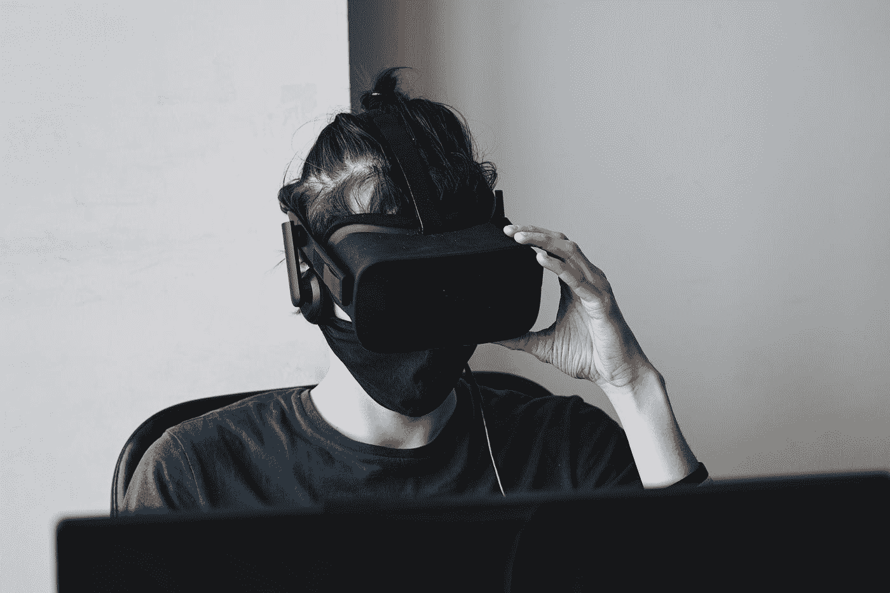

# 人工智能将革新的 3 个潜在领域

> 原文：<https://pub.towardsai.net/3-under-the-radar-sectors-that-will-be-revolutionized-by-ai-666d75a29d95?source=collection_archive---------0----------------------->

## [人工智能](https://towardsai.net/p/category/artificial-intelligence)

## 探索将改变我们社会的被低估的人工智能应用

照片由来自 [Pexels](https://www.pexels.com/photo/person-reaching-out-to-a-robot-8386434/?utm_content=attributionCopyText&utm_medium=referral&utm_source=pexels) 的[塔拉·温斯泰德](https://www.pexels.com/@tara-winstead?utm_content=attributionCopyText&utm_medium=referral&utm_source=pexels)拍摄

说到炒作，科技行业一直是人们的首选。当我们忍受单调重复的生活方式时，我们期待领先的创新者让我们的生活更加有趣和方便。

即使当吹嘘的技术不可行时，它们也会获得很多关注，因为人们喜欢释放他们的想象力，探索这些技术存在的不同现实。

目前，人工智能处于聚光灯下，不难看出为什么；它有能力彻底改变经济中的每一个部门。

然而，有些技术就是没有获得足够的吸引力。

人们目前正在关注自动驾驶汽车的发展，打击网上的错误信息，加强网络安全以打击勒索软件。

虽然这些应用值得关注，但很多关注来自于人们对新技术的幻想和投资者对下一个重大创新的热切追求。

在对人工智能的崛起将带来什么的猜测中，人们忽略了一些最有可能在这一过渡期间经历巨大变化的领域。

这里有 3 个部门可能会受到人工智能的严重影响。

# **1。老年人护理**

照片由 [Kampus 出品](https://www.pexels.com/@kampus?utm_content=attributionCopyText&utm_medium=referral&utm_source=pexels)来自 [Pexels](https://www.pexels.com/photo/woman-assisting-elderly-man-7551667/?utm_content=attributionCopyText&utm_medium=referral&utm_source=pexels)

由人工智能驱动的设备可以提高老年人护理的标准。有了可以更好地诊断、监测和治疗老年人的技术，医生将有办法为他们的病人提供更好的护理。

人工智能增强的摄像头和传感器能够密切监控老年人的状况。由于计算机视觉的进步，摄像头可以根据患者的行为识别出患者病情的任何潜在问题。传感器可以检测跌倒等事故，以便患者在需要时可以尽快得到帮助。

此外，允许老年人进行自我诊断的设备已经投入生产。例如， [Apple Watch Series 4](https://www.apple.com/newsroom/2018/09/redesigned-apple-watch-series-4-revolutionizes-communication-fitness-and-health/) 利用人工智能来提供心电图和房颤检测。

此外，现在可以为老年人提供聊天机器人和虚拟助手，随时为他们服务。这些微服务不仅能确保患者遵循规定的常规，还能让他们参与社会互动。

# 为什么这很重要

老年人很少与头条新闻联系在一起，这很容易理解为什么；他们是最没有魅力的人群。从经济的角度来看，这部分人消耗资源而不为生产做出贡献，因此他们很少受到媒体的关注。

尽管如此，老年人占人口的很大一部分。随着时间的推移，随着预期寿命的逐渐提高和出生率的稳步下降，老年人的突出地位只会变得更加明显。事实上，据估计，到 2030 年，老年人将占美国人口的 20%。类似的趋势也可以在中国和韩国这样的全球超级大国中看到。

随着人口逐渐老龄化，政府现在必须考虑如何用更少的劳动力养活更多的老年人。

目前的老年人护理系统已经不足。有限的护理人员数量使每个老人都得不到足够的关注。此外，那些照顾老人的人经常工作很长时间，工资很低。鉴于这些前景，随着时间的推移，老年人护理行业面临的问题很可能只会加剧。

因此，满足老年人的需求将成为未来几代人面临的主要挑战。

毫无疑问，人工智能将在提供适应老龄化人口的手段方面发挥关键作用。

因此，理解可以促进向更好的老年人护理过渡的人工智能应用并学会有效地实施它们是至关重要的。

# 2.赌博

照片由[像素](https://www.pexels.com/photo/white-gaming-console-on-wooden-surface-275033/?utm_content=attributionCopyText&utm_medium=referral&utm_source=pexels)的[皮克斯拜](https://www.pexels.com/@pixabay?utm_content=attributionCopyText&utm_medium=referral&utm_source=pexels)拍摄

游戏文化已经完全融入了我们的社会。从移动应用程序到游戏机，各种年龄的人都有很多方式来探索视频游戏的世界。

这种趋势只会随着人工智能的引入及其增强游戏体验的能力而继续下去。随着更丰富的可视化图形和更真实的游戏交互，未来的游戏看起来不会更诱人。

我们对人工智能的掌握突飞猛进。由于一种叫做**强化学习的技术的出现，开发者现在能够为他们的游戏探索新的途径。**

简单来说，现在可以根据用户自己的行为数据为用户定制游戏。不同的玩家将能够从同一个游戏中享受不同的体验。

不可玩角色(NPC)的使用也将有相当大的进步。NPC 可以被训练说话或根据用户的数据做出决定，而不是遵循一个平凡的脚本。用户将体验到非常类似于人与人之间的互动，而不是与没有大脑的机器人打交道。

这些添加将增加现实主义的元素，并为休闲和狂热的游戏玩家提供更加激动人心的体验。游戏的受欢迎程度肯定会继续上升。

# 为什么这很重要

Maxim Tolchinskiy 在 [Unsplash](https://unsplash.com?utm_source=medium&utm_medium=referral) 上拍摄的照片

游戏最好的一面也是最差的一面；令人身临其境。

作为一个从小就喜欢电子游戏的人，看到电子游戏行业与时俱进当然令人欣慰。

不幸的是，尽管对游戏的喜爱仍然很强烈，但对它的防范措施却没有。

让我们面对它；电子游戏容易上瘾。

医学专家长期以来一直认为游戏成瘾是一种合理的状况。过度玩游戏的人已经被证明忽视了他们的身心健康，放弃了他们的教育和职业前景，并限制了他们与朋友和家人的互动。

如果游戏行业存在准入门槛，这些问题就可以避免。不幸的是，随着智能手机、电脑和游戏机的出现，即使是蹒跚学步的孩子也能轻松接触到视频游戏。

经济超级大国现在正在考虑建立规则，限制所有用户的游戏特权，危及整个视频游戏产业。中国已经主动禁止未成年人玩游戏，每周只允许他们玩 3 小时游戏。

人工智能的崛起无疑为未来一代的视频游戏提供了很多东西。然而，随着这种转变，我们还必须考虑这些技术的潜在影响，并对它们做出解释，以免它们弊大于利。

# 监督

照片由来自 [Pexels](https://www.pexels.com/photo/police-fun-funny-uniform-33598/?utm_content=attributionCopyText&utm_medium=referral&utm_source=pexels) 的 [Pixabay](https://www.pexels.com/@pixabay?utm_content=attributionCopyText&utm_medium=referral&utm_source=pexels) 拍摄

几十年来，由于警察在执行任务时的失误和疏忽，他们受到了公众无休止的批评。

不言而喻；全世界都在谴责警方。

他们表现平平的一个可能原因是他们打击犯罪的主要技术已经过时。

然而，随着越来越依赖数据驱动的决策，警务调查可以实现最佳结果，同时最大限度地减少成本和事故。

现在，机器学习算法可以通过历史数据进行训练，以识别潜在的罪犯或犯罪受害者。它们还可以用来检测“热点”，让警方更好地准备任何不祥的事件。

这类似于在火灾开始前就将其扑灭。

此外，面部识别等工具可以确保抢劫和枪击等犯罪背后的罪犯被迅速识别和起诉。案件可以迅速结案，同时确保更少的无辜者因他们没有犯下的罪行而被起诉和监禁。

# 为什么这很重要

如果人工智能提供了交付更令人满意的结果的方法，执法部门可以慢慢巩固他们的声誉，并修补警察和公众之间的破裂关系。

然而，尽管将人工智能纳入警察工作的潜在收益相当可观，但缺点也同样值得注意。

算法虽然不受人类偏见的影响，但仍然是从历史数据中训练出来的。因此，很有可能模型会做出同样有偏见的预测，而这些预测让警察部门声名狼藉。

例如，美国、英国和法国等国家的执法机构以种族貌相著称。许多研究强调了不成比例的大量黑人受到敌意的对待。

如果这些国家的警察开始用对有色人种有偏见的数据训练他们的模型，我们怎么能指望模型有不同的表现？

如果有什么不同的话，这种模型的使用会使持续的种族不公正永久化。警察将能够使用他们的预测模型作为“证据”来证明他们的好战行为。

人工智能的出现可以证明是我们如何看待警察工作作为一个社会的转折点。长期困扰执法部门的问题终于可以解决了。然而，如果没有足够的监督，这些新技术也有可能被浪费或滥用。

# **结论**

[附身摄影](https://unsplash.com/@possessedphotography?utm_source=medium&utm_medium=referral)在 [Unsplash](https://unsplash.com?utm_source=medium&utm_medium=referral) 上拍照

今天的人们看待新兴技术的心态，就像孩子厌倦了旧玩具后看新玩具一样。

虽然被最有趣或最有利可图的创新所吸引是可以理解的，但这并不能证明忽视将改变我们社会基础的技术是合理的。

人工智能应用将影响几乎每个行业，因此有必要关注那些影响最大的应用，而不是那些最有趣的应用。

历史一次又一次地证明，在新技术面前的疏忽和自满只会招来麻烦。