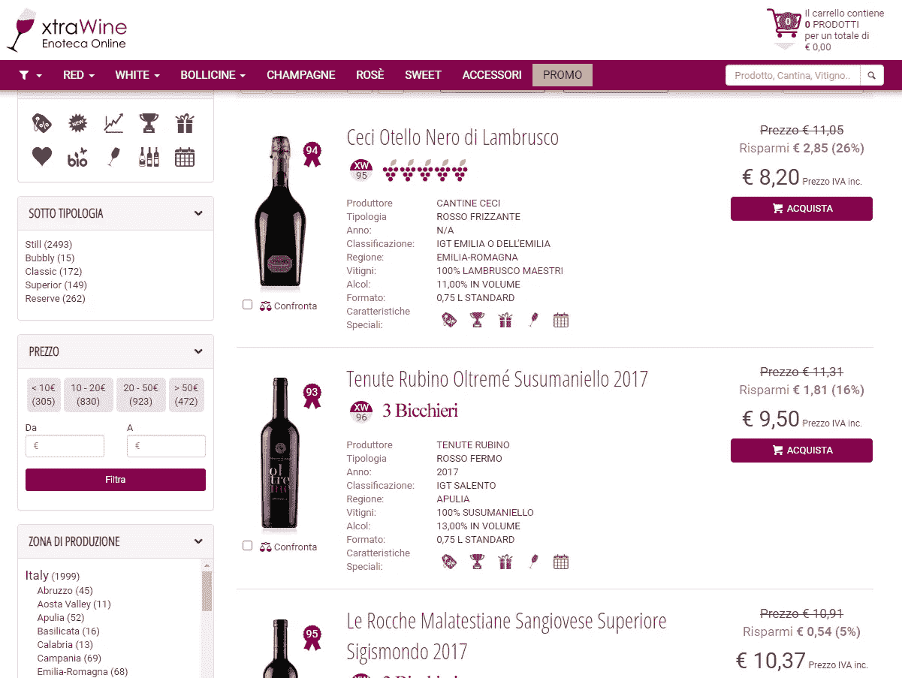
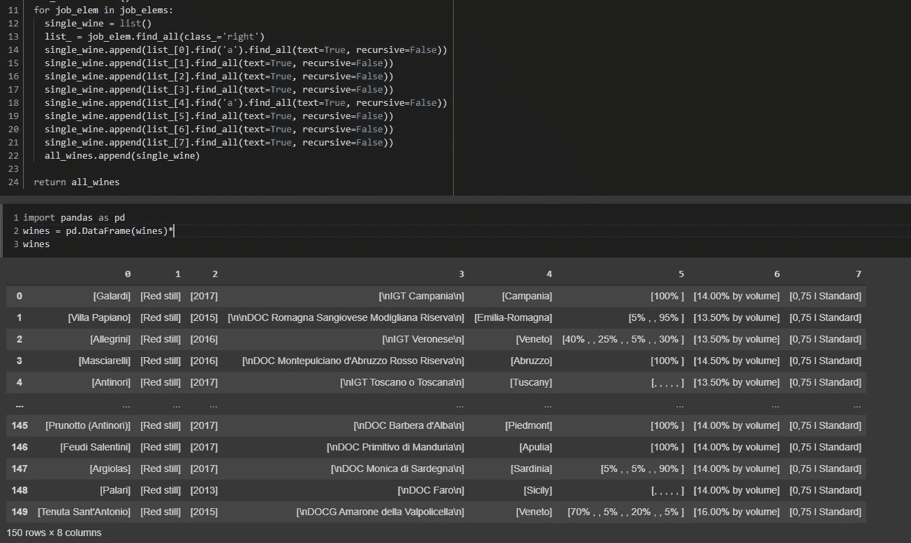

# 用电脑收集大数据的 3 种方法

> 原文：<https://pub.towardsai.net/3-ways-to-collect-big-data-with-your-pc-1248ecc386b2?source=collection_archive---------1----------------------->

## [数据挖掘](https://towardsai.net/p/category/data-mining)

## 如何以及在哪里找到互联网上的数据？

*这篇文章是技术性的。我希望你能应用这篇文章的内容来改进你的工作和你的技能。*

照片由 [NASA](https://unsplash.com/@nasa?utm_source=medium&utm_medium=referral) 在 [Unsplash](https://unsplash.com?utm_source=medium&utm_medium=referral) 拍摄

自从我开始在人工智能领域工作，我发现 100 万美元的问题是寻找数据。你可以想有多好就有多好，有很多改变世界的绝妙想法，但是没有数据，你手里什么都没有。因为数据已经成为一种非常珍贵的商品，你需要详细了解如何去搜索它。

有三种方法可以从互联网上挖掘数据:

*   应用程序接口
*   网页抓取
*   开源数据集

## 谷歌搜索信息不会给你带来什么

你在公司中不断看到的一件事是，人们需要花费数小时的时间从互联网上找到的网站中搜索和收集 excel 数据库数据。这对雇员和雇主来说都是浪费宝贵的时间。

在过去的几年里，谷歌已经成为搜索信息的最烦人的工具之一。搜索优先考虑广告，定向搜索不再可靠。试图手动收集大量信息(尤其是从不同网站收集的信息)现在是一种可笑的尝试。

## 你有什么选择？

# 1.应用程序接口

简单来说，API 是一组算法的集合，允许我们连接到数据库来下载信息。

例如，我想下载包含关键字“#sustainability”的推文列表。为此我需要一个 Twitter API。如果我想连接到股票市场，一个网上购物、象棋、游戏的网站，情况也是如此

注意 ***你需要网站发布他们的开源 API*** 来连接他们的数据库。该网站将对允许下载的信息量进行限制。只有少数网站提供信息而不需要你付费。然而，如果你足够幸运的话，你仍然有机会免费下载信息。

## 如何搜索 API

例如，我想下载我最喜欢的国际象棋网站 lichess.org 的国际象棋比赛。你可以谷歌一下 lichess API，如果幸运的话，你可以找到 lichess.org 发布的源代码。

事实上，[https://lichess.org/api](https://lichess.org/api)包含了下载象棋比赛的 API 和指令。

## 所有网站都提供 API 吗？

可惜没有。考虑到脸书不得不限制信息的下载，因此，你不允许从脸书下载任何信息(例如，甚至帖子)。我将谈论 API 的替代品，但是对于脸书，没有他们的书面同意你不能下载任何信息。

## 如果一个网站提供 API，我可能会遇到什么限制？

*   **代码**

如果你不知道如何编码，这是第一个问题。每个网站都需要个性化的方法，并不像看起来那么简单。

*   **格式**

最大限度减少信息浪费的常见格式是 JSON，但也有其他形式。你下载的数据需要被标准化，被理解，然后按照你想要的方式存储(我能猜到一个. csv 文件)。这很耗时，而且代码也不总是稳定的。

*   **价格**

有时候，你会很幸运地找到免费提供信息的网站。大多数时候，如果没有订阅计划，你甚至无法下载免费信息:做好备份计划的准备。

*   **请求频率**

你不能只从数据库中下载全时间、全速千兆字节的数据。信息流可能会降低服务器的速度，所以网站会非常小心，并且会限制你执行的请求数量。您需要每 n 秒执行一次 GET 请求(从在线数据库下载信息的行为)。当然，整个过程可以自动化。

*   **音量限制**

大多数提供 API 的网站，除非它们都是开源的，否则都是为了盈利(现在你明白卖数据意味着什么了)。如果你想下载超过一定大小的数据，他们会要求你付费。

*   **请求限制**

另一种限制下载的标准不是根据大小，而是根据请求的数量。例如，使用 Alpha Vantage 下载历史股票价格的限制是每天 500 次请求。

这些数字(比如每天 10 万条推文的限制)似乎不是一个很大的限制，但如果你正在运营一家 500 人的公司，并且你的目标是建立巨大的人工智能预测模型，10 万条推文对于你想要建立的东西来说是一个可笑的数量。

# 2.网页抓取

网络抓取正在成为我最喜欢的下载数据的方式，毕竟，处理 API 从来都不是一件有趣的事情(如果你不相信我，你可以四处问问)。

一些网站有一个信息列表，你可以直接在他们的网页上看到。我想用的一个例子是 [Xtrawine](https://www.xtrawine.com/en) 。

这个网站包含了成千上万关于葡萄酒的信息。如果你是数据分析师，看起来很好吃！如果你在谷歌上查一下，你会发现这个网站不提供开源 API。数据存储在他们的数据库中，你不能访问它。

您可以利用主页上已经可见的数据，而不是询问您连接的数据库。信息存储在附加到页面的 HTML 代码中。您唯一需要做的就是访问代码，编写一个算法，遍历所有成千上万的页面，提取每瓶葡萄酒的信息，并将它们存储到一个. csv 数据集中。

这是为从该网页中提取信息而编写的网页抓取算法的输出。你可以看到结果。我使用 beautiful soup 从一个网站提取 HTML，但是还有其他可用的 python 工具，取决于你。

## 网络抓取的缺点

要非常小心，网上的数据可能是公开的，但不是购物中心。你不能连接到任何网站，下载所有你想要的，这不仅是粗鲁的，而且你也可能违反他们的政策。因此，如果您打算将这些信息用于您的工作或研究，请非常小心您下载的内容和下载量。

# 3.开源数据集

下载数据的最后一种方法是找到已经准备好的数据。像 Kaggle 或 data.world 这样的网站有一个开源数据集列表，你可以下载来做实验。不幸的是，你不太可能找到你要找的东西。大多数信息不会更新，如果您要搜索特定的内容，例如价格列表或营销列表，您将必须使用前面的两种方法进行检索。

## 那些预制的数据集什么时候有用？

新冠肺炎紧急情况就是一个例子。例如，如果你在 Kaggle 上搜索，你会发现一个关于新冠肺炎的每日更新的数据集(巨大的信息集合)。研究人员可以为寻找基因相关信息做出贡献，并可以创建预测病毒传播的模型。

> 你怎么想呢?你知道其他下载数据的方法吗？