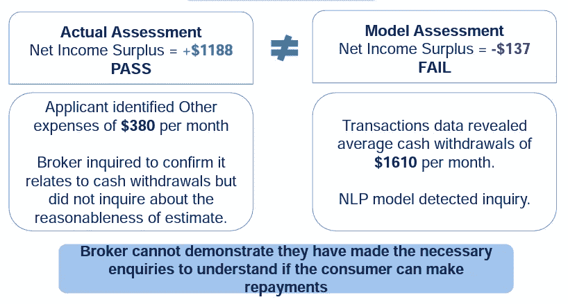

# 5 数据科学在人寿保险行业的应用

> 原文：<https://pub.towardsai.net/5-data-science-applications-in-the-life-insurance-industry-a9ca78d44573?source=collection_archive---------1----------------------->

## 数据科学如何为人寿保险价值链带来机遇

多明尼克·霍夫鲍尔在 [Unsplash](https://unsplash.com?utm_source=medium&utm_medium=referral) 上拍摄的照片

# **背景**

经过一番搜索，我首先惊讶的是，在中型平台上，关于数据科学在人寿保险行业中的应用这一主题的文章是如此之少。也就是说，我不能说我完全感到惊讶，因为人寿保险公司在嵌入数据科学应用程序时主要面临两个挑战，即:

1.  收集的数据很少，可能无法进行可信的分析
2.  高级管理层的认同度低(即“自上而下”的驱动力低)

关于 1)，需要确定术语数据科学应该定义为包含数据转换、数据可视化、预测分析、机器学习和其他人工智能学科。也就是说，数据科学不限于更高级的机器学习技术，如需要大量数据来执行的深度学习。

就 2)而言，获得高级管理层认可的最佳方式之一是展示数据科学应用程序，这些应用程序已被证明能够使用一些使用案例在特定的业务应用程序中增加价值。本文正是为了做到这一点，列出了数据科学在人寿保险行业的 5 个应用。

# 1.空间可视化和聚类

一个地区的社会经济状况可能会对人寿保险的结果产生影响。例如，有一些假设认为:

*   由于生活方式更健康，生活在相对更富裕地区的投保人索赔倾向更低。
*   生活在相对不太富裕地区的投保人由于承受能力较低，更容易中断保险。

数据科学技术使人寿保险公司能够量化和可视化特定几何区域的社会经济状况。举例来说:

*   地区社会经济指数(“SEIFA”)是一个由澳大利亚统计局(“ABS”)校准的分数，使用降维技术**主成分分析**(PCA)，根据相对社会经济优势和劣势对澳大利亚各地区进行排名。在高层次上，SEIFA 从代表几何区域特征的人口普查数据中获取信息。数据的一些例子包括教育变量，如拥有学位的人的百分比，职业变量，如被归类为专业人员的职业的百分比，以及住房变量，如少于一间卧室的房产的百分比。这些变量(以及就业和基础设施等其他变量)用于形成主成分，然后根据第一个主成分将其压缩成单一得分。这在 ABS 出版的[技术论文](https://www.abs.gov.au/ausstats/subscriber.nsf/log?openagent&SEIFA%202016%20Technical%20Paper.pdf&2033.0.55.001&Publication&756EE3DBEFA869EFCA258259000BA746&&2016&27.03.2018&Latest)中有详细讨论。
*   这篇[文章](https://towardsdatascience.com/creating-interactive-geospatial-visualisation-75a2dfaf7e59)展示了一个可视化用例，其中使用 Python 库**follow**绘制了几何区域的中断率。下面的短片演示了如何在感兴趣的地点以交互方式显示中断率。

视频 1:交互式地图演示。作者提供的视频

# 2.自然语言处理

对于人寿保险价值链的各个阶段，**自然语言处理**(“NLP”)有许多应用。其中之一在本文[中讨论，该文](https://towardsdatascience.com/applying-data-science-in-the-life-insurance-industry-a-perspective-from-a-qualified-actuary-698c197e1826)涉及自由文本索赔原因或职业描述的自动分组。

NLP 在人寿保险中的一个更非正统的应用是基于与投保人的对话数据预测“流失”或中断。本[文章](https://towardsdatascience.com/customer-churn-prediction-with-text-and-interpretability-bd3d57af34b1)讨论了该应用的技术方面。本质上，在 NLP 的帮助下，来自聊天机器人、电子邮件或音频记录的对话数据可以嵌入到特定的主题或功能中，这可能会增加流失预测模型的预测能力。

在更广泛的范围内，监管机构对高级分析的使用越来越感兴趣。例如，NLP 已被用于了解澳大利亚银行对负责任贷款义务的监管合规性。特别是，澳大利亚证券和投资委员会(ASIC)主办了一次解决问题的活动[旨在检测在其监管下的银行是否向其客户提供了适当数量的信贷。在](https://www.youtube.com/watch?v=kPxYcvD0KDs&t=9s)[ASIC 发布的一个解决方案](https://download.asic.gov.au/media/5759475/skilful-analytics-presentation.pdf)中，NLP 已经被用于根据描述将客户的实际交易分组为收入或费用类别。然后将这些与贷款申请表中申报的收入和支出进行比较。下面的屏幕截图显示了一个客户违规的例子。

图 2:不遵守负责任的贷款。技能分析，ASIC Regtech 负责任贷款演示网络研讨会，2020 年 8 月 20 日

# 3.索赔建模

理解索赔是人寿保险价值链中最关键的任务之一。它允许保险公司收取适当的保费，留出足够的索赔准备金，并最终提供盈利能力的指标。

对于拥有可靠索赔数据的国家(如美国和澳大利亚),该行业的寿险公司将通过提供有关风险属性(如性别、吸烟状况、职业、索赔原因等)的单个公司数据，共同为旨在确定索赔驱动因素的行业研究做出贡献。

一般来说，识别潜在索赔驱动因素的方法可以是首先通过数据拟合**梯度推进机**(“GBM”)模型，以理解特征的顺序和重要性(即影响索赔成本的风险属性)，然后使用之前识别的重要特征拟合**广义线性模型**(“GLM”)(考虑到特征之间的相互作用)。使用 GBM 和 GLM 可以确保:

*   因果关系被清楚地识别出来，并与相关性分开。例如，保单的性别和吸烟者状态可能高度相关(例如，男性和吸烟者)。哪个属性是真正的底层索赔驱动因素？如果两者都是，那么它们对索赔成本的边际影响是什么？
*   模型的结果可以得到清晰的解释。这可以通过检查相对于基线场景的 GLM 系数的大小和符号来完成。

# **4。计算机视觉**

在最近由美国再保险集团的承保人和精算师在澳大利亚举行的 2022 年精算师峰会上所做的介绍中，讨论了可以在承保阶段部署**光学字符识别**(“OCR”)技术，以便从保单申请人那里收集更多数据。

核保是指人寿保险公司根据投保人提供的医疗和生活方式信息，决定是否为投保人接受保单或对保单适用何种条件/定价的阶段。在通常为 PDF 格式的申请表上，申请人披露了许多与风险相关的数据，如性别、职业、收入和消遣。然后可以使用 OCR 从 PDF 表单中“抓取”这些数据，并将其存储为结构化数据，而不是由承销商手动填充这些数据。虽然 OCR 功能通常在 Adobe 等基于订阅的软件上可用，但它可以使用 tesseract 和 **PyPDF2** 的 Python 库免费实现。

此外，预测建模可用于提高核保阶段风险评估过程的准确性和速度。特别是，在与我工作的公司的再保险人的高级数据科学家交谈后，预测建模可被承保人用作决策支持工具，以进一步将手动案例(即非自动受理案例)分类为更细粒度的风险组。

# 5.中断建模

如果投保人在销售后不久(比如一两年内)终止保单，人寿保险公司将会遭受损失，因为它将无法收回与销售保单相关的高额前期购买成本，例如支付给中介的初始佣金。事实上，人寿保险公司通常需要 5-7 年的时间才能从保单中赚钱。这就是为什么终止保险很重要，而且大多数公司都投入大量资金来留住现有的投保人。

与索赔建模类似，GBM 或 GLM 可以适用于公司的停产数据，以了解停产驱动因素。根据公司保留操作的规模，可能需要在模型预测的精确度(即预测的精确度优先于识别)之间权衡模型评估的度量，如召回。

# 结束语

当实践者对技术过度使用案例进行优先排序时，组织中的许多数据科学项目都失败了。例如，从业者不应该给高级管理层带来诸如深度学习之类的花哨的数据科学技术，并询问他们能为组织做什么。相反，应该使用数据科学技术作为对潜在业务问题的适当响应，其解决方案与组织的需求密切相关。

此外，作者认为数据科学的应用，如数据转换和 T2 可视化经常被忽视。仅针对这些应用程序进行优化就已经可以为组织带来更好的洞察力和运营效率。

喜欢你正在读的书吗？请务必关注[作家](https://jin-cui.medium.com/)了解更多！