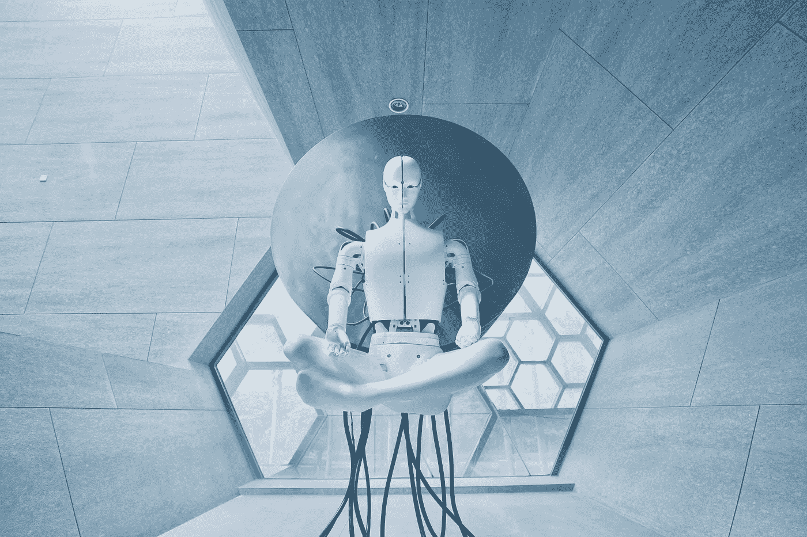

# GitHub 上 5 个必知的机器学习库；一个是必须学习的

> 原文：<https://pub.towardsai.net/5-must-know-machine-learning-libraries-on-github-one-is-a-must-learn-31a58a6ecd6e?source=collection_archive---------3----------------------->

## GitHub 上最重要的机器学习库，用于简单、高效和精确的建模

来自 Unsplash 的亲教会媒体

Github 上 5 个必知的机器学习库；一个是必须学习的

我可能比你们大多数人在 GitHub 上有更多的“星星”。如果一个模型、程序或实体在 GitHub 上不存在，那么我敢说它们要么处于测试阶段，要么实际上不存在。不可避免的是，您将使用 GitHub，无论是在学术界为面试提交解决方案，还是为专业实现提交解决方案。

GitHub 为开发者提供了一个向队友和用户透露代码的平台；对于任何对学习人工智能技术和方法感兴趣的人来说，有无数的知识库。GitHub 上的机会允许分支存储库和共享(通过它的上传功能)数字产品，以便共同构思和发现。

我确定了以下五个 GitHub 库，主要是因为您可以在学术研究范围内找到大量的经验结果，为其进一步发展做出贡献的专业人员，大量的追随者社区(他们渴望并准备好提供帮助)，以及经过战斗考验的结果(特定于这些库以及它们因其用例而闻名的解决方案)。举例来说，我每天都使用 XGBoost 和 TensorFlow，因为我在机器学习用例中进行了大量的实现。

我的前五名如下。

来自 Unsplash 的阿什顿·穆林斯

# **XGBoost**

我在 Kaggle 上用过 XGBoost [3]很多次；如果你有 Kaggle 的经验，你应该知道 XGBoost 在 Kaggle 上完成和赢得的比赛数量。它确实是一种非常有能力的机器学习技术，可以产生准确的结果。根据我的经验，我已经能够建立它，并表明它可以胜过其他机器学习算法，如梯度提升和随机森林。

XGBoost [2]是关于如何调优的大量文档。我不觉得它很难利用；开发人员和贡献者一直致力于简化编码和微调的过程。

我发现自己用 XGBoost 做的一件事是跨其他数据科学工具和库的集成；我发现它确实很好地集成了许多现有的数据科学实现资源，并且几乎是无缝的(使它成为任何机器学习工作流的一个有价值的补充)。

来自 Unsplash 的杰西卡·坎塔克·贝利

# **Scikit-learn**

Scikit-learn 是一个公认的机器学习库，可用于执行一系列复杂用例的任务，从实现简单的回归到更复杂的分类和聚类算法。

我通常使用它进行原型制作和快速测试，因为它相对容易使用，并且有很好的文档，这使它成为一个很好的选择，特别是对于那些刚刚开始学习机器的人。

无论是利用库进行测试还是部署，集成对我来说都是关键。即使您现在没有计划集成，这也是扩展的基本要求。Scikit-learn 与其他库(如 NumPy 和 pandas)集成得很好，使得快速使用 Python 进行数据分析成为可能。

除了易于使用之外，scikit-learn 还通过其各种类和方法提供了灵活性和定制选项，允许用户根据自己的特定需求定制库，而不必从头开始编写自己的代码。

这个社区又宽又大，因为它很容易辨认。开源因素是一个额外的好处，因为有机会为 bug 修复或新特性做出贡献。

来自 Unsplash 的 Aideal Hwa

# **PyTorch**

我从 PyTorch 开始实现神经网络，因为它提供了一种简单有效的方法来执行数据预处理，这是实现这个机器学习用例的重要的第一步。

部署神经网络的典型起点是识别一个库，该库在被调用时允许高度的灵活性和最少的代码量。我发现 PyTorch 两者都有(当你开始尝试不同的架构时)。

他们有一个庞大的社区(16k+分叉，近 60k 星)支持和一个活跃的开发团队，确保库随着时间的推移不断改进。举个例子，PyTorch 1.12 刚刚在 2022 年 6 月发布。

总的来说，PyTorch 由于其易用性[7]、灵活性和社区支持，为那些想要了解或开发机器学习模型的人提供了一个良好的平台和环境。

# **Keras**

我使用 Keras 开始几乎每个深度学习实现(在我使用 TensorFlow 进一步扩展它之前)。Keras 简化了我发现构建那些神经网络的复杂性，使得开发深度学习模型变得更容易。

我喜欢的第二个因素是你可以进行实验的速度——Keras 的开发专注于实现快速实验，以快速尝试不同的想法并快速构建原型模型[5]。

我测试并过渡到 TensorFlow，因为 Keras 与其他 TensorFlow 库无缝集成，在构建深度学习模型时可以轻松使用 TensorFlow 的所有功能。因为 Keras 构建在 TensorFlow 之上，所以它继承了 tensor flow 的所有优点，比如可伸缩性、效率和可移植性。

来自 Unsplash 的斯蒂芬妮·勒布朗

# **张量流**

这是我必须要学的。我认为 TensorFlow 是当今最流行的机器学习库之一；由于其简化复杂的机器学习算法和模型的潜力，它已经获得了牵引力。因为它是一个开源项目，任何人都可以贡献 bug 修复或新特性，使它成为一个社区协作的成果。

TensorFlow 支持多种语言，包括 Python、C++和 Java，如果您正在寻求语言互操作性，这是一个不错的选择。此外，还有其他语言如 Go、Haskell 和 R [6]可用的绑定，允许您使用您已经熟悉的软件栈，而不必学习新的。

开发人员可以创建数据流图和结构，描述数据如何通过图来构建模型。这些图表使人们更容易理解和直观地看到模型中发生的事情，并理解不同的组件如何相互作用[8]。这种高度的抽象也使得优化你的代码变得更加容易，因为代码不同部分之间的关系是可以学习的(特别是对于团队在 GitHub 上共享代码编辑，我将在这篇文章的下一部分讨论你为什么需要 GitHub 帐户)。

TensorFlow 相对于其他机器学习库的关键优势之一是，它能够在 CPU 和 GPU 上运行计算，而无需对您的代码进行任何重大更改。举例来说，它在可扩展性方面大放异彩，尤其是在训练大型模型时。

来自 Unsplash 的 Brett Jordan

# **为什么你需要一个 GitHub 账户**

除了能够“分叉”和遵循这些库之外，版本控制管理、开源代码共享、bug/问题跟踪和文档托管是您今天应该加入 GitHub 的许多原因。我将提供 GitHub 用例的简要概述。

版本控制:GitHub 允许你管理你的代码变更，并在必要时恢复到以前的版本。这在与多个团队成员一起处理大型项目时尤其有用，因为它有助于让每个人都在同一页面上，并避免出现无法协调的不同版本的代码库。

开源代码共享:GitHub 最受欢迎的特性之一是它能够托管任何人都可以访问和贡献的开源代码库。这使得它成为软件项目协作的理想平台，也是从他人的代码中学习或与世界分享您的工作的好方法。

Bug 跟踪和问题管理:通过将所有问题(例如 bug 和特性请求)集中在一个地方，GitHub 使开发人员更容易跟踪和解决它们。此外，许多项目经理使用 GitHub 的问题跟踪系统来跟踪需要做什么以及每项任务分配给谁，从而加强沟通，以潜在地确保不会有任何遗漏。

文档托管:除了源代码，GitHub 还允许用户上传文档，比如图像文件、CSV/xlsx 文件和 pdf。这种能力对于架构图或用户手册等东西来说很方便，就像 GitHub 上托管的任何数字内容一样，队友可以很容易地找到它们以供参考。

___

如果您有任何编辑/修改建议或关于进一步扩展此主题的建议，请与我分享您的想法。

我写了以下与这篇文章相关的内容:他们可能与你有相似的兴趣:

# XGBoost:它在机器学习方面的当前能力和用例

 [## XGBoost:它在机器学习方面的当前能力和用例

### XGBoost 基于当前实现的深入研究

pub.towardsai.net](/xgboost-its-present-day-powers-and-use-cases-b4cac3d6e1d5) 

# TensorFlow 2.9 在这里:现在的用例

 [## TensorFlow 2.9 在这里:现在的用例

### TensorFlow 用例、功能和当前定义

pub.towardsai.net](/tensorflow-present-day-use-cases-1a412b7e2cf0) 

# **另外，请考虑订阅我的每周简讯:**

 [## 周日报告#1

### 人工智能和产品:帖子和聚光灯，截至 2022 年 7 月 24 日

pventures.substack.com](https://pventures.substack.com) 

*参考文献。*

*1。sci kit-学习。(未注明)。GitHub—sci kit-learn/sci kit-learn:sci kit-learn:Python 中的机器学习。GitHub。检索 2022 年 7 月 23 日，来自*[*https://github.com/scikit-learn/scikit-learn*](https://github.com/scikit-learn/scikit-learn)

*2。(未注明)。ACM 数字图书馆。检索 2022 年 7 月 25 日，来自*[*https://dl.acm.org/doi/abs/10.1145/2939672.2939785*](https://dl.acm.org/doi/abs/10.1145/2939672.2939785)

*3。dmlc。(未注明)。GitHub — Dmlc/xgboost:可扩展、可移植和分布式梯度增强(GBDT、GBRT 或 GBM)库，用于 Python、R、Java、Scala、C++等。运行在单机上，Hadoop，Spark，Dask，Flink，DataFlow。GitHub。检索到 2022 年 7 月 25 日，来自*[【https://github.com/dmlc/xgboost】T21](https://github.com/dmlc/xgboost)

*4。Pytorch。(未注明)。GitHub—py torch/py torch:Python 中的张量和动态神经网络，GPU 加速强劲。GitHub。检索到 2022 年 7 月 25 日，来自*[*【https://github.com/pytorch/pytorch】*](https://github.com/pytorch/pytorch)

*5。喀拉斯团队。(未注明)。GitHub — Keras-team/keras:人类的深度学习。GitHub。检索 2022 年 7 月 25 日，来自*[*https://github.com/keras-team/keras*](https://github.com/keras-team/keras)

*6。阿莱尔，J. J .(未注明)。r .的张量流于 2022 年 7 月 25 日检索，来自*[*https://tensorflow.rstudio.com*](https://tensorflow.rstudio.com/)

*7。什么是机器学习的 Python？常见问题—内置。*[【https://builtin.com/learn/python-machine-learning】T21](https://builtin.com/learn/python-machine-learning)

8。DNS 包的秘密生活:调查复杂网络。[*https://stripe.com/blog/secret-life-of-dns*](https://stripe.com/blog/secret-life-of-dns)

*9。MSDYN365BC 的开发者预览摘要—2019 年 2 月..*[*https://www . sauravdhyani . com/2019/03/summary-of-developer-preview-July . html*](https://www.sauravdhyani.com/2019/03/summary-of-developer-preview-february.html)