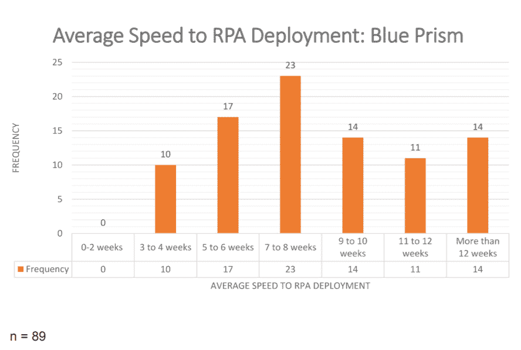
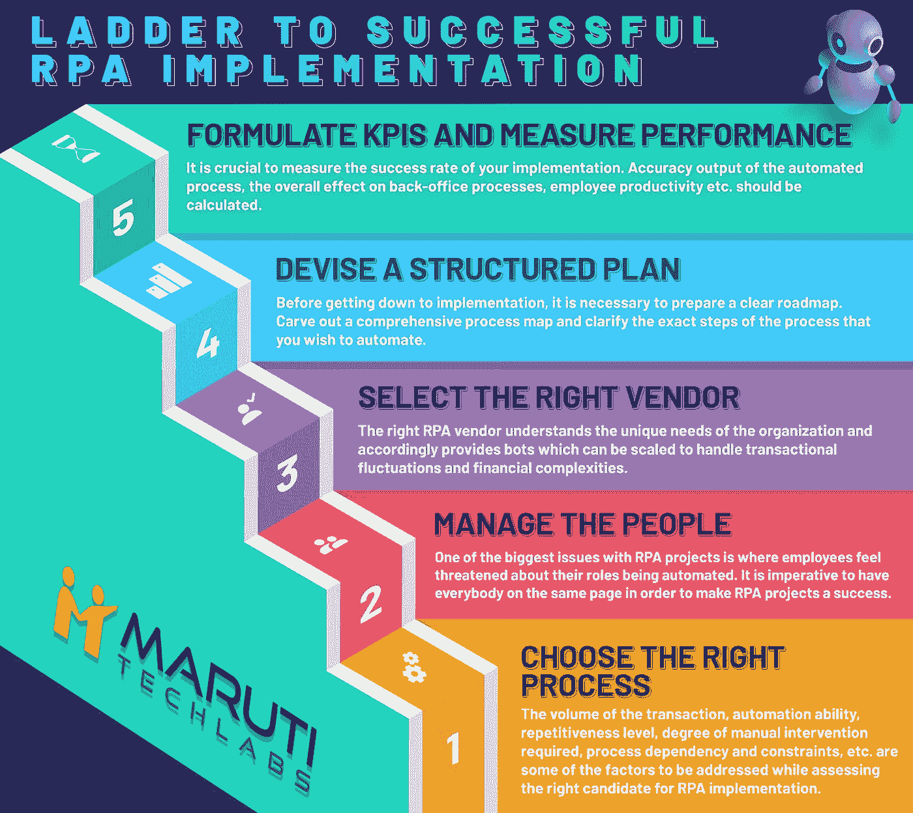

# 成功实施机器人过程自动化的 5 步指南

> 原文：<https://pub.towardsai.net/5-step-guide-to-successfully-implementing-robotic-process-automation-4ffc6ecb52d0?source=collection_archive---------1----------------------->

机器人过程自动化已经存在很长时间了。随着大型企业看到以前的 RPA 实施所带来的成本节约成果，这一趋势开始在他们中形成。在本文中，我们旨在分解 RPA 是什么，以及企业如何着手制定正确的 RPA 实施战略—从创建业务案例到初始发现研讨会和实施，再到测试和推广。

如果企业/组织遵循清晰而详细的路线图，RPA 的实施会非常简单。如上图所示，大多数 RPA 部署需要将近 2 个月的时间来配置、测试以及将自动化投入生产。

根据毕马威的说法，不同行业的多个企业“不确定从哪里以及如何开始过渡到机器人和认知自动化系统。”机器人转型带来的这种不确定性可能会影响多达 78%的公司，其中 40%的公司根本不使用 RPA，另外 24%的公司仅考虑使用 RPA。

任何新软件的实现都可能伴随着问题、焦虑和怀疑。[实施 RPA 解决方案](https://www.marutitech.com/successful-rpa-implementation/)也不例外。技术越有前途(RPA 因易于使用和提供快速投资回报而享有盛誉),问题就越大。

> 业务和运营流程的自动化对增强您的业务潜力产生了奇迹般的效果。它需要最少的前期投资，旨在提供快速的组织效益，而不会对底层系统造成任何破坏。尽管有各种传统解决方案可以促进这种方法，但并非所有解决方案都能像成功的 RPA 实施那样无缝运行。

据[本报道](http://www.pavantestingtools.com/2017/10/robotic-process-automation-statistics.html#.WsaCtdPwbMI)通过软件测试和大数据 Hadoop，几乎 20%的工作时间都花在单调重复的基于计算机的任务上。这标志着大量时间被浪费在急需自动化的流程上。

## [机器人过程自动化(RPA)](https://www.marutitech.com/robotic-process-automation-vs-traditional-automation/) 简单来说，就是一种利用配备了机器人的计算机软件，通过模仿人类的动作来执行任务的技术。RPA 主要用于执行重复性、可预测性和高容量的活动，其工作方式是捕获数据、解释响应，并以有组织、有系统的方式与其他设备通信。

尽管这种技术提供了可扩展性和生产效率，但大多数企业都难以成功实施 RPA，这主要是因为他们要么无法准确评估需要自动化的特定流程，要么因为他们未能获得 RPA 设计和集成的批准。但是，如果您希望 RPA 的实施是一件高效的事情，您需要遵循一个严格的路线图，在不损害任何一方利益的情况下平衡所有利益相关方的关注。

# 成功实施 RPA 的 5 步流程

这里有一个简单而全面的 5 步指南，可帮助您了解在您的组织或企业内实施、开发和启动机器人流程自动化的战略流程:

# 1.挑选流程

说到 RPA 实施，选择正确的自动化流程集是成功的关键。要做到这一点，您需要对各个部门内部和跨部门的所有操作进行彻底的评估，以便您可以确定哪些特定的流程可以证明是自动化的良好候选。然而，由于大多数企业在复杂而敏感的环境中运营，进行这样的客观分析无疑是一项具有挑战性的任务。

> 答案在于制定一个框架，使 RPA 的主要意图与组织的战略目标保持一致。这个框架应该尝试检查潜在的风险和期望值，这可以从自动化中获得。

可以考虑以下属性，并以结构化的方式进行评分，以确定自动化流程的适用性:

*   总交易量可以在没有人工干预的情况下进行。
*   定期执行重复性任务所需的人力或资源量。
*   过程的组件和子组件被数字化的能力。
*   一个流程在没有任何人为错误的情况下提供卓越客户体验的能力。
*   可能阻碍收获自动化益处的可能约束。
*   管理一个过程的规则的能力，被机械地定义和编程。
*   流程在整个组织工作流程中的敏感性和相关性。

除了上述因素，可能的影响、法规遵从性要求、成本效益、技术复杂性和数据隐私等因素也可能有助于确定流程，这可以在成功实施 RPA 后产生最显著的回报。

# 2.管理人民

即使它处理自动化，RPA 的实施也完全是为了管理人员。该组织从高层到基层都必须受到信任。首先，必须建立一个令人信服的案例，才能引起公司领导层的注意。他们必须了解自动化的需求、其重要性以及它可能如何影响投资回报(ROI)。

一旦完成，下一步就是说服员工。他们缺乏正确的理解可能会导致他们担心机器人过程自动化的实施可能会夺走他们的工作。伴随自动化而来的不安是真实的，这就是为什么它需要通过开放和诚实的讨论来充分解决。

与员工谈论自动化将带来什么。RPA 只能作为过滤冗余和提高生产效率的过程。它永远不会被允许取代他们的工作。

或者仍然激发更大的信心，在员工中建立一个跨职能团队来监督 RPA 的成功实施。授权团队处理运营挑战和申诉，同时促进 RPA 技术的推广。这还包括与 IT & HR 等部门协调，以确保 RPA 的整合和配置是绝对和完整的。

随着企业准备迎接新的挑战，现在是时候将注意力集中在选择有能力的 RPA 供应商上了。

# 3.选择供应商

所有组织都有独特的需求。为了实现这些目标，他们需要了解这些需求并提供定制解决方案的 RPA 供应商，这只有在组织进行了详细评估以确定成功实施 RPA 所需的精确工具时才能实现。

以下是您在选择 RPA 供应商时必须牢记的参数列表，以便避免陷阱(如果有):

*   部署软件机器人可能需要的成本和时间。
*   他们能够提供可扩展的机器人来处理交易波动和财务复杂性。
*   为加密存储数据并确保其隐私性和机密性而制定的规定。
*   定位系统，在出现流程错误或数据泄露时向组织发出警报。
*   审计跟踪功能的存在，记录了机器人采取的每一个行动，从而实现性能监控。
*   供应商提供的 RPA 工具也应该是非侵入性的，并且能够很好地适应不断变化的技术。

此外，应该验证供应商的技术实力及其组织证书。供应商对 RPA 领域的承诺可以通过他们以前的关联、治理历史和开发经验来证实。最终，只有供应商解决自动化问题的能力，才能帮助您熟练地实现机器人流程自动化。

# 4.实现这个想法

在开始实际执行之前，必须设计一个细致的、结构化的实施方法来定义你的总体战略的轮廓。在初始阶段，负责实施 RPA 的团队将确定必要条件并提供指导原则，以帮助各个业务部门推动自动化。

> 设计好框架后，将选择一个实施合作伙伴，它可以是 RPA 供应商，也可以是内部团队。无论您选择谁，都要确保他们拥有成功实施 RPA 所必需的功能诀窍、领域专业知识和技术能力。

下一步是制定适当的解决方案。绘制一个全面的流程图，并标记出您计划自动化的具体部分。记录此图，阐明您期望 RPA 机器人扮演的确切角色，并相应地对它们进行编程。在整个过程中，确保各个相关部门和人员同步运作。就在编程完成时，运行几个测试。

基础设施、软件和其他系统变化有时会导致小问题的出现。因此，重复迭代过程，并解决任何可能出现的意外障碍。在考虑了所有主要场景并制定了后备计划后，就可以开始试运行了。

> 在试点项目运行期间，通过随机选择 bot 输出并审查它们来为团队充电。评估在此测试运行期间获得的结果，并使用它们来纠正故障(如果有)。如果机器人正常工作，配置它们来处理变化。这意味着应该建立一种机制，使它们能够继续发挥作用，即使流程发生了变化。此事解决后，告知所有利益相关者他们在机器人流程自动化实施方面的角色和职责。最后，仔细检查您的应急计划，并投入使用！

# 5.衡量绩效

最后但同样重要的是，制定关键绩效指标(KPI ),根据这些指标，您可以了解 RPA 实施的成功率。

尽管这些指标可能因组织而异，但它们通常包括:

*   衡量 RPA 的部署如何影响后台流程。
*   通过比较 RPA 完成一项任务的时间与人类工作人员执行相同功能的时间，确定员工的生产力是否有所提高。
*   计算输出的准确性，在理想情况下，应该增加到百分之百。
*   分析 RPA 的合规性报告，即机器人遵守规则和法规的效率。

坦率的评估会突出任何可能的差异，并给你足够的时间来纠正它们。潜伏期结束后，应根据这些标准进行更多此类评估，以便及时发现和纠正成功的 RPA 实施计划中的任何差距。

# 展望未来

为了正确实施机器人流程自动化，企业需要将勤奋与技能相结合。考虑到 RPA 解决方案在减少工作量、改善客户服务和增加利润方面的巨大重要性和[优势，确保每一步都得到适当的审查、审核和支持变得至关重要。](https://www.marutitech.com/benefits-of-rpa-in-business/)

> 考虑到 RPA 在组织变革计划中的实施，即使在最初的成功之后，每个利益相关者也必须严格遵循实施路线图。至关重要的是，合适的 RPA 供应商应提供高效的用户体验、适当的资源培训，以降低技术入门级，并最终提供具备强大功能的 RPA 平台。

RPA 平台应确保为持续监控和排除机器人故障提供一流的运营支持、负载管理以确保机器人在流程、性能指标和完整审计跟踪中的最佳使用。

# 当谈到成功的 RPA 实施时，只有当它被视为一个平台而不是某个单独的工具时，它才更有利于投资回报。随着自动化范围的扩大，企业肯定会看到更深远的影响。毕竟，自动化让企业能够扩大其数字足迹，成为数字化转型的一部分，而数字化转型有能力显著改变未来！