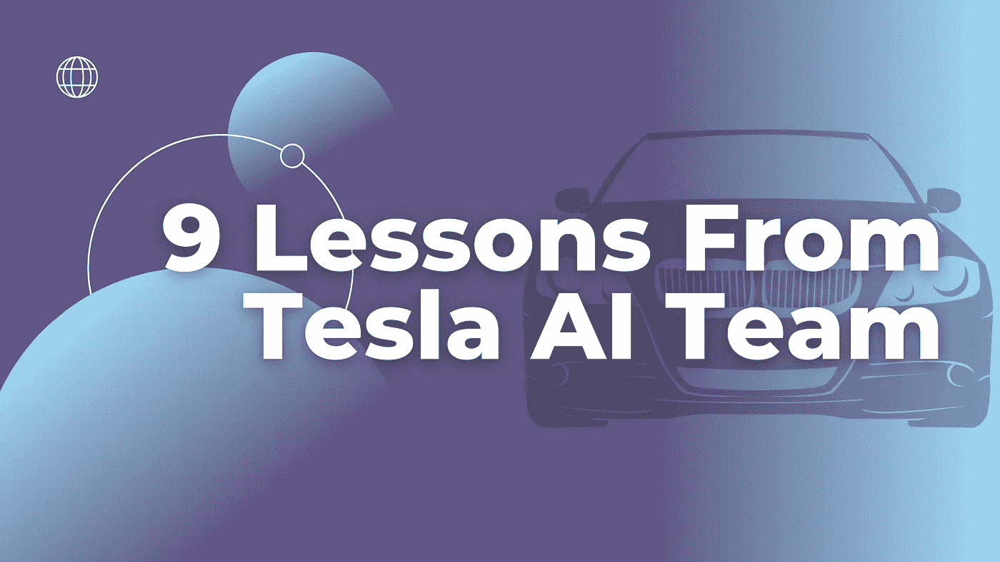
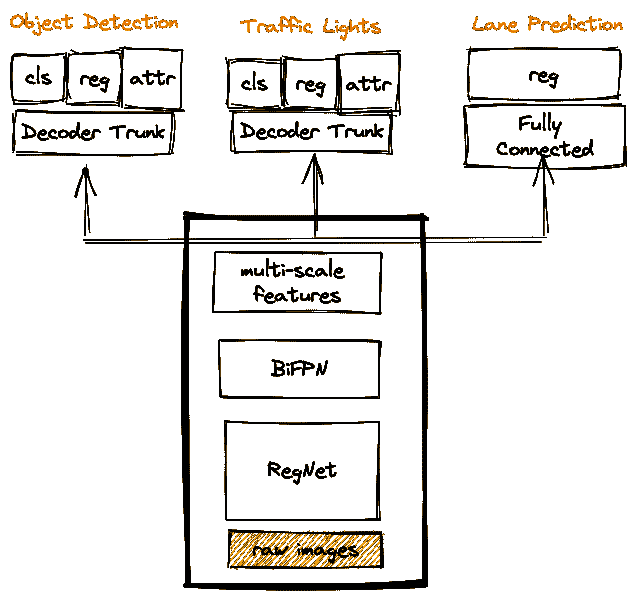
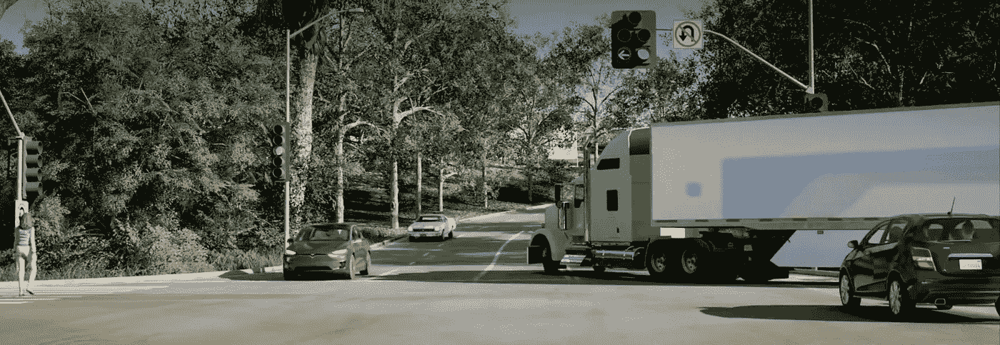

# 特斯拉人工智能团队的 9 个教训

> 原文：<https://pub.towardsai.net/9-lessons-from-the-tesla-ai-team-3c311100e6cc?source=collection_archive---------0----------------------->

## 什么促成了特斯拉的成功，你能做些什么

虽然 OpenAI 因在 NLP 方面的成功而闻名，DeepMind 因 RL 和决策而闻名，但特斯拉绝对是计算机视觉领域最具影响力的公司之一。即使你不是计算机视觉从业者，你也可以从特斯拉那里学到很多关于其生产级 AI 的东西。

特斯拉的人工智能团队不像优步或 Airbnb 那样发布博客帖子，所以外人很难理解他们做了什么，以及他们是如何实现今天的成就的。然而， [2021 特斯拉人工智能日](https://www.youtube.com/watch?v=j0z4FweCy4M)揭示了[技术](https://towardsdatascience.com/tesla-ai-day-2021-review-part-1-the-promise-of-fully-self-driving-cars-8e469265509b)以及所有人工智能参与者和公司可以借鉴的经验。

以下是教训。

来源:图片由作者提供。

# **一、业务**

## 1.创造性地(重新)使用尖端技术

特斯拉公布了其新产品:一款名为特斯拉机器人(Tesla Bot)的人形机器人。虽然车辆和机器人可能看起来非常不同，但自动驾驶汽车和人工智能机器人实际上有很多共同的组成部分。例如，特斯拉汽车和特斯拉机器人都需要传感器、电池、实时计算和分析接收的数据，以及即时决策能力。因此，特斯拉制造的人工智能芯片和硬件可以在这两款产品上使用。

在软件和算法方面，这两款特斯拉产品需要视觉系统和规划系统。因此，特斯拉汽车团队可以与特斯拉机器人团队共享软件代码库。规模经济进一步降低了平均开发成本，并可能使特斯拉在市场上更具竞争力。

特斯拉 AI 团队的另一个好处是，从特斯拉 Bot 接收的数据也可以用于特斯拉自动驾驶汽车的训练。

事实上，还有其他重用内部先进技术的例子。其中一个是 reCAPTCHA。路易斯·冯·安(Luis von Ahn)首先与人合作发明了验证码，让人们通过输入屏幕上显示的字母来自我识别。后来，他挑战自己让验证码更有用，最后他与纽约时报合作[发明了 reCAPTCHA](https://www.youtube.com/watch?v=-Ht4qiDRZE8) ，这是一个分解书中长句并要求用户输入他们所看到的内容的系统。仅仅一个小小的调整就足以帮助**在几天内将数百万本可能需要几年才能完成的书籍数字化。**

如果你的公司有一项独特的技术，记住这项技术的本质，想想什么样的人会从你的技术中受益。投入一些精神资源去思考，你会找到你的下一个业务线。

# 二。改进和进步

## 2.迭代进度

在问答环节，埃隆·马斯克说，

> *一般来说，创新就是多少次迭代，每次迭代之间的平均进度是多少。所以如果你能减少迭代之间的时间，改进的速度会更快。*
> 
> *所以，如果训练一个模特有时需要几天时间，而不是几个小时，这是一件大事。*

对于 ML 工程师和数据科学家来说，我打赌你会同意我的观点，他说的再正确不过了。ML 的人花的时间，大多不是在机器学习建模上，而是像可视化的东西，错误分析，清洗数据，研究数据，获取更多的数据等等。没有合适的工具，开发人员需要**更长的时间**才能取得进展。另一个常见的场景是，同一个团队或同一个公司的多个团队中的多个开发人员正在独立地制作类似的工具**以使他们自己的生活更加轻松。**

**这解释了为什么特斯拉有一个**工具团队**并且在内部制造很多东西。这是下一课。**

## **3.专门设计的系统比通用系统更好**

**特斯拉明白，GPU 通常是内置的硬件，而大规模计算可以通过专门构建的芯片来加快速度。这就是为什么特斯拉打造了他们自己的 AI 芯片:Dojo。**

**除了芯片，特斯拉还建立了自己的人工智能计算基础设施，每周运行 100 万次实验。他们还构建了自己的调试工具来可视化结果。在演示过程中，Andrej Karpathy 提到他发现数据标签管理工具非常重要，他们为该工具感到自豪。**

**如果您的团队构建自己的工具的资源有限，请加入开源社区。您可以在开源项目的基础上构建适合您需求的东西。如果你的问题是新的，或者你有一个更好的解决问题的想法，那么做最难的部分，开发最初的原型，写好文档，帮助那些和你有相似问题的人来帮助你。**

## **4.错误不可避免。向他们学习。**

**如果你对站在舞台上的人的背景做一点研究，你很快就会发现他们都是极其聪明的人，他们获得了博士学位，毕业于顶级大学，或者在过去做过一些令人印象深刻的事情。**

**这些人也会犯错。Andrej Karpathy 分享说，他们一开始就与第三方数据提供商合作。我认为他们这样做是因为他们想更快地获得数据并降低成本。然而，他们很快发现，在如此重要的事情上与第三方合作，来回沟通是“行不通的”。然后，他们将贴标机带到了内部，现在他们有超过 1000 台贴标机。**

**这里的教训是，创新和技术进步总是一个试错的过程。错误是其中的一部分。如果你逃避错误，把失败归咎于他人，你就没有学习，也不会取得进步。**

# **三。人工智能实践**

## **5.神经网络是一个乐高积木**

**在问答分享中，Ashok Elluswamy 将神经网络视为系统中的一个模块，可以与任何东西结合。他解释说，你实际上可以在搜索和优化中进行烘焙，然后规划到网络架构中，或者你可以将基于物理的块(模型)和神经网络块结合起来，形成一个混合系统。**

**我觉得**把非神经网络模型和神经网络**结合起来进行训练的想法还是挺有意思的，绝对是一件值得尝试的事情。**

## **6.消防栓**

**HydraNet 的想法可以追溯到 2018 年，这在 AI 社区是很久的事情了。不过，我认为这个想法很棒，在很多情况下都会有用。Andrej 解释说，HydraNet 允许神经网络**共享一个公共架构**，**解耦任务**，你可以**缓存中间特性**以节省计算。**

****

**来源:作者的 HydraNets 图片。参考特斯拉 AI Day 中的原幻灯片转载。**

## **7.模拟作为解决数据不足的方法**

**标签失衡普遍存在，无处不在。少数民族的数据很难获得，如果不是不可能的话。然而，在现实世界中部署人工智能，总是边缘情况很重要，因为它可能意味着严重和不必要的后果。**

**模拟是产生新数据的数据论证技术之一，但说起来容易做起来难。在特斯拉，模拟团队使用光线追踪等技术来生成逼真的视频数据，我个人乍一看无法分辨这些数据是真是假。**

****

**特斯拉 AI 团队模拟的数据。来源:摘自 [YouTube](https://www.youtube.com/watch?v=j0z4FweCy4M) 。**

**我认为这项技术真的是特斯拉的秘密武器，因为这使得获得大量不寻常数据的任务变得极其容易。现在，他们可以生成视频数据，就像一对夫妇带着一只狗在高速公路上跑步一样，这是不可能的，但肯定是可能的。**

**顺便问一下，你对**模拟即服务**的想法有什么看法？**

## **8.99.9%的时候你不需要机器学习**

**一位观众问特斯拉是否在其制造设计或其他工程流程中使用机器学习，这是埃隆所说的。**

**我不会对 99.9%的数字发表评论，因为这取决于你在说什么。例如，你当然不需要 ML 来找出你消费最高的客户。你所需要的只是一个排序算法。**

**然而，我确实看到这是许多人的一个普遍错误。你需要满足一系列条件才能让 ML 工作。如果没有，还有一大堆其他工具可以帮助你解决数据科学问题。例如，遗传算法、数学建模、调度算法等等。**

> ***当你有一把锤子时，一切看起来都像钉子。***

## **9.数据和计算**

**自动驾驶模拟团队的经理 Ian Glow 提到，最近有一篇关于照片真实感增强的论文展示了最新的成果，但他的团队可以做的比发表论文的团队多得多。这是因为特斯拉拥有更多的数据、计算能力和人力资源。**

**这只是另一个表明数据和计算对于深度学习至关重要的例子。我认为这里的教训是，如果你确实需要在生产中使用深度学习，请花时间考虑如何有效和高效地获取数据和使用计算能力。继续这样做，直到获取数据和使用数据的平均成本可以忽略不计。**

# **结论**

**虽然许多人专注于深度学习模型的实现细节，但我认为它们背后的大思想、教训和思考过程同样有价值。我希望这篇文章能给你带来一些新的东西，帮助你制定一个更好的 ML 实践。**

**干杯。**

**如果你喜欢这篇文章，请👏 👏 😃。你的支持是我最大的动力💪。**