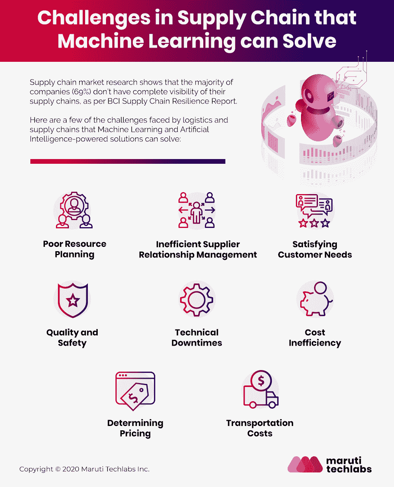
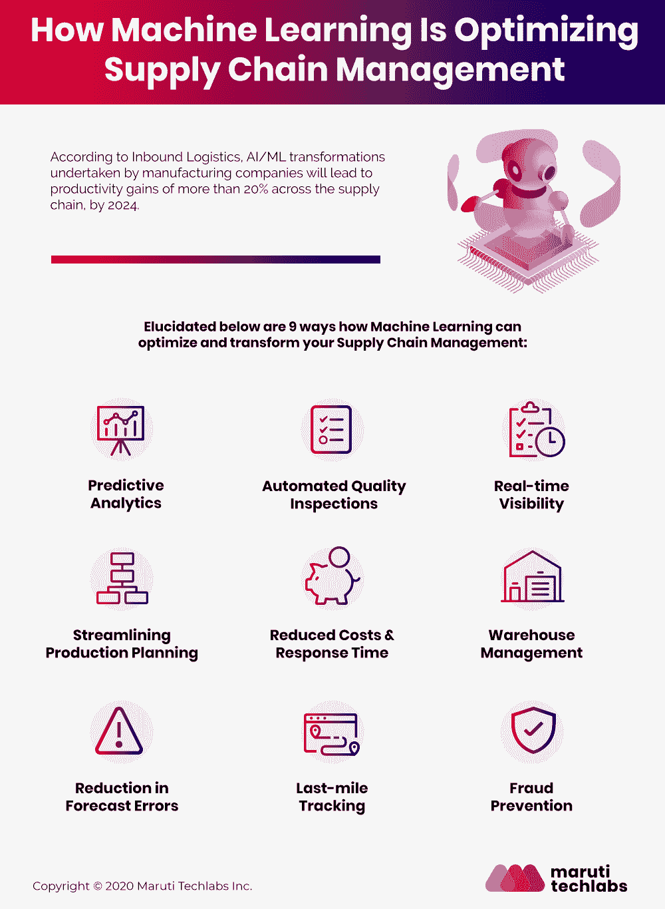

# 机器学习改善供应链管理的 9 种方式

> 原文：<https://pub.towardsai.net/9-ways-machine-learning-can-improve-supply-chain-management-ba4535b088dd?source=collection_archive---------3----------------------->

## [科技](https://towardsai.net/p/category/technology)，[未来](https://towardsai.net/p/category/future)

人工智能和机器学习最近已经成为不同垂直领域的流行语，但它们对现代供应链管理究竟意味着什么？

效率和成本效益是当今供应链管理面临的最大挑战。企业一直在努力降低成本，提高利润率，并提供卓越的客户服务。在这样一个竞争激烈的市场中，像机器学习(ML)和人工智能(AI)这样的颠覆性技术为公司带来了令人兴奋的机会。你抓住这些机会了吗？

# 供应链中的机器学习

人工智能和机器学习最近已经成为不同垂直领域的流行语，但它们对现代供应链管理究竟意味着什么？

首先，将机器学习集成到供应链管理中可以帮助自动化许多平凡的任务，并允许企业专注于更具战略性和影响力的业务活动。

> 使用智能机器学习软件，供应链经理可以优化库存，并找到最合适的供应商，以保持他们的业务高效运行。如今，越来越多的企业对机器学习的应用表现出兴趣，从其各种优势到充分利用仓储、运输系统和工业物流收集的大量数据。

它还可以帮助企业创建一个完整的机器智能驱动的供应链模型，以降低风险，提高洞察力，增强绩效，所有这些对于建立一个具有全球竞争力的供应链模型都是极其重要的。

Gartner 最近的一项[研究也表明，人工智能(AI)和机器学习(ML)等创新技术将在未来极大地扰乱现有的供应链运营模式。ML 技术被认为是一种高效益的技术，它能够实现高效的过程，从而节约成本并增加利润。](https://www.gartner.com/smarterwithgartner/gartner-top-8-supply-chain-technology-trends-for-2019/)

在深入研究机器学习如何变革供应链的细节以及讨论公司在供应链交付中成功使用 ML 的例子之前，我们先来谈谈机器学习本身。

# 什么是机器学习？

机器学习是人工智能的一个子集，它允许算法、软件或系统在没有专门编程的情况下进行学习和调整。

ML 通常使用数据或观察来训练计算机模型，其中数据中的不同模式(结合实际和预测的结果)被分析并用于改进技术如何运行。

> 基于算法的机器学习(ML)模型非常擅长分析趋势，发现异常，并在海量数据集中获得预测性见解。

这些强大的功能使其成为解决供应链行业一些主要挑战的理想解决方案。

# 物流和供应链行业面临的挑战

以下是物流和供应链面临的一些挑战，基于机器学习和人工智能的解决方案可以解决这些挑战:

*   **库存管理**

库存管理对于供应链管理极其重要，因为它允许企业处理和调整任何意外短缺。没有一家供应链公司愿意在寻找另一家供应商的同时停止公司的生产。同样，他们也不希望库存过多，因为这会影响利润。

供应链中的库存管理在很大程度上是在安排采购订单的时间以保持运营顺利进行，同时不过度储存他们不需要或不使用的物品之间取得平衡。

*   **质量与安全**

随着准时交付产品以保持供应链装配线运转的压力越来越大，保持质量和安全的双重检查成为供应链公司的一大挑战。接受不符合质量或安全标准的不合格零件可能会产生很大的安全隐患。

此外，环境变化、贸易争端和供应链上的经济压力很容易转化为问题和风险，并在整个供应链中迅速蔓延，造成重大问题。

*   **因资源匮乏而产生的问题**

由于资源稀缺，物流和供应链面临的问题是众所周知的。但人工智能和机器学习在供应链和物流中的实施，使得对各个方面的理解变得容易得多。算法在研究各种因素后预测需求和供应，从而实现早期规划和相应的库存。ML 为供应链的各个方面提供了新的见解，也使库存和团队成员的管理变得超级简单。

*   **低效的供应商关系管理**

供应链专业人员的极度缺乏是物流公司面临的另一个挑战，这可能使供应商关系管理变得繁琐和无效。

机器学习和人工智能可以提供对供应商数据的有用见解，并可以帮助供应链公司做出实时决策。

# 为什么机器学习对供应链管理很重要？

随着一些最大和知名的公司开始关注机器学习可以提高供应链的效率，让我们了解机器学习在供应链管理中如何解决问题，以及这种强大的技术在供应链管理中的当前应用。

> 机器学习给供应链管理带来了几个好处，包括-

*   机器学习带来的成本效益，系统地推动减少浪费和提高质量
*   优化供应链中的产品流，而不需要供应链企业持有大量库存
*   由于更简单、更快速和成熟的管理实践，无缝的供应商关系管理
*   机器学习有助于获得可操作的见解，允许快速解决问题和持续改进。

# 供应链中机器学习的 9 大用例

机器学习是一门复杂而有趣的学科，可以解决许多跨行业的问题。

> 作为一个严重依赖数据的行业，供应链有许多机器学习的应用。下面阐述的是机器学习在供应链管理中的 9 大用例，它们有助于推动行业走向高效和优化。

## 预测分析

在供应链管理中，准确的需求预测有几个好处，例如降低持有成本和优化库存水平。

使用[机器学习](https://marutitech.com/machine-learning-services/)模型，公司可以享受需求预测预测分析的好处。这些机器学习模型擅长识别历史需求数据中的隐藏模式。供应链中的机器学习也可以用于检测供应链中的问题，甚至在它们扰乱业务之前。

拥有强大的供应链预测系统意味着企业拥有资源和智能来应对新出现的问题和威胁。此外，响应的有效性与企业对问题的响应速度成正比。

## 自动化质量检测实现稳健管理

物流中心通常会进行人工质量检查，以检查集装箱或包裹在运输过程中是否有任何损坏。人工智能和机器学习的发展扩大了供应链生命周期中自动化质量检查的范围。

机器学习技术允许自动分析工业设备中的缺陷，并通过图像识别检查损坏情况。这些自动化质量检测的优势在于减少了向客户交付有缺陷或有缺陷商品的机会。

## 提高客户体验的实时可见性

Statista [调查](https://www.statista.com/statistics/829634/biggest-challenges-supply-chain/)发现可见性是困扰供应链企业的一个持续挑战。蓬勃发展的供应链业务严重依赖于可见性和跟踪，并不断寻找有望提高可见性的技术。

> 机器学习技术，包括深度分析、物联网和实时监控的结合，可以用来大幅提高供应链的可见性，从而帮助企业转变客户体验，实现更快的交付承诺。机器学习模型和工作流通过分析不同来源的历史数据，然后发现供应链上各流程之间的相互联系来做到这一点。

这方面的一个很好的例子是亚马逊使用机器学习技术为其用户提供卓越的客户体验。ML 通过使公司能够深入了解产品推荐和客户后续网站访问之间的相关性来做到这一点。

## 简化生产计划

机器学习可以在优化生产计划的复杂性方面发挥重要作用。机器学习模型和技术可以用于在已经可用的生产数据上训练复杂的算法，以帮助识别可能的低效和浪费区域。

此外，值得注意的是，在供应链中使用机器学习来创建更具适应性的环境，以有效处理任何类型的中断。

## 降低成本和缩短响应时间

越来越多的 B2C 公司正在利用机器学习技术来触发自动响应和处理供需不平衡，从而最大限度地降低成本和改善客户体验。

> 机器学习算法从实时数据和历史交付记录中进行分析和学习的能力有助于供应链经理优化其车队的路线，从而减少驾驶时间，节省成本并提高生产率。

此外，通过改善与各种物流服务提供商的连接以及整合货运和仓储流程，可以降低供应链中的行政和运营成本。

## 仓库管理

高效的供应链计划通常等同于基于仓库和库存的管理。利用最新的需求和供应信息，机器学习可以使公司不断改进工作，以最低的成本满足客户服务水平的期望水平。

> 供应链中的机器学习及其模型、技术和预测功能也可以解决库存不足或过量的问题，并彻底改善您的仓库管理。

使用 AI 和 ML，您还可以更快地分析大数据集，并避免人类在典型场景中犯下的错误。

## 减少预测误差

机器学习是一种强大的分析工具，可以帮助供应链公司处理大量数据。

除了处理如此大量的数据，供应链中的机器学习还确保它以最大的多样性和可变性完成，这一切都要归功于远程信息处理、物联网设备、智能交通系统和其他类似的强大技术。这使得供应链公司能够获得更好的洞察力，并帮助他们实现准确的预测。麦肯锡的一份报告也指出，供应链中基于人工智能和人工智能的实施可以减少高达 50%的预测误差。

## 先进的最后一英里跟踪

最后一英里交付是整个供应链的一个重要方面，因为它的效率会对多个垂直领域产生直接影响，包括客户体验和产品质量。数据还显示，供应链中的最后一英里配送占了[所有配送成本的 28%。](https://www.mdpi.com/2071-1050/10/3/782/pdf)

供应链中的机器学习可以通过考虑关于人们用来输入地址的方式以及将货物运送到特定位置所需的总时间的不同数据点来提供巨大的机会。ML 还可以在优化流程方面提供有价值的帮助，并为客户提供更准确的装运状态信息。

## 欺诈防范

[机器学习算法](https://marutitech.com/problems-solved-machine-learning/)能够通过自动化检查和审计流程，然后对结果进行实时分析，以检测异常或偏离正常模式的情况，从而提高产品质量并降低欺诈风险。

除此之外，机器学习工具还能够防止特权凭证滥用，这是全球供应链违规的主要原因之一。

# 使用机器学习改善供应链管理的公司

以下是一些使用机器学习来提高供应链管理效率的顶级公司:

## a) [com —电子商务](https://www.businessinsider.com/machine-learning-driving-innovation-at-amazon-2017-4?IR=T)

电子商务行业著名的供应链领导者之一亚马逊利用基于人工智能和机器学习的技术先进的创新系统，如自动化仓储和无人机送货。

由于在智能软件系统、运输和仓储方面的大量投资，亚马逊强大的供应链直接控制着包装、订单处理、交付、客户支持和逆向物流等主要领域。

## b) [微软公司—技术](https://www.sap.com/assetdetail/2018/05/6a45406d-077d-0010-87a3-c30de2ffd8ff.html)

科技巨头微软的供应链系统严重依赖于由机器学习和商业智能驱动的预测洞察力。

该公司拥有庞大的产品组合，这些产品组合会产生大量数据，需要在中央级别进行集成，以进行预测分析并提高运营效率。

机器学习技术使该公司能够建立一个无缝集成的供应链系统，使他们能够实时捕捉数据并进行分析。此外，该公司强大的供应链利用主动预警系统来帮助他们降低风险和快速解决问题。

## c) [Alphabet 公司——互联网集团](https://notesmatic.com/2019/09/supply-chain-management-at-google/)

Alphabet 是一家著名的技术巨头和高度创新的技术公司，它依靠灵活、反应迅速的供应链，能够以无缝的方式跨区域协作。

Alphabet 的供应链利用机器学习、人工智能和机器人技术来实现完全自动化。

## d) [宝洁&博彩——消费品](https://digital.hbs.edu/platform-rctom/submission/pg-end-to-end-supply-chain-model/)

消费品领先企业 P&G 拥有最复杂的供应链之一，拥有庞大的产品组合。该公司出色地利用机器学习技术，如高级分析和端到端产品流管理的数据应用。

## e) [劳斯莱斯汽车](https://www.ship-technology.com/features/rolls-royce-teams-google-ai-driven-ship-awareness/)

罗尔斯·罗伊斯(Rolls Royce)与谷歌(Google)合作，创造了自动驾驶的船只，在这里，机器学习和人工智能技术取代了所有船员的工作，而不是仅仅取代无人驾驶汽车中的一名司机。

该公司现有的船只使用算法来准确感应水中周围的东西，并根据它们对船只构成的危险相应地对物品进行分类。ML 和 AI 算法还可以用于跟踪船舶发动机性能、监控安全以及装卸货物。

# 结果

提高供应链的效率在任何企业中都起着至关重要的作用。在利润微薄的情况下经营业务，任何一种流程改进都会对底线利润产生巨大影响。

像机器学习这样的创新技术使得应对全球供应链中的波动性和准确预测需求的挑战变得更加容易。Gartner 预测，到 2023 年，至少 50%的供应链运营全球公司将使用人工智能和人工智能相关的转型技术。这证明了机器学习在供应链行业越来越受欢迎。

但是，为了能够获得机器学习的全部好处，企业需要规划未来，并开始投资于今天的[机器学习](https://marutitech.com/machine-learning-services/)和相关技术，以在供应链行业中享受更高的利润、效率和更好的资源可用性。