# 两周 900 颗星:Deepchecks 的开源版本和导致它的一切

> 原文：<https://pub.towardsai.net/900-stars-in-2-weeks-deepchecks-open-source-release-and-everything-leading-up-to-it-d1dea1186356?source=collection_archive---------0----------------------->

## [编程](https://towardsai.net/p/category/programming)

# 几周前，我和我的团队发布了一个 python 包，用于测试机器学习模型和数据。这带来了一些有价值的教训，我认为值得分享，所以在这里🙂

# ❓Who 这是 for❓吗

*事实证明，尽管许多伟大的软件包完全对公众开放，但这些项目背后的个人* ***公开分享关于发布的“幕后”*** *并不常见。这让我/我们写一篇关于我们经历的详细博客变得很重要。* *✅*如果你正在* ***参与一个开源项目或者科技创业*** *(或者正在考虑参与)，我认为这篇文章会很有用。* ❌ *否则，这可能不值得你浪费时间。**

# 👋介绍

几周前，我和我的团队发布了 [deepchecks](https://github.com/deepchecks/deepchecks) ，这是一个 python 包，旨在为机器学习模型和数据构建测试套件。在发布之前，我们降低了预期，并认为需要几个月的时间 deepchecks 才会引起注意。然而，这个版本最终比我们想象的要成功得多——我决定分享一些我认为对其他人也有帮助的想法和经验。

我将在这篇文章中讨论几件事:

1.  **回顾:**从公司成立到发布的时间线
2.  **社区:**专业社区在我们发布前后的重要性
3.  **发布:**发布的度量标准以及 deepchecks 的特色
4.  **经验:**我和我的团队在准备发布时学到的经验，我认为对其他人会有帮助
5.  改进:有些事情我们本可以改进的
6.  **愿景:**根据经验教训完善我们的长期愿景

所以我们开始吧😇：

哦，如果你喜欢我们正在做的事情，请考虑 GitHub ⭐ *上由我们主演的* ⭐ [*，并加入我们*上的讨论👐](https://github.com/deepchecks/deepchecks) [*懈怠社区*](https://join.slack.com/t/deepcheckscommunity/shared_invite/zt-y28sjt1v-PBT50S3uoyWui_Deg5L_jg) 👐*。*

# 🕐概述

## 古代史:ML 监控为唯一焦点

Deepchecks 已经存在两年多了。我和我的团队一直热衷于开发一种产品，这种产品将真正影响机器学习实践者的日常生活，并将成为数据科学家的“家喻户晓的名字”。这确实是促使我和我的联合创始人( [Shir Chorev](https://medium.com/u/a37019811ee5?source=post_page-----d1dea1186356--------------------------------) )解决这个问题的部分原因，我认为这也是让我们的创始团队成员对跳槽充满热情的主要原因。

尽管如此，在大约 1.5 年的时间里，我们将大部分开发资源集中在 ML 监控解决方案上，这意味着企业已经将 ML 模型部署到生产中。原因很明显:

1.  这是你在与企业内部的人工智能领导者交谈时会听到的主要痛点。
2.  公司愿意为此付费，但不一定觉得有必要进行内部开发

虽然这种方法确实触及了生产中 MLOps 最明显的问题之一，但我们看到这几乎保证了我们一个缓慢而笨拙的过程😞。在我们开始 POC 之前，在他们开始体验价值之前，通常需要内部支持者暂时批准预算和 IT/InfoSec 的批准…这与我们的目标相去甚远，无法找到成为“家喻户晓”的途径。

当你不能用弹药武装你的 DS 冠军时，这就是开始 POC 的感觉。迪士尼动物园办公室树懒 GIF。

## ML 验证“试点”(处于备用状态)

大约在去年的这个时候(大约 2021 年 1 月)，我们的 algo 团队开始致力于一个旨在进行 ML 验证的辅助项目。想法很简单:用户将上传他们的模型和数据到我们的网站，并可以下载一份总结许多不同方面的报告。这是这个“试点”版本的样子:

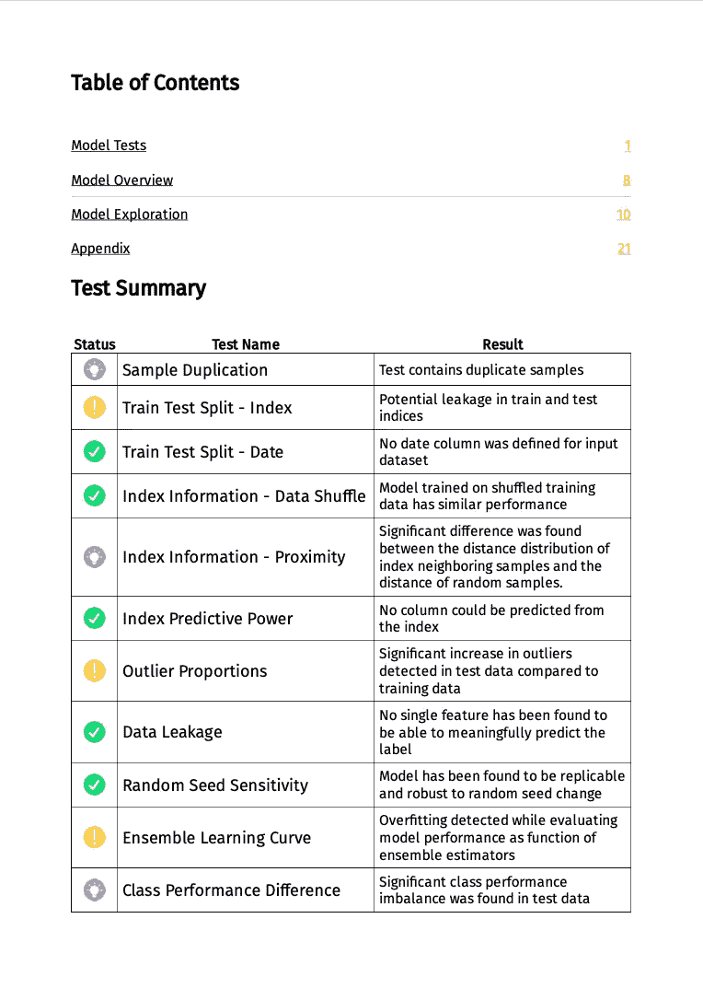

我们 ML 验证包的第一个版本，最初以 PDF 报告+ UI 的形式上传。

我们对 4 到 5 名数据科学家进行了用户访谈，收到了不同的反馈🤔。他们都喜欢这个想法，但也有很多有趣的想法:

*   如果我想自定义我的报告怎么办？还是只加一张自定义支票？
*   我必须把我的数据上传到你的服务器吗？如果是本地部署，将如何部署？
*   我能以 python 包的形式得到它吗？

经过密集的内部讨论，我们得出的结论是，尽管这个项目看起来很有前景，但它需要大量的工作才能启动，而且它似乎太独立于 ML 监控，我们无法同时在这两个项目上进行团队合作。所以我们让它待命。

然而，我认为我们都没有忽视这个想法的潜力。而且至少在个人层面上，这个“飞行员”一秒钟都没有离开过我的脑海。我觉得这可以被比 ML 监控受众更广泛的人群使用——学生、研究尚未部署的模型的数据科学家等等。所以每次我们有一个重要的产品路线图讨论，这个项目“复活”的可能性就会出现。

## 突破&黑客马拉松

在 2021 年 9 月，也就是我们将验证项目搁置大约 8 个月后，我们有了一个“梦想成真”的时刻。我们的团队取得了突破，使我们能够使用相同的基础设施进行离线验证和生产监控。

这个想法非常简单，并且非常符合你所知道的(和喜欢的)deepchecks 包😉 ❤️).这是这个想法的主要部分:

*   ML 验证模块应该是一个 python 包，而不是自动生成的 PDF 报告。如果用户愿意，结果可以作为报告下载。
*   python 包必须是开源的，这样:
    -它可以在包含敏感数据的环境中本地使用。
    -社区可以贡献他们自己的检查和测试功能。
*   报告将由不同类型的测试套件构建，其中每个测试套件将与特定类型的用例相对应。
*   通过添加、删除或定制不同的功能，可以获得套件的可定制性。
*   我们的 ML 监控系统的仪表板和警报策略可以使用与 ML 验证包相同的 python 包中的套件轻松配置。

如果我们能让它发挥作用，这对我们来说可能是一个巨大的新闻。我们最终可以让我们的团队致力于测试/验证用例，而不必考虑这是一个可能会分散我们注意力的独立项目。

因此，我们决定对此进行测试，并就这是否可行以及如何可行进行重要的内部讨论。但是到目前为止，只有 algo 团队参与其中。那么，其他团队成员如何明智地表达他们的意见，说出他们认为是好还是坏的想法呢？我们的解决方案—让每个人都参与进来。

我们在 10 月份开始了为期三天的全公司黑客马拉松(随后是公司休息日=])。结果令人难以置信。经过一周的准备和为期三天的黑客马拉松，我们有了一个可工作的、像样的演示，完全符合我们的想象。最初的反馈是非常积极的，或者至少是你能从一个相当初步的计划中得到的积极的反馈。

(有趣的轶事——在这次黑客马拉松结束时，这个包的名字是' **mlchecks** ，而不是' **deepchecks** ')

Deepchecks 包正在运行。由 Cornellius Yudha Wijaya 制作。

## 明确的发布日期，“无声发布”，迷你截止日期

从我们短暂的实验中感受到一个成功的故事后，我们获得了足够的信心来进行一次大胆的行动。除了决定开源我们现有的大量知识产权，我们还决定在接下来的几个月里将我们绝大部分的资源(> 80%)投入到开源工作中。剩下唯一要做的事情就是确定发行日期。

我们选择的发布日期是大约 3 个月后:**2022 年 1 月 6 日**。为什么？我们的考虑相当武断。我们认为 1.5 个月的时间不够，我们不想在离假期太近的时候发布这个包。无论如何，有一个明确的发布日期，整个团队都非常重视，这是一个非常好的体验。

以下是我们为发布日期所做的准备工作:

1.  **失败/通过标准:**我们决定这段时间的核心重点是超过用户反馈积极程度的某个阈值。我们决定的失败/通过标准非常简单:我们需要让试用该软件包的大多数用户积极回答这两个问题(我们总是问):
    -如果你在不认识我们的情况下看到这个软件包，你会使用它吗？
    -你会推荐给朋友吗？
    只要特定的人/团体不是这样，我们就知道我们有工作要做。
2.  **静默发布:**由于我们关注的是真实的用户反馈，我们希望确保他们的体验尽可能接近“发布后的那一天”。因此，在软件包准备就绪前一个月左右，我们进行了一次“静默发布”，用户可以直接链接到回购。我们只是善意地要求所有的测试者不要在发布日期之前分发这个包。
3.  **迷你截止日期**:让我们将发布日期(1 月 6 日)标记为“ **T** ”。仅仅把'**' T '【T5]'作为一个离我们还有几个月的大截止日期，对我们来说不是一个好的策略。因为我们的主要目标是在关于用户反馈的通过/失败标准上做得更好，所以我们设置了与此相关的小期限:
    💻在'**T-10 '**(10 =发布前的天数)收集来自**几十个**用户/beta 测试人员的反馈，以便为发布做准备。反馈收集后的几天将被封锁，以修复 bug 或 beta 测试人员的其他投诉。如果修复后我们没有通过通过/失败标准，我们应该考虑推迟发布截止日期。
    💻在' **T-20** '从**几个团队**收集反馈，但这次的想法不是为发布做准备，而是为 **'T-10** 事件做准备。如果需要，我们将了解我们需要推迟' **T-10'** 截止日期。
    💻在'**T-30**'-为' **T-20'** 活动做准备，收集一些个人“朋友和家庭用户”的反馈。现在你可能已经了解我们的迷你截止日期了😉。但我对我们团队的工作方式印象深刻的是，我们不需要移动任何一项活动。一切都完全按照时间表进行，所以发布日期仍然是 1 月 6 日，而**甚至没有移动一天**。**

老实说，我认为准时不仅仅是“魔法”和伟大的计划。我认为这个时间表很有挑战性，但也是可以实现的，一旦我们(令人惊讶的)团队成员接受了目标和最小期限(我们一起制定的)，他们就会感到有责任感，并尽一切努力去实现它们。

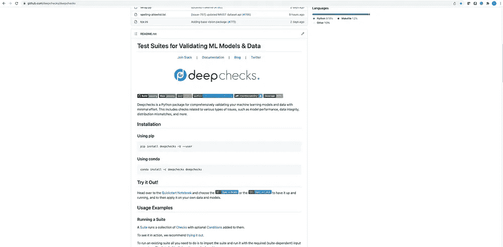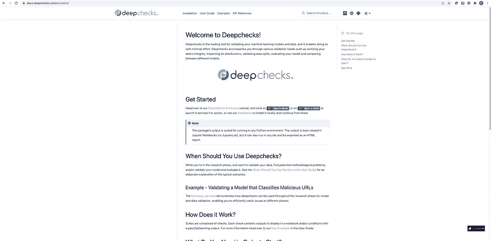

经过多次“乒乓”之后，这就是 deepchecks 自述文件(左)和文档(右)的样子。在与社区的迭代过程中，价值实现时间显著缩短，目前可以在向现有笔记本添加 3-8 行代码后打印出完整的测试套件。

# 🏘️社区

## 社区故事，而不是深入调查的故事

在我深入研究这些数字之前，我认为这是一个很好的机会来感谢社区为我们提供了一个很好的开端。我和我的团队从你们那里得到的支持和能量让我目瞪口呆。认可、想法&反馈非常有意义，给了我们足够的信心，让我们能够继续以开源的方式解决这个问题。因此，在接下来的部分，我将吹嘘一些衡量标准——但我认为值得澄清的是，我将讲述的不是我的故事。甚至是我在 Deepchecks 的同事的故事。真的是社群的故事(就是说你！).

这里有一个我能感同身受的社区故事:
一些测试/验证 ML 的解决方案已经开始出现，但它们中的大多数都是“告诉我们，我们会向你展示我们的惊人但秘密的解决方案”类型的格式。这对于其他行业来说可以很好地工作，但是如果没有必要，ML 社区通常会试图避免这种类型的解决方案(是的，即使是银行和制药公司的 DSs)。所以在此期间，典型的 ML 从业者只是编写他们自己的测试，这是一个疯狂的工作量(+需要高级人员)。所以事实上，在 ML 堆栈中有一个重要的缺失组件，它变得越来越重要。

出现了一家公司(我们)，它希望与社区建立双赢的关系，并解决这个问题。即使在没有直接投资回报的情况下，公司也在开源软件上花费了开发资源，社区也尽可能地用开源软件的爱来帮助我们:关于特性的想法、积极的评论、贡献和传播信息。

这个“社区故事”，不是关于一家名为 Deepchecks 或“我们漂亮的眼睛”的公司。这是关于社区奖励那些帮助它的人。这仅仅是社区的“自我保护”机制。就这么简单。出于同样的原因，我相信当企业交易出现时，社区的个人成员也会更喜欢与 deepchecks 合作，而不是与“非社区专注”的公司合作。

# ⌚The 发布

## 来自发布的指标

事不宜迟，让我们深入数字，从“明星史”开始:

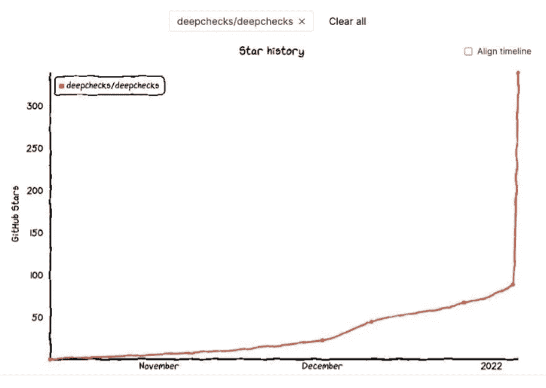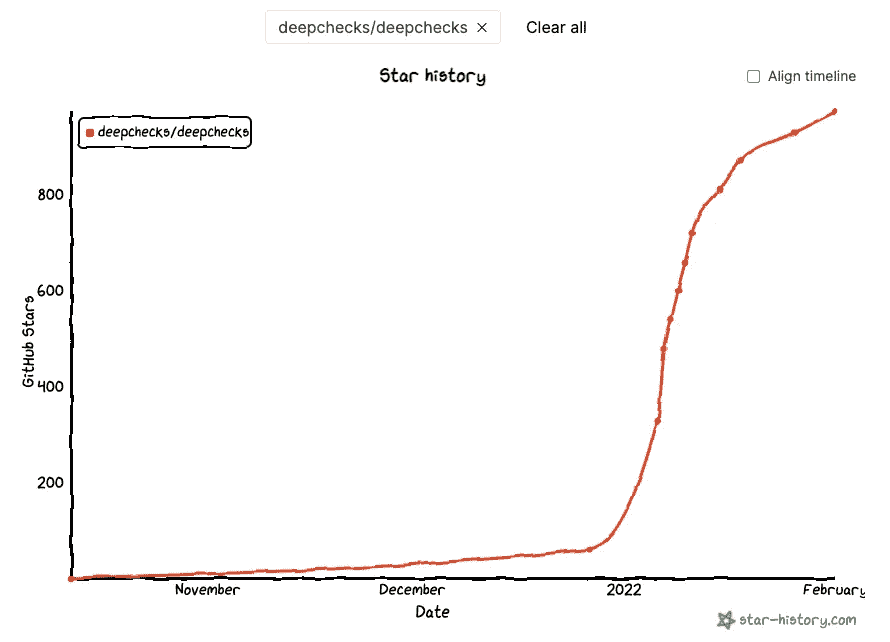

左边:发行前的明星历史。大约有 100 颗星星从无声发行期就已经存在了，高峰是从 1 月 6 日发行的那一天。右边:迄今为止的恒星历史。三周多一点后，目前大约 970 颗星。

正如你所看到的，deepchecks 在发布当天从 100 星攀升至约 350 星，并在大约 2 周内达到约 900 星。当我写这些文字的时候，我们已经有大约 970 颗星星了(发布 3 周多了)。对于一个全新的包装来说，相当令人印象深刻！

不像明星，下载量真的很难衡量。可能有一个拥有成千上万用户的巨大组织，只计算一次下载…你必须处理机器人，镜像下载，多种下载机制，等等。无论如何，下面是来自 PyPI 的下载统计数据(没有僵尸工具，没有镜像):

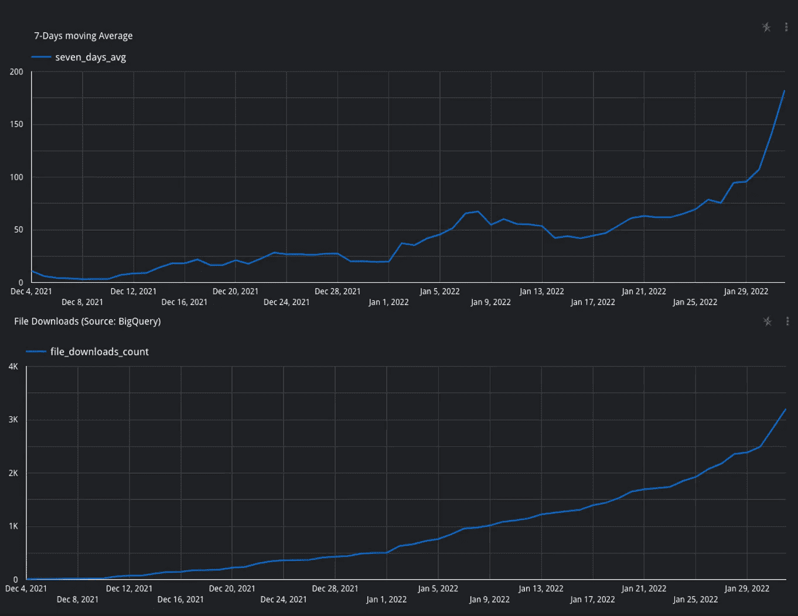

最上面:下载数量的 7 天移动平均值，自 1 月 6 日发布以来一直在持续增长。底部:迄今为止的总下载量，刚刚超过 3K 下载量。

据我们所知，这种分布似乎有一个非常有趣的机制。似乎很多人看到了这个包，给它加了星，发给了朋友，但实际上是等了一段时间，直到他们下载了它，并在自己的数据集上试用了它。

那么用户来自哪里呢？为了得到一个估计值，我们可以在我们的文档网站上查看来自 Google Analytics 的统计数据:

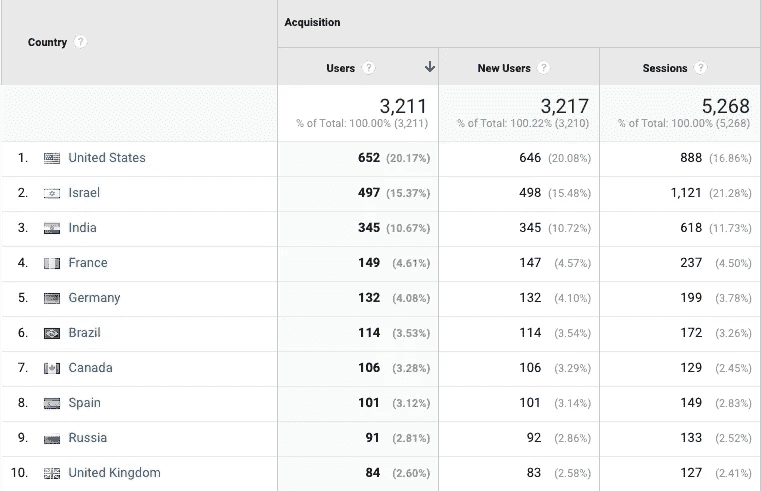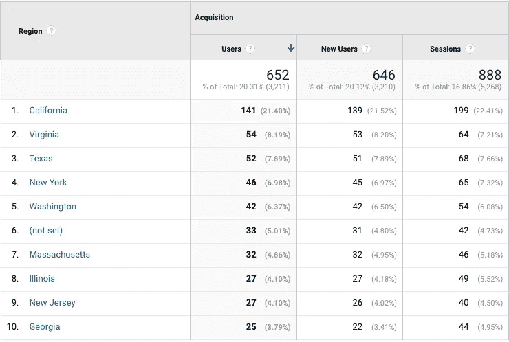

左边:deepchecks 文档上的访问者，按地理位置排列。美国是最常见的，紧随其后的是以色列。左边:深度检查文件上的美国访客，按州分类。

关于这些统计数据的一些评论/问题(我知道这些数字对于统计学意义来说太小了，但是仍然很有趣😀):

1.  美国的使用率似乎最高，但以色列的会话总数更高。这难道仅仅是因为我们 R&D 团队的核心在以色列吗？
2.  中国在哪里？！他们在 AI/ML 会议中占主导地位，但在我们的文档中却看不到他们的身影…没人告诉他们深度检查吗？还是他们已经遥遥领先，不需要医生了？我们可以问一个关于俄罗斯的类似问题，俄罗斯确实提供了一些流量，但不如一些小得多的国家，如西班牙和法国。
3.  弗吉尼亚有什么特别的，他们有很多 ML 吗？或者这是与 ML 有关的某个特定团体/课程？此外，德克萨斯州领先于纽约、华盛顿和马萨诸塞州，这很酷。我想知道它是否会随着时间的推移保持这样。

## 那么这个包裹在哪里展出呢？

我们很荣幸在相当多有趣的地方进行深度检查。其中一些非常早期，帮助我们获得了一些早期的关注和明星，而另一些则在给我们更详细的反馈(或额外的“批准章”)方面非常重要。我将从 LinkedIn 上的帖子开始，逐一介绍不同的类别:

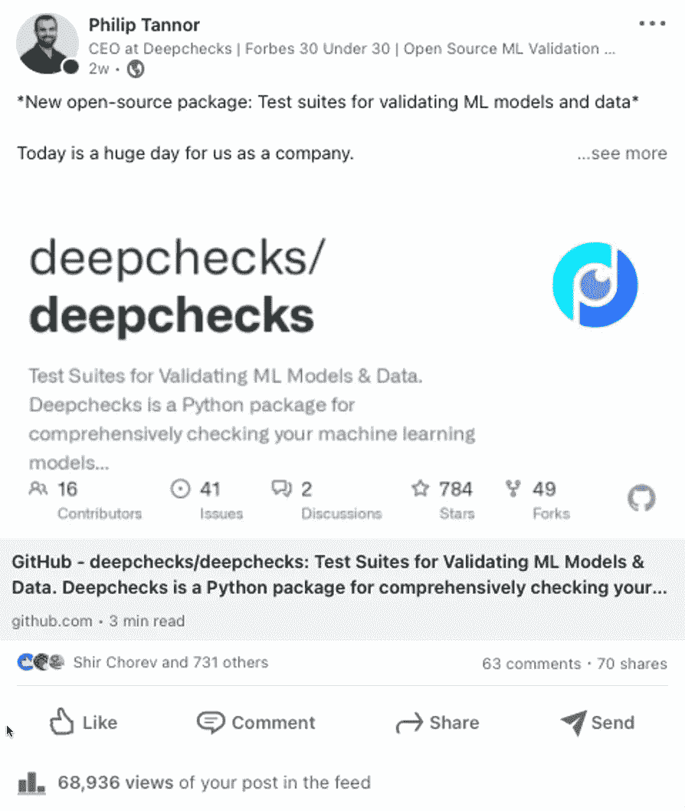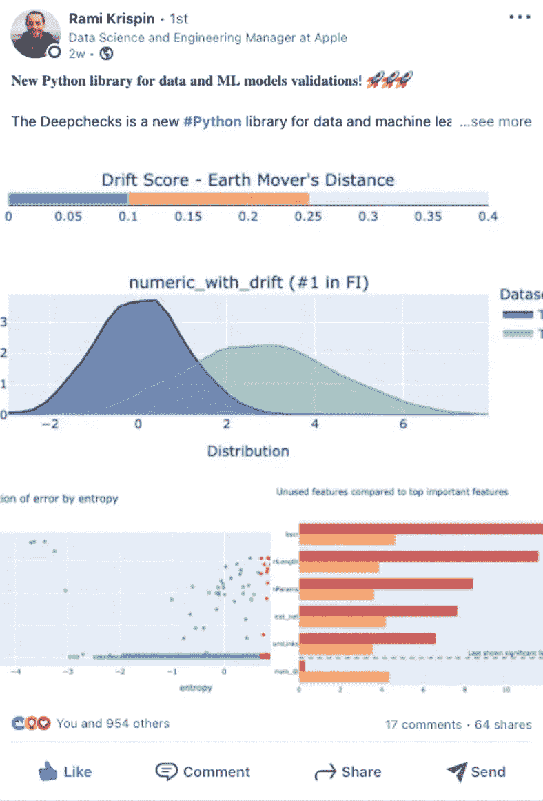

左边:来自我个人账户的 LinkedIn 帖子，被你们许多人分享，有近 7 万人阅读。右边是 Rami Krispin 在 LinkedIn 上的帖子，我在这篇文章发布之前并不认识他。我猜他的帖子比我的曝光率高(因为他有更多的反应)。

LinkedIn 的帖子是 deepchecks 回购的主要流量来源。这是两个最引人注目的帖子，但还有许多同事和社区成员发布的其他帖子。

我们也有一个相当重要的 Reddit 帖子，是由我们研发团队的 [Itay Gabbay](https://medium.com/u/e08add57fda?source=post_page-----d1dea1186356--------------------------------) 在发布当天自发撰写的:

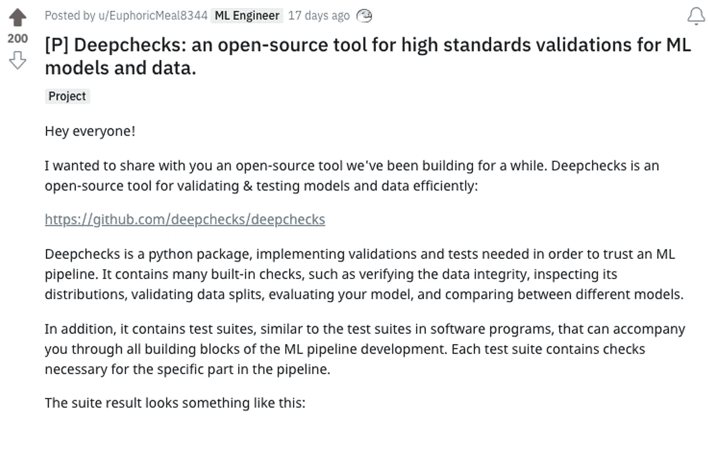

图片:Reddit 上的一个帖子引起了很多关注，也是 deepchecks 发布当天的重要流量来源。来看看[这里](https://www.reddit.com/r/MachineLearning/comments/rxczzl/p_deepchecks_an_opensource_tool_for_high/)

发布几天后，我们很高兴地看到 deepchecks 出现在 GitHub trending 上(针对 python)。我们在那里连续呆了三天……这也对回购的传入流量产生了影响，既来自 GitHub 上的[列表，也来自这条推文:](https://github.com/trending/python)

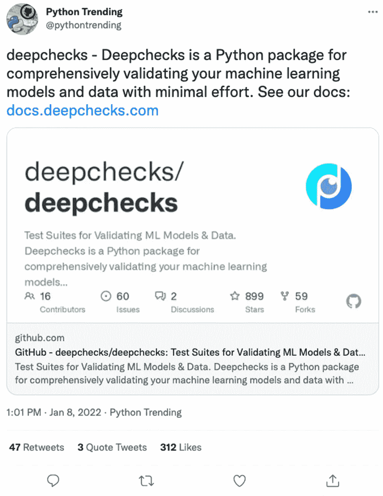

python 的“GitHub 趋势”推文。这是一个连续三天深度检查的荣誉

思想领袖还在时事通讯和帖子中介绍了我们。例如，参见:

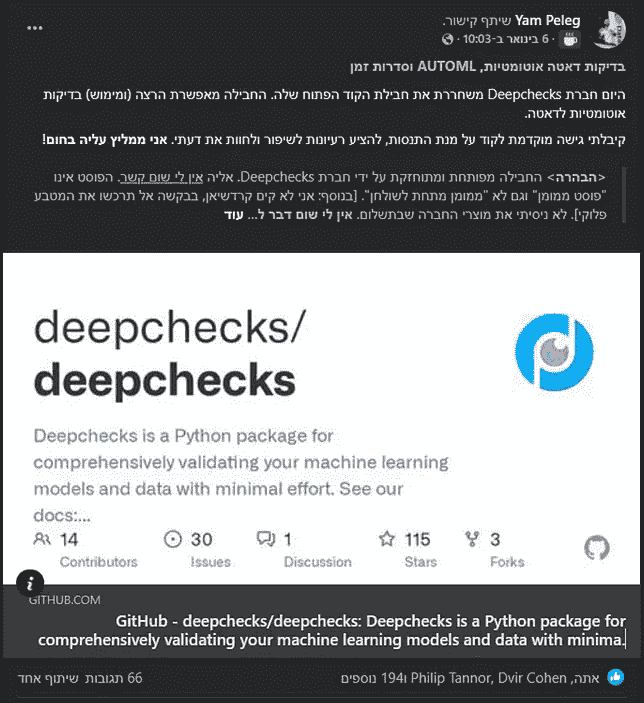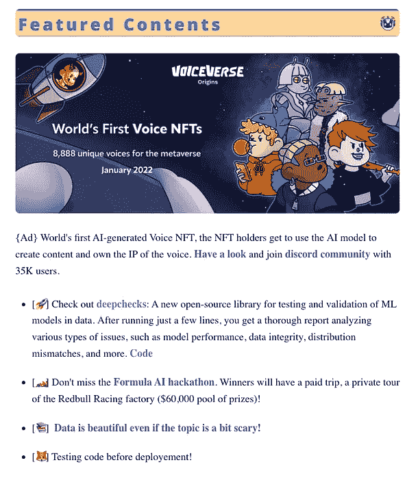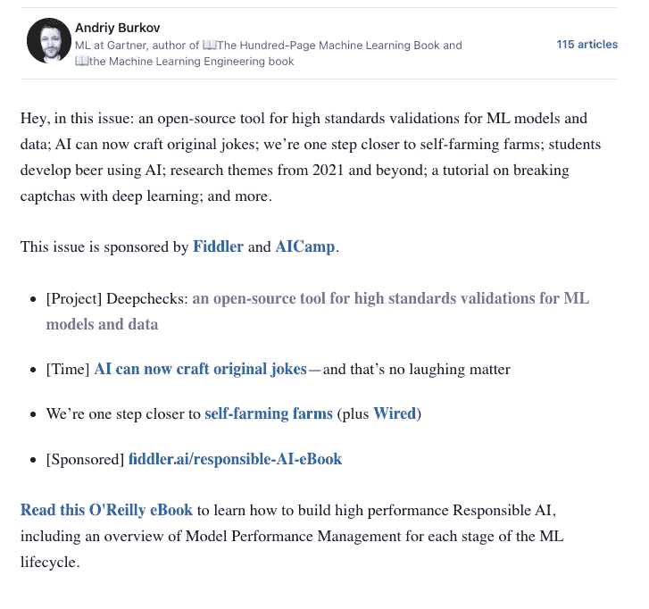

从左到右，深度检查推荐/审核人: [Yam Peleg](https://medium.com/u/e0607cd7607d?source=post_page-----d1dea1186356--------------------------------) (希伯来语) [Steve Nouri](https://medium.com/u/2768e797a377?source=post_page-----d1dea1186356--------------------------------) 和 [Andriy Burkov](https://medium.com/u/5f1bc10f2a73?source=post_page-----d1dea1186356--------------------------------)

Yannic Kilcher 在“ML 新闻”上特别报道了这个包裹:

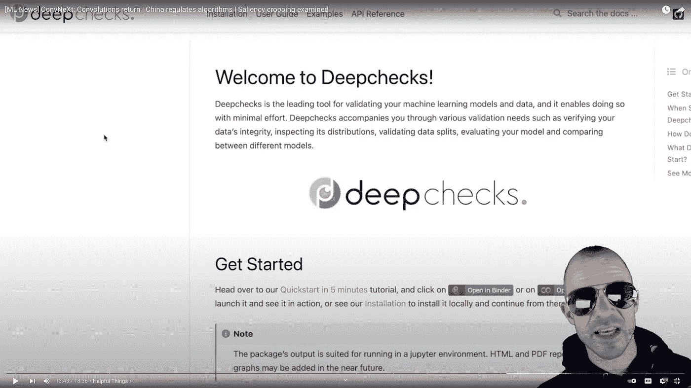

深度检查军情六处的新闻。在这里查看(从 13:35 开始)。希望在计算机视觉模块发布后能够再次出现！

deepchecks 甚至两次出现在《走向数据科学》上，作者是我们以前从未见过的人:

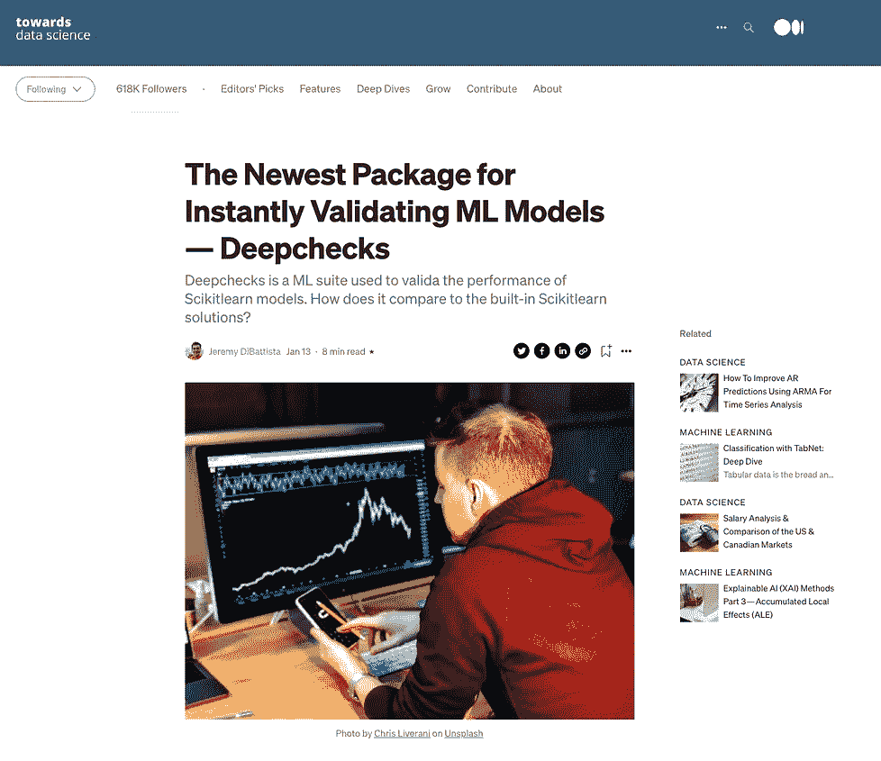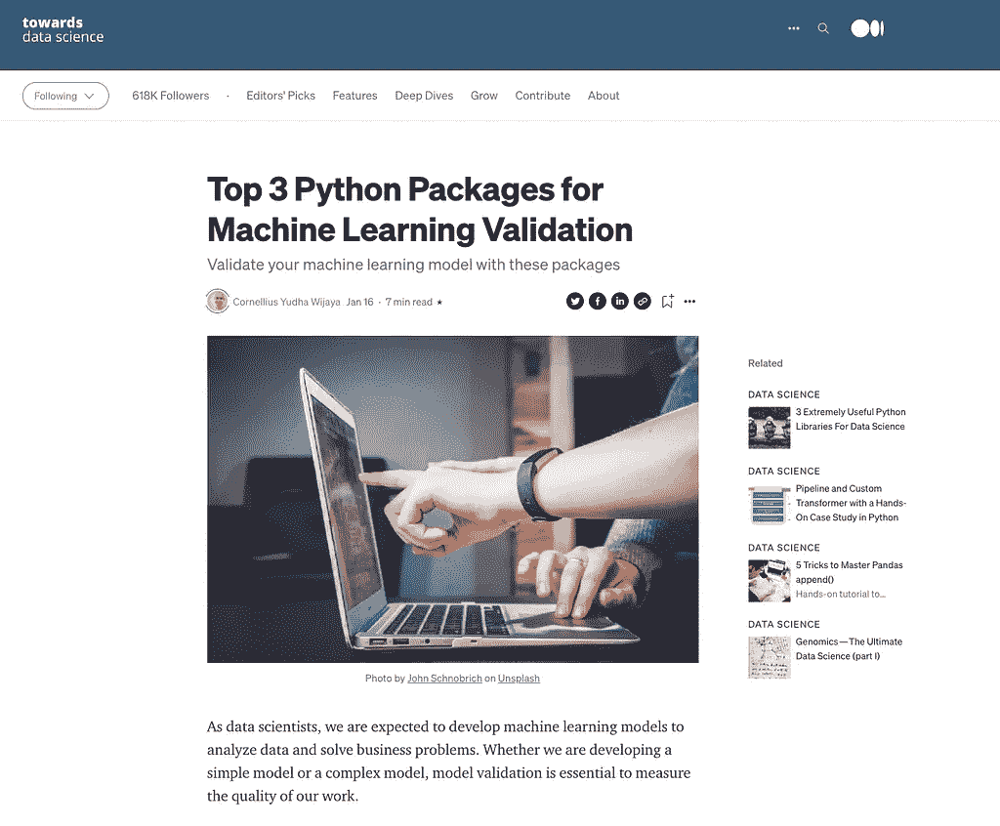

Deepchecks OSS 软件包由 Jeremy DiBattista 和 T2 Cornellius Yudha Wijaya 制作。链接[这里](https://towardsdatascience.com/the-newest-package-for-instantly-evaluating-ml-models-deepchecks-d478e1c20d04)和[这里](https://towardsdatascience.com/top-3-python-packages-for-machine-learning-validation-2df17ee2e13d)。

🤗正如你可能从我的写作语气中看出的，我对这些结果非常满意🤗。我们仍有很多工作要做，但这些指标都远远好于我和我的团队的预期。我认为发布如此顺利的主要原因是听取社区反馈并执行它。然而，我意识到推荐“倾听用户”是一个非常普通的建议，我想我有更多具体的经验可以与社区分享。

# 🏫经验教训

以下是我和我的团队从发布这个开源包中学到的主要经验:

1.  README + docs 的重要性:对于开源项目，README、docs 和 repo 的结构与代码/产品本身一样重要。原来很多人都知道这个，只是我们没有。我们在与用户的反馈会议中学到了这一点。我们最初的计划是没有初始版本的文档(只有自述文件)。然后，我们从用户反馈中了解到，我们至少需要最少的文档。在那之后，我们看到改进 docs+README 对整体用户体验的影响比实际的代码更改更大…
    ***有趣的轶事:*** 发布的前一天，我看着我们的 docs，变得有点焦虑。我们之前讨论过一些主要的变化，我发现它们还没有到位。但是我告诉自己已经太晚了，我们应该充分利用我们所拥有的(所以我没有告诉任何人我的担忧)。更让我紧张的是，在我们发布的那天早上，我们的 CTO Shir Chorev 睡过头了(当我打电话给她时，她说“OMG，我还没醒”)。但结果她整晚都在研究文件😆。我认为她所做的改变对发行的成功非常重要。
2.  **快速实现价值是关键**:我们花了很长时间才为自己实现这一目标，但你想要优化以实现快速口碑增长的一个关键指标是达到初始价值所需的时间。听起来微不足道，但有一百万的事情需要优化，对于 OSS 项目和类似的项目来说，这可能是最重要的。
3.  **迷你截止日期是一种很好的工作方式**:正如帖子开头所描述的，拥有这些清晰、频繁、有可衡量结果的截止日期真的很神奇。我不认为这总是可能的，但是当它是可能的时候——它可以对生产力有很大的帮助。
4.  **阳光让我们提升自己**:我真的觉得自从我们的代码开源后，我们的标准更高了。知道外面的每个人(包括挑剔的人)都能确切地看到我们在做什么，只会让每个人成为最好的自己。

# 📈丰富

1.  Twitter:社交媒体在宣传 deepchecks 计划方面发挥了重要作用。在过去的几年里，我在 LinkedIn 上花了很多时间，在发布期间，它确实得到了回报。然而，我刚刚开始了解到 Twitter 也同样重要。但是忽略了我的推特账号这么久，原来我的推特账号只是伤心。看看我在“发布日”的数据有多糟糕，尽管有重大新闻(7 个赞，< 3 条转发):

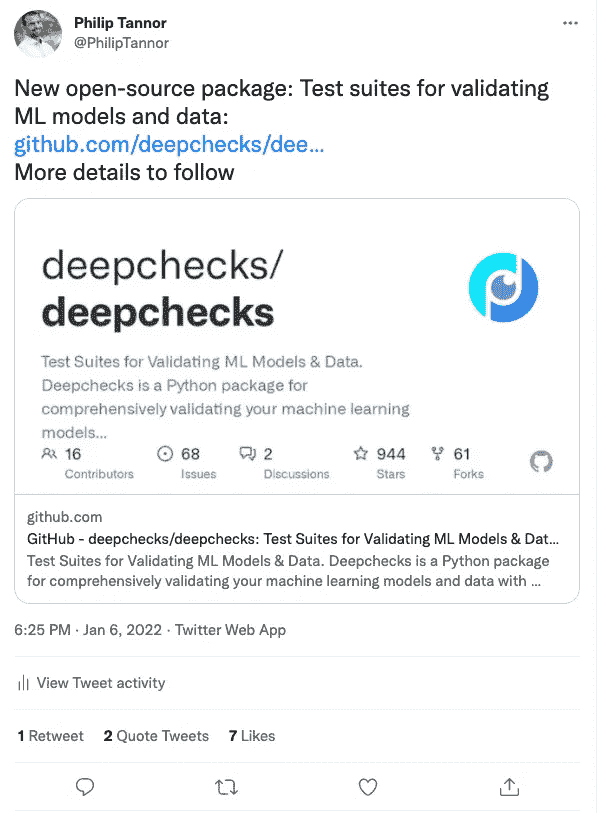

我糟糕的推特账户的例子。在发布了一个全新的开源包后，我甚至得不到 10 个赞…希望这在未来会有所改善。

*(顺便说一句，关于这个推特账户问题——如果你愿意帮助一个好的事业，我现在接受 pitty 追随者:*[*https://twitter.com/PhilipTannor*](https://twitter.com/PhilipTannor)*)*

2.**深入调查尚未发现的社区声音**:从一家“经典销售”公司转变为一家关注社区的公司需要许多重大变革。但其中之一是找到我们与社区交流的“基调”，这传达了我们正在以一种对社区和公司都有益的方式进行真正的合作。我们仍在解决这一问题，我们仍需确保我们的信息不会超出应有的“销售 y”。
顺便说一句，解决方案的一部分可能是雇用一名社区经理/德弗雷尔·🧑‍💼。请让我知道你或你认识的任何人是否适合这份工作。

# 👓结论和长期愿景细化

当我们的 OSS 包还很״draft-y״的时候，我真的不知道社区潜力是什么。但是在过去的几个月里，我们学到了很多，正如我在“社区”部分所写的，我认为 ML 社区和 Deepchecks(公司)之间的合作有很大的潜力。

**我相信 deepchecks 开源包有潜力成为一个“家喻户晓的名字”**，这将成为每个 ML 从业者工作流程的一部分，从大学生到大型企业中最资深的数据科学家。Deepchecks 真的可以变成“测试机器学习”的同义词，并有望在数据科学家之间的专业对话中用作动词。我认为，拥有一个用于 ML 测试验证的通用语言标准协议将会给社区带来巨大的好处…

随着我们继续将包从表格数据扩展到计算机视觉和 NLP，从 Jupyter 笔记本输出扩展到其他格式，我认为这一愿景开始变得越来越现实。

这真的会发生还是只是一个未实现的梦想？🛌🏾

说实话，那更取决于👉**你的**👈比在**矿**上做的还要多。

[*Philip Tannor*](https://www.linkedin.com/in/philip-tannor-a6a910b7/)*是持续验证机器学习系统和数据的领先公司*[***deep****checks*](http://www.deepchecks.com/)*的联合创始人兼首席执行官。Philip 在数据科学领域拥有丰富的背景知识，并拥有 NLP、图像处理、时间序列、信号处理等项目的经验。Philip 拥有电子工程硕士学位以及物理和数学学士学位，尽管他几乎不记得任何与计算机科学或算法无关的学习内容。*

(好吧，我的父亲是一位量子力学教授，他要求我澄清这只是一个玩笑。比起物理，我更喜欢 ML🤗*不过你还是可以问我伯努利原理*或者麦克斯韦方程组。只是不要在播客上给我惊喜！)