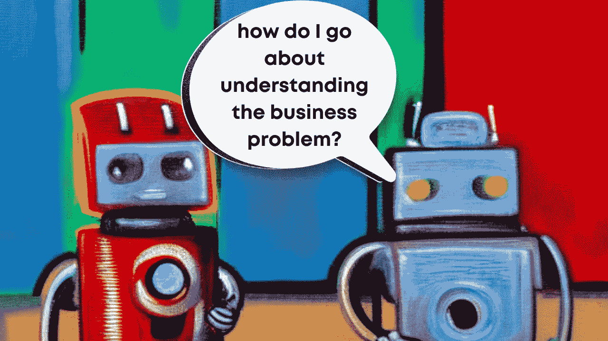

# 深入了解领域知识+数据科学

> 原文：<https://pub.towardsai.net/a-deep-dive-on-domain-knowledge-data-science-683e871d8206?source=collection_archive---------5----------------------->

## 你一直称之为领域知识的东西？

# 概观

我在向经理和高管(已经这样做了，或者那些渴望监督数据科学专业人员的人)讲授数据科学时，面临的最常见的问题之一是:你一直称之为领域知识的东西是什么？您能详细介绍一下领域知识以及它对数据科学家的重要性吗？领域知识可能意味着很多事情。对于数据科学专业人员来说，这意味着一些相当具体的东西。本文深入探讨了数据科学家所认为的领域知识。

在数据科学中，领域知识是一种专业形式的知识，通常通过多年的工作在任何领域中学习。专业人士通过高级学术研究、特殊的企业培训或纯粹的在职经验获得专业知识。例如，领域知识可以是零售业的知识。另一种类型的领域知识可能与医疗保健、医学或制药相关。其他特定领域的知识可以是会计、人力资源、市场营销、制造、建筑、城市管理。领域知识最重要的方面是，对于那些对特定领域有深刻理解的人来说，他们也将理解那些领域的业务问题。

在 [Unsplash](https://unsplash.com?utm_source=medium&utm_medium=referral) 上 [Thea](https://unsplash.com/@theasophie?utm_source=medium&utm_medium=referral) 拍摄的照片

理解业务问题——真正看到微妙或隐藏的问题以及预测每个问题细微差别的能力——是领域知识在数据科学中非常重要的原因。如果没有这些复杂的专业知识，数据科学家的价值将更加有限。数据科学家将了解数学、统计学和算法。通常，数据科学可以为企业提供通用的解决方案。但是，如果没有对领域知识的仔细考虑，通用的和可概括的数据科学方法实际上可能不会帮助企业解决具体的问题。

但是有了领域知识，或者在拥有领域知识的其他人的帮助下，数据科学家可以开发有针对性的解决方案，为企业带来有意义的变化。如果你对数据科学的职业感兴趣，尽早开始发展你的领域知识是很重要的，这样当你进入职场时，你就可以立即投入工作。如果你是一个数据科学团队的经理，或者如果你期望管理和监督数据科学专业人员的工作，这篇文章也适合你。

# 领域知识听起来如何

资深科学家:所以，你的意思是你想为我们的客户收集数据。不过，在开始收集数据之前，您需要知道一些事情。首先，理解你试图解决的业务问题是很重要的。不了解业务问题，就很难收集相关数据。

初级科学家:我明白。但是我如何着手理解业务问题呢？

图片来源:作者用 Jasper AI 艺术创作的背景机器人。

资深科学家:嗯，这取决于你工作的知识领域。例如，如果你在零售业工作，你可能想与商店经理和员工交谈，以更好地了解业务问题。或者，如果你在医疗保健行业工作，你可能想与医生和护士交谈来了解这个问题。没有放之四海而皆准的答案，但是在收集数据之前很好地理解业务问题是很重要的。

初级科学家:好的，所以我想更好地了解购物者如何使用优惠券。我注意到来自我们销售点系统的数据经常显示折扣，但不是折扣的原因。我想那些折扣可能是优惠券。我知道如果商店员工使用优惠券，他们有办法在交易中记录，但似乎有时他们会跳过这一步。

资深科学家:对，所以你想了解购物者是否使用优惠券，以及这如何影响他们的购物行为。但是看起来你有一些缺失的数据。或者，你似乎不确定如何解读这些数据。为了有效地进行这种分析，你需要获得更多的领域知识。在这种情况下，领域知识将是与商店店员在收银机销售期间遵循的程序相关的信息或知识。你可能还想和商店员工聊聊，问问他们对优惠券的体验。

初级科学家:我明白了。因此，我需要获得更多的领域知识，以便有效地解决业务问题。

资深科学家:对，没错。领域知识对数据科学家来说很重要，因为它有助于他们理解业务问题并收集相关数据。

# 领域知识的隐性本质

领域知识通常不是每个人都能轻松访问和理解的单一信息体。领域知识是特定于上下文的，并且总是不断发展的。它包括显性知识和隐性知识，前者可以被编纂/记录和分享，后者是个人的，难以分享。通常领域知识最重要的方面都深埋在那些隐性的口袋里。

获取隐性领域知识需要时间、耐心和关系。数据科学家可能很难获得他们需要的隐性领域知识，因为他们不是业务的一部分，并且可能没有在组织内建立关系。隐性知识通常被视为比显性知识更有价值，因为它更难以分享和复制。

图片由 [Unsplash](https://unsplash.com?utm_source=medium&utm_medium=referral) 上的[克拉克街商业](https://unsplash.com/@mercantile?utm_source=medium&utm_medium=referral)拍摄

例如，明确的领域知识包括像行业术语、流程和最佳实践这样的东西——领域知识的明确形式通常可以在教科书、员工手册、操作指南、电子邮件、slack 消息、wikis 和其他形式的文档中轻松获得。这种显式类型的知识可以相对容易地获取、存储和检索。

# 如何发展领域知识

发展领域知识的最好方法是在你感兴趣的领域工作。当要了解一个特定的行业或商业领域时，没有什么可以替代第一手经验。如果你还在上学，或者刚刚开始你的职业生涯，试着在你感兴趣的行业获得实习或初级工作，这样你就可以开始发展你的领域知识。

除了获得第一手经验，另一个发展领域知识的好方法是阅读与你想要的行业相关的贸易出版物和其他新闻来源。这将有助于你了解该行业的最新趋势和变化。参加与你想要的行业相关的会议和网络活动也是一个好主意，这样你就可以认识在那个领域工作的人，并从他们的经验中学习。

作为一名数据科学家，如果我从事的项目涉及你更了解的数据，我希望你加入我的团队——即使你不一定是数据科学家。我更希望有一个拥有相关领域知识的团队成员，而不是一个只是数据专家但不了解业务的人。

此外，对我来说，这个领域最有价值的方面之一是它对其他人的参与和合作开放，因为数据科学家必须考虑领域知识在我们工作中的作用。因此，如果你是一名经理，你对数据科学感兴趣，但没有很多编码经验，那也没关系！作为管理者或组织领导者，你会有所贡献。对于那些拥有领域知识的人来说，你可以通过许多方式为数据科学团队做出贡献和贡献。

如果你渴望成为一名数据科学家，努力发展你的领域知识可以促进你向该领域的过渡。当你能把自己展示为一名拥有先进领域知识的数据科学家时，聪明的雇主会认可你作为候选人所带来的附加值。

# 结论

领域知识是数据科学的重要组成部分。如果没有它，数据科学家将只能为企业提供一般化的解决方案，而这些解决方案可能不会真正帮助他们解决具体的问题。

本文确定了什么是领域知识，并讨论了它有时是隐性的，有时是显性的性质。隐性领域知识包括像行业规范、流程和最佳实践这样的东西，这些东西更难编纂，因为它们通常是个人的和特定于上下文的。这类知识通常是通过经验和关系获得的。另一方面，显式领域知识更容易编纂和共享，因为它包括诸如行业术语、流程和最佳实践等内容，这些内容通常记录在教科书、员工手册、操作指南、电子邮件、slack 消息、维基百科和其他形式的文档中。

照片由[西格蒙德](https://unsplash.com/@sigmund?utm_source=medium&utm_medium=referral)在 [Unsplash](https://unsplash.com?utm_source=medium&utm_medium=referral) 上拍摄

发展领域知识(显性的和隐性的)的最佳方式是在实地工作。

但是有了领域知识，数据科学家可以开发有针对性的解决方案，真正为该特定领域的企业带来变化。因此，如果你对数据科学的职业感兴趣，一定要尽早开始发展你的领域知识！

如果您已经从事数据科学工作，并且您的项目需要您不具备的领域知识，那么您需要与拥有您项目特定领域知识的其他人合作。通过结合你们的思想，你们将产生更好、更可靠、更有价值的结果。

# 感谢阅读

你准备好了解更多关于数据科学职业的信息了吗？我进行一对一的职业辅导，并有一份每周电子邮件列表，帮助专业求职者获取数据。联系我了解更多信息。

感谢阅读。把你的想法和主意发给我。你可以写信只是为了说声嗨。如果你需要告诉我是怎么错的，我期待着尽快和你聊天。推特:[@ adamrossnelson](https://twitter.com/adamrossnelson)LinkedIn:[亚当罗斯尼尔森](https://www.linkedin.com/in/arnelson/)。