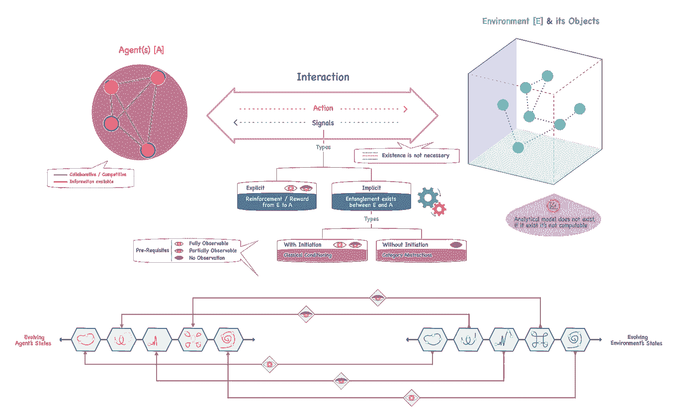

# 关于强化学习的论述

> 原文：<https://pub.towardsai.net/a-discourse-on-reinforcement-learning-37f9dc224282?source=collection_archive---------0----------------------->



**我们的扩展设置图** [图片由作者提供] —我们有一组代理和一个环境(由多个对象组成)，作为两个不相交的实体。智能体的目标是在环境约束下完成一系列决策任务中的一个目标。对象可以集体地或非集体地影响内部环境，而代理可以通过外部交互协作地或竞争地影响环境，并且它们在这样做的同时可以在它们之间共享不同数量的信息。代理人将采取行动作出决定，环境将发送信号帮助代理人。当信号是明确的，学习是通过强化，否则它是通过代理人和环境之间的某种形式的纠缠，这可能需要或不需要启动。在每一个时刻，环境和主体都以状态的形式对它们过去的历史进行编码。当代理可以完全观察环境的状态时，他们通常会将它们复制到自己的状态。然而，当环境的状态仅仅是部分可观察的时，代理也可以通过从他们自己的历史中添加一部分来增加他们的状态。只有当代理不知道环境的数学或数学上可解的模型时，才需要通过状态观察、动作和信号顺序地取消绘制环境功能的整个过程。

## [让我们知道系列] — #2

## 第一部分——广阔的背景

> ***叙述呈现了一个膨胀的设定，有多种范式，围绕着*强化学习(RL) *的主题相关。我们相信，这样的背景可能有助于读者对 RL 有一个更广阔的看法，实现其潜在的假设，并预见未来研究中未探索的环节。***

> ***这是 3 篇系列文章《强化学习论》的第一篇；我们从一个广阔的背景下对 RL 的整体概述开始。***
> 
> ✔️第一部——广阔的背景
> 
> ◻️协议第二部分——算法方法和变体
> 
> ◻️第三部分——高级主题和未来途径

## a.**代理&环境**

让我们考虑一个一般的设置，其中一个代理(或一组代理)和环境是*通常是*两个不相交的实体。

*智能体的角色是一个学习者，试图通过*与环境*互动来实现*顺序决策*目标。而在单代理设置中，代理*之间的相互动态不成立*(因为只有一个代理)；在多代理设置中，可能需要考虑 **☟** [ **交互代理**。*

```
*[**mutual-agents interplays**] The agents may *collaboratively*, *competitively*, or *under a mixed setting* (a mix of collaboration and competition), strive to arrive at decisions. While doing so, agents may also sometimes suffer from *imperfect information* amongst themselves, i.e. what all one agent knows, the other agent may only partially or not know.
While we *do not* exclusively target multi-agent settings in this narrative, we are keen to provide intuitive portrayals at places, for a more consummate understanding.*
```

*另一方面， ***环境*** 可以被视为潜在地包含多个对象的东西，这些对象的动作(或不动作)以及代理如何与环境交互，定义了在给定的 **☟** [ **时间** ]的实例中环境的情况。*

```
*[**time**] Note that since we are talking about sequential decision making, we can invoke the notion of *time* here. As we shall see later, the situations of the environment may be critical for the agents to make decisions.*
```

*环境*的 ***对象*** 可能与智能体有任何直接联系(或相互作用),也可能没有。例如，可能的情况是，代理只与对象的子集交互，从而影响它们的未来行为，并因此影响环境。**

*对于代理，环境的情况可以是:*

*【*完全可观察
部分可观察
不可观察**

*基于呈现(或不呈现)给代理的情况，代理做出他们的决定。这些*情况*可以被看作是环境的**状态，而智能体为响应这些情况的交流而做出的*决策*就是它们的**☟****行动***。****

```
*[**action(s)**] Note that the actiontaken by the agent(s) may just be that *no action* is taken, which is a very valid decision. Also, the actions may not necessarily be taken, *immediately* in response to observing the environmental states; rather, some actions may be dependent on the observation of *past states*, and more generically, even on the estimation of future states, that the environment may attain.*
```

## *b.州*

*我们上面提到过环境的*状态*大致等同于环境的情况。*

*📎我们也有代理的*状态吗？
📎我们还能知道环境对象的状态吗？
📎这些*态*告诉我们什么，或者，什么时候我们可以说某个东西是一个*态*？**

*让我们从我们对*情况*的概念出发继续讨论。在任何时刻，由于物体的行为、代理的相互作用、环境所处的初始情况等，环境的情况反映了过去发生的事情。因此，在某种程度上，这种情况也会部分地影响未来环境的形成。**在这种哲学下，一个实体的状态可以是任何东西，包含它的过去，因此，在某种程度上，可能*影响*它的未来**📄**。***

```
*📄 [**Reference]** D. Silver, Google DeepMind **1**, 1 (2015).*
```

*我们现在可以联系起来，智能体 的 ***状态可能是由于它们与环境等的交互作用而从它们过去的动作、观察、输入和输出中形成的。类似地，内部行为的过去历史，由交互作用引起的外部输入，对外部世界的输出等。，可能形成物体*** 的 ***状态。****

```
***💡 Remark** - Note that the objects are considered to be a part of the environment. Thus, while the environment can be seen at the *apex* of its hierarchy, the objects, are at a lower level in the same hierarchy. The agent(s), however, being disjoint from the environment, sit at the top of a separate hierarchy. For the sake of simplicity, and ease of optimization (will be discussed in Part II), we would normally *not* talk about the states of the *entities, which are not at the apex of any hierarchy*.*
```

***大多数文本在谈论环境的*状态时，会简单地提及它们，如*状态*状态***。这是因为，当代理能够完全观察环境的状态时，他们通常不需要为决策建立他们自己的状态(环境的状态就是他们的状态)。然而，当*观察是部分的或空的*(在某个时刻)，*代理将需要建立它们自己的状态。*为此，他们可能需要用一段他们自己的观察、行动等的历史来扩充由环境传达的部分(或空)状态。执行后续/未来的行动。*

> *除非明确指出，否则从现在开始，我们也将环境的状态简称为状态。*

## *c.**环境功能和状态***

*环境的状态反映了它的功能。国家是了解环境的唯一途径吗？这看起来是不是一个缓慢的过程，类似于定期拍摄时间序列的快照，从而一步一步地取消图表？*

*如果我们能有一个数学物理模型来描述环境的进化和功能，会怎么样？换句话说，给定环境的一些初始状态(或条件)，如果可以估计未来的状态会怎样？*

*前者提供了*无模型*学习的一瞥，后者谈到了有*基于模型的*学习**。**具体来说，我们可以说:*

***(MFL)无模型学习意味着代理不知道环境的任何分析模型，而是通过环境状态来近似它。
**(MBL)基于模型的学习则需要对环境的可计算分析模型有精确的了解。*****

*****我们这里的大部分讨论将围绕无模型学习，因为在实际情况下，通常很难通过分析来描述一个环境。然而，我们将在第三部分介绍基于模型的学习的相关概念。*****

## *****d.**环境刺激*******

*****当代理人观察到环境状态时，他们可能会被驱使采取行动。然而，这需要存在某种刺激，该物质应该从环境中经历或接收。*环境刺激*的类型取决于状态观察的三种可能性，即。代理*完全观察*状态，*部分观察*状态，或者*根本不观察状态*。*****

*******如果智能体无法观察到状态，**刺激*的唯一方式就是通过环境和智能体状态之间的某种 **☟** [ **纠缠** ] 。通俗地说，这可能意味着状态表现出某种能量，这种能量可以被代理人感觉到，并可以为他们提供采取行动的刺激。******

```
*****[**entanglement**] One may normally relate this to some form of *quantum entanglement*; however, *classical entanglement* may also exist, if the states are lossy. Quantum entanglement may or may not exist when the systems are lossless, but classical entanglement can never exist for lossless systems 📄.
📄 [**Reference]** D. G. Danforth, “Classical entanglement,” in “arXiv preprint quant-ph/0112019,” (2001).*****
```

*******如果代理完全或部分观察到状态，**可以有两种选择:*****

*****🔗状态和代理之间不存在纠缠；因此，环境需要向智能体提供*明确的刺激*(信号)来帮助他们决定他们的行动。
🔗状态和智能体之间存在某种类型的纠缠，这种纠缠只有在智能体能够观察到至少一个状态子集，并且*隐含刺激*被释放时才会开始。*****

*****在心理学领域，后者被更好地称为*经典条件反射*，而前者被称为*操作性条件反射*。经典条件反射的一个典型例子是，如果一个人在看到冰淇淋(环境状态)后，开始流涎(由于激活流涎腺的隐性刺激而引起的纠缠行为)，因为他/她非常喜欢它。另一方面，操作性条件反射需要向主体提供明确的信号。*****

*****在操作性条件作用下，环境可能会向代理人提供 ***信号*** ，帮助他们*改善/提高*他们的行为，或者*恶化*他们的行为。因为我们对代理人实现他们的目标感兴趣，所以我们通常希望代理人改善他们的行为(通过行动)，并且永远不要使他们的行为朝着远离他们目标的方向恶化。改善型信号是对代理人的*强化*，恶化型信号是*惩罚。******

*****强化信号(*奖励*)可以是*正*或*负*，即环境可以告诉代理他们的行为是好是坏，如果他们必须实现他们的目标。然后，代理可以通过学习在什么情况(状态)下哪一个(哪些)动作不好以及哪一个(哪些)动作好来相应地适应。*****

*****🧬智能体的学习称为 ***强化学习(RL)*** 当，*****

*******+** 环境的解析(或解析可解)模型是**未知的，**
**+** 在环境和代理之间没有**纠缠**，无论有或没有启动，
**+** 环境需要**通过*明确的信号/奖励来加强***代理，从而*****

```
*********💡 Remark** - **Who designs the reinforcement signals? Is there something built-in within the environment, that can issue the reward signals?** Well, under an entanglement setting, this might be possible, but under the reinforcement learning setting, it’s the user's (AI/ ML researcher's) job to specify the reward signals on behalf of the environment, such that the agent(s) always ameliorate their behaviour. 
Now while doing so, one may imagine that the user has some prior knowledge about the functionality of the environment. However, this knowledge is not in a comprehensively mathematically formulated manner, else the user could have designed an analytical model of the environment and supplied to the agent(s).******* 
```

## *******e.**基于模型的学习&纠缠*********

*******所有这些纠结的讨论有什么用，为什么我们在上面定义了强化学习，在一个无模型的设置下？想象自然的物理纠缠不存在，然后一个人创造了人工纠缠。这不像是基于模型的学习吗？这种混淆可能是非常明显的，因为大多数 RL 文本从不谈论纠缠。然而，我们认为有明确的区别，在此提及它们可能是值得的。*******

*********在基于模型学习的理想版本中，**环境的数学模型是已知的。代理人应该使用这个模型来决定他们的行动，并且不需要强化信号来驱动他们的行动。*******

*******在基于模型的学习的另一变型中，**既不提供环境的数学模型，也不通过强化进行环境功能的粗略估计；然而，环境本身的分析模型是可以学习的。这里，方法通常需要一些初始教育，关于哪些动作需要应用于哪些状态，然后模型(来自已知的*系列*数学模型)适合这种经验。*****

*****在我们看来，在这些基于模型的学习的变体中(无论模型是已知的还是分析学习的)，抽象不同于典型的 RL 设置，因此，我们通常认为 RL 是无模型的。*****

*****让我们以国际象棋为例。在这里，游戏规则将定义环境的模型，代理(玩家)需要采取行动来战胜对手(位于环境中的对象，除了代理之外，还会改变其状态)。如果游戏规则可以作为一种*数学抽象*存在，玩家的行为作为另一种*数学抽象*，以及一种语言*定义这两个抽象空间*之间的交互(合作或崩溃)会怎样？处理这样的抽象空间就是我们所说的，使纠缠成为可能，尽管是人为的。*****

*****有人可能会说，人类定义的抽象只不过是数学结构，因此，我们定义了一个数学模型。然而，在定义用于纠缠的抽象空间和用于典型的基于模型的学习的数学模型之间有三个重要的区别，*****

*****📎数学上抽象的模型是为环境和代理定义的，而不仅仅是为环境定义的
📎没有明确的规则和动作空间被定义，但是只有它们的抽象被解析地指定，
📎还定义了两个抽象结构之间的交互规则。*****

*****尽管关于纠缠的概念还没有被探索，我们还是在这里介绍了它们，因为我们会将它们与第二、三部分中的*范畴理论*中的概念联系起来，为一些 RL 元素提供潜在的扩展。*****