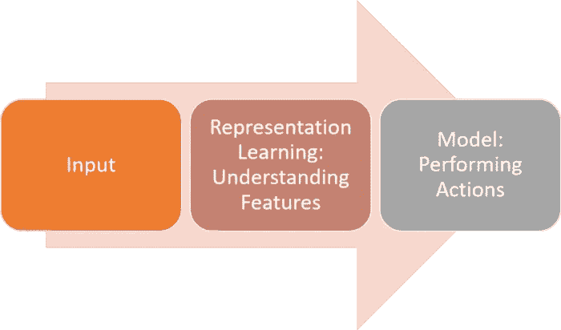

# 表象学习的温和介绍

> 原文：<https://pub.towardsai.net/a-gentle-introduction-to-representation-learning-e79e5ed6964?source=collection_archive---------0----------------------->

## 机器学习的核心基础之一。

图片来源:[https://medium . com/synced review/UC-Berkeley-uses-a-causal-perspective-to-formulate-the-desiderata-for-representation-learning-F2 a 7 cf 9 c 96 a 3](https://medium.com/syncedreview/uc-berkeley-uses-a-causal-perspective-to-formalise-the-desiderata-for-representation-learning-f2a7cf9c96a3)

> 我最近创办了一份专注于人工智能的教育时事通讯，已经有超过 125，000 名订户。《序列》是一份无废话(意思是没有炒作，没有新闻等)的 ML 导向时事通讯，需要 5 分钟阅读。目标是让你与机器学习项目、研究论文和概念保持同步。请通过订阅以下内容来尝试一下:

 [## 序列

### 与机器学习、人工智能和数据发展保持同步的最佳资源…

thesequence.substack.com](https://thesequence.substack.com/) 

理解输入数据集的特征是机器学习算法的一项基本能力。给定特定的输入，机器学习模型需要推断关于数据的特定特征，以便执行一些目标动作。表示学习或特征学习是机器学习空间的子学科，处理提取特征或理解数据集的表示。

表征学习可以用一个非常简单的例子来说明。以深度学习算法为例，该算法试图识别下图中的几何形状:

为了将像素匹配到几何形状，算法首先需要理解数据的一些基本特征/表示，例如角的数量。这就是表征学习的作用。

几十年来，表示学习已经成为机器学习领域的一个既定学科，但随着深度学习的出现，它的相关性最近已经大大增加。虽然分类等传统机器学习技术通常处理数学上结构良好的数据集，但深度学习模型处理的是图像或声音等没有明确特征的数据。从这个意义上说，表征学习是大多数深度学习架构的关键要素。

表征学习的核心问题是确定输入数据的最佳表征。在深度学习的背景下，表征的质量主要取决于它在多大程度上促进了学习过程。在现实世界中，学习算法和模型的底层表示是直接相关的。

# 没有免费的午餐定理

如果模型的知识表示依赖于它的学习算法，那么选择正确的表示应该是微不足道的，对吗？我们只是选择与学习任务相关的知识表示，这应该保证最佳的性能。我希望事情能这么简单。在寻找最优表示的过程中，我们很快找到了一个老朋友:没有免费的午餐定理(NFLT)。

NFLT 是困扰最务实的数据科学家和技术专家的数学悖论之一。简而言之，NFLT 指出，对所有可能的数据生成分布进行平均，每个机器学习算法在处理以前未观察到的点时都具有大致相同的错误率(阅读我以前关于 NFLT 的文章)。换句话说，在给定足够宽的数据集的情况下，没有任何机器学习算法比任何其他算法更好。

图片来源:[https://medium . com/@ LeonFedden/the-no-free-lunch-theory-62 AE 2c 3 ed 10 c](https://medium.com/@LeonFedden/the-no-free-lunch-theorem-62ae2c3ed10c)

在表征学习的背景下，NFLT 证明了多种知识表征可以适用于学习任务。如果是这样的话，我们怎么能凭经验决定一种知识表示和另一种知识表示呢？答案是机器学习和深度学习模型中最核心且经常被忽略的技术之一:正则化。

# 正规化

机器学习算法的核心任务是在训练数据集之外的新输入下表现良好。优化这项任务就是正则化的作用。从概念上讲，正则化导致对机器学习算法的修改，这种修改减少了测试或泛化误差，而不影响训练误差。

现在让我们回到原点，看看正则化是如何与表征学习相关联的。这种关系非常清楚:知识表示的质量从根本上与其有效概括知识的能力有关。换句话说，知识表示必须能够适应训练数据集之外的新输入。为了更好地处理新输入并减少泛化误差，任何知识表示都应该在正则化技术中有用。因此，表征学习模型的质量直接受到它们使用不同正则化策略的能力的影响。下一步是找出哪些正则化策略与表征学习特别相关。这将是未来文章的主题。

既然我们知道正则化是一种改进知识表示的机制，下一步就是评估给定表示的质量。本质上，我们试图回答一个简单的问题:是什么使知识表示优于其他表示？

# 通过规范化提高知识

为了让术语更直截了当，通过正则化，我们指的是模型在不影响其训练误差的情况下减少其测试误差(生成误差)的能力。每一种知识表示都有某些特征，这些特征使得它更适合特定的正则化技术。人工智能杰出人物伊恩·古德费勒(Ian Goodfellow)和约舒阿·本吉奥(Yoshua Bengio)在正则化领域做了一些出色的工作。根据 Goodfellow 和 Bengio 的论文，当涉及到正则化时，有几个特征使知识表示更有效。我总结了以下五种我最喜欢的监管模式:

## 1 —解开因果因素

健壮知识表示的关键指标之一是其特征对应于训练数据的潜在原因的事实。此特征有助于区分制图表达中的哪些要素对应于输入数据集中的特定原因，从而有助于更好地将一些要素与其他要素区分开来。

## 2 —平滑度

制图表达平滑度是假设输入数据集中相邻点之间的假设值不会发生剧烈变化。从数学上来说，平滑度意味着对于非常小的 e， *f(x+ed)≈ f(x)* 。这一特性允许知识表示在输入数据集中的封闭区域内更好地进行概括。

## 3 线性度

线性是一种正则化模式，是对平滑假设的补充。从概念上讲，这种特性假设一些输入变量之间的关系是线性的 *(f(x) = ax + b)，*，这使得即使当输入存在相对较大的变化时也能做出准确的预测。

## 4 —分层结构

基于层次的知识表示是许多正则化技术的理想选择。层次结构假设网络中的每一步都可以用前面的步骤来解释，这极大地有助于通过知识表示进行更好的推理。

## 5-流形表示

流形学习是机器学习最迷人、数学上最深厚的基础之一。从概念上讲，流形是完全连接点的高维区域。流形假设表明概率质量倾向于集中在输入数据的流形上。流形的伟大之处在于，它们相对容易从高维结构简化为低维表示，这更容易操作，也更便宜。许多正则化算法在检测和操纵流形方面特别有效。

尽管它很重要，但在深度学习领域，表征学习仍然是一个不太为人所知的学科。为了为任何给定的任务选择最佳的神经网络架构，理解基础数据集的特征和表示是至关重要的。本文中解释的一些特征为在深度学习解决方案的背景下考虑表征学习提供了一个简单的框架。