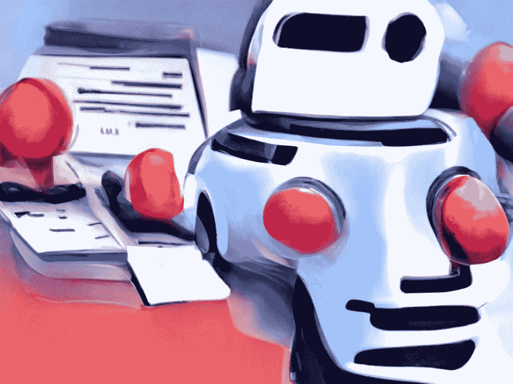

# 构建以数据为中心的自主人工智能之旅

> 原文：<https://pub.towardsai.net/a-journey-in-building-data-centric-autonomous-ai-dcc98d39d6f7?source=collection_archive---------0----------------------->

在风投支持的早期创业公司担任机器学习主管四年的经验

[“会计 AI 自动驾驶仪](https://creator.nightcafe.studio/creation/xugPhlPE3nhQhdwtoZzy)”通过剪辑引导扩散

# 介绍

本周结束了我作为 [Vic.ai](https://www.vic.ai/) 机器学习负责人的四年角色，因为我已经转移到了一个研究职位。**我在这个职位上的这些年是构建下一代商业人工智能产品和今天运营它的团队的史诗般的旅程**。当我接受这个职位时，Vic 是奥斯陆的一家初创公司，有大约 15 名员工和 150 万美元的种子期资金。从那以后，Vic 成指数增长，并获得了美国主要风险投资者的支持。今天，Vic 在全球范围内运营，成千上万的公司使用我为 Vic 设计的人工智能进行会计核算。

Vic.ai 的愿景雄心勃勃，影响深远:**构建一个自主的人工智能，完全取代处理发票的人工会计工作流程**。这让我想起了发明计算机的最初原因:取代人类“计算机”的工作，这些“计算机”的职业是一丝不苟地计算和纠正数字。就像一个世纪前的人类计算机一样，今天的会计师越来越多地处理大量的发票，而不是需要创造性解决问题和人际互动的任务。对于一名人工智能科学家来说，这个问题具有现实世界的影响，并提出了一些问题:如何构建人工智能，如果这种类型的任务可以实现自治，那么还有哪些类型的乏味工作可以使用自治人工智能实现自动化？

最初的**“机器学习负责人”在早期成长的初创公司中的角色与在大公司中的角色有很大不同**，并且需要身兼数职。在我任职期间，我管理了所有的数据科学项目，设计了 Vic 现在使用的 ML 算法，并雇佣了当前的 ML 和后端工程师。直到去年，我做了所有的分析来推动人工智能的发展，为构建人工智能堆栈选择技术，训练部署的模型，并做了相当多的分析来解决预测错误。这种工作量听起来很累人，但是在早期阶段，每一项都需要有限的时间，而改进的软件大大减少了这些时间。

作为一个在过去二十年里从事人工智能研究、创业和咨询工作的人，Vic.ai 在许多方面给我留下了独特的印象。人工智能项目的常见陷阱不复存在，工作可以专注于构建人工智能产品的核心挑战。人工智能研究或行业没有完全认识到这些剩余的挑战。**我决定分享这次旅程的收获**，因为这些挑战对于大多数构建人工智能的组织来说都是常见的，并且其他人也可能对这种经历感兴趣。

# CRISP-DM 符合 DevOps 文化

在 Vic 之前，我的商业 AI 经历是作为外部顾问，以及作为几家初创公司的内部 ML 开发人员。没多久我就注意到管理人工智能和软件开发项目之间的**不匹配**。大多数人工智能开发项目都是使用源自数据挖掘咨询的 [CRISP-DM](https://www.kdnuggets.com/2014/10/crisp-dm-top-methodology-analytics-data-mining-data-science-projects.html) 框架进行的，这为客户带来了高成功率和快速周转。软件开发是用受 Scrum 影响的实践完成的，只有不到一半的项目成功。两者解决的问题不同，合不来。CRISP-DM 是非线性的，结果不确定。Scrum 是线性的，有计划的结果。最常见的是，人工智能项目被原型化并交付用于生产，但是组织的支持未能将这些转化为成功的产品。

像大多数人工智能社区一样，由于这些组织问题，以及 CRISP-DM 和 Scrum 之间的完全不匹配，我对商业人工智能越来越悲观。遇到 Vic 改变了这一点，因为该公司有一个非常专业的早期开发团队。他们中的许多人拥有 CTO 级别的经验，或者从维也纳国际中心继续担任 CTO 职务。**工程部门和公司的其他部门实践 DevOps 文化**，与 Scrum 不同的是，他们应用了敏捷#1 的价值观“[人先于过程](https://agilemanifesto.org/)”。在近距离接触 Scrum 之后，这改变了我对软件工程的看法。

**ML 的努力得到了公司**的全力支持，我很幸运，CTO 对 ML 充满热情，在过去几年里一直领导 ML 项目。有一些临时承包商为维克做了一些初步的人工智能工作。在我开始之前，一些组织规划就已经解决了，并且在实践中已经隐含了一种“敏捷 CRISP-DM”框架。

在前三年，我的团队由 2-4 名经验丰富的后端和 ML 开发人员组成，这是构建 AI 代码库基础的理想团队规模。后来，我将这个团队扩大为一个 8 人的 MLOps 团队，有更多专门的角色。这项工作是异步和完全远程的，通常每周或每两周通过看板召开一次会议。根据[康威定律](https://en.wikipedia.org/wiki/Conway%27s_law)，职责范围被明确定义，主要划分在后端/ML 和开发/运营之间。

**团队在 DevOps 的基础上工作**，在定期发布周期的生产中开发和维护代码。如果有来自其他团队的请求，这些请求首先被处理，这样他们的工作就畅通无阻了。我们对其他团队的请求通常在一两天内得到类似的处理，因此公司范围的目标进展很快。这防止了筒仓效应阻碍项目，并允许我们考虑新的项目，因为我们可以信任从其他团队获得快速支持和优先级。一般来说，任何成员大约一半的工作时间用于开发，另一半用于响应问题和请求。

团队的目标和里程碑是在公司层面协商的，团队自主处理**项目**。这意味着在同步调用之间，任务通常会被快速添加、更改和重新排序。提前终止、并行任务、任务暂停，甚至失败都是流程的正常部分。在 Scrum 环境中，这些是不可想象的，但是对于开发人工智能来说，这只是正常的程序。重要的是达到长期目标，而不是单个任务的结果。

这个框架的另一个方面是完全由数据驱动的人工智能开发。不是高管强制要求“使用深度学习解决 X”，而是每个问题都经历相同的过程。该问题的最佳解决方案可能是一天内完成的字符串匹配，一个复杂的人工智能解决方案需要几个月的时间来开发，或者报告该问题需要修改。所有这些都是常见的结果。使用这种方法，可以快速完成问题的最佳解决方案。总的结果是一个人工智能系统，它结合了传统软件和人工智能的技术，通过数据驱动的分析为每个案例选择。

# 以数据为中心的人工智能

在开发了我的第一个模型之后，我收到了关于其中一个的反馈。据报道，最初测试的准确率约为 30%。这是惊人的，因为我们信任开发度量，这为模型提供了良好的结果。仔细研究一下细节，似乎根据这些数据训练的任何类型的人工智能都存在多个数据质量问题。我知道这是一个技术问题，我们仍然可以通过将数据预处理和模型开发作为一个单一问题来处理来产生高精度的模型。我开始研究这种人工智能的解决方案，就像许多发现以模型为中心的人工智能的局限性的其他人一样，大约在这个时候，这个领域被命名为“以数据为中心的人工智能”。

**通过“标签工程”开发标签流程**对我们来说，这是一种以数据为中心的关键人工智能。会计平台中存在各种数据质量问题，但对人工智能来说最严重的是标签信息通常不确定、不完整、不正确、过时或可作为间接匹配的元数据。根据经验，20%的标签丢失或具有错误的值。根据数据训练的监督 ML 需要正确的标签信息，否则它会重现训练中出现的错误。我用来解决这个问题的一些技术包括嘈杂的正则表达式匹配、基于分数的试探法、决策树、基于信息论的匹配和基于模型的伪标记。在某些情况下，这些最好作为外部过程来应用。在其他情况下，ML 模型具有内部标签过程是有用的，甚至是强制性的。对于我遇到的所有问题，可以结合各种技术来产生高质量的训练数据，尽管代价是工程化和分析每个模型的标记过程。

标签过程是完成的最关键部分，但**以数据为中心的人工智能在 ML 的正常开发工作之外提出了一系列挑战**。随着更多模型的部署和更多客户的加入，会出现更多不同类型的数据问题。这些问题包括数据转换问题、OCR 错误、平台缺陷等。可以从各种来源检测数据问题:发布 QA、事件管理、客户反馈、错误报告、监控、数据验证、度量标准等。更多的未被发现，直到探索性数据分析(EDA)完成，这需要时间。我本质上需要自动化 EDA 以保证数据质量，并找到了一个专门的开发人员来做这件事，这是我第一次受雇于这个团队。

发现问题是至关重要的，但很快我们的大部分时间都花在了维护模型和可接受的准确性上。显然**从长远来看，我们需要更好的工具和流程**。在工程运营团队的支持下，我们早期构建的一些运营工具是指标和监控仪表板。在模型方面，作为培训的一部分，我们构建了所有模型的持续测试，以及在每次拉请求时使用工人流程的模型测试，以及每次发布后的 QA 过程。模型测试在防止模型出现任何生产问题方面改变了游戏规则。由于进行了这些测试，我们几乎没有模型失败，并且必须每年回滚一次模型。我做的另一层预防措施是向所有模型添加变量类型和验证，以便进入模型的数据总是被类型化和验证。

# 自主人工智能

一旦我解决了在这个领域中构建 ML 模型的主要数据质量问题，我就开始开发用于发票处理的自主 AI 解决方案。这是一项具有挑战性的任务，因为目前还没有关于这一主题的研究，也不知道用当前的技术能做得多好。但是，**我认为从 ML 设计的角度来看没有问题**。我可以访问大量的数据，从工程和管理两方面获得坚实的支持，并在宽松的时间框架内构建解决方案。我毫不犹豫地接受了挑战。

与众所周知的自动驾驶问题相比，会计中的**自动人工智能问题具有一些简化的特性。最重要的是，我们不需要自动化所有文档。在自动驾驶的情况下，人工智能无法在困难的情况下选择停止控制车辆。在我们的例子中，一个异常的文档将被发送给人工审查，而不是自动化，这是可以接受的，甚至是可取的。另一个简化是自动化错误率不需要任意接近 0。在自动驾驶中，任何类型的错误都有潜在的生命代价。在我们的情况下，最严重的错误类型可以很容易地避免，许多类型的错误是无关紧要的或平均的，许多重要的类型只需要一个匹配人类的错误率。**

一个关键的优势是我在我们控制的平台上设计系统，这个平台在这个阶段为数百家公司处理发票，文件流呈指数级增长。这意味着我可以开发系统来精确地处理它所部署的数据流，消除从外部来源传输 ML 模型带来的任何偏差。此外，我可以修复任何导致问题的 ML 组件，并在需要时向后端请求更改，不断增加的数据量将有助于以后更好地建模。

我们案例中的一个复杂因素是自动化所需预测的数量和多样性。为了自动化会计工作流程，人工智能需要预测会计产生的所有结果，包括不同语言和法规的发票。幸运的是，**人工智能工具包正在不断发展，提供更好的工具来解决每个建模问题**。当我开始时，Vowpal Wabbit 和基于 CPU 的梯度提升是针对大规模问题的行业标准解决方案。可用的 ML 工具已经经历了许多发展，如基于 GPU 的梯度增强，用于深度学习的 Pytorch 和基于 transformer 的 AI。尤其是变压器是应用人工智能领域的一次真正革命，对于人工智能来说，它可能就像晶体管对于电子学一样。这个不断扩展的工具包允许设计出仅仅几年前还不可思议的解决方案。

我花了几个月的时间专注于工作，并对建模方法进行了第三次大的迭代，以找到一个工作良好的解决方案。我为该产品提出了“会计自动驾驶仪”的名称，简称为自动驾驶仪。**的解决方案在概念上很简单，但需要做大量的工作来获得正确的细节**。这个问题的任何解决方案都需要所有 ML 组件的高准确性、平台的一致性以及每次预测时来自平台的详细信息。这意味着我必须加倍努力以数据为中心的人工智能工作，但与此同时，我们正在呈指数级增长，因此我们必须升级我们的人工智能堆栈和平台以匹配增长。

# 在云上扩展人工智能

从一开始，我们就与北欧最大的会计技术公司之一建立了合作关系，提供了访问数亿张发票的途径。随着我们在美国和欧盟的扩张，我从多个地区的客户那里获得了类似规模的数据。很明显**这个解决方案需要大规模地、定期地对数百万个文档进行训练和预测**。人工智能从一开始就必须是可扩展的，并且可以移植到分布式的基于云的处理中。实际上，这包括两个部分:编写高效、可维护和可分发的代码，以及为训练和预测建立分布式处理。

选择 Python 工具和最佳实践是提高可伸缩性的简单方法。我丢弃了所有原型工作中的 Jupyter 笔记本。相反，**我们部署了原型化**的相同 Python 脚本。不久后，我看到了 Joel Grus 著名的“[我不喜欢笔记本](https://conferences.oreilly.com/jupyter/jup-ny/public/schedule/detail/68282.html)”演讲，它道出了我对笔记本的所有想法。部署脚本而不是笔记本消除了生产转换所需的时间，这意味着可以使用完全相同的代码离线调试生产问题。脚本还可以进一步优化，从多重处理和序列化开始。这是使用 Python 数据栈尽可能合理地完成的，因此操作模型的基本成本被最小化。这包括缓存数据帧、关键模型代码的 Cython 扩展、尽可能使用 GPU、模型修剪和压缩，以及定期分析和优化处理瓶颈。

在 Vic 之前，我已经在 Spark 工作了几年。它提供的函数式 MapReduce 范式令人兴奋，但是 PySpark 集成有根本性的缺点。受 Spark 的启发，我开发了自己的 Python 库 [Wordbatch](https://github.com/anttttti/Wordbatch) ，它可以对任何 Python 方法或函数进行 MapReduce 处理，由选定的调度器后端执行，如串行进程、多处理、Dask 或 Spark。我可以**在单个节点上开发代码，并使用 Wordbatch 在云上扩展代码，在内核数量上实现近乎线性的加速**。在单个 128 线程工作站上，Wordbatch 将大多数瓶颈加速了 100 倍，从而实现了快速开发迭代和模型训练。在开发出第一个模型后不久，Ray 就宣布了。我开始广泛地使用 Ray 作为 Wordbatch 后端，用于模型开发和训练。它使用嵌套并行技术进行简化，并允许以低成本进行大规模的模型生产培训。今天，我们在生产中同时训练和操作几十万个模型。

关于模型服务，我考虑了替代方案，因为我们最初的基于芹菜的工人不可伸缩或不可靠。团队中的一些高级开发人员考虑了基于 FastAPI 的模型服务。我考虑过 FastAPI 或 Ray Serve，甚至与 FastAPI 的创建者 sebastán ramírez 讨论过与我们合作。最终，运营团队决定采用 AWS 无服务器处理，并希望我们使用 Lambda 和其他 AWS 无服务器工具。选择取决于后端开发人员，而**模型服务器端是用 AWS 无服务器工具**扩展的。

第三种云计算是外部人工智能微服务的**使用。当我开始时，这些还不可用，但在过去的四年里，云巨头(亚马逊、谷歌、微软)开始提供越来越全面的人工智能 API 选择，其中许多可用于我们正在进行的文档处理类型。这些都没有直接与我们的人工智能竞争，但为构建解决方案提供了有用的基本构件，包括 OCR、机器翻译、表格处理、文档人工智能等。我对其中的许多进行了系统的评估，我们开始为一些人工智能工作负载使用外部 API。这有几个好处:外部服务是可伸缩的和可靠的，每个过程的成本是已知的，并且 AI 结果在许多情况下是高精度的。知道外部 API 可以在几周内部署到生产环境中，我就可以快速启动项目，与启动成本和结果不确定的内部研发工作相比，批准项目的执行门槛降低了。**

# 建立 MLOps 团队

构建和维护一个像我们这样的**商业人工智能最终需要一个更大的团队**，因为对准确性和自动化的要求很高。我分两个阶段为 Vic.ai 招募团队，首先是 2-4 人的 ML 团队来构建初始解决方案，然后在工作负载对小团队来说变得不可持续时，将其扩展到 8 人的 MLOps 团队。我得到了高管们的全力支持，并亲自规划了每个职位，实施了招聘流程。

这段时间的一个障碍是“[大辞职](https://en.wikipedia.org/wiki/Great_Resignation)”，这开始影响人工智能的招聘。尤其是美国的候选人有很多公司可供选择，对这个职位的期望很高，而且继续发展的门槛很低。与其在美国争夺人才库， **engineering 早就有了雇佣 EU-开发人员的想法**，并在 covid 之前在 Oslo 设立了一个工程办公室。这些早期的开发人员中有许多是优秀的雇员，并成为了有价值的贡献者。

我进一步发展了这个想法，并决定在时区接近纽约和奥斯陆的地区招聘，但这些地区有更好的人才储备:特别是拥有数据和 ML 高级工程学位的**开发人员，但只有有限的本地人工智能公司提供给他们角色**。对于奥斯陆来说，波兰、西班牙、葡萄牙、意大利和法国等国家有很好的工程学院和大学，但人工智能创业场景有限。对纽约来说，巴西和加拿大是质量相似的国家。由于远程工作，南半球的开发人员也同样接近协作。只有时差对他们的团队很重要，即使这样也没什么大不了的。

我根据当前和未来我们对操作人工智能的需求来规划**的每个角色，大致对应于谷歌的“[ML](https://cloud.google.com/architecture/mlops-continuous-delivery-and-automation-pipelines-in-machine-learning)的数据科学步骤”。对于这个小团队来说，招聘的内容是数据分析、OCR 和后端工程。对于更大的团队，我将团队分为数据、ML 和 ops，每个领域至少有 2-3 人操作。这意味着对于代码库的每个区域，在众所周知的总线事件的情况下，至少有两个人详细了解该区域，并且在每个区域有多个开发人员进行成对编码。更大团队的总体目标是朝着全面的 MLOps 成熟度发展[。所有候选人都被要求至少拥有计算机科学相关的学位，几年的商业软件开发经验，以及他们的专业技能。](https://cloud.google.com/architecture/mlops-continuous-delivery-and-automation-pipelines-in-machine-learning)**

我们流程的其余部分相当标准。对于所有的角色，我们都有多次面试，整个团队都有机会面试和否决候选人。我们所有的广告职位都收到了成百上千的候选人，所以我们需要有效地筛选合适的雇员。从一开始，我进行了初步的筛选面试，然后是与团队的技术面试，编码测试，以及与在场的一位高管的最终面试。对于更大的团队，我们得到了技术招聘人员的支持，包括一轮额外的人力资源筛选。该流程创建了一个选择合适候选人的漏斗，但是团队投入的时间仍然相当可观。总的来说，这是值得的。我们有了不起的同事，他们从第一周就开始做出贡献。

# 收场白

这些年来最重要的教训是**组织基础是构建人工智能解决方案**的关键要求。这包括 AI 开发人员工作之外的几个事项，包括公司愿景、文化、高管、产品和行业联系。人工智能开发需要高管和文化来获得足够的支持和自主权，以取得成功，而人工智能开发的其他外部事项决定了开发的解决方案是否会在市场上取得成功。

Vic 的成功表明**自主的小型远程团队在构建商业 AI** 方面非常有效。在最初的 4 年里，我设计、开发并培训了生产中部署的所有模型，而 ML 团队中的 1-3 名其他开发人员处理所需的运营、数据工程和后端工作负载。此外，由于疫情，这项工作几乎完全是远程进行的。小团队的有效性在软件工程中已经得到很好的确立，AI 也不例外。关键的区别在于任务管理，人工智能和数据科学在项目层面需要不同的过程。

构建一个**商业人工智能解决方案与在 ML 学位、研究或竞赛中所学的完全是分开的**，即使从这些中学到的理论和工具提供了所需的技术基础。商业人工智能解决方案建立在尖端环境中，在这种环境中，产品愿景努力寻求用上一代技术不可能实现的解决方案，也许用当前技术也不可能实现。同时，以数据为中心和可伸缩性的考虑给设计问题带来了额外的复杂性。最后，这项工作与软件工程和产品管理相结合，在一个动态的环境中，各种事件决定了计划和长期目标。

我们目前正处于人工智能的黄金时代，研究、数据、计算、软件、开发者、应用、公司和资金的数量在过去十年都在以指数速度增长。这是一个类似于 90 年代个人电脑的时期，每年都有意想不到的方法来使用越来越好的电脑。与此同时，来自初创公司和云计算巨头的竞争越来越激烈。如果一个人想在人工智能领域打造一个产品，一个策略是瞄准一个新的人工智能应用，并建立领导地位，就像 Vic 在自主会计领域所做的那样。最重要的是，这是一个为即将到来的人工智能的众多用途感到兴奋的时刻。