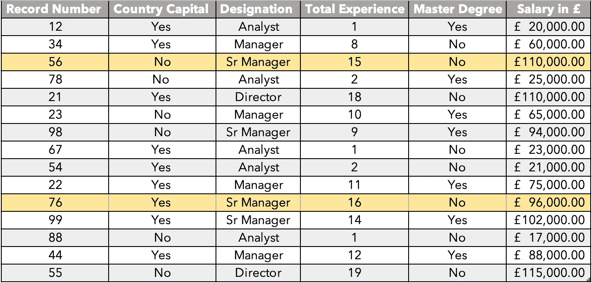

# 数据清洗的定量和定性方法

> 原文：<https://pub.towardsai.net/a-quantitative-and-qualitative-approach-to-data-cleaning-a47918b6a6b3?source=collection_archive---------1----------------------->

## 干净的数据是氧气，使经过训练的机器学习模型能够提供奥林匹克级别的性能。

Lina Verovaya 在 [Unsplash](https://unsplash.com?utm_source=medium&utm_medium=referral) 上的照片

当我们在高中开始学习 COBOL 的时候，老师首先介绍的东西之一就是 GIGO 的概念。GIGO 代表“垃圾进，垃圾出”。如果我们将杂乱的数据输入到程序中，它要么会出错，要么会提供不准确的结果。这一基本原则在机器学习编程中没有改变。此外，考虑到为现实生活中的人工智能用例训练模型所需的大量数据，它随着时间的推移变得更加相关。

如今，原始数据是从各种来源和方式收集的。迄今为止最流行的模式之一是用户从调查中输入数据。然而，由于人类在记录数据时容易犯错误，所以用这种模式编译的数据集通常需要在数据清理阶段得到很好的爱护和照顾。最近，随着物联网(IoT)的兴起，我们在每一个可能的地方植入了传感器和芯片，在没有任何人类干预的情况下，以自主模式收集机器生成的数据。因此，传感器收集的数据质量要好得多，但由于一些问题，如连接丢失，仍然需要清理。不幸的是，由于所需数据输入的性质，我们仍然需要在特定场景中依赖众包数据。

我们看到的原始数据的常见问题如下。

*   **缺失值或格式不正确:**我们可以将缺失数据大致分为两类:没有任何特定模式的随机缺失数据和基于数据记录的其他属性值的系统模式缺失数据。缺失值在由人工输入收集的数据集中普遍存在。通常怀疑是日期字段混淆了 DD/MM/YY 和 MM/DD/YY 格式，以及不同国家/地区使用的不同十进制表示法。
*   **不同测量单位中的数量值** —由于英国和印度各自国家的测量单位系统不同，两点间相同物理距离的默认答案会有所不同。在英国，当地人会以英里为单位回复，而在印度，则会以公里为单位。
*   **重复记录** —数据集中可能存在重复记录。它不仅给出了可用于训练和测试机器学习模型的数据记录数量的错误印象，而且误导了模型预测结果的能力。由于存在重复记录，该模型可以很容易地预测测试数据集中相同重复记录组合的结果，就像在训练过程中已经看到的那样。我们觉得经过训练的机器模型在预测结果方面非常棒。然而，由于重复的记录，该模型是在未屏蔽的测试数据集上评估的。筛选出重复数据记录的方法之一是使用社会保险号等属性作为唯一标识符，如果数据集中有这些属性的话。或者，生成一个串联字段，如全名后跟出生日期，作为唯一字段来标识重复记录。

我们必须使用定量和定性技术来清理原始源数据集。

## ***定量数据*** 清洗

这些技术更加机械，并且在很大程度上使用了统计学。我们可以用几行代码来识别丢失的值。有几种策略可用于填充缺失值，例如对于数值属性，用属性的平均值或中值、最常见的值或常数替换缺失值。重要的技能是选择适当的替代价值策略，这涉及到我们试图用机器学习和数据源解决的业务用例。让我们考虑另一个例子，假设在最初的探索性数据分析中，一些数值数据点在数据集中出现异常值。在这种情况下，首先要检查的是这些记录的数据点是否与其他数据点使用相同的度量单位。例如，大多数记录的高度是以厘米为单位的，只有一小部分记录是以毫米为单位的。在这种情况下，当解决方案是为一个属性提供一个标准的测量单位时，我们冒着丢失有价值的数据记录的风险，认为它们是错误的数据点。

有时业务案例是为了检测欺诈或新奇，而源训练数据集包含这些异常值。丢弃这些离群值将是致命的，在这种情况下将其视为一些流氓条目。数据清理的实际操作非常简单，只需要几行代码。然而，主要的挑战是在清理的同时做出适当的决定，如上所述，有例子。

## ***定性数据 C*** 学习

这些技术更加复杂，需要领域知识和业务规则来清理数据。例如，下面的样本训练数据集对于人力资源(HR)领域之外的人来说可能看起来不错。雇员记录 56 和 76 在教育资格、经历和职位方面是相似的。它表明，居住在首都城市的雇员 76 的工资组成中有较高的城市津贴，但其工资仍然低于居住在某个城镇的雇员 56。差异并没有大到让一些通才数据专家立刻大吃一惊。

作者创建的随机工资数据集示例

然而，来自 HR 领域的某人，理解公司的补偿方案业务规则，可以立即指出记录 76 的潜在不正确的工资条目。然而，从定性的角度清理数据需要更多的努力和时间。

## ***结束语***

用清理后的数据训练机器学习模型与选择合适的算法一样重要。我们的瑞士刀有不同的工具来处理不同的螺母和螺钉。同样，我们需要根据我们旨在用机器学习和数据集来源解决的问题，使用定量和定性的数据清洗技术。

用清理后的数据训练机器学习模型与选择合适的算法一样重要。一般的数据科学家可以在项目中进行定量的数据清理。然而，根据数据集的源和目标，接受领域专家的建议和指导，以定义定性数据清理的业务规则是非常重要的。