# 深度学习的短暂旅程

> 原文：<https://pub.towardsai.net/a-short-journey-to-deep-learning-396ddf02f57f?source=collection_archive---------4----------------------->

## 用 Example…🫀理解人工神经网络


Mahdis Mousavi 在 [Unsplash](https://unsplash.com/s/photos/deep-learning?utm_source=unsplash&utm_medium=referral&utm_content=creditCopyText) 上的照片

# 文章概述

本文主要是关于人工神经网络及其工作流程的理解。当你听到这些话时，你可能会有很多疑问，比如:

> 什么是深度学习？
> 
> 生物和人工神经元是如何工作的？
> 
> 什么是感知器(ANN)？
> 
> 深度学习模型是如何得到训练的？

所有这些问题在这篇文章中都有所涉及。文章中包含了对该示例的详细解释，其步骤如下:

> 数据集的描述
> 
> 导入包和数据集
> 
> 探索性数据分析
> 
> 数据预处理
> 
> 创建、训练、预测和评估人工神经网络模型

# 我们开始吧

# 什么是深度学习？

深度学习是机器学习的一部分，主要关注试图模仿大脑的人工神经网络。深度学习是在 50 年代初引入的，但近年来由于面向人工智能的应用程序和公司产生的数据的增加而变得流行。


[亚历山大·奈特](https://unsplash.com/@agk42?utm_source=unsplash&utm_medium=referral&utm_content=creditCopyText)在 [Unsplash](https://unsplash.com/s/photos/deep-learning?utm_source=unsplash&utm_medium=referral&utm_content=creditCopyText) 上拍照

在我看来，单独理解这些概念很容易，但是当你一起实现它们时，就很难理解模型内部发生了什么。这就是为什么深度学习模型通常被称为黑盒模型。然而，它会给我们的商业问题带来惊人的结果，而且它有很多应用。

# 生物和人工神经元是如何工作的？

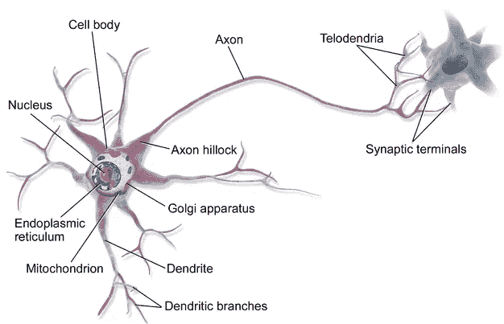

让我来解释一个场景，当你用手触摸一个热的物体时，你会感到疼痛，并立即把手拿开。这个动作和反应在几分之一秒内完成。你有没有感觉到这是怎么发生的？

当你触摸一个热的物体时，电脉冲会从你手中的神经元传递到你大脑中的神经元。然后做出决定，电脉冲立即传回到手边的神经元，指示移除它。

在神经元内部，**树突**除了充当**输入层**之外，什么都不充当神经受体。**轴突**除了**输出层以外，什么都不充当神经递质。**细胞核是动作电位与阈值比较的地方。如果动作电位**比阈值**大，电脉冲将**传递**到另一个神经元。如果动作电位**比阈值**小，电脉冲**不会传递**到另一个神经元。

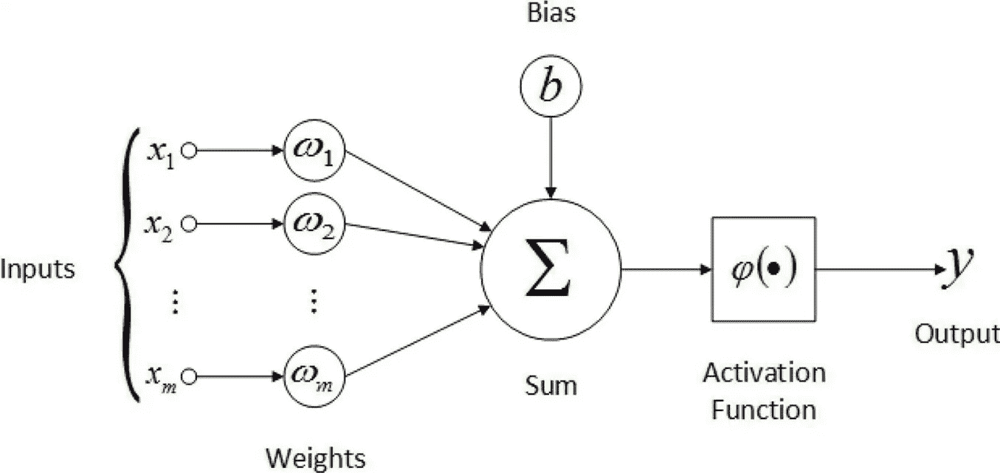

类似地，人工神经元**从**输入层**接收**信息，并且**通过**输出层将**信息传输给其他神经元。在这里，神经元是相互连接的，并且特定的权重被分配给那个特定的连接。这些**权重**代表连接的**强度**，它们在神经元的激活中起着重要作用。**偏差**类似于线性方程中的**截距**。**

这里，输入(x1 至 xn)与相应的权重(w1 至 wn)相乘，然后与偏差相加。结果将被作为激活函数的输入，这是决策发生的地方，并且激活函数的输出被传送到其他神经元。存在不同类型的激活函数，一些是线性的、阶跃的、sigmoid 的、RelU 的等等。

# 什么是感知器？

感知器是一种让神经元从给定信息中学习的算法。它有两种类型，**单层感知器**不含隐藏层**。鉴于，**多层感知器**包含**一个或多个隐藏层**。**单层感知器**是**人工神经网络** ANN **的**最简单形式**。****

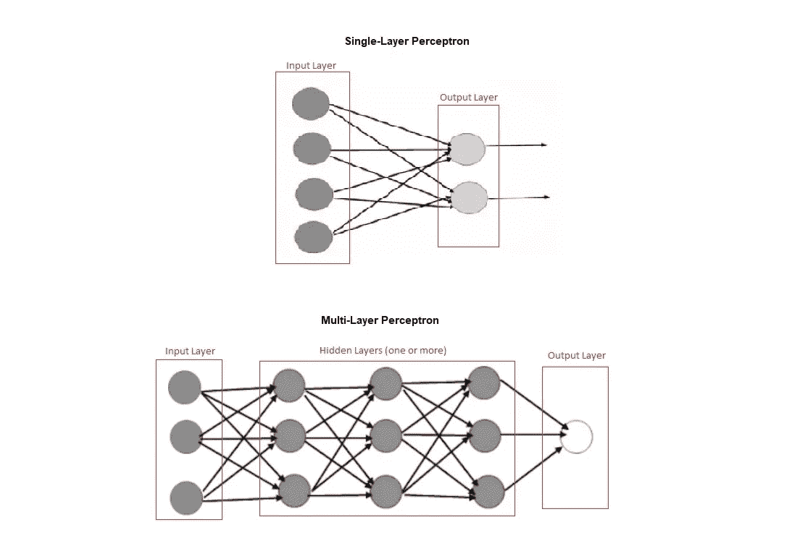

# 深度学习模型是如何得到训练的？

在**正向传播**中，**信息**从**输入** **层**到**输出** **层**。这里，输入乘以相应的权重，然后与偏差相加，然后激活函数应用于该结果。这一过程一直持续到到达具有预测值(输出)的输出层。**损失函数**将找到**预测**和**实际**输出之间的**误差**。

**反向传播**的整体思想是**通过更新权重来减小误差**。这可以在优化器的帮助下实现。这里，通过实现导数规则，权重从最后一层更新到第一层。所以，这两个步骤都要继续，直到你得到想要的精度。

# 例子

考虑一个例子，让我们在**心力衰竭预测**数据集上工作。这是一个分类问题，我们将预测患者是否患有心力衰竭。

## 关于数据集

该数据集包含 2015 年在费萨拉巴德心脏病研究所收集的 299 个条目。在数据集中，年龄范围在 40 到 95 岁之间的有 105 名女性和 194 名男性。它包含 13 个功能，分别是:

*   年龄:患者的年龄
*   贫血:患者的血红蛋白是否低于正常范围
*   肌酐 _ 磷酸激酶:血液中肌酸磷酸激酶的水平(微克/升)
*   糖尿病:患者是否患有糖尿病
*   射血分数:它是左心室在每次收缩中泵出的血液的量度。
*   高血压:患者是否患有高血压
*   血小板:血液中血小板的数量(千血小板/毫升)
*   血清肌酸酐:血液中的血清肌酸酐水平(mg/dL)
*   血清钠:血液中的血清钠水平(毫克当量/升)
*   性别:患者的性别
*   吸烟:患者是否吸烟
*   时间:患者对疾病的随访时间，以月为单位
*   死亡 _ 事件:患者是否死于心力衰竭

## 导入包

首先，导入浏览、可视化和预处理数据所需的包。这些可以在 pandas、Scipy、NumPy、matplolib 和 seaborn 库的帮助下完成。让我们也导入警告库来忽略代码生成的警告。

**代码:**

```
import pandas as pd
import numpy as np
import scipy
import matplotlib.pyplot as plt
import seaborn as sns
%matplotlib inline
import warnings
warnings.filterwarnings('ignore')
```

## 导入数据集

借助 pandas 包中的 read_csv 方法导入数据集(**heart _ failure _ clinical _ records _ dataset . CSV**)。

**代码:**

```
df=pd.read_csv('heart_failure_clinical_records_dataset.csv')
df.head()
```


## 探索性数据分析

关于数据集，有很多东西需要探索。让我们借助 describe 和 info 方法，从数据集的描述和信息开始。

**代码:**

```
df.describe()
```


```
df.info()
```

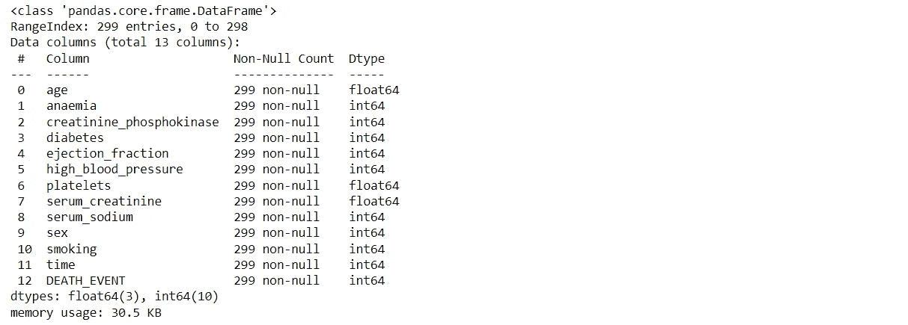

## **检查空值**

检查数据集中是否有空值总是很重要的。如果存在，必须进行处理，因为它可能会影响模型的准确性，您可能会得到不希望的结果。

**代号:**

```
df.isnull().sum()
```


幸运的是，数据集不包含任何缺失值。否则，需要借助插补、删除等技术进行处理。

## **数据可视化**

它是一种通过以图形、图表、曲线图等形式可视化趋势和模式来分析数据的方法。它们是不同类型的可视化:

*   单变量分析:处理一个变量并找出变量中的模式
*   双变量分析:处理两个变量，主要关注它们之间的关系。
*   多变量分析:处理两个以上的变量，同时检查变量的整体行为。

**1。**让我们从 **target** 变量开始数据可视化，使用 seaborn 库的 countplot 方法检查康复和死亡的患者数量。

**代码:**

```
plt.figure(figsize=(3,3),dpi=150)
sns.countplot(x="DEATH_EVENT", data=df,palette='rocket')
plt.title('0 - Survived, 1 - Deceased')
plt.ylabel("Count")
plt.show()
```

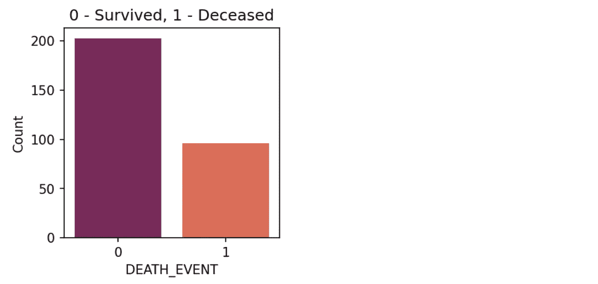

从图上看，治愈率几乎是病人死亡率的两倍。这里，数据有点不平衡。通常使用 SMOTE 技术来平衡数据。从现在开始，让我们保持这样。

**2。**检查**分类变量**，以及它们相对于目标变量的表现。

**代码:**

```
plt.figure(figsize=(4,3),dpi=150)
sns.countplot(x=”sex”,hue=’DEATH_EVENT’, data=df,palette=’viridis’)
plt.ylabel(“Count”)
plt.xlabel(“Gender”)
plt.title(‘0 — Female, 1 — Male’)
plt.show()
```

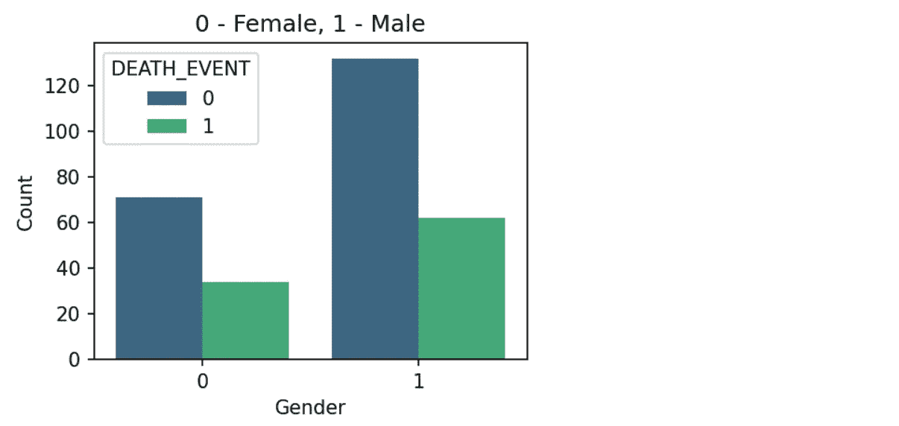

从剧情来看，男性患者的数量几乎是女性患者的两倍。我们可以得出结论，这两类死亡率几乎是存活率的一半。

**代号:**

```
plt.figure(figsize=(4,3),dpi=150)
sns.countplot(x=”high_blood_pressure”,hue=’DEATH_EVENT’, data=df)
plt.ylabel(“Count”)
plt.xlabel(“Blood Pressure”)
plt.show()
```

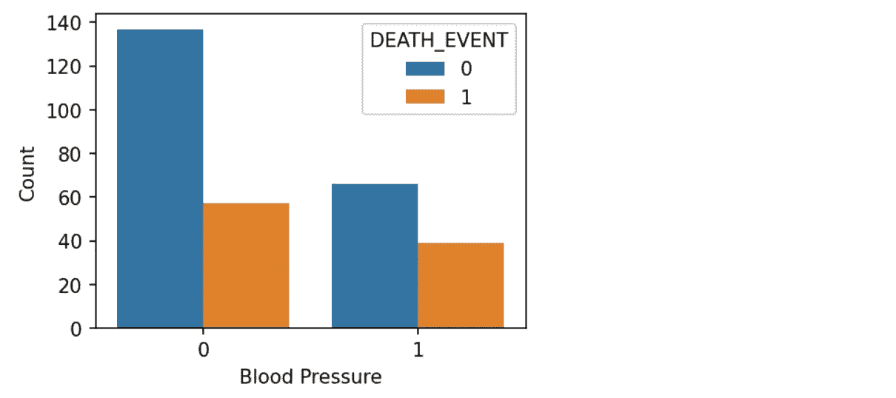

从图上看，不患高血压的人数几乎是患高血压人数的两倍。我们可以得出结论，当一个人有高血压时，他更有可能心力衰竭。

**代码:**

```
plt.figure(figsize=(4,3),dpi=150)
sns.countplot(x=”smoking”,hue=’DEATH_EVENT’, data=df,palette=’mako’)
plt.ylabel(“Count”)
plt.show()
```

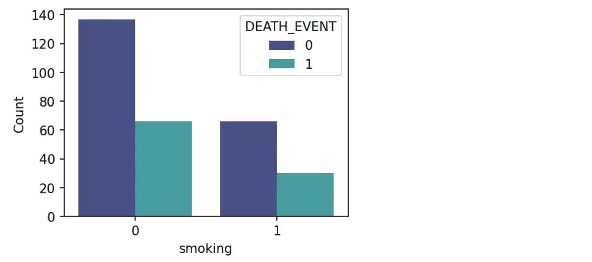

从剧情来看，不吸烟的患者几乎是吸烟患者的两倍。我们可以得出结论，这两类死亡率几乎是存活率的一半。

**3。**检查**连续变量**，以及它们的趋势和模式如何分布。

**代码:**

```
print(‘The mean value is’, df[‘age’].mean())
print(‘The kurtosis value is’, df[‘age’].kurt())
plt.figure(figsize=(4,3),dpi=150)
sns.distplot(df[‘age’],color=’orange’)
plt.show()
```

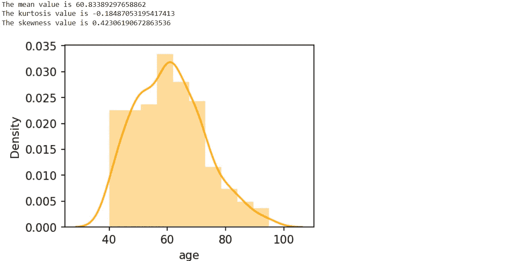

从图表中，我们可以说患者年龄的平均值约为 60 岁，范围在 40 到 95 岁之间。偏度值为正，这意味着在图表的右侧有更多的观察值，并得出更多的人小于 60 岁的结论。

```
print('The mean value is', df['serum_sodium'].mean())
print('The kurtosis value is', df['serum_sodium'].kurt())
print('The skewness value is', df['serum_sodium'].skew())
plt.figure(figsize=(4,3),dpi=150)
sns.distplot(df['serum_sodium'],color='black')
plt.show()
```

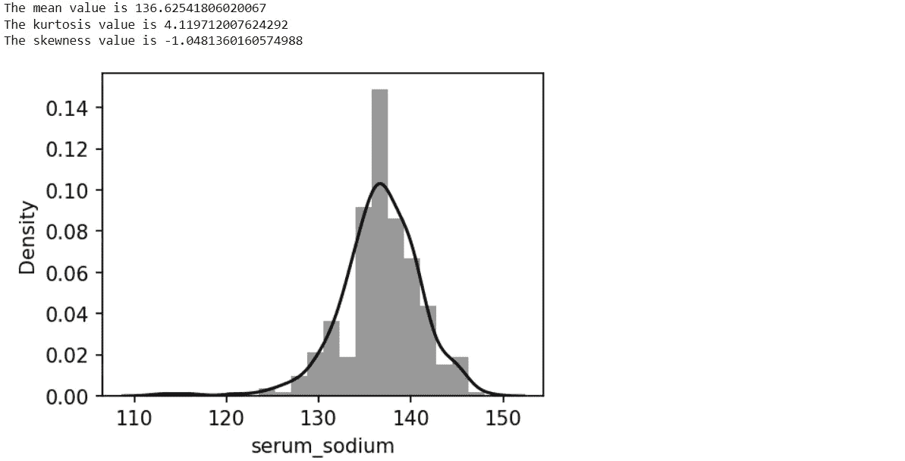

从上面的图中，我们可以说大多数患者的血清钠水平的平均值为 136 (mEq/L ),并且大多数患者的值大于该值。

**代码:**

```
plt.figure(figsize=(4,3),dpi=150)
sns.boxplot(data=df,x='DEATH_EVENT',y='platelets')
plt.show()
```

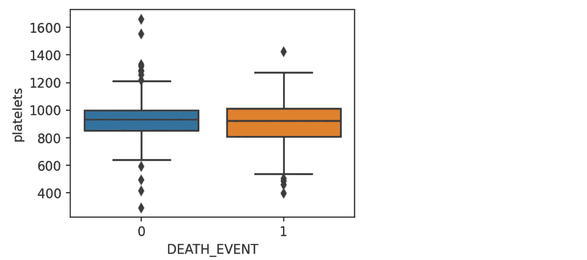

从上图中，我们可以说存活患者的计数中存在更多的极值。两个类别的平均值几乎相同。看起来，这个特性中也存在一些异常值，这些需要处理。

**4。**让我们通过多变量分析来检查这些特征是如何相互展示趋势的。在**热图**和 **pairplot** 方法的帮助下，这是可能的。热图法决定了变量之间的关联程度。而 pairplot 方法确定变量之间关系的形状。

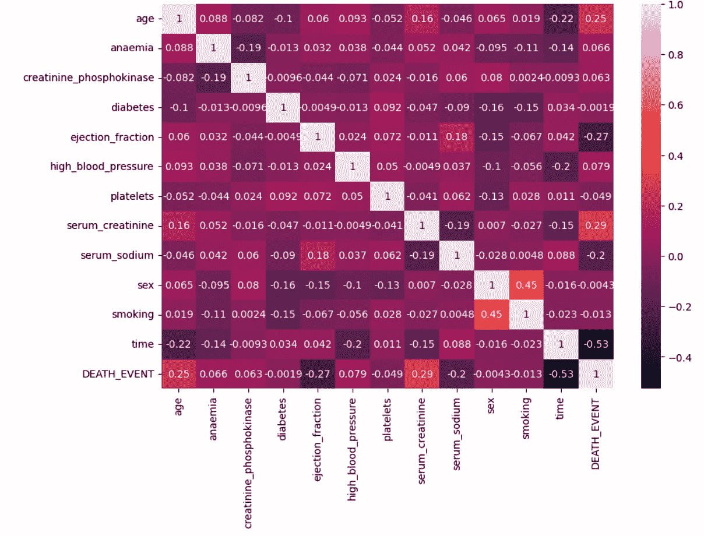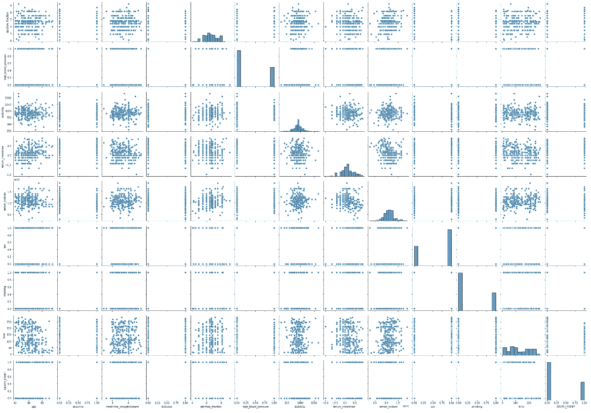

从这些图中，我们可以说这些特征彼此之间没有很强的相关性。所以在这里，有需要担心的协方差问题，可以考虑所有的特征来预测输出。

**5。**最后，在探索性数据分析中，有一个神奇而强大的包可以自动完成我们到目前为止已经完成的所有工作，这就是 **pandas_profiling** 包。当你有较少的时间，并且想要集中更多的精力在模型上时，最好选择自动化 EDA。我将附上由 **ProfileReport** 方法生成的 HTML 模板的第一页，您可以稍后浏览。

**代码:**

```
from pandas_profiling import ProfileReport
profile = ProfileReport(df)
profile
```

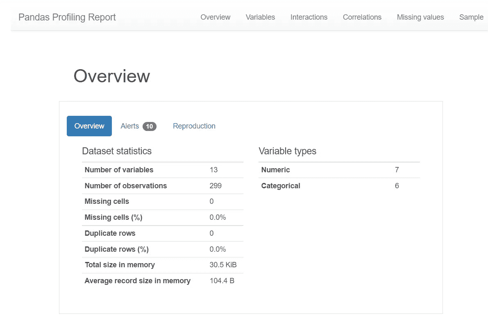

## 数据预处理

## 离群点检测

数据集中的异常值会严重影响预期结果的模型输出。因此，最好借助任何技术，如**四分位数间距**方法、DBSCAN 等，首先检测它们。 **IQR** 方法将比**下尾**小**的值和比**上尾**大**的值视为**异常值**。****

**代码:**

```
def iqr_method(data_frame,column_name):
    q1 = data_frame[column_name].quantile(0.25)
    q3 = data_frame[column_name].quantile(0.75)
    iqr = q3-q1
    Lower_tail = q1 - 1.5 * iqr
    Upper_tail = q3 + 1.5 * iqr
    return(pd.concat([data_frame[data_frame[column_name]<Lower_tail],data_frame[data_frame[column_name]>Upper_tail]]))
iqr_method(df[:],'serum_sodium')
```


以上是血清钠中存在的异常值。类似地，其他特性中也存在一些异常值。

## 异常值处理

所以，我们可以用**来转换**这个变量，这样**就消除了**中的异常值。因为**最好不要删除**条目，因为**数据集的大小小于**。在这里，我使用了 **boxcox 变换**来处理离群值，并编写了一个代码用于自动处理离群值的**。**

****代码:****

```
def automated_handling_outliers(df1):
    outlier_feature_names=[]
    for i in df1.columns:
        if len(iqr_method(df1[:],i))>0:
            print(i)
            outlier_feature_names.append(i)
    for i in outlier_feature_names:
        df1[i],fitted_lambda= scipy.stats.boxcox(df1[i] ,lmbda=None)
    return(df1)
df=automated_handling_outliers(df[:])
```

## **分割数据集**

**此步骤的目的是将数据集分为测试数据集和训练数据集，以便为模型训练和预测提供不同的数据。这可以通过使用 train_test_split 函数来完成。一般来说，**(70–30)%**或**(60–40)%**比率被认为是将数据集拆分为训练和测试数据。**

****代号:****

```
X = df.drop('DEATH_EVENT',axis=1)
y = df['DEATH_EVENT']
from sklearn.model_selection import train_test_split
X_train, X_test, y_train, y_test = train_test_split(X,y,test_size=0.35,random_state=101)
```

## **缩放数据**

**数据缩放是数据预处理步骤中的一个重要步骤。如果数据具有不同的幅度范围，则人工神经网络模型很难设置权重并修改它们以获得最佳结果。这里，最小-最大缩放器用于将整个数据带入 0 到 1 之间的特定范围，同时保留数据的行为(趋势)。**

****代码:****

```
from sklearn.preprocessing import MinMaxScaler
scaler = MinMaxScaler()
X_train= scaler.fit_transform(X_train)
X_test = scaler.transform(X_test)
```

## **创建人工神经网络模型**

**为了创建一个模型，我们有一些强大的库，如 **Tensorflow** 和 **Keras** 包，它们使这个过程在更短的时间内变得非常简单。Keras 包会让事情变得简单，因为它有所有你需要的功能，你只需要定义它们，并在任何你想要的地方使用它们。以前，这些包是独立的，但现在它们被集成到 **TensorFlow** 包的**最新** **版本**中。让我们导入这些包来创建一个模型。**

****代码:****

```
from tensorflow.keras.models import Sequential
from tensorflow.keras.layers import Dense
from tensorflow.keras.optimizers import Adam
from tensorflow.keras.callbacks import EarlyStopping
```

**导入包和功能后，使用这些功能创建一个模型。首先，我们必须创建一个可以连续工作的**模型布局**。**

****代码:****

```
model = Sequential()
```

**现在，**将**的**密集层**添加到序列模型中。**每个密集层**都有**个神经元**和**每个神经元**都有一个对应的**激活函数**。总有一个**输入层**会先到达**，其中**神经元** **等于数据集中**特征**的数量。一般来说，大多数人认为**整流线性单元(** relu **)** 为该层所有神经元的激活函数，除非是输出层。******

**添加隐藏层，因为你的愿望，也将有一些规则。大多数人建议让神经元的数量为 2 的幂，比如(16，32，64，..)与单层中的 **relu** 激活功能。对于输出层，我们可以有一个具有 **sigmoid** 激活函数的神经元，因为这是**二元分类**。**

****

****代码:****

```
model = Sequential()
model.add(Dense(12,activation='relu'))
model.add(Dense(24,activation='relu'))
model.add(Dense(24,activation='relu'))
model.add(Dense(1,activation='sigmoid'))
```

**然后，通过定义损失函数和优化器来编译模型。这里，**损失函数**被认为是**二元交叉熵**，因为这是一个**二元分类**问题，优化器被认为是 **adam** 以获得模型的最佳性能。**

****代码:****

```
model.compile(loss='binary_crossentropy', optimizer='adam')
```

## **训练和评估模型**

**通过给定特征的**训练数据集**和**目标**变量，在**拟合**方法的帮助下训练模型。对于这种方法，我们可以将**验证数据**作为参数传递，然后在模型训练时**确定**验证损失**。在这种情况下，测试数据可用于验证目的。****

****还有一个更重要的参数 **epoch。**如果**一个时期**完成，则表示**模型经过**一次**的**训练数据****。该值可以设置为一个较大的值，但不能太大。如果**纪元**参数设置为**大**值，则**过拟合**问题可能会发生。****

****代码:****

```
model.fit(x=X_train,y=y_train.values,validation_data=(X_test,y_test.values),epochs=200)
```

****

**一旦模型在训练数据集上得到训练，最好检查模型的历史，这意味着它在验证数据上的性能。**

****代码:****

```
model_loss_1 = pd.DataFrame(model.history.history)
plt.figure(figsize=(4,3),dpi=150)
plt.plot(model_loss_1['loss'],color='r',data=model_loss_1,label='loss')
plt.plot(model_loss_1['val_loss'],color='g',data=model_loss_1,label='val_loss')
plt.legend()
plt.show()
```

**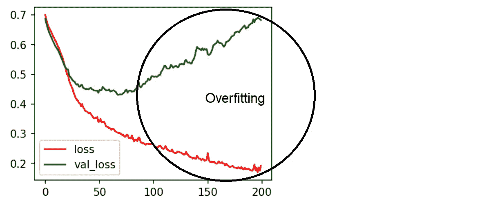**

**从图中，我们可以说训练损失和验证损失都暂时减少了。经过阈值的历元后，**验证损失**开始**增加**，而**训练损失**保持**减少**。这个问题叫做**过拟合**。**

**为了克服上述问题，Keras 库中有一个叫做**提前停止回调**的概念。这种提前停止技术**停止**模型**基于给定参数进一步**训练**。让我们通过重新创建模型来实现这一点。通过将**监视器**参数设置为**验证损失**来定义提前停止方法。这里的**耐心**参数无非是**即使在注意到监控参数的剧烈变化后，模型还要等待**多久才能继续训练。****

****代码:****

```
model = Sequential()
model.add(Dense(units=12,activation='relu'))
model.add(Dense(units=24,activation='relu'))
model.add(Dense(units=24,activation='relu'))
model.add(Dense(units=1,activation='sigmoid'))
model.compile(loss='binary_crossentropy', optimizer='adam')
early_stop = EarlyStopping(monitor='val_loss', mode='min', verbose=1, patience=2)
model.fit(x=X_train, y=y_train,epochs=600,validation_data=(X_test, y_test),verbose=1,callbacks=[early_stop])
```

****

**当您将提前停止的功能添加到模型中时，它**不** **依赖于历元**的**数，即使它是一个**大数**。现在，让我们通过绘制模型的训练损失和验证损失来检查模型的历史。****

**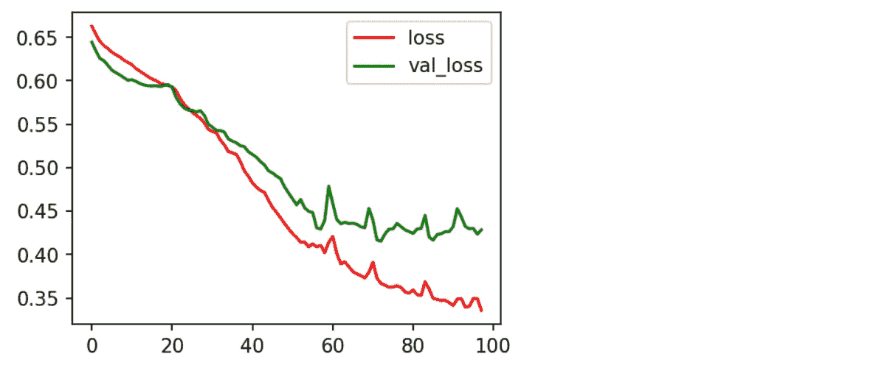**

**从图中，我们可以看出模型训练已经停止了大约 100 个时期。在模型训练期间没有发生过拟合。**

## **预测数据**

**这一步可以在**预测**方法的帮助下完成，您可以将数据作为模型的参数进行测试。**

****代码:****

```
df_y=pd.DataFrame()
df_y['y']=y_test
df_y['y_hat']=model.predict(X_test)
df_y['y_hat']=df_y['y_hat'].apply(lambda x: 1 if x>0.5 else 0)
```

**让我们从 sklearn 包中导入决定模型的准确度、精确度和召回率的模块。**

****代码:****

```
print("Accuracy Score of the model:",accuracy_score(df_y['y'],df_y['y_hat']))
print("Precision Score of the model:",precision_score(df_y['y'],df_y['y_hat']))
print("Recall Score of the model:",recall_score(df_y['y'],df_y['y_hat']))
print(classification_report(df_y['y'],df_y['y_hat']))
```

****

**嗯，我得到了 82%的整体准确率，还不错。根据模型的数据预处理和调整，您可能会获得不同的精度。除此之外，您还可以尝试在模型之间集成 dropout 层，以减少模型过度拟合的机会。在结束之前，让我们通过绘制它的历史来比较提前停止和不提前停止的模型的性能。**

****代码:****

```
plt.figure(figsize=(8,6),dpi=100)
plt.plot(model_loss_1['loss'],data=model_loss_1,label='loss with out early stopping')
plt.plot(model_loss_2['loss'],data=model_loss_2,label='loss with early stopping')
plt.legend()
plt.show()
```

**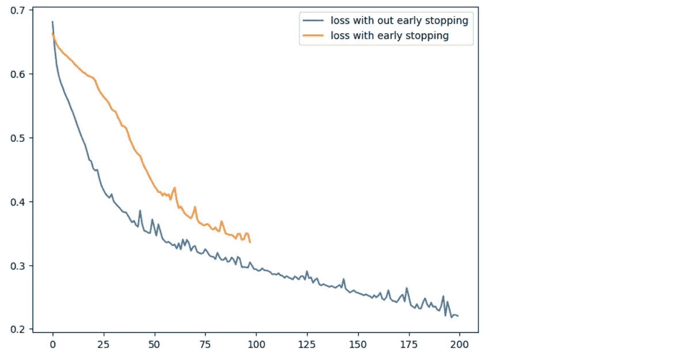**

****代码:****

```
plt.figure(figsize=(8,6),dpi=100)
plt.plot(model_loss_1['val_loss'],data=model_loss_1,label='val_loss with out early stopping')
plt.plot(model_loss_2['val_loss'],data=model_loss_2,label='val_loss with early stopping')
plt.legend()
plt.show()
```

**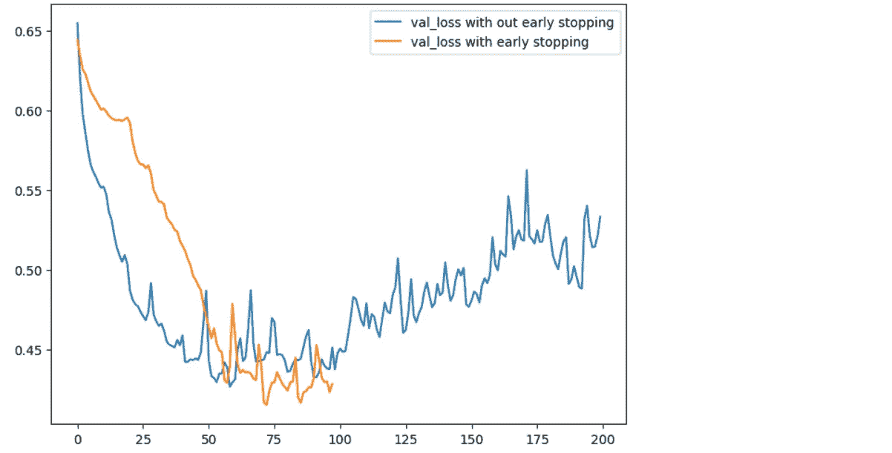**

# **源代码**

**[](https://github.com/balupeddireddy08/Heart-Failure-Prediction-Using-ANN/blob/main/DL_medium.ipynb) [## 心力衰竭预测-使用-ANN/DL_medium.ipynb 在主…

### 通过在 GitHub 上创建一个帐户，为 balupeddireddy 08/Heart-Failure-Prediction-Using-ANN 开发做出贡献。

github.com](https://github.com/balupeddireddy08/Heart-Failure-Prediction-Using-ANN/blob/main/DL_medium.ipynb) 

# 结论

因此，我想说的是，有许多很酷的应用程序可供开发，你可以用 ANN 来实现它们。我本想在文章中加入一些更有趣的东西，但它已经很长了。我将在接下来的文章中尝试添加这些内容。

我希望你有一个有趣的阅读，这篇文章对你有用…🤝

如果你有任何疑问，请告诉我，如果文章有任何错误，请纠正我。所有的建议都是 accepted…✌

# 快乐学习😎**