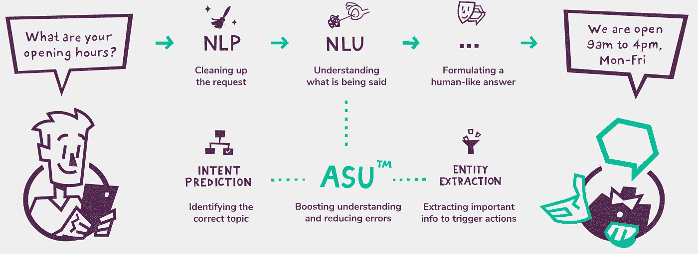
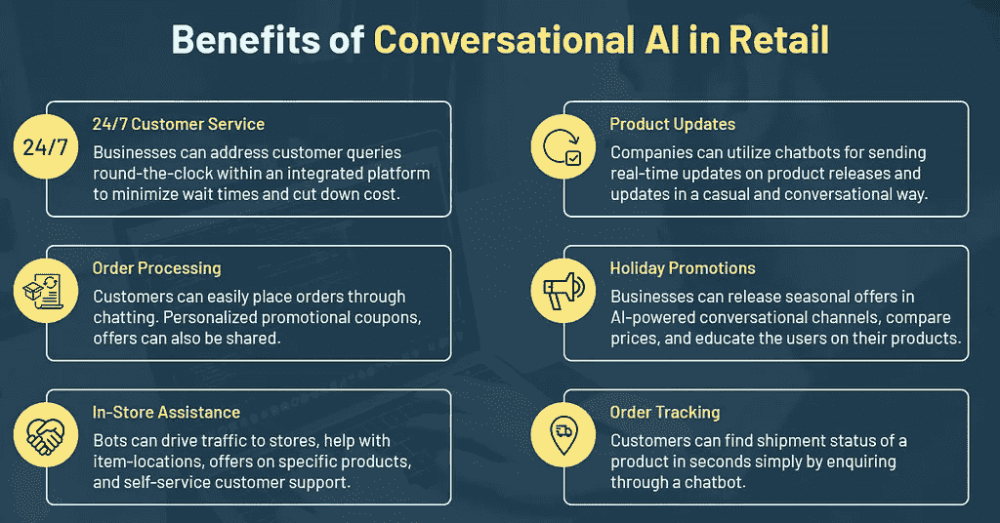
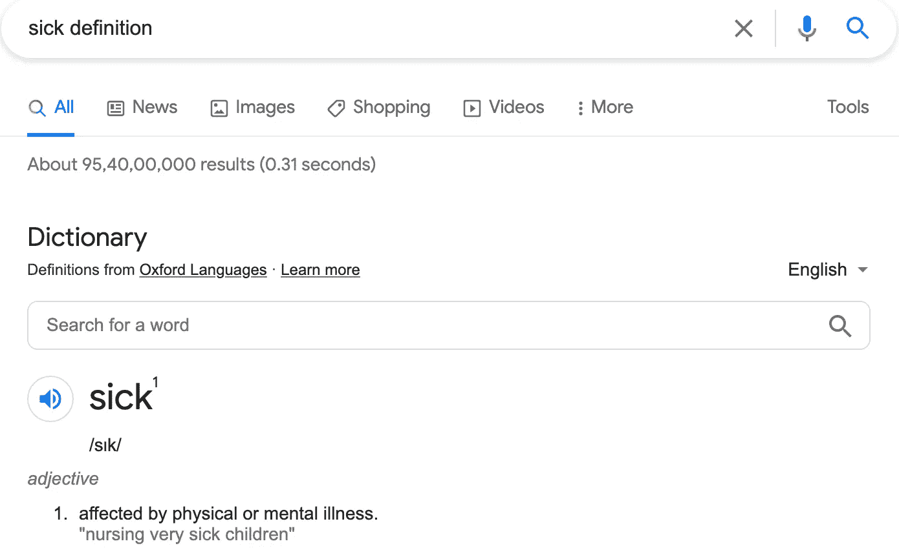

# 一个学生研究者对对话人工智能的看法

> 原文：<https://pub.towardsai.net/a-student-researchers-view-on-conversational-ai-8d7a81a4762a?source=collection_archive---------2----------------------->

我的文章中使用的图片是各自组织的财产，仅用于参考、说明和教育目的。(图片来源:Google【除了部分图片，在图片下方特别提到了其来源】)

# 对话式 AI 到底是什么？

*   对话式人工智能是自动化消息传递和语音应用背后的一系列技术，这些应用提供了计算机和人类之间类似人类的交互。
*   它可以像人类一样交流，识别语音和文本，理解意图，破译不同的语言，并以模拟现实生活中人类对话的方式做出反应。
*   它们使用大量数据、机器学习和自然语言处理来帮助模仿人类交互，识别语音和文本输入，并将其意义翻译成各种语言。

因此，简单地说，对话式人工智能是一种允许用户向机器提问并获得自动响应的技术，这些问题和人类的响应一样，有时几乎无法区分。(本文后面会详细介绍)

你可能知道一些比较流行的:Siri、Alexa、谷歌助手、Cortana 等。对话式人工智能的主要组成部分是自然语言处理(NLP)的使用

# 对话式人工智能的组件

对话式人工智能主要有两个组成部分，即-

**机器学习**

**自然语言处理**

NLP 有四个步骤

*   输入生成
*   输入分析
*   产出生成
*   强化学习。

非结构化数据被转换成计算机可以读取的格式，然后对其进行分析以生成对输入的适当响应。随着时间的推移，机器学习算法可以提高响应质量。

这四个 NLP 步骤可以分解并在下面进一步解释:

*   **输入生成**:用户通过网站或 app 提供输入。输入的格式可以是语音或文本。
*   **输入分析**:如果输入是基于文本的，对话式 AI 将使用自然语言理解(NLU)来破译和理解输入的含义，并推导出其意图。然而，如果输入是基于语音的，它将结合使用自动语音识别(ASR)和 NLU 来分析数据。
*   **对话管理**:在这个阶段，自然语言生成(NLG)，NLP 的一个组成部分，形成一个适当的响应。
*   **强化学习**:最后，机器学习算法会随着时间的推移细化反应，以确保准确性。

让我们用两个相似的例子来更好地理解这一点。

在客户的请求和人工智能的回答之间捕获的过程

再次记住，输入是上图中的" ***【语音】*** ，因此使用了自动语音识别(ASR)。

这是另一个类似的例子

来源:Boost.ai

# 对话式人工智能的优势

资料来源:www.flickr.com

## **以客户为中心**

*   对话式人工智能有助于对各种不同请求的客户做出快速响应。因为顾客很忙，所以不耐烦——给他们快速的回应是让他们的体验更愉快的最简单的方法之一。
*   在最初的响应之后，对话式人工智能还可以通过有用的提示和探索性问题在教育用户方面发挥重要作用。客户支持代理给客户提供指导非常普遍。通过对话式人工智能，这些教程可以自动利用客户的个人资料数据，以确保客户获得个性化的指导。
*   最后，对话式人工智能已经证明了自己是不知道该去哪里的客户的必要和有价值的指南。当客户不知道去哪里解决他们遇到的特定问题或问题，或者问一个简单的问题时，对话式人工智能可以将人们重定向到需要的地方。例如，在银行内部，对话式人工智能可以帮助迷路的顾客去哪里，并满足他或她申请贷款、信用卡等的要求。

## **以组织为中心**

*   从客户体验的开始，对话式人工智能可以通过直观、易于参与的实时聊天窗口和聊天机器人，帮助您更好地将网站访客转化为潜在客户。
*   从这里开始，对话式人工智能可能有助于提高你从潜在客户到购买者的整体转化率。通过询问定制的、具体的问题，聊天机器人激发客户并支持销售团队的工作。

## 成本效益高

为客户服务部门配备人员可能会相当昂贵，尤其是当你想在正常办公时间之外回答问题的时候。通过对话界面提供客户帮助可以降低工资和培训方面的业务成本，尤其是对中小型公司而言。聊天机器人和虚拟助理可以即时响应，为潜在客户提供 24 小时可用性。

## 增加销售和客户管理

随着移动设备进入消费者的日常生活，企业需要准备好向最终用户提供实时信息。由于对话式人工智能工具比人类劳动力更容易获得，客户可以更快更频繁地与品牌互动。

这种即时支持使客户能够避免长时间的呼叫中心等待、被搁置等，从而改善整体客户体验。随着客户满意度的提高，公司将看到其影响体现在客户忠诚度的提高和来自推荐的额外收入上。

对话式人工智能中的个性化功能也为聊天机器人提供了向最终用户提供建议的能力，允许企业交叉销售客户最初可能没有考虑过的产品。

## 可量测性

对话式人工智能也非常具有可扩展性，因为添加基础设施来支持对话式人工智能比新员工的招聘和入职流程更便宜、更快。当产品在国际扩张时扩展到新的地理市场时，或者在意想不到的短期需求高峰期间，例如在假日季节，当人类无法像对话式人工智能那样高效、出色地完成工作时，这一点尤其有用。

# 对话式人工智能面临的挑战

“生病”一词的字典定义

俚语中“生病”一词的定义

对话式人工智能面临着许多挑战，要跟上飞速发展的世界，并保持有用的工具。

## 不断变化的交流方式

我们人类经常改变我们交流的方式。曾经很酷的东西，现在意味着完全不同的东西。例如，单词"**生病**"的字典定义是"受到身体或精神疾病的影响"。但在俚语中，这个词也有令人惊叹，或者令人印象深刻的意思，如上图所示。

从语言、方言、口音到讽刺、表情符号、俚语到表情符号，有大量因素可以影响人类和机器之间的交流。

同一个表情符号对这一代人来说可能意味着完全不同的东西，而对传统的老年人来说则意味着完全不同的东西。对话式人工智能系统和机器人需要跟上人类交流的“正常”和“新常态”。

## **安全和隐私**

尤其是在处理可能被窃取的敏感个人信息时，对话式人工智能应用程序的设计必须考虑到安全性，以确保隐私得到尊重，所有个人详细信息和信息都得到保密，以确保没有数据丢失或被盗。

## **发现和采用**

尽管对话式人工智能应用程序变得越来越容易使用，并且对普通人群来说越来越正常，但我们仍然需要克服一些挑战，以增加在更广泛的用例中舒适地使用技术的人数。

向您的客户群介绍机会可以帮助他们更好地接受该技术，并为那些不熟悉该技术的人创造更好的体验。这一点非常重要，有时会被忽视，并且执行不当，这会导致客户有不好的体验，无法解决他们的问题，或者变得不耐烦。

# 我们使用对话式人工智能

来源: [IBM](https://www.ibm.com/cloud/learn/conversational-ai)

我们在各个领域使用对话式人工智能。下面列出了其中的一些。

*   在线客户支持
*   易接近
*   人力资源流程
*   卫生保健
*   物联网
*   计算机软件

# 什么是图灵测试？

这是一个 Ted 视频，清楚地解释了图灵测试是什么

资料来源:youtube.com/teded

我想以这个话题的前 5 个问题来结束这篇文章。请务必慢慢来，理解问题，并通过下面的评论提交您的答案:)本文中问题的答案将在下一篇文章的结尾提供！

## Q1。

NLU 和 NLP 的区别是什么？

## Q2。

组织如何从使用对话式人工智能中受益？

## Q3。

如果客户给出的输入是语音，那么用什么来分析数据？

## Q4。

对话管理阶段我们做什么？

## Q5。

对话式 AI 面临的最大挑战之一是什么？

感谢阅读，快乐学习！