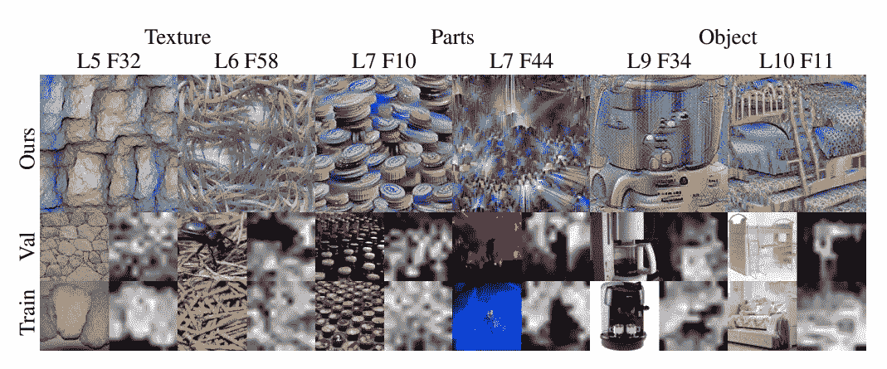
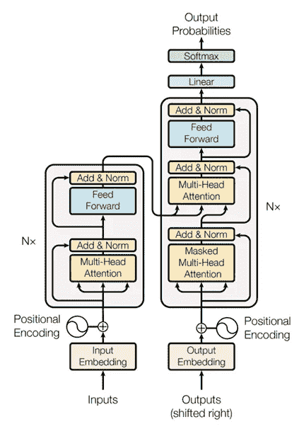
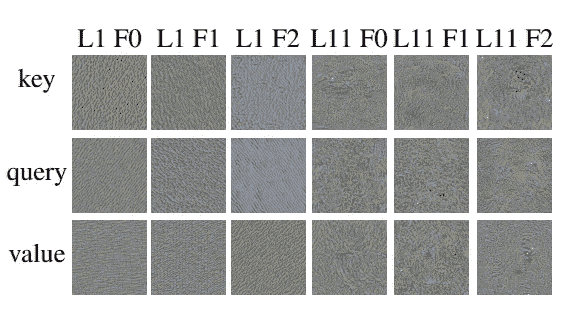
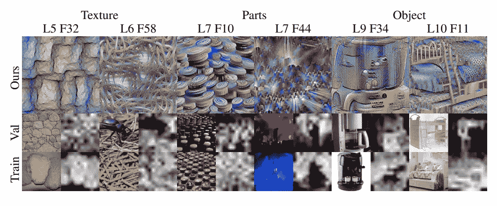
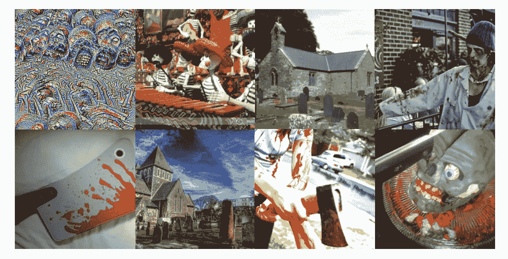

# 视觉变形者眼中的视觉之旅

> 原文：<https://pub.towardsai.net/a-visual-journey-in-what-vision-transformers-see-9db9c8ba62d4?source=collection_archive---------3----------------------->

## 一些大模特如何看待这个世界

图片来自原文章:[来源](https://arxiv.org/pdf/2212.06727.pdf)

可视化 CNN 让我们了解了更多关于这些模型是如何工作的。既然《视觉变形金刚》正走上舞台，一篇新文章解释了我们如何能看到这些广义模型眼中的世界。

# 想象视觉变形金刚

图片来自文章原文：<https://arxiv.org/pdf/2212.06727.pdf>

**自从** [**卷积神经网络**](https://en.wikipedia.org/wiki/Convolutional_neural_network) **(CNN)成为计算机视觉中的一个获奖模型以来，不同的研究小组一直专注于了解这些模型学习什么。**

一方面，神经网络已经出现在几个领域(从语言分析到计算机视觉)，但一直被认为是“黑箱”。与许多其他算法相比，它们更难解释。事实上，模型变得越强大(参数数量的增长)，就越难以理解内部的情况。

因此，已经开发了几种方法来可视化[卷积神经网络学习的内容](https://cs231n.github.io/understanding-cnn/)。一些最常用的:

*   可视化过滤器(或可视化权重)。
*   可视化层激活
*   检索最大程度激活神经元的图像
*   用 t-SNE 嵌入特征向量。
*   GradCAM，显著图。

2016 年[变形金刚](https://en.wikipedia.org/wiki/Transformer_(machine_learning_model))登场。这些基于自我关注的广泛模型已经被证明在 NLP(机器翻译、语言分类等)中实现了更好的性能。很快，它们成为了 NLP 的标准，随着视觉变形器的引入，它们也被应用于计算机视觉。

来自原变压器篇:[此处](https://arxiv.org/abs/1706.03762)

因此，不同的研究人员试图将 [**视觉变形金刚**](https://en.wikipedia.org/wiki/Vision_transformer) **(ViTs)学到的东西可视化。**vit 已被证明更加难以分析，而且到目前为止，所用的方法已显示出局限性。**理解这些模型的内部运作可能有助于解释它们的成功和潜在的困境。**

以前的工作集中在观察自我注意层的键、查询和值的激活，但结果是不成功的。

视觉化自我关注的重量并不会带来深刻的视觉化。原文章的标题和图片:[来源](https://arxiv.org/pdf/2212.06727.pdf)

**纽约大学和马里兰大学**的研究人员最近发表了一篇论文**，更好地理解了模型**内部发生的事情(无论它们是视觉变形金刚还是像 [CLIP](https://openai.com/blog/clip/) 这样的模型)。

在文章中，研究人员总结了他们的贡献:

1.  虽然标准方法会导致无法解释的结果(特别是在应用于键、查询和值时)，但通过将相同的技术应用于同一变压器模块的下一个前馈层，可以获得信息丰富的可视化效果(他们使用不同的模型演示了这一点:ViTs、DeiT、CoaT、ConViT、PiT、Swin 和 Twin transformers)。
2.  ViT 特征的逐片图像激活模式的行为类似于显著图，表明该模型保持了片之间的位置关系(并且在训练期间学习这一点)。
3.  CNN 和 ViTs 构建了一个复杂的渐进式表示(在 CNN 中，第一层表示边缘和纹理，而后面的层学习更复杂的模式，作者表明在 ViTs 中也会发生同样的情况)。与 CNN 相比，vit 能够更好地利用背景信息。
4.  作者还将他们的方法应用于使用语言监督的模型(如 CLIP)，并表明可以从这些模型中提取与字幕文本相关的特征(如介词、形容词和概念类别)。

作者将 vit 与卷积网络进行了比较，并注意到表示的复杂性随着模式的增加而增加(更早的层学习更简单的结构，而更高级的层学习更复杂的模式)。**实际上，CNN 和 ViTs 都有一个共同的特点，那就是所谓的渐进式专业化。**

维生素 B-32 可视化特征的进展。早期图层的特征捕捉一般的边缘和纹理。移动到更深的层，特征进化到捕捉更专业的图像成分，并最终捕捉具体的对象。”原文章的标题和图片:[来源](https://arxiv.org/pdf/2212.06727.pdf)

“ViT B-32 特性的复杂性与深度。可视化表明，vit 类似于 CNN，因为它们显示了从纹理到零件到对象的特征进展，正如我们从浅到深的特征进展一样。”原文的说明和图片:[来源](https://arxiv.org/pdf/2212.06727.pdf)

也有不同之处。作者研究了 vit 和 CNN 对背景和前景图像特征的依赖性(使用 ImageNet 上的边界框)。 **ViTs 能够检测图像中的背景信息**(例如图像中的草地和雪地)。此外，通过掩盖图像中的背景或前景，研究人员表明**vit 不仅可以更好地利用背景信息，而且受其移除的影响也更小。**

“维特-B16 检测背景特征。左:图像优化，最大限度地激活第 6 层的功能。中心:来自 ImageNet 的相应最大激活示例。右图:图像的逐片激活图。(b):原始图像和被遮罩的前景和背景的示例原文章的标题和图片:[来源](https://arxiv.org/pdf/2212.06727.pdf)

> 我们发现令人惊讶的是，即使每个小块可以影响每个其他小块的表示，这些表示仍然是局部的，甚至对于网络深层的单个通道也是如此。虽然对 CNNs(其神经元可能具有有限的感受野)的类似发现并不令人惊讶，但即使在 ViT 的第一层中的神经元也具有完整的感受野。换句话说，vit 学会保存空间信息，尽管缺乏 CNN 的归纳偏向。-来源:[原文](https://arxiv.org/pdf/2212.06727.pdf)

**换句话说，在训练期间，模型学习如何保存空间信息。**此外，最后一层反而具有统一的激活模式，并学习如何对图像进行分类(根据作者的说法，最后一层具有全球化信息的功能)。

> 基于空间信息在斑块中的保存，我们假设 CLS 令牌在整个网络中扮演相对次要的角色，并且直到最后一层才用于全球化。

“来自 ViT 前馈层的特征可视化示例。左:图像优化，以最大限度地激活第 5 层的功能。中心:对应最大化激活 ImageNet 示例。右图:图像的逐片激活图。(b):购物车最常激活的最后一层中的一个要素原文章的标题和图片:[来源](https://arxiv.org/pdf/2212.06727.pdf)

近年来，视觉转换器模型已经用语言监督和对比学习技术进行了训练。其中一个例子是剪辑。因为这些模型的使用越来越多，竞争越来越激烈，所以作者也分析了 CLIP。

左:功能优化显示清晰的边界，最大化激活 ImageNet 示例包含不同的相邻图像。中图:功能优化和最大化激活 ImageNet 照片都是从一个升高的有利位置显示图像。正确:功能优化显示了一群人，但最大限度地激活图像表明对象的重复比对象的类型更相关。原文的说明和图片:[来源](https://arxiv.org/pdf/2212.06727.pdf)

该模型显示了与推测相关的特征，例如“之前和之后”或“从上面”换句话说，有一些特征代表了概念类别，并且是清晰可辨的:

> 来自数据集的相应的七个高度活跃的图像包括其他不同的对象，如带血的武器、僵尸和骨骼。从严格的视觉角度来看，这些类别具有非常不同的属性，表明该特征可能负责检测与发病率广泛相关的图像成分。

“使用与发病率类别相关的 CLIP 训练的 ViT 特征。每个类别中的左上方图像:优化图像以最大程度地激活第 10 层的功能。其余:最能激活该功能的十个 ImageNet 图像中的七个。原文章的说明和图片:[来源](https://arxiv.org/pdf/2212.06727.pdf)

# 结论

要明白，眼见为实总是更好。近年来，人们越来越重视模型的可解释性。虽然在中枢神经系统上有许多有效的方法，但是能够可视化 ViTs 的特征是不可能的。

作者不仅确定了一种能够做到这一点的方法(他们表明必须使用前馈层，而不是自我关注层)，而且还分析了这些特征的属性。他们展示了模型如何能够在训练期间学习空间关系，以及另一方面，最后一层如何不参与这种空间表示。

此外，虽然 vit 类似于卷积网络，但作者的成功部分源于他们如何更好地利用背景相关信息。他们还表明，当 vit 在语言模型监督下接受 d 训练时，他们学习的是更多的语义和概念特征，而不是特定于对象的视觉特征。

**代号**:此处，**条** : [此处](https://arxiv.org/abs/2212.06727)

# 如果你觉得有趣:

你可以寻找我的其他文章，你也可以 [**订阅**](https://salvatore-raieli.medium.com/subscribe) 在我发表文章时得到通知，你也可以在**[**LinkedIn**](https://www.linkedin.com/in/salvatore-raieli/)**上连接或联系我。**感谢您的支持！**

**这是我的 GitHub 知识库的链接，我计划在这里收集代码和许多与机器学习、人工智能等相关的资源。**

** [## GitHub - SalvatoreRa/tutorial:关于机器学习、人工智能、数据科学的教程…

### 关于机器学习、人工智能、数据科学的教程，包括数学解释和可重复使用的代码(python…

github.com](https://github.com/SalvatoreRa/tutorial) 

或者随意查看我在 Medium 上的其他文章:

 [## 人工智能的崛起:2022 年展望

### 创新与颠覆:2022 年人工智能的展望

pub.towardsai.net](/the-rise-of-ai-a-look-at-the-2022-landscape-956e7e3f1839)  [## Twitter 的收购给科学界敲响了警钟

### 为什么科学家和数据科学家会关注

medium.com](https://medium.com/mlearning-ai/twitters-acquisition-raises-red-flags-for-scientific-community-9b865fb2f694)  [## 释放生成人工智能的力量:最终列表

### 探索人工智能技术的最新进展，以及它们如何让你受益

medium.com](https://medium.com/mlearning-ai/unleashing-the-power-of-generative-ai-the-definitive-list-13988d422c16)  [## 人工智能可以成为数据科学家吗？

### OpenAI 的 ChatGPT 让数据科学家们大吃一惊。它会偷走他们的工作吗？

medium.com](https://medium.com/mlearning-ai/can-an-ai-be-a-data-scientist-2d4d9b6c5d5)**