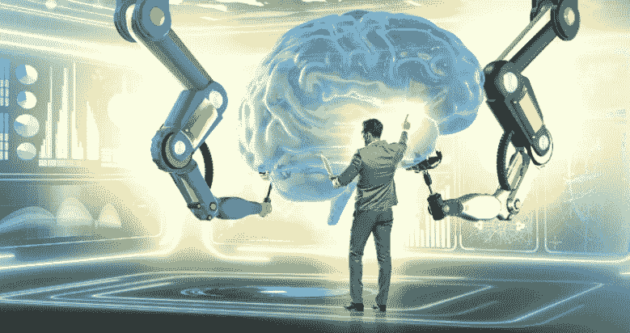
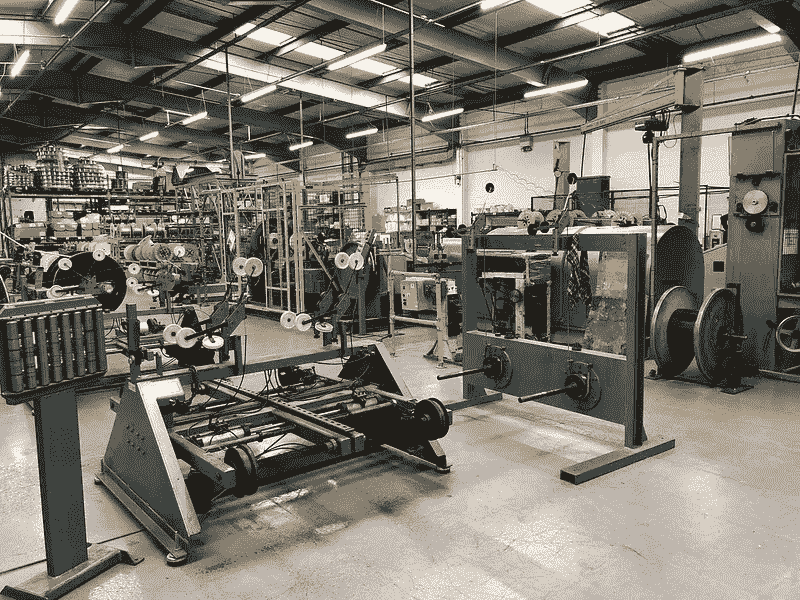

# 后疫情时代的人工智能和自动化

> 原文：<https://pub.towardsai.net/ai-and-automation-in-a-post-pandemic-world-38d00270c66a?source=collection_archive---------4----------------------->

## [人工智能](https://towardsai.net/p/category/artificial-intelligence)，[观点](https://towardsai.net/p/category/opinion)

## 人工智能如何(深刻地)重塑了一个行业

图片由 [Flikr](https://www.flickr.com/photos/167487274@N04/40027789343/in/photolist-23Z7Te2-wuajWh-2cVDCjU-M4zUUX-qEcVtB-qE8ZQ7-qsyjZe-2dN5uJo-2ePqS6A-CL1rgG-25V4wC7-qMRG4L-24cz45v-qnLksF-qnLini-qEcUhD-JBtjWp-2c8V27p-ho8QA-2ibvLUV-2hpUmSp-2hpUmHM-JUZxQ1-qMZ8st-26sVUxV-Sk98ro-Wbpxum-UXuxNG-2hchnb5-CgjrUE-zpXfBe-NrynZr-2hpUmMK-2hpTt4d-9Civer-2hpUmzW-pWGqyK-2hpRzxg-2hpUmBV-pWGpcr-pWGpqT-qAUdYd-qAVfVQ-qTtCe6-pWtvbN-qAUcnh-pWGqaZ-qTjzrM-qTjA86-qAUe9U) 提供

2020 年 3 月，很少有人会认为工业制造商是新技术的早期采用者。传统上，这是一个保守的行业，每一项新技术都要经过仔细评估，以免可能破坏非常复杂和整合的流程。但该行业正面临前所未有的挑战，促使谨慎的公司迅速采用颠覆性技术来应对新的现实:客户需求不规则，生产线对敏捷性的需求日益增加。

今天的制造商需要用更少的人来交付同样数量的产品，而不会因为减少了人工监督而牺牲质量。对许多人来说，提高人工智能等技术的利用率以及利用制造过程中产生的大量数据已经成为优先事项。

人工智能曾经是一项很好的技术，现在是先进制造业的必需品——尽管大多数全球首席执行官预计将需要[3-5 年](https://home.kpmg/xx/en/home/insights/2018/06/2018-global-manufacturing-outlook.html)才能完全实现该技术的投资回报。

**因此，投资回报问题至关重要:**虽然人工智能*可能是答案*，但更重要的是要有一个精心设计的问题。今天，比以往任何时候，在头脑中有一个清晰的商业目标对于有效的人工智能集成都是至关重要的。人工智能不会放之四海而皆准，人工智能部署中成功与失败的界限归结为拥有一个可以用显式 KPI 跟踪和衡量的特定目的。

图片由 [Flickr](https://www.flickr.com/photos/156999189@N04/30237300687/in/photolist-N4Y53t-2hbzGyQ-73uYSx-7zRkM9-7zMzQ2-dbRiEY-7zMzE2-7zRkAY-7zMzHt-7zMzKv-wkYEUW-2hqRYG5-wkZsdJ-wkYbXW-wCAhMi-wCBXp6-vFAyry-wBUAih-PG5JqL-N4XZZZ-N4Y2wM-PG5F6u-2bQ2BvB-5FVZ4b-azMtHt-N4Y3XH-2ebRe1s-e2KEdK-bM1ThD-2aJdmoY-PG5MeG-2b7ecKE-PG5NTo-f7jy3a-2aJdkJw-by7cAs-bM1TeR-dMqrDV-8vLt41-2aJdmfS-naVyy8-25jG1mQ-nqnhEq-ns97mZ-nssiuC-dMqrfH-nuavSK-2bQ2t6F-9tqhP4-nsrFbf) 提供

例如，测量人工智能部署的商业价值的一个简单方法是分析有缺陷的产品。生产有缺陷的产品从来都不是制造商的选择，但在大流行后的世界里，这个问题因生产车间人口更加稀少而变得更加复杂。通过乘以看生产线的“眼睛数量”来采用人工智能，可以消除产品召回，增加产量，提高客户满意度，并提高制造商的整体底线。

以一家商业面包店为例。

面包店通常处理大量的原料，有时供应商会提供错误的产品，有时，错误的产品会带有正确的条形码。在这里，可以通过在生产流程的关键步骤中添加廉价的摄像头来有效地实施人工智能，直观地识别配料并将该信息与扫描的条形码进行比较，在存储和使用配料之前纠正错误，提高面包店的整体产量，同时最大限度地减少浪费。

在上面的例子中，一个明确的目标(减少一定数量的浪费)是至关重要的。此外，制造商可以实施具有特定软件/硬件要求和安装时间表的人工智能解决方案，以经济高效的方式实现这些目标。

今天，市场上有一些人工智能解决方案，使制造商可以更容易地改造现有的硬件，并轻松地将人工智能作为“软件更新”添加到已建立的基础设施上。

这将我前面提到的投资回报期从 3-5 年缩短到仅仅几个月。

随着这些技术变得更加强大和精简，人工智能的商业案例也变得更加强大。这与人工智能软件的兴起相呼应，人工智能软件已经用于从评估包装机器中的组件存在到定制标签检查到托盘检查的所有事情。

制造业采用工业 4.0 需要清晰的业务原理和可衡量的 KPI。尽管有广泛的负面影响，2020 年疫情已经促使制造商更深入、更迫切地思考这些问题，结论是明确的。人工智能确实是一种范式转换技术，它通过增加人类劳动力来实现企业投资回报。

未来的工厂将展示人类、人工智能和机器之间更加平衡的分工，协同工作，为下一波制造业竞争力提供动力。

*Max Versace 是* [*Neurala 的首席执行官兼联合创始人。*](https://www.neurala.com/)