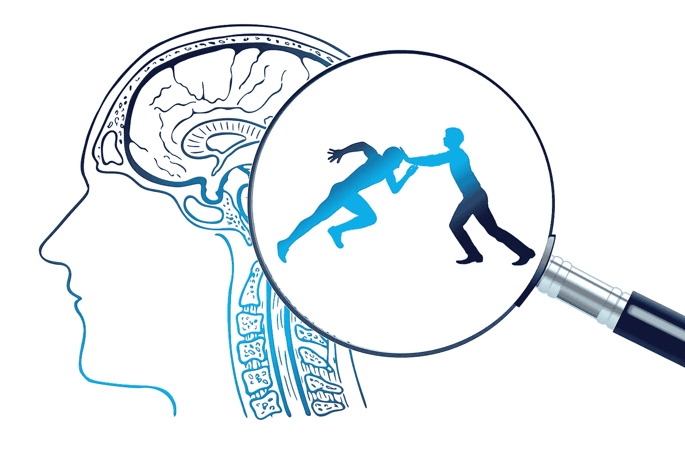

# 人工智能可以给评估带来公平性，但我们准备好了吗？

> 原文：<https://pub.towardsai.net/ai-can-bring-fairness-to-assessments-but-are-we-ready-for-it-4bd2b039ee8d?source=collection_archive---------5----------------------->

## [人工智能](https://towardsai.net/p/category/artificial-intelligence)，[公平性](https://towardsai.net/p/category/artificial-intelligence/fairness)

图片由 [Gerd Altmann](https://pixabay.com/users/geralt-9301/?utm_source=link-attribution&utm_medium=referral&utm_campaign=image&utm_content=1571851) 从 [Pixabay](https://pixabay.com/?utm_source=link-attribution&utm_medium=referral&utm_campaign=image&utm_content=1571851) 拍摄

去年 9 月，我偶然看到一篇即将发表的文章，文章讲述了一群七年级学生如何想出一种简单的方法，在由人工智能(AI)评分的历史考试中作弊。这篇文章主要讲述了一个年轻学生的故事，她在 Edgenuity 的历史作业中获得了很低的分数，但后来在她的母亲(碰巧是历史教授)的帮助下，她找到了如何欺骗人工智能评分系统的方法，并在其余的作业中获得了 100 分。一个非常耐人寻味又吸引眼球的故事吧？

> 故事总比你想象的要复杂。

看完整篇文章，我意识到故事中有一些空白。例如，文章中提到的所谓“人工智能”评分系统实际上是一个简单的关键词匹配引擎，**而不是真正的人工智能系统。在 Edgenuity 平台中，测试中的每个简答题似乎都与几个关键词相关联。学生的答案包含的关键词越多，他/她的分数就越高。所以，这个分级系统从一开始就不应该叫 AI。有趣的是，[The Verge 在 2019 年发表的另一篇文章](https://www.theverge.com/2019/1/28/18197520/ai-artificial-intelligence-machine-learning-computational-science)指出了新闻界和社交媒体对“AI”一词的误用。这两篇文章看似矛盾。**

# 人工智能自动评分

在这一点上，有人可能会想知道人工智能是否真的可以用来准确客观地给学生的书面回答打分。简单的回答是肯定的。在我上一篇关于人工智能的文章中，我谈到了**自动论文评分**，简称 AES，这是一个很有前途的解决方案，可以对简答题和长论文进行高度精确的自动评分。使用自然语言处理，AES 基于人类评分者(例如，教师)如何对学生的回答进行评分来创建一组语言评分规则，然后应用这些规则来对新一组学生的回答进行评分。

照片由[布雷特·乔丹](https://unsplash.com/@brett_jordan?utm_source=medium&utm_medium=referral)在 [Unsplash](https://unsplash.com?utm_source=medium&utm_medium=referral) 拍摄

人工评分者根据问题答案的相关性、答案的组织以及低级错误(如语法错误、打字错误和标点错误)对问题进行评分[1]。与人类评分员不同，AES 不会尝试来“理解”回答的内容。取而代之的是，它在由人类评分者相似评分的回答中寻找一致的模式。

几个测试机构正在使用 AES 给写作评估打分——通常是为英语学习者设计的。例如，教育考试服务中心(ETS)在低风险和高风险评估中有几个自动评分的应用。同样，澳大利亚教育研究委员会使用 AES 对成人[在线写作评估(OWA)](https://www.acer.org/au/owaa/scoring-system) 评分。

# 客观和公正

当谈到评分的便利性和客观性时，[多项选择测试](https://journals.sagepub.com/doi/full/10.3102/0034654317726529)通常被认为是最有效和最持久的评估形式[2]。与多项选择测试不同，简答题和论文型问题更难评分，因为它们需要人工评分员逐一检查每个答案。还有，这样的问题在评分时更容易带有主观性，原因有几个。例如，分级一致性可以根据人类评价人的情绪或能量水平而改变。此外，如果有两个或更多的评价人，每个评价人可能会以不同的宽容程度对回答进行评分。

在对简答题和论文型问题的回答进行评分时，使用 AES 的一个重要好处是可以保持评分的客观性和公平性。无论学生的社会经济地位、性别、民族或种族背景如何，AES 都可以对所有学生的回答应用相同的评分规则。此外，AES 不会受到光环效应的影响，光环效应是指根据学生以前的经验分配明显更高(或更低)的分数的趋势[3]。

值得注意的是，对所有学生一致地应用相同的评分规则并不意味着由 AES 分配的分数是完全无偏见的。对于 AES 来说，学习*正确的*评分规则，需要一个大规模的评分数据集，其中人类评分员已经对问题进行了一致的评分。

> 你只和你的数据集一样好。[4]

如果人类评分员的评分包含对特定学生群体的负面或正面偏见，那么 AES 评分也会包含相同的偏见。也就是说，AES，或者更一般的 AI，并不能自动消除人类偏见造成的不公平和歧视。

# 文化抵抗

图片由 [Gerd Altmann](https://pixabay.com/users/geralt-9301/?utm_source=link-attribution&utm_medium=referral&utm_campaign=image&utm_content=4065092) 从 [Pixabay](https://pixabay.com/?utm_source=link-attribution&utm_medium=referral&utm_campaign=image&utm_content=4065092) 拍摄

目前，实践中存在反对使用不良事件的文化阻力(部分是无意识的)。

*   **学生和教师:**让学生有机会在回答问题时使用自己的语言，有助于创建更有针对性的评估。与此同时，它带来了这样的期望，即人类评分者(例如，教师)将从每个书面回答中读出言外之意，以对该回答给予至少一些部分的信任。因此，学生可能会担心 AES 将无法捕捉到他们反应的深度，特别是如果它没有明确地写出来。一些教师和讲师也对 AES 评分持怀疑态度，因为他们担心这会鼓励学生使用公式化写作。
*   普通大众:当人们听说一个有趣的人工智能系统时，总会倾向于寻找欺骗它的方法。在人为因素影响很大的评估中，让公众相信人工智能的效用甚至更难。[前麻省理工学院教授 Les Perelman](https://lesperelman.com/) 博士对 AES 的不准确评分直言不讳，他称之为“机器人评分”。在[最近的一篇文章](http://journalofwritingassessment.org/article.php?article=145)中，他谈到了[巴别塔生成器](https://lesperelman.com/writing-assessment-robo-grading/babel-generator/)——一种能够创建复杂但无意义的文本的软件程序，得到了大多数 AES 引擎的满分。新闻媒体也继续在这个问题上影响公众舆论。大多数报纸和杂志文章认为，人工智能对人类语言的理解仍然很浅，因此人工智能系统无法理解书面文本的意思。

# 最后的想法

迟早，我们将不得不认识到，通过使用先进的人工智能系统，每个领域，包括教育和人类评估，都变得越来越自动化。因此，我们需要采用以人为中心的方法来建立不同利益相关者(如学生、教师、家长和决策者)对人工智能效用的信任。AES 等有前途的应用预示着人工智能在不久的将来可能会给人类评估带来公平，但仍需要更多的进展。

# 参考

[1]n .马德纳尼和 a .卡希尔(2018 年 8 月)。[自动化评分:超越自然语言处理](https://www.aclweb.org/anthology/C18-1094.pdf)。第 27 届国际计算语言学会议论文集*(第 1099-1109 页)。*

[2] Gierl，M. J .，Bulut，o .，郭，q .，，张，X. (2017)。[开发、分析和使用教育中多项选择测试的干扰物:一项综合综述](https://journals.sagepub.com/doi/full/10.3102/0034654317726529)。*教育研究评论，87* (6)，1082–1116。

[3]马鲁夫、J. M .、斯坦、S. J .、博思马、L. N .、库尔特、k .、艾默顿、A. J. (2014 年)。[防止大学生作业评分中的光环偏差](https://doi.org/10.1080/23311908.2014.988937)。*痛切心理学，1*①。

[4][https://cs . ut Dallas . edu/dr-Vincent-ng-develops-ai-essay-grading-program/](https://cs.utdallas.edu/dr-vincent-ng-develops-ai-essay-grading-program/)