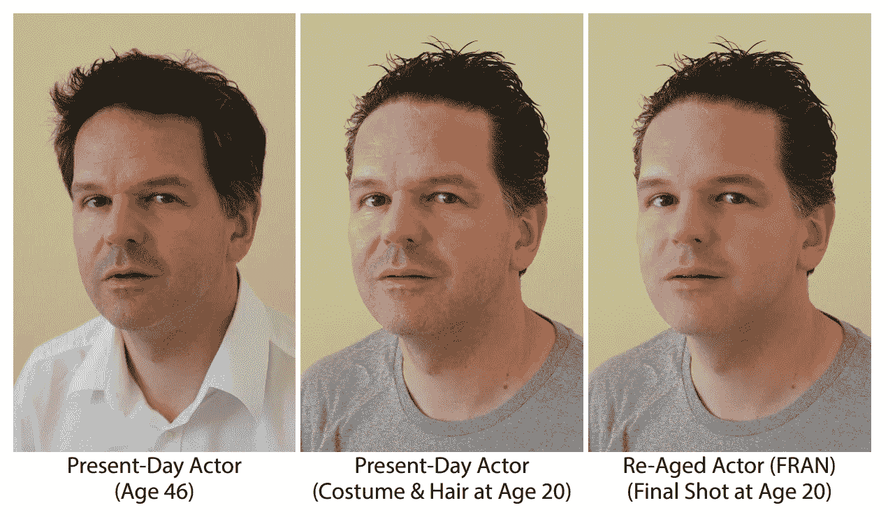
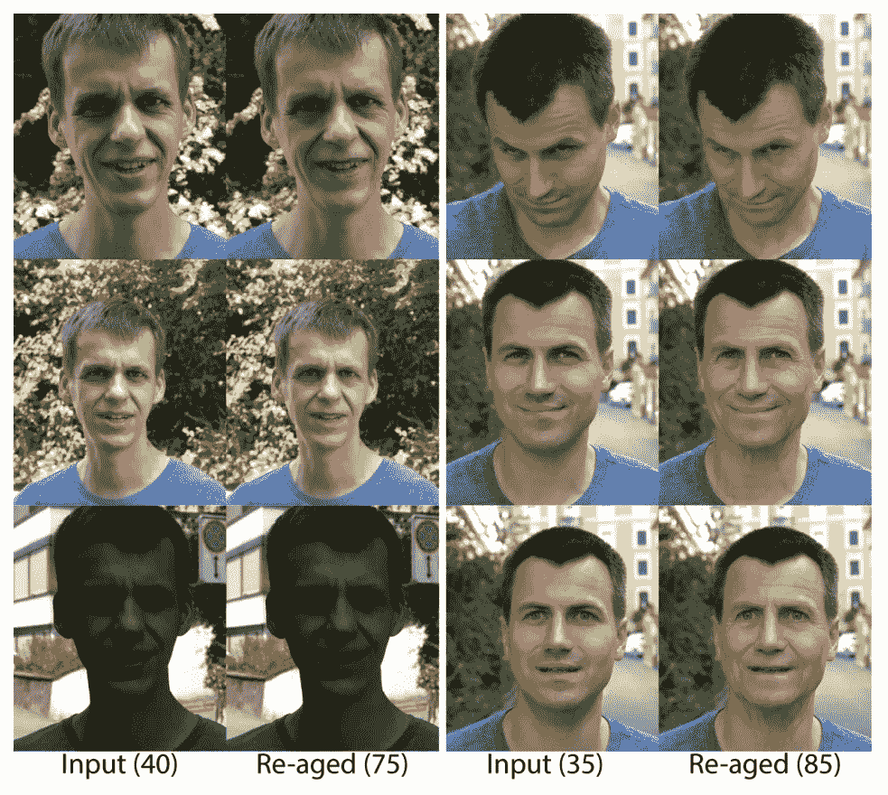
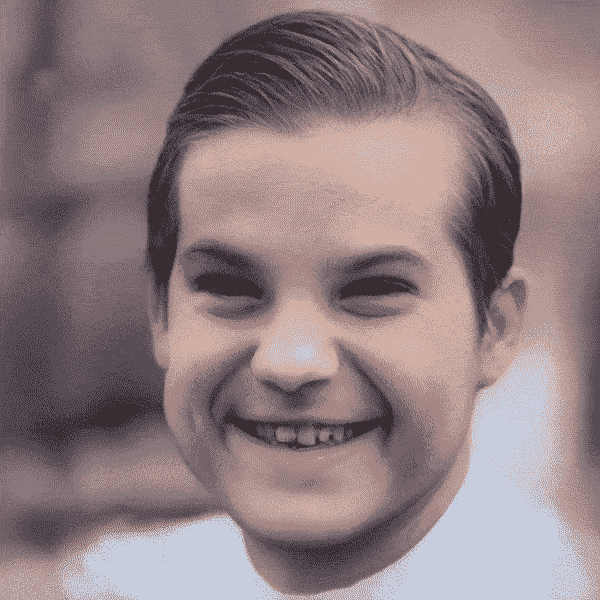

# 艾面临再老化

> 原文：<https://pub.towardsai.net/ai-face-re-aging-c6446be94d92?source=collection_archive---------5----------------------->

## 迪士尼新模式解释

> 最初发表于 [louisbouchard.ai](https://www.louisbouchard.ai/disney-re-age/) ，前两天在[我的博客上读到的！](https://www.louisbouchard.ai/disney-re-age/)

## 观看视频

无论是为了在 Snapchat 过滤器中寻找乐趣，还是为了看电影，甚至是为了解开几个谜语，我们都有一个能够在照片中改变我们年龄的实用程序。

这通常是由熟练的艺术家使用 Photoshop 或类似的工具来编辑你的图片。最糟糕的是，在一个视频中，他们必须对每一帧都进行这种人工编辑！想象一下为此需要做多少工作。好吧，这里有一个解决方案和一个新问题。

来自[弗兰论文](https://studios.disneyresearch.com/2022/11/30/production-ready-face-re-aging-for-visual-effects/)的结果。

迪士尼最近的研究出版物《FRAN 》可以自动做到这一点。这对电影业来说是一件大事，它让你可以用很少的成本在整部电影中立刻让某人重新变老。然而，对于艺术家来说，同时削减一些工作机会并帮助他们削减漫长而乏味的工作时间以专注于与人才相关的任务是一个问题。这里很酷的一点是，他们创建了一个基于 FRAN 的工具，供艺术家使用和编辑结果，通过专注于改善细节而不是单调的复制粘贴编辑，使他们的工作更有效率。我很乐意在[我们的 Discord 社区](https://www.louisbouchard.ai/learn-ai-together/)上听到你对此的想法。但是，让我们再一次关注这项工作纯粹积极的一面:他们在视频人脸数字化老化方面取得的科学进展。

弗兰论文的结果。

你所看到的是这种新的 FRAN 算法的结果，我相信你已经同意这些结果看起来是多么惊人！只要看看与其他包含许多人工制品且无法保持人的身份不变的最先进的再老化方法相比，它看起来要真实得多。此外，FRAN 的方法不需要像其他方法那样将面部居中，这使得它更加令人印象深刻。更不可思议的是，他们的做法是多么简单。

首先，不出所料，弗兰代表着面部衰老网络。

这意味着该模型能够拍摄一张脸，并在各种表情、视点和光照条件下以一致性、真实感和高分辨率的结果改变该人的年龄。

对于电影，演员的年龄外貌通常由制作团队使用专用的服装、发型等来改变。，来描绘目标年龄，只有面部留给数字艺术家一帧一帧地编辑，这就是弗兰的用武之地，他严格关注面部的皮肤区域。他们还关注成年人的年龄，因为电影已经有了有效的不同技术来让非常年轻的人重新衰老，因为在这些情况下，整个身体和面部的形状都不同，而且更小。

但是他们怎么能从任何位置取一张脸，仅仅改变它的外表来增加或减少几十岁呢？主要是因为他们在这个任务上没有地面实况。这意味着他们不能训练一种算法来复制图片之前和之后。从各个角度看，同一个人相差 20 年或更久的例子很少。他们需要有一种不同于传统的监督学习方法的方法，在传统的监督学习方法中，你试图复制你已经有的例子。通常，研究人员使用强大的模型来解决这个问题，这些模型是在所有年龄的人造人脸上训练出来的。虽然结果相当令人印象深刻，但由于为其生成的假脸的训练数据，它们主要在中心和正面人脸上工作。因此，结果很难推广到真实世界的场景，因为它们没有真正保持人的身份，因为它不是在不同时间段使用同一个人来训练的，而是不同年龄的各种不同的人，并且这种静态模型很难产生真实的面部运动，因为它是在静态图像上训练的:它不知道真实世界的机制、照明变化等。

山姆论文的结果。

他们的第一个贡献是解决了同一个人在不同年龄的图像数量的差距。他们的目标是做和以前的方法一样的事情，但是有一点小小的改变。他们仍将使用生成的假人脸，但将建立一个充满不同年龄的相同人脸的数据集，因此相同的背景和相同的一切都使算法严格专注于人脸。他们认为，即使这些方法在现实世界和视频场景中不能很好地推广，他们仍然能够很好地理解衰老过程，因此他们可以使用它来生成同一个人在不同年龄的更多图像，作为建立更好的数据集的第一步。这一步是使用一个名为 [SAM](https://yuval-alaluf.github.io/SAM/) 的模型来完成的，该模型可以获取一个人的面部，并对其进行重新老化。它将仅用于构建我们的前后图片集，以用于训练他们的 FRAN 算法。这一步是必要的，因为我们的算法太愚蠢，无法像我们一样从几个例子中进行归纳，而且我们无法在不同年龄获得几乎一样多的具有相同照明、背景和服装的真实人脸照片:它必须是人工生成的。

FRAN 模型概述。左图:U-Net 模型，用于生成再老化的预测掩膜。右图:鉴别器对真实图像(来自数据集)或生成图像的预测，用于训练。图片来自[报社。](https://studios.disneyresearch.com/2022/11/30/production-ready-face-re-aging-for-visual-effects/)

第二个贡献是使用他们创建的这组新图像，并训练一种算法，能够在真实世界的场景中复制这一过程，并在视频帧之间保持良好的一致性。事实上，他们构建的算法非常简单，类似于你会发现的大多数图像到图像的翻译算法。他们使用 U-Net 架构，该架构采用输入和输出年龄以及图像来学习将它转换为新图像的最佳方式，方法是将它编码到最有意义的空间中，然后解码成新图像。因此，网络学会获取任何图像，并把它放入我们称之为潜在空间的地方，在那里我们有自己的编码。这个潜在空间基本上包含网络为其特定任务学习的所有必要信息，因此这个特定个体的不同面部特征，但不包含关于图像背景和其他对于再老化不必要的特征的信息。

然后，它利用这些信息来预测某种重新老化的面具。该遮罩将仅包含图片中需要编辑的部分，以实现再老化效果，这使得该任务比再次预测整个图像更易于管理。并且我们简单地将这个预测的面具合并到我们的初始图像中以得到重新老化的脸。这个面具是他们的方法更好地保存人的身份的主要原因，因为他们限制了他们的网络的行动领域，只对老化的修改，而不是整个图像。当你不能把它变得更智能的时候，就把它变得更具体！

该模型按照 GAN 方法进行训练，这意味着它将使用另一个模型，您可以在上面的模型概览图中看到，在右侧，称为同时训练的鉴别器，用于计算生成的再老化图像是否与我们在训练数据集中的图像相似，基本上是对其结果进行评级以指导训练。

瞧！这就是弗兰帮助你在 18 岁到 85 岁之间重新变老的方法。

当然，这只是对这份新的迪士尼研究出版物的简单概述，我建议阅读他们的优秀论文以获得更多信息和结果分析。如果你对 GANs 不熟悉，我建议你看一下我做的关于他们的[简短介绍视频](https://youtu.be/ZnpZsiy_p2M)。

感谢您的阅读，我们下次将带着另一篇精彩的论文再见！

## 参考

Loss 等人，DisneyResearch，2022: FRAN，[https://studios . Disney research . com/2022/11/30/production-ready-face-re-age-for-visual-effects/](https://studios.disneyresearch.com/2022/11/30/production-ready-face-re-aging-for-visual-effects/)
甘斯解释:[https://youtu.be/ZnpZsiy_p2M](https://youtu.be/ZnpZsiy_p2M)
山姆:[https://yuval-alaluf.github.io/SAM/](https://yuval-alaluf.github.io/SAM/)
不和:[https://www.louisbouchard.ai/learn-ai-together/](https://www.louisbouchard.ai/learn-ai-together/)