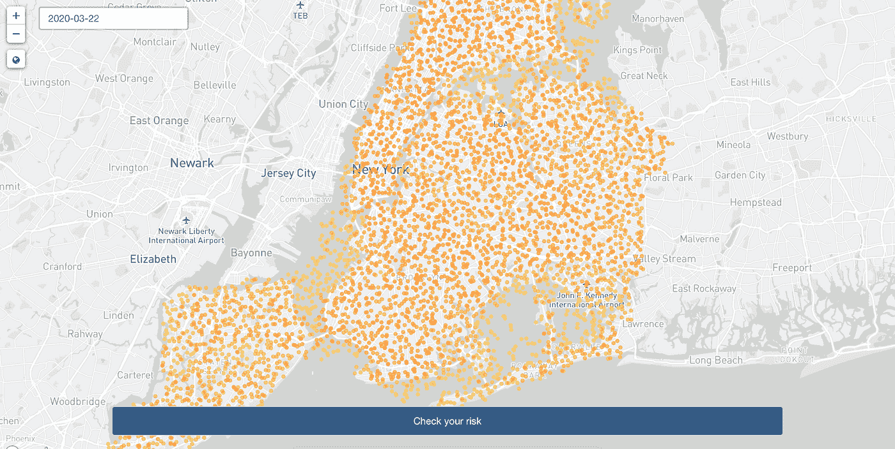
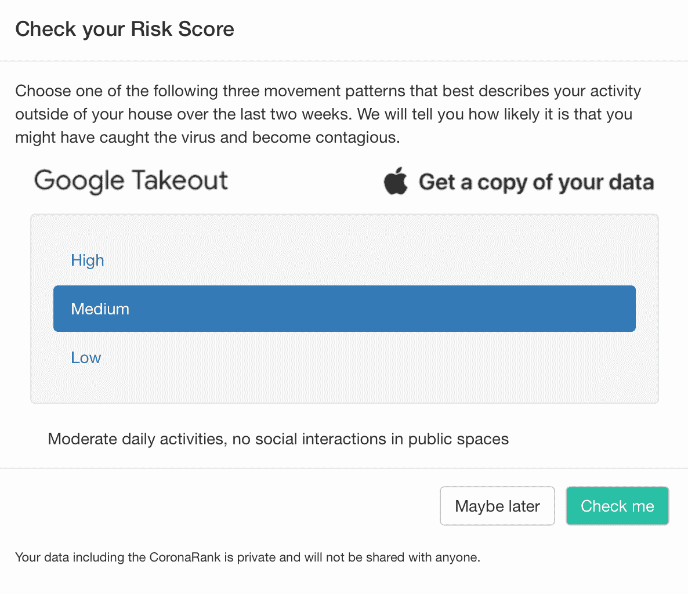
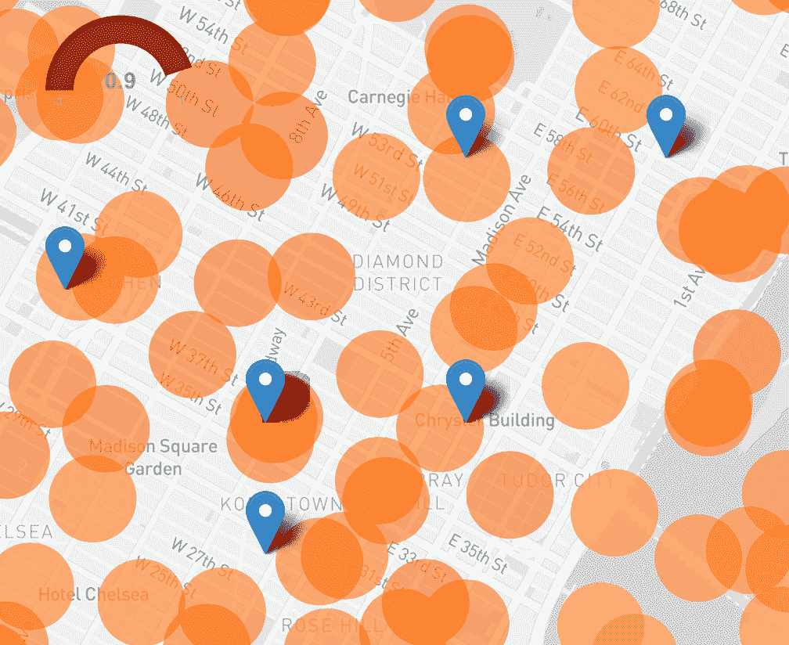

# 人工智能:用数据科学对抗新冠肺炎

> 原文：<https://pub.towardsai.net/ai-for-good-fighting-covid-19-with-data-science-73fc3a062320?source=collection_archive---------0----------------------->

这是我们最近参加疫情响应黑客马拉松的两篇文章中的第一篇。请继续关注我们的 CoronaRank 解决方案的技术细节(Markov Chains，R，Shiny，以及如何快速操作一个 100GB 的数据集)。

新冠肺炎疫情给社区、医疗系统和经济带来了前所未有的压力。遏制病毒传播的大部分努力仍然是为了更广泛社区的利益而承担个人责任。各种政府机构和国际组织正在制定政策，旨在遏制疫情和最大限度地提高医疗保健服务的效率。

**数据科学公司能做些什么来帮助这些努力？**

我们的 [AI for Good initiative](https://appsilon.com/ai-for-good/) 旨在弥合技术专业知识与那些站在为我们星球的可持续未来而奋斗的最前沿、需要这种支持的人之间的差距。致力于这一愿景，我们开始为一个可以减少新冠肺炎疫情影响的项目贡献我们的数据科学技能。

我们最近在一次以寻找全球疫情解决方案为中心的黑客马拉松中得到了这个机会。在黑客马拉松期间，我们开发了[CoronaRank](https://devpost.com/software/coronarank)——一种为用户提供个人冠状病毒风险评分并生成风险区域热图的算法。

# 疫情响应黑客马拉松

Devpost 是一个平台，为技术社区提供了一个为克服各种全球性挑战做出贡献的机会。他们最近的[疫情响应黑客马拉松](https://hackcovid19.devpost.com/)要求参与者开发技术来解决几十年来最重大的公共卫生挑战。

黑客马拉松于 3 月 27 日启动。在接下来的三天里，2，000 多名参与者参与进来，提交了超过 230 个项目，涵盖四个领域:

*   公共卫生和信息共享
*   疾病的流行病学和科学
*   保护我们卫生工作者的安全
*   二级社会影响

30 个不同的组织投入了资源，包括来自 Amazon AWS 的云计算、来自 Mapbox 的可视化工具、来自 Veraset 的数据集等等。

我们与 [Ewa Knitter](https://www.linkedin.com/in/ewaknitter/) 合作参加了黑客马拉松，他是一位传染病流行病学家，友好地提出支持我们的努力。

# 我们着手解决的问题

经过初步讨论，我们发现了当前疫情中几个特别突出的问题，并且我们意识到可以使用地理定位数据来解决这些问题。具体来说:

*   新冠肺炎测试是一个有限的资源，没有一个明显的方法来决定谁应该被测试。
*   由于很少进行检测，部分原因是许多感染者没有症状，所以很难知道应该避开哪些人和地区。
*   医疗保健行业的供应链管理将非常难以推进，政策制定者需要了解当前可能即将爆发疫情的潜在热点。
*   许多年轻、健康的人忽略了社交距离指导，因为他们的个人风险很低。我们需要一种方式来说明打破孤立会如何影响社区。

# 我们的解决方案

为了解决这些问题，我们决定创建具有高度人类互动的疫情热点的热图。这种热图将使公共官员了解下一次潜在爆发的地点，并向用户提供关于不遵守公共卫生措施的风险的信息。

为了实现这一点，我们从谷歌的 PageRank 算法中获得了灵感，该算法部分基于网页与其他流行网页的交互和连接来对网页进行排名。我们用马尔可夫链模型在流行病学中复制了这种方法。由此产生的 **CoronaRank** 是一种算法，它使用地理位置数据、流行病学数据、自我报告和马尔可夫链建模来评估冠状病毒暴露的可能性。

为了创建和实现 CoronaRank，我们使用了纽约州的 [Veraset](https://www.veraset.com/) 数据库。Veraset 提供匿名的手机地理定位数据，给每个人一个唯一的标识符。

挑战在于在有限的时间内分析这个大型数据集(每天超过 100GB 的数据)。然而，基于我们以前在大数据方面的经验，我们能够快速开发算法。我们继续将它嵌入到一个 web 应用程序中，该应用程序名为 **Community Shield** ，专为智能手机设计，可以显示疫情热点——最近一段时间内活动频繁的地区，并根据用户在这些热点地区的互动次数给用户一个风险分数。

*纽约热图。深色(红色)圆圈表示风险较高的位置。*

一个人的冠状病毒等级是他们可能感染新冠肺炎病毒的可能性。确诊病例的冠状等级为 1。未确认的人员被分配 0 的冠状等级

*用户输入的演示。*

你去的危险地方越多，你的冠状动脉排名就越高。一个地方的高级官员越多，风险就越大。

*一个高危个体(CoronaRank 为 0.9)最近去了曼哈顿的几个高危区域。*

你可以在这里测试应用[的演示。目前，它包括三个预定义的风险概况，以展示该应用程序的能力。](https://internal.appsilon.ai/coronarank/)

# 我们未来的计划

我们计划通过包含自我报告功能来进一步开发 CoronaRank 算法。这样，用户可以匿名提供关于其 COVID 相关症状的信息(如果有的话)。这将影响他们的冠状动脉，进而影响他们最近几周遇到的所有其他人。这对于没有能力筛查和测试每个公民的公共卫生组织来说是非常有价值的。

我们还旨在整合谷歌外卖，将个人位置数据导入应用程序，使其完全针对用户，并改善用户界面。

我们希望与政府和国际机构合作，获得对该应用程序的认可，并将其交付给公众。长期合作将有助于将该应用程序转变为一个全面的工具，以教育个人并推动公共机构的知情医疗服务政策。为了实现这一点，我们需要获得云资源，让这款应用大规模可用。

# 关注我们了解更多信息

*   在推特上关注 [@Appsilon](https://twitter.com/appsilon)
*   在 LinkedIn 上关注 Appsilon
*   报名参加 AI for Good [简讯](https://appsilon.com/ai-for-good/)