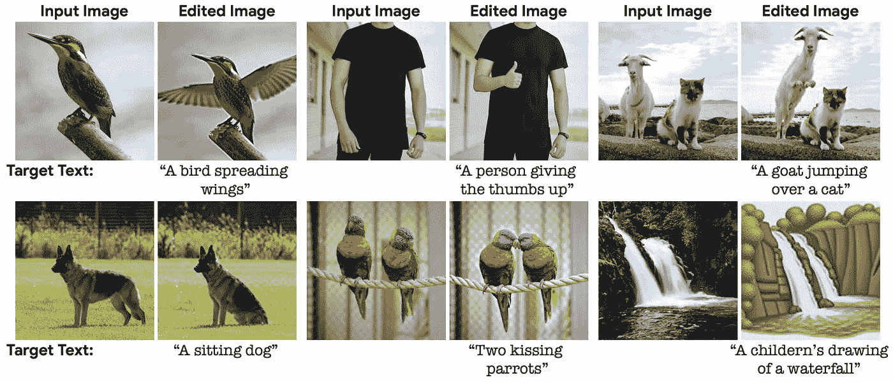
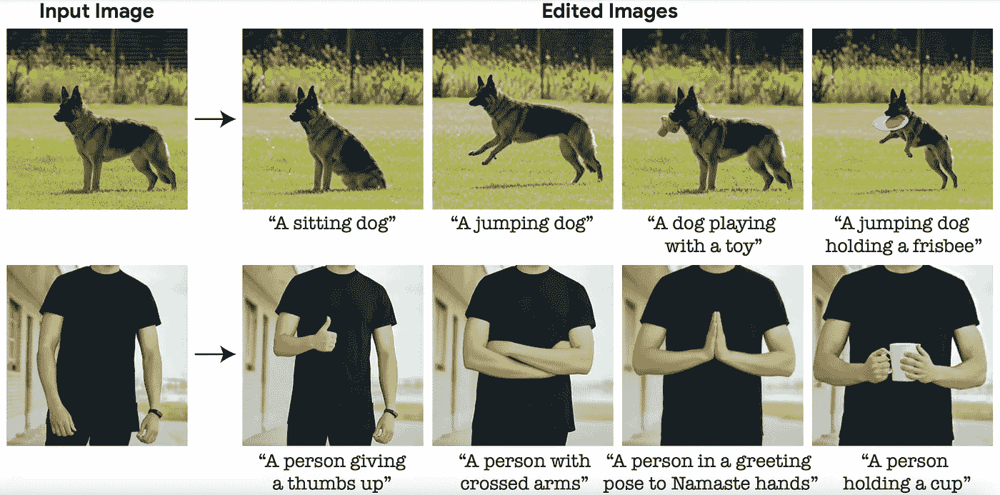
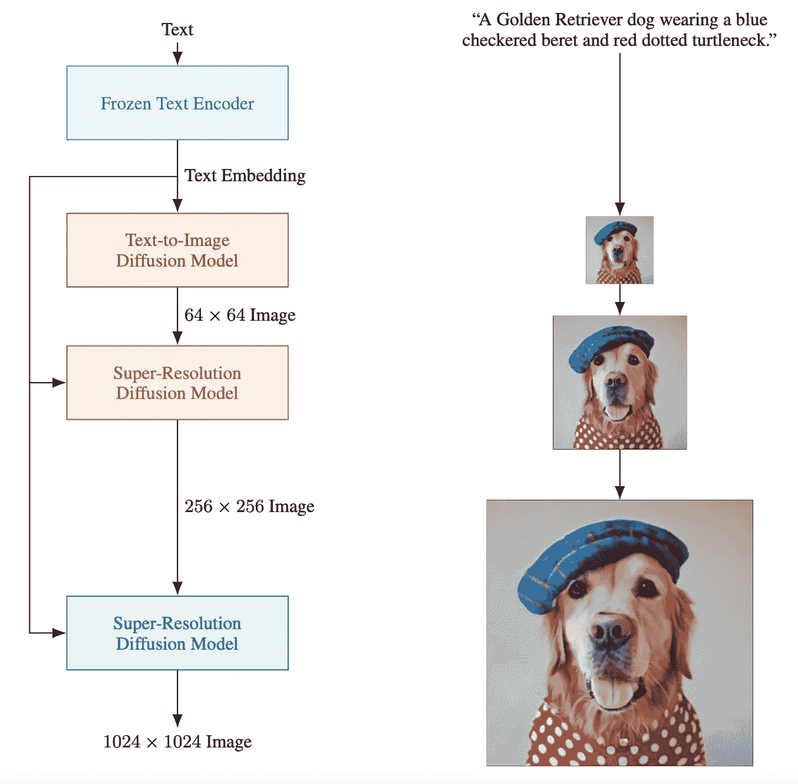
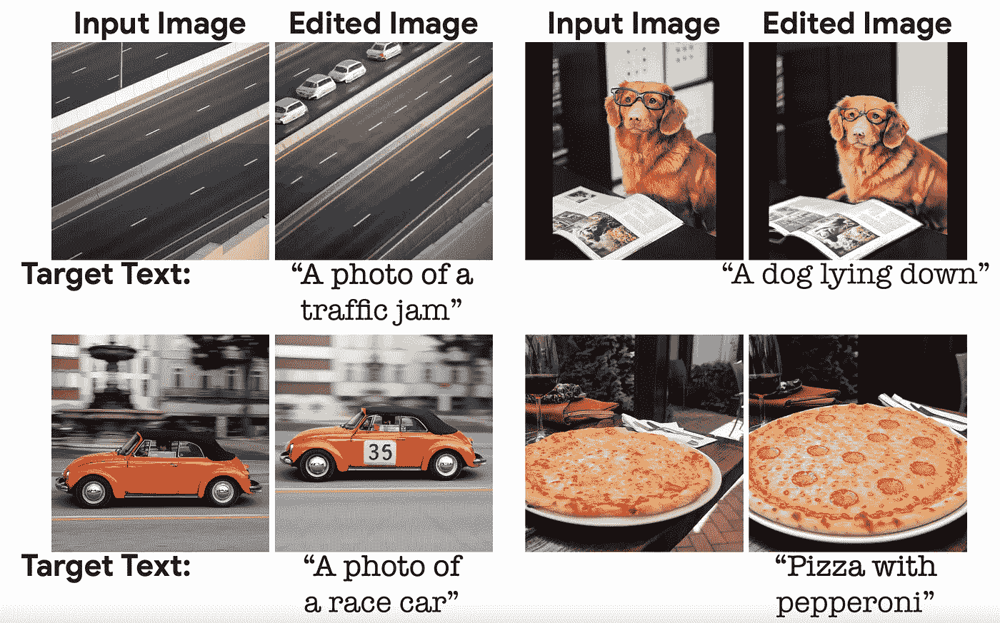

# 来自文字的 AI 图像编辑！Imagic 解释道

> 原文：<https://pub.towardsai.net/ai-image-editing-from-text-imagic-explained-4f7061058006?source=collection_archive---------1----------------------->

## Imagic:使用预先训练好的图像生成器模型操纵图像！

> 最初发表于 [louisbouchard.ai](https://www.louisbouchard.ai/imagic/) ，前两天在[我的博客上读到的！](https://www.louisbouchard.ai/imagic/)

## 观看视频

本周的报纸可能是你下一个最喜欢的模特。

如果你认为最近的图像生成模型像 [DALLE](https://www.louisbouchard.ai/openais-new-model-dall-e-2-is-amazing/) 或[稳定扩散](https://www.louisbouchard.ai/latent-diffusion-models/)很酷，你不会相信这是多么不可思议。

这是 Imagic:

图像结果编辑各种输入图像。图片来自[论文](https://arxiv.org/pdf/2210.09276.pdf)。

Imagic 采用这种基于扩散的模型，能够从中提取文本并生成图像，并调整该模型以编辑图像。看看那个...你可以生成一个图像，然后教模型按照你想要的方式编辑它。

这是向免费拥有自己的 photoshop 设计师迈出的一大步。

这个模型不仅能理解你想要展示的东西，而且还能保持真实，并保留初始图像的属性。看看狗和人是如何在所有的图片中保持一致的。

图像结果编辑各种输入图像。图片来自[纸张](https://arxiv.org/pdf/2210.09276.pdf)。

这项任务被称为文本条件图像编辑。这意味着只使用文本和初始图像来编辑图像，这在一年前几乎是不可能的。现在，看看它能做什么！

是的，这一切都是从一个单一的输入图像和一个简短的句子，你说你想有。多神奇啊。！

唯一更酷的是它的工作方式。让我们开始吧！

这个模型，像这些天发表的绝大多数论文一样，是基于扩散模型的。更具体地说，它使用一个已经训练好的图像生成器模型从文本生成图像，并使其适应图像编辑。在他们的例子中，它使用了 [Imagen](https://www.louisbouchard.ai/google-brain-imagen/) ，我在之前的视频中介绍过。这是一个基于扩散的生成模型，能够在图像-字幕对的巨大数据集上训练后创建高清图像。

图像的可视化。图片来自[论文](https://arxiv.org/pdf/2205.11487.pdf)。

在 Imagic 的情况下，他们只是将这个预训练的 Imagen 模型作为基线，并对其进行修改，以便编辑作为输入发送的图像，保留图像特定的外观，如狗的种族和身份，并根据我们的文本编辑它。

Imagic 微调过程概述。图片来自[纸](https://arxiv.org/pdf/2210.09276.pdf)。

因此，首先(上图，左图)，我们必须对文本和初始图像进行编码，以便我们的 Imagen 模型能够理解它。完成后，我们优化我们的文本编码或文本嵌入，以更好地适应我们的初始图像。基本上，采用我们的文本表示，并为我们的初始图像优化它，称为 e_opt，以确保它理解，在这个例子中，我们希望生成具有相似外观的鸟和背景的同类图像。

然后，我们用预先训练好的图像生成器对其进行微调。这意味着我们将重新训练 Imagen 模型，保持我们刚刚生成的优化文本嵌入不变。因此，这两个步骤用于通过冻结两者中的一个并使另一个更接近来使文本嵌入更接近图像嵌入，这将确保我们针对文本和初始图像两者(a 和 b，上图)进行优化，而不仅仅是两者中的一个。

既然我们的模型理解了初始图像和我们的文本，并且理解它们是相似的，我们需要教它为这个文本生成新的图像变体。

这部分超级简单。我们的文本嵌入和图像优化嵌入非常相似，但仍不完全相同。我们在这里做的唯一的事情是，我们把图像嵌入到我们的编码空间中，并把它向文本嵌入移动一点。

此时，如果您要求 Imagic 模型使用优化的文本生成一个图像，它应该会给出与您的输入图像相同的图像。因此，如果你向文本的嵌入位置移动一点，它也会向你想要的方向编辑图像一点(上图，c)。你在这个空间移动得越多，编辑就越大，离你的初始图像就越远。所以你现在唯一需要弄清楚的是，你想对你的文本采取的步骤的大小。

向 e_target(我们的文本嵌入)前进 n 步。

瞧！

当你找到你的完美平衡时，你就有了一个新的模型，它能够生成你想要的各种变化，以保存重要的图像属性，同时以你想要的方式进行编辑！

当然，结果还不完美，正如你在这里看到的，模型要么没有正确编辑，要么对初始图像进行了随机的图像修改，如不适当的裁剪或缩放。不过，如果你问我的话，我会觉得印象很深刻。我发现图像生成过程的速度令人难以置信，这既令人惊讶又令人害怕。我很想知道你对这些图像生成和图像编辑模型的看法。你认为它们是好事还是坏事？这样的模型变得越来越强大，你能想到什么样的后果？

失败案例的例子。图片来自[纸](https://arxiv.org/pdf/2210.09276.pdf)。

你可以在他们的论文中找到关于他们用来实现这些结果的具体参数的更多细节，我肯定会邀请你阅读。

如果你想了解更多关于图像生成部分及其工作原理的信息，我也邀请你阅读我写的关于 [Imagen](https://www.louisbouchard.ai/google-brain-imagen/) 的文章。

下周我会带着另一篇精彩的论文来看你！

## 参考

阅读全文:【https://www.louisbouchard.ai/imagic/】
卡瓦尔，b .，扎达，s .，朗，o .，托夫，o .，常，h .，德克，t .，莫塞里，I .，伊拉尼，m .，2022。基于文本的真实图像编辑与扩散模型。arXiv 预印本 arXiv:2210.09276。
配合稳定扩散使用:[https://github . com/Justin pinkney/Stable-Diffusion/blob/main/notebooks/imagic . ipynb](https://github.com/justinpinkney/stable-diffusion/blob/main/notebooks/imagic.ipynb)我的简讯(每周向您的邮件解释的新 AI 应用！):[https://www.louisbouchard.ai/newsletter/](https://www.louisbouchard.ai/newsletter/)