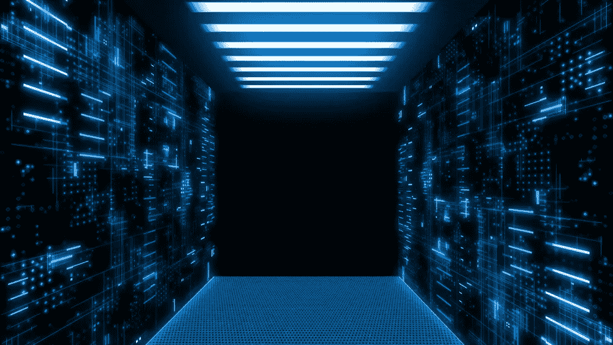
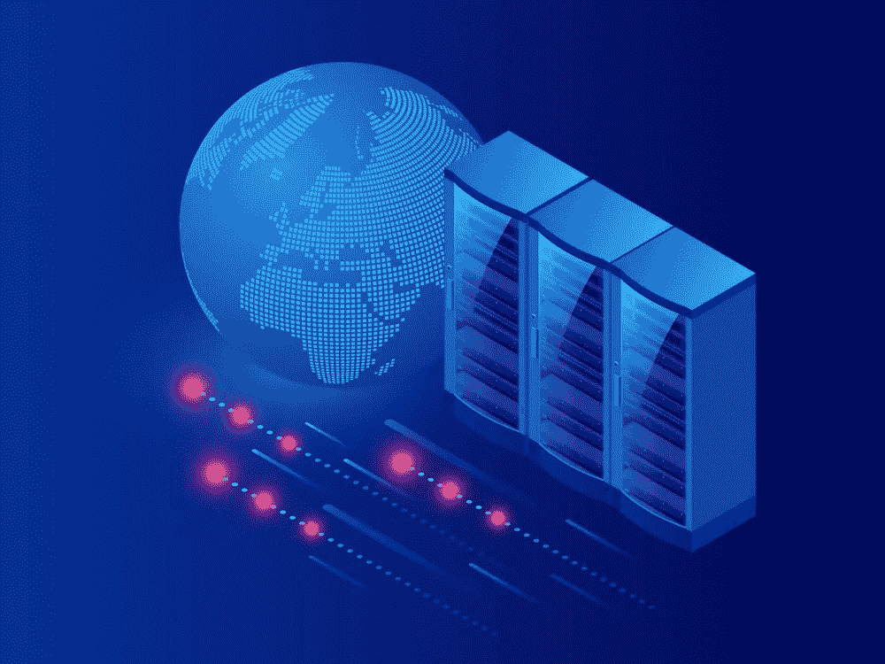

# 医疗保健数据中心中的人工智能

> 原文：<https://pub.towardsai.net/ai-in-healthcare-data-centers-75cf768c9d83?source=collection_archive---------4----------------------->

## [人工智能](https://towardsai.net/p/category/artificial-intelligence)

医疗保健和其他行业的数据量和速度正在以令人难以置信的速度[增长](https://www.statista.com/statistics/871513/worldwide-data-created/)，这主要是由云计算和智能互联设备在全球的扩散所驱动的。这种信息爆炸为组织创造了通过分析改进流程的机会，但也给他们处理所有这些信息的能力带来了巨大挑战。

虽然大数据革命几乎触及了医疗保健领域的每个业务部门，但数据中心受到的影响最大。

事实上，数据生成的这种爆炸式增长给数据中心基础架构带来了巨大的压力，每秒可发生数万次事件(EPS)。在许多情况下，数据太多，人类无法跟上。不仅如此，寻求窃取敏感数据的坏人现在已经将[人工智能(AI)武器化——让首席信息安全官(CISOs)和他们的团队在武器库中没有类似工具的情况下落后一步。](https://cisomag.eccouncil.org/hackers-using-ai/#:~:text=AI%20Weaponization%20by%20Hackers&text=For%20instance%2C%20criminals%20use%20AI,have%20subscribed%20to%20the%20applications.)

这也是几年前甲骨文联合创始人兼首席技术官拉里·埃里森[宣布其公司高度自动化的安全和管理系统](https://www.zdnet.com/article/oracles-larry-ellison-the-way-to-prevent-data-theft-is-more-automation/)的一个重要原因。“防止数据窃取的方法是更多的自动化，”他当时说。“我们需要一个网络防御系统，能够自动检测漏洞，在攻击前修复漏洞，如果有攻击，检测并关闭它。”

随着数据量的增加和安全威胁的成倍增加，AI 在数据中心的价值变得越来越明显。人工智能的重要性如此之大，以至于 Gartner [预测](https://cio.economictimes.indiatimes.com/news/next-gen-technologies/the-increasing-role-of-ai-in-the-data-center/79601042)大约三分之一没有实施人工智能和机器学习(ML)的数据中心最终将在运营或经济上不可行。

## 数据中心中以安全为中心的人工智能应用

虽然这一预测已经有几年的历史了，但人工智能已经在许多方面给许多医疗保健数据中心带来了变化。其中最深刻的是网络安全。AI 补充了安全事件和管理(SEIM)系统和威胁监控，在数据中心快速移动的广阔数据河流中更有效地分析和解析合法威胁和误报——这是在[零信任](https://www.csoonline.com/article/3247848/what-is-zero-trust-a-model-for-more-effective-security.html)时代的一项重要功能。

这也有助于扩大医疗网络安全团队的规模，因为雇佣更多的网络安全专家可能会很昂贵，并且很难实现，这要归功于整个行业有据可查的 It 技能短缺。美国的网络安全专业人士当然不会忽视人工智能在数据中心安全方面的力量，其中 82%的人在 [2018 年的一项调查](https://www.datacenterknowledge.com/machine-learning/ai-s-biggest-impact-data-center-cybersecurity)中表示，他们认为人工智能可以发现否则无法检测到的威胁。同一项调查表明，87%的美国受访者已经将人工智能用于网络安全。

人工智能已经在数据中心的物理安全方面取得了很大进展，最明显的是在两个主要方面:图像/声音识别和异常检测。

*   **图像识别**:数据中心内和周围的视频安全摄像头可以由图像识别人工智能支持，使这些摄像头不仅可以确认某人的身份，还可以确定他们是否携带武器或没有戴面罩
*   **异常检测**:通过在数据基线上训练人工智能系统，团队可以部署人工智能算法来寻找和评估似乎不符合既定模式的事件或指标。*数据中心知识*的 Maria Korolov 举了一个[的例子:如果一辆可疑车辆反复经过数据中心，保安人员会收到通知](https://www.datacenterknowledge.com/machine-learning/how-ai-used-data-center-physical-security-today)

但人工智能的好处远不止物理安全，特别是当网络骗子学会如何通过部署越来越先进的恶意软件来绕过检测规则时。人工智能工具[由网络安全团队在一系列领域使用](https://www2.deloitte.com/content/dam/Deloitte/ca/Documents/risk/ca-en-smart-cyber-pov-aoda.pdf)，包括威胁检测、狩猎和情报；系统安全；身份访问管理(IAM)；治理、风险和法规遵从性；和漏洞管理。人工智能可以提高效率，降低医疗保健组织的成本，部分原因是它的可重复性，减少了人为错误和人工干预的需要。

事实上，德勤最近的“[智能网络](https://www2.deloitte.com/content/dam/Deloitte/ca/Documents/risk/ca-en-smart-cyber-pov-aoda.pdf)”报告称，人工智能工具为医疗保健机构的网络安全团队提供了几个关键优势:

1.  它们通过改进对已知和新出现或未知威胁的检测，补充了现有的安全基础设施
2.  他们的高级检测功能可以发现系统中其他方式无法检测到的危害迹象
3.  他们可以分析大量的数据，甚至超过一个人类专家团队的处理能力，从而提高威胁检测和狩猎能力
4.  它们通过分析各种数据源中的模式和异常情况，实现前瞻性和预测性的安全洞察

除了检测通常可能躲避人类的问题，人工智能支持的网络安全工具还可以在检测到威胁时做出更快的反应。FireMon 的 Josh Mayfield 说，[在一个快速移动和快速变化的数据中心重写防火墙规则就是一个很好的例子。“(人工智能工具)识别数据中心的合规漂移，然后调整并编写新的防火墙规则来将其拉回，”他解释道，并补充说，这种防火墙调整传统上是由人类手动执行的。“他们挑选一个需要在一系列条件下保护的新应用程序，并自动编写加强新应用程序所需的防火墙规则。”](https://www.datacenterknowledge.com/machine-learning/ai-s-biggest-impact-data-center-cybersecurity)

德勤的报告解释说，基于人工智能的网络安全工具(像大多数人工智能应用程序一样)运行着复杂的领域，包括从更基本的、基于规则的自动化脚本到深度学习神经网络和预测人工智能的一切。虽然德勤也表示，更基本的机器人流程自动化(RPA)是当前最流行的应用，但由于预测分析的准确性不断提高，丰富数据的可用性不断增加，以及人工智能技术的成本不断下降，更复杂的数据中心安全应用正在快速发展。

## 数据中心中的运营人工智能应用

人工智能结合传感器数据对于提高医疗保健数据中心的效率和运营也具有不可估量的价值。2016 年，当谷歌的 DeepMind 系统将该公司的数据中心冷却账单减少了 40%，相当于谷歌的电力使用效率(PUE)开销减少了 15%时，其成本节约的潜力[变得非常明显](https://deepmind.com/blog/article/deepmind-ai-reduces-google-data-centre-cooling-bill-40)。事实上，在这一点上，大多数大型技术公司在他们自己的数据中心内使用[人工智能进行电源管理](https://www.forbes.com/sites/cognitiveworld/2019/05/31/exploring-the-impact-of-ai-in-the-data-center/?sh=3edc2c5e67c4)。

AI 和 ML 算法以其他方式帮助数据中心维护和管理，包括性能监控、设备管理、工作负载管理和停机缓解。

**性能监控**

使用 AI 的异常检测和其他功能，可以显著加快和改善主动[监控数据中心性能](https://www.evoquedcs.com/ai-performance-monitoring/)以发现潜在问题。AI 工具可以有效地跟踪冷却装置的电机电流(通过计算基线和监控偏差)，而运营团队不必猜测或依赖第三方信息。这些人工智能系统还可以跟踪外部或内部的温度和湿度等变量，当与 ML 结合时，团队可以超越简单的“工作/不工作”评估，进行更主动的预测性监控。

**工作负载管理和服务器优化**

强化机器学习、预测分析和基于人工智能的负载平衡算法可以通过从过去的数据中学习后更有效地平衡工作负载来提高数据中心的性能。[麻省理工学院的研究人员](https://news.mit.edu/2019/decima-data-processing-0821)最近使用[强化学习](https://www.capestart.com/resources/blog/reinforcement-learning-in-health-care-why-its-important-and-how-it-can-help/)在数千台不同的服务器之间更有效地分配工作负载，系统自动学习调度工作负载的最佳方式(而不是人类编写的算法，后者通常相对不精确)。

**停机和停机缓解**

一个好的数据中心的对立面是长时间的停机时间——然而，传统上，大多数组织都[依赖](https://www.forbes.com/sites/cognitiveworld/2019/05/31/exploring-the-impact-of-ai-in-the-data-center/?sh=3edc2c5e67c4)手动停机时间预测，这一点也不高效。风险很高:数据中心停机[每小时会给](https://www.linesight.com/en-us/insights/artificial-intelligence-for-optimizing-data-centers/)组织造成高达 100 万美元的损失。因为 AI 已经非常擅长性能监控和异常检测，所以它还可以通过将这些数据点与网络拥塞和磁盘利用率数据相结合来帮助减少停机时间。

正如我们所见，AI 和 ML 技术已经对医疗保健数据中心的安全性和性能产生了重大影响。虽然这可以减少 IT 员工的人数，但它也可以让员工扩展自己，从事更有价值的任务，从而发挥力量倍增器的作用。随着人工智能在医疗保健数据中心的效用在未来演变成一个更大的角色，数据中心必须接受它带来的更高的安全性、效率和性能，否则就有可能在竞争激烈的市场中落后。