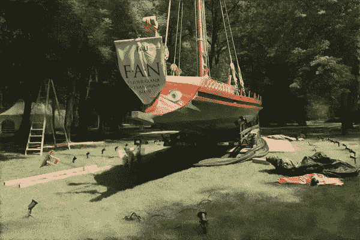
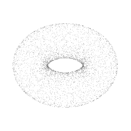
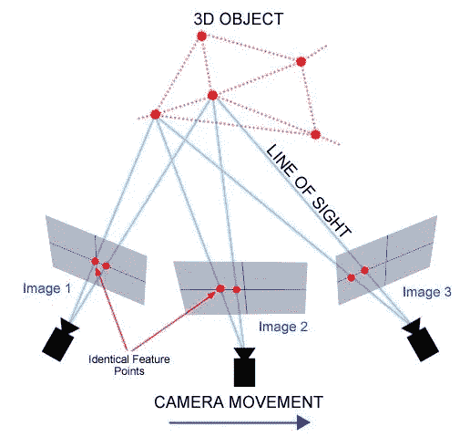
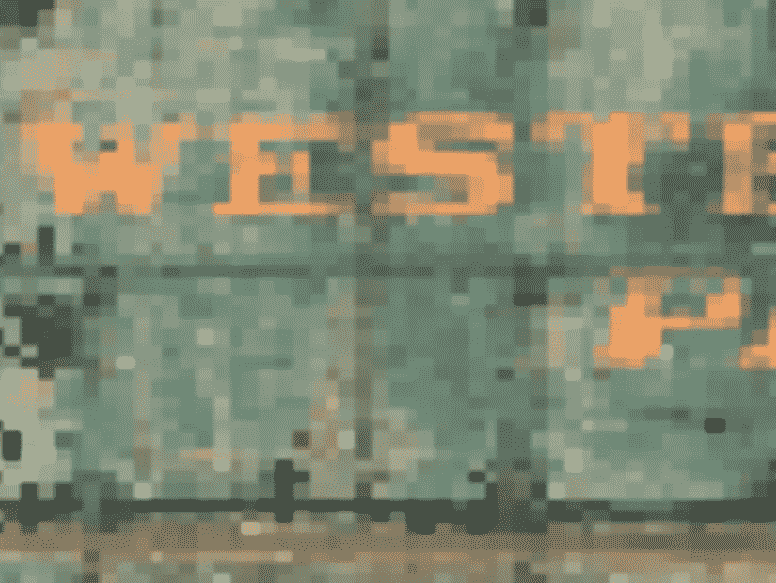
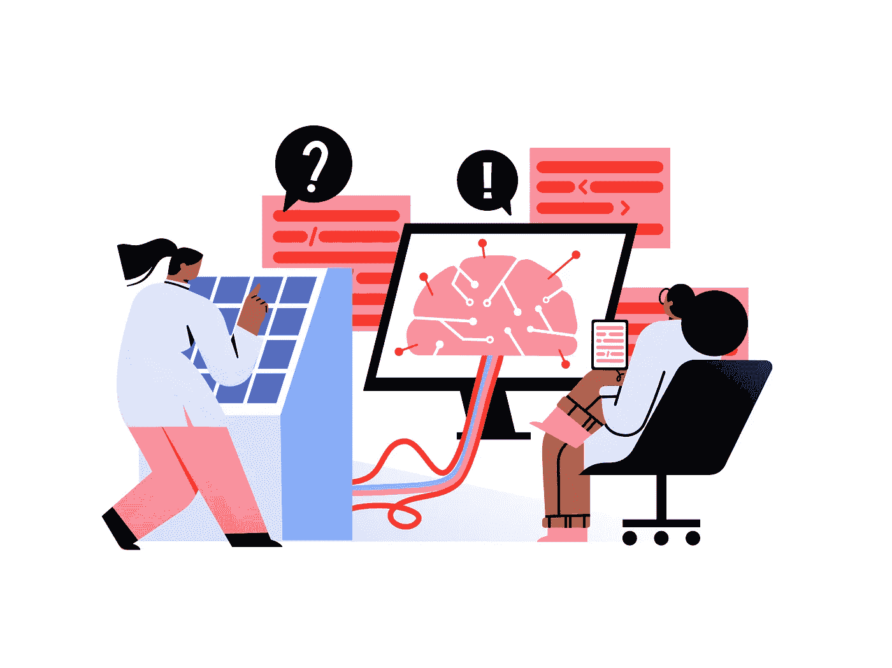

# 人工智能从一对夫妇的图像合成流畅的视频！

> 原文：<https://pub.towardsai.net/ai-synthesizes-smooth-videos-from-a-couple-of-images-aeb288493b3d?source=collection_archive---------2----------------------->

## [人工智能](https://towardsai.net/p/category/artificial-intelligence)

## 让我们从几张照片中构建 3D 模型…

> 原载于 [louisbouchard.ai](https://www.louisbouchard.ai/ai-synthesizes-smooth-videos-from-a-couple-of-images/) ，前两天在[我的博客](https://www.louisbouchard.ai/ai-synthesizes-smooth-videos-from-a-couple-of-images/)上看到的！

结果示例来自 [Rückert，d .等人(2021)，ADOP](https://github.com/darglein/ADOP) 。

## 看视频！

信不信由你，上面看到的其实不是视频。它是由一组简单的照片制作而成，并被转换成一个三维模型！最棒的是，它甚至不需要一千张照片，只需要几张，并且可以在事后创建缺失的信息！正如您所看到的，结果是惊人的，但它们不容易生成，需要的不仅仅是图像作为输入。让我们倒回去一点…

假设您想从拍摄的一堆照片中生成一个 3D 模型。除了使用这些图片，你还需要给它一个点云。

一个[圆环](https://en.wikipedia.org/wiki/Torus)的点云图像。图片来自[维基百科](https://en.wikipedia.org/wiki/Point_cloud)。

点云基本上是 3D 模型的最简单形式。您可以将其视为 3D 模型的草稿版本，由 3D 空间中的稀疏点表示，就像这样。这些点也具有您拍摄的图像中的适当颜色和亮度。使用多张照片对相应的点进行三角测量，以了解它们在 3D 空间中的位置，可以轻松创建点云。

从多个摄像机视图生成点云。图片来自[哈斯金斯学会](https://thehaskinssociety.wildapricot.org/photogrammetry)。

顺便说一句，如果你觉得这很有趣，我邀请你免费关注博客，并通过将这篇文章发送给朋友来分享知识。我相信他们会喜欢的，他们会因为你而感激学到新的东西！如果你没有，不要担心，谢谢你的观看！

三个模块。图片来自[吕克特，d .等人，(2021)，ADOP](https://github.com/darglein/ADOP) 。

首先，你要把你的图像和点云发送到第一个模块，光栅化器。请记住，点云基本上是我们最初的三维重建，我们的初稿。光栅化器将使用图片和点云的相机参数生成 3D 图像的第一个低质量版本。它将基本上试图填补你的初始点云表示中的漏洞，近似颜色和理解深度。

首先渲染质量。图片来自[吕克特，d .等人，(2021)，ADOP](https://github.com/darglein/ADOP) 。

这是一项非常具有挑战性的任务，因为它必须理解没有覆盖所有角度的图像和稀疏点云 3D 表示。由于缺乏信息，它可能无法智能地填充整个 3D 图像，这就是它看起来像这样的原因。

仍然未知的像素被背景所取代，并且这仍然是包含许多伪像的非常低的分辨率。由于它远非完美，这一步是在多个分辨率上进行的，以帮助下一个模块获得更多信息。

第二个模块是神经渲染器。这个神经渲染器只是一个 [U-net，就像我们在我的文章](/this-ai-transform-faces-into-disney-animated-movie-characters-toonify-5225f04da588)中多次提到的那样，将图像作为输入，并生成它的新版本作为输出。它会将各种分辨率的不完整渲染作为图像，理解它们，并以更高的清晰度产生每个图像的新版本来填补漏洞。这将为场景中所有缺失的视点创建高分辨率图像。当然，我说的理解它们，是指两个模块一起训练达到这个目的。这种神经渲染器将产生渲染的 HDR 新图像，或高动态范围图像，其基本上是更逼真的、具有更好照明的 3D 场景的高分辨率图像。HDR 结果基本上看起来像真实世界中的场景图像。这是因为 HDR 图像将具有比传统 jpeg 编码图像更宽的亮度范围，传统 JPEG 编码图像的亮度只能以 255:1 的范围在 8 位上编码，因此如果以类似的格式编码，它看起来不会很好。

第三个也是最后一个模块是色调映射器(Tonemapper ),它引入了更广泛的范围，并学习智能转换以更好地适应 8 位编码。第三个模块的目的是把这些 HDR 小说图像转换成覆盖整个场景的 LDR 图像，也就是我们的最终输出。LDR 图像是低动态范围图像，使用传统图像编码会看起来更好。这个模块基本上学习模仿数码相机的物理镜头和传感器属性，从我们以前的真实世界一样的图像产生类似的输出。

三个模块。图片来自[吕克特，d .等人，(2021)，ADOP](https://github.com/darglein/ADOP) 。

这个算法基本上有四个步骤:
1 .从您的图像创建一个点云，以获得场景的第一个 3D 渲染。
2。使用图像和相机信息尽可能好地填充第一次渲染的缺失。并对不同的图像分辨率这样做。
3。使用 U-Net 中 3D 渲染的各种图像分辨率，为任意视点创建该渲染的高质量 HDR 图像。
4。将 HDR 图像转换为 LDR 图像，以便更好地可视化。

瞧！就像我们在上面链接的视频开始时看到的那样，你有你的令人惊叹的现场视频。正如他们提到的，有一些限制。其中一个事实是，由于显而易见的原因，它们高度依赖于点云的质量。此外，如果相机非常接近一个对象或点云过于稀疏，它可能会在最终渲染中导致像这样的洞。尽管如此，考虑到任务的复杂性，结果还是相当令人难以置信！在过去的一年里，我们取得了巨大的进步！你可以看看[我在不到一年前制作的](/ai-generates-3d-high-resolution-reconstructions-of-people-from-2d-images-introduction-to-pifuhd-d4aa515a482a)涵盖其他神经渲染技术的视频，比较一下结果的质量。太疯狂了！

当然，这只是这篇新论文的概述，它以一种新颖的方式攻击这个超级有趣的任务。我邀请您阅读他们的优秀论文，以获得关于其实现的更多技术细节，并使用预先训练的模型检查他们的 Github 库。两者都在下面的参考文献中链接。非常感谢你看完整篇文章！

## 直接来自[我的时事通讯](http://eepurl.com/huGLT5):由 [Frédérique Godin](https://www.linkedin.com/in/frederiquegodin/) 撰写的《人工智能伦理透视》

> *通常作为伦理反思起点的一个重要问题是“我们应该吗？我们应该做 x，y，z 吗？很明显，要看情况。*
> 
> 观看这段视频时，我首先想到的是:“如果有人类参与会怎么样？“事实上，在这种情况下，生成船只或公园的图像没有什么高风险……除非里面有人。
> 
> 我想在这里强调一点。不是每种模式都适合每种情况。一个看似合理的模型可能导致严重的伦理影响，预见这些可能性的重要任务有时很复杂，需要想象力(和谦逊，但我们可能会在另一个时间谈论这一点)。
> 
> 伦理和技术本质上是交织在一起的。事实上，模型或软件的部分伦理性在于它的技术性。这里一个相关的技术组件是数据。数据是否足够多样化？数据从哪里来？我们有多少数据点？现在，带着这些问题(还有更多)，让我们试着想想如果这个模型被用来生成有人类在其中的图像会发生什么。
> 
> *多样性差的数据集可能会导致生成同质图像，其中仅代表人口的某一部分。这将引发偏见的概念，我们都越来越熟悉，但它也可能改变我们可靠地代表现实的能力。*
> 
> *我的意思是:模型不能产生它没有被训练过的东西，它不知道的东西。现在现实中充满了多样性，而且非常多。如果我们有数量非常有限的多样性很差的数据来推断和生成图像，那么这张深网可能会非常笨拙地“填补这个洞”，这可能会导致对人的有害和歧视性的描述，或者根本没有对少数群体的描述。现在我们不能把人从现实中抹去，因为技术还不存在，这对于没有代表和不道德的人来说是非常无效的。*
> 
> 从更个人的角度来说，我认为我们应该小心我们使用的技术以及它在我们生活中占据的位置。这听起来可能有些牵强，但我对生活在由算法产生的数字化环境中持谨慎态度。这是因为预测不是真理，我担心这将会改变。
> 
> *那么，在这种情况下，我们认为这种模式会被用于对个人有害的方式吗？*
> 
> *显然，是的。因此，当涉及到人类时，我们应该使用这种模型吗？也许不是。*
> 
> *- AI 伦理部分由* [*Frédérique Godin，M. Sc。*](https://www.linkedin.com/in/frederiquegodin/)

如果你喜欢我的工作，并想了解人工智能的最新动态，你绝对应该关注我的其他社交媒体账户( [LinkedIn](https://www.linkedin.com/in/whats-ai/) ， [Twitter](https://twitter.com/Whats_AI) )，并订阅我的每周人工智能 [**简讯**](http://eepurl.com/huGLT5) ！

## 支持我:

*   支持我的最好方式是成为这个网站的成员，或者如果你喜欢视频格式，在 **YouTube** 上订阅我的频道。
*   跟着我上 [**中**](https://whats-ai.medium.com/)
*   想进 AI 或者提升技能，[看这个](https://www.louisbouchard.ai/learnai/)！

## 参考

*   吕克特博士、弗兰克博士和斯塔明格博士，2021 年。ADOP:近似可微分单像素点渲染。[https://arxiv.org/pdf/2110.06635.pdf](https://arxiv.org/pdf/2110.06635.pdf)。
*   代号:[https://github.com/darglein/ADOP](https://github.com/darglein/ADOP)