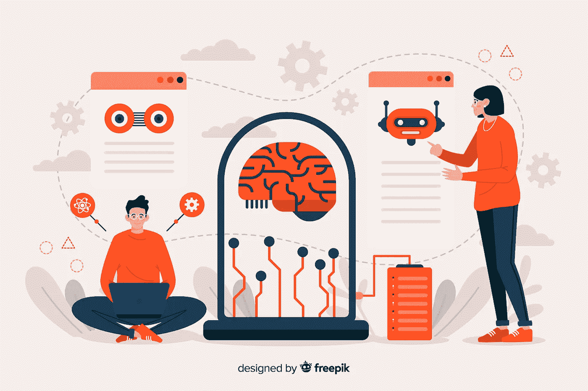

# AIOPS

> 原文：<https://pub.towardsai.net/aiops-a3ea0f04e882?source=collection_archive---------5----------------------->

新兴 IT 实践的人工智能操作[图片由 Freepik 提供>

[AIOps](https://www.gartner.com/smarterwithgartner/12-steps-to-excellence-in-artificial-intelligence-for-it-operations-infographic) 是一种新兴的 IT 实践，它将分析和机器学习应用于 IT 运营，能够缩短 MTTR[平均响应时间]、进行预测性分析和主动性能监控，并为更快的决策提供可操作的见解。除了提高 it 运营效率，AIOps 解决方案还可以为 IT 和业务带来变革性的好处，因为它被定义为下一代任务控制和指挥中心，为许多 IT 和业务运营提供预测智能。此外，将敏捷性放在核心位置的组织或初创公司将要求其 IT 运营具有高度的短暂性。AIOps 的实现使现代平台能够捕获多维数据流，如应用操作、DevOps、安全操作、基础设施操作和服务管理。因此，企业能够更加高效和有效地运营，这是当今许多组织的关键。

# 早期采用者

根据来自 IDC 的[研究，拥有 250-1000 名员工的中型企业在采用人工智能方面最为积极。此外，据预测，75%的全球 it 组织将采用自动化运营，以支持即时运营和空前规模的数据激增。此外，疫情强调了对每个行业实施 AIOps 的重要性，特别是在一定程度上。金融服务、零售、媒体和医疗保健正在推动对 AIOps 采用的需求，因为现在需要在所有客户体验平台上提供数据。](https://www.idc.com/getdoc.jsp?containerId=AP47369121)

特别是 APAC 地区，它是众多行业的领导者，如呼叫中心、制造、客户服务和金融服务。为了在这些领域保持领先地位，安全数据必须随处可用，自动化必须被视为一流学科。采用运营有助于创造效率，并将平台与人才聚集在一起。随着下一阶段从云计算转向边缘计算，AIOps 用例也将在未来跨越所有行业。AIOps 的早期用例包括预测分析、异常检测、智能警报、自然语言处理[NLP]和相关性/群组分析，以客户体验 KPI 的形式提供即时效益和量化指标。

# 神话和误解

在当今世界，虽然许多 IT 领导者都在考虑实施 AIOps 以实现主动的性能方法，但他们也必须考虑采用 AIOps 带来的挑战，例如拥抱新的业务流程、掌握新的技能以及将更新的平台集成到企业系统中。然而，对于 AIOps，有一些常见的误解:

*   通过实现 AIOps，机器可以做出自主决策。

它使人类能够通过检测异常、突出模式/趋势并可能找到根本原因来更快地解释数据。让机器做出自主决策还有很长的路要走，因为它需要在可观察性、自动补救和工作流自动化方面取得进展。

*   在 AIOps 中，人类被机器人取代来完成业务流程

只有通过消除平凡、重复的任务和处理常规的日常任务，机器人才能产生影响——旨在增强人类的能力，使他们能够以更高的效率和创造力将注意力转移到更高价值的任务上。

*   AIOps 用于大规模操作

AIOps 解决方案使用定义良好的系统和框架，从头到尾帮助构建支持人工智能的产品线。无论规模大小，它都能实现业务敏捷性、上市时间以及从产品构思到应用程序生产的所有功能的共享服务。

# AIOps 的优势

通过实施 AIOps，我们可以主动预防故障并在问题发生前解决问题。数据、人员、过程、产品和平台都应该是一个组织的 AIOps 策略的一部分，以使其充分受益。该战略还应涵盖三个关键领域:

*   规模和人工智能治理的组织能力
*   生命周期管理的运营能力
*   面向技术进步的分析平台现代化

由于 AIOps 是数据驱动的，它需要将组织范围内的数据吸收到一个中央数据湖平台中。例如，为了分析停机，必须引入来自应用程序、网络、计算和安全的数据来创建可追溯性。此外，在整个组织中，利益相关者需要了解转型流程、数据驱动的思维模式、作为推动者的 AIOps 以及提升技能的路线图，以便清楚地了解不同部门和个人之间的交响乐。实施策略应该从识别高价值的、不太复杂的和不太费力的问题陈述开始，并带有持续改进的路线图。

# 下一个 AIOps

据 Insight Partner 称，从 2021 年到 2028 年，AIOps 市场预计将以 32.2%的 CAGR 增长。在当今世界，AIOps 主要关注检测、根本原因分析和建议。未来的 AIOps 解决方案将侧重于数据结构，如具有自动化、沿袭、安全、治理和访问的数据，以及可观测性、边缘计算和超自动化。

这将为可操作的人工智能洞察力铺平道路，通过可解释性降低风险，并扩展运营以支持业务敏捷性。