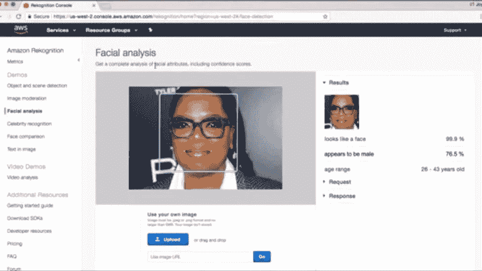
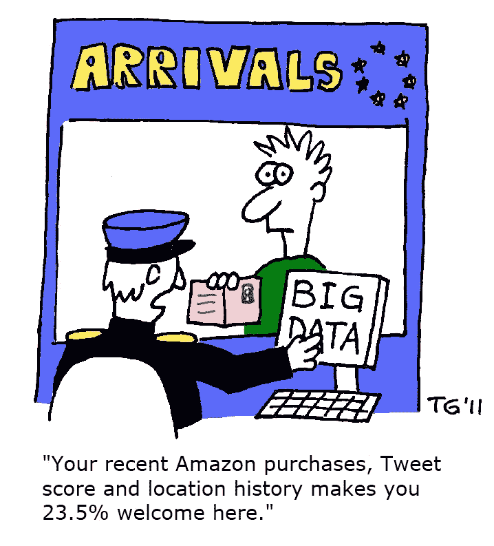
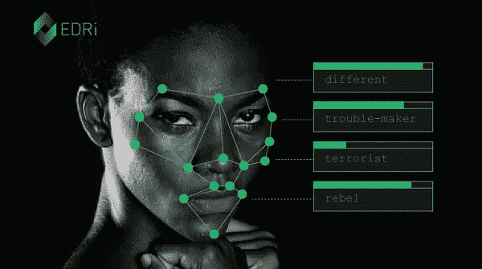
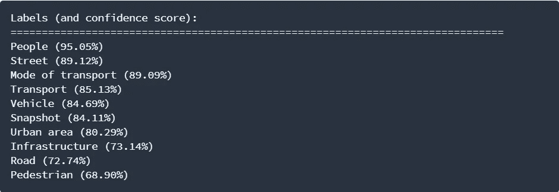
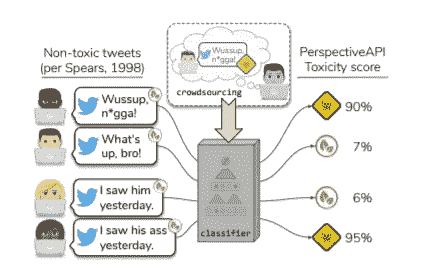
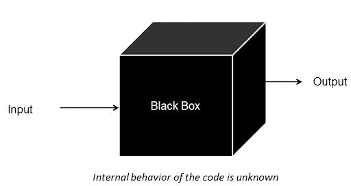

# 算法压迫:有偏见的机器以及在哪里找到它们

> 原文：<https://pub.towardsai.net/algorithmic-oppression-biased-machines-and-where-to-find-them-70032172ee3d?source=collection_archive---------1----------------------->

## [公平，](https://towardsai.net/p/category/artificial-intelligence/fairness) [伦理](https://towardsai.net/p/category/ethics)

最近执法部门和[医疗保健行业的种族歧视事件向我们展示了人类是多么的偏见和种族歧视。统治这些机构的系统性种族主义是显而易见的，从警察对黑人的暴行到疫情期间医院拒绝治疗黑人病人。我们都知道无数**无辜**黑人被警察盯上并杀害的故事。例如，在医疗保健行业，黑人患者的疼痛通常没有白人患者那么严重。所有这些系统的失败都是由于人类有意识或无意识的种族偏见。](https://www.theguardian.com/commentisfree/2020/may/04/racism-us-healthcare-coronavirus-african-americans)

与人类决策过程相比，计算机通常被认为不那么有偏见。考虑到这一点，人工智能算法为更平等的机构和更少的偏见提供了一个有吸引力的机会。换句话说，人工智能可能允许机构在其决策中包括对数据的准确处理。人工智能的应用范围广泛，从执法机构的面部识别到预测哪些病人应该在卫生机构获得额外的医疗护理。

> 但是……我们的算法公平吗？

让我们看看。

认为算法是客观或无偏见的想法是危险的。这是一个危险的问题，因为它可以在客观的面纱后面掩盖系统性的歧视(种族主义、性别歧视，等等)。这样一来，揭露和反对歧视就更加困难了。其次，基于人工智能的决策将决策的责任从人类手中夺走。基于算法决策过程让个人对他们的歧视行为负责几乎是不可能的。最后，这些算法通常是有利润的公司的知识产权，而不是边缘化公民的福祉作为他们议程上的优先事项。

## **什么是算法？**

让我们介绍一些人工智能算法如何工作的一些基础知识。这将使你更容易理解文章的其余部分。

把算法想象成计算机的烹饪食谱。它们是计算机完成一项任务需要采取的具体步骤。这些步骤通常是需要由计算机执行的一组操作。因为计算机非常“狭隘”，不喜欢给它们宽泛、开放的指令，所以算法必须由非常简单、直接的步骤组成。计算机会逐字逐句地阅读并采取这些步骤。简而言之，算法是任何计算机程序的组成部分。例如，让我们拿你的常规地图程序来说，假设你想让你的手机带你去自动取款机。当你在搜索栏中键入“ATM”时，手机上的地图程序(app)会使用一种算法来访问你的位置，并找到附近的所有 ATM。当你选择你想去的 ATM 机时，应用程序会使用一种算法来计算到达目的地的可能路线。然后，为了选择特定的路线，它使用其他算法来检查交通，估计到达时间，查看像你这样的人以前走过的路线等。完成这些步骤后，应用程序会使用最终算法，根据之前算法提供的信息，决定哪条路线最适合您。

## 好吧…那 AI 是什么？

近年来，我们已经改进了一些算法，以至于它们比大多数人(如果不是所有人)做得更好。以 [AlphaGo](https://deepmind.com/research/case-studies/alphago-the-story-so-far) 为例，一个打败了围棋世界冠军的计算机程序，可以说是有史以来最好的围棋选手。有许多不同的算法属于 AI(人工智能)的范畴，但一般来说，任何可以执行通常由人类执行的任务，并随着时间的推移自我改进的程序都可以被认为是 AI。机器和深度学习(ML & DL)算法使人工智能更进了一步，算法能够处理和学习海量数据集。这些算法是强大的工具，可以根据大量信息提供见解并做出准确的决策。这是人脑做不到的。人工智能有几个值得注意的应用。其中一些你可能已经遇到过:

*   计算机视觉——自动驾驶汽车、面部识别程序、图像识别等中使用的算法。
*   文本人工智能——语音和文本识别、语音到文本转换等。
*   分析型人工智能——风险或需求评估算法、情绪分析(基于行为和文本数据对情绪进行解释和分类)等。
*   交互式人工智能——聊天机器人、个人助理(Siri、Alexa……)等。

如你所见，基于人工智能的算法就在我们身边。有人可能会说，有些是我们现代世界的基石。因此，它们对我们的日常生活有着巨大的影响力。

那么，基于人工智能的算法正在为我们做出哪些决定呢？这些决定是如何产生偏差的？

图片作者:Thierry Gregorius(漫画:大数据)

# 有偏差的机器以及在哪里可以找到它们

## **执法**

人工智能在执法中有许多含义。计算机视觉算法可用于罪犯的面部识别，监控公共区域，以及预测/检测可疑行为，或在拥挤的地方识别持有枪支或冷兵器的人。分析型人工智能可以帮助评估罪犯再次犯罪的风险或分析证据。

乍一看，这些应用似乎都是雄心勃勃和高尚的追求，然而，最近的案例表明，它们只是执法机构中系统性种族主义的延伸。

**解析人工智能**

[COMPAS](https://en.wikipedia.org/wiki/COMPAS_(software)#:~:text=COMPAS%2C%20an%20acronym%20for%20Correctional,a%20defendant%20becoming%20a%20recidivist.) (替代性制裁的矫正罪犯管理概况)是美国法院使用的决策支持工具。COMPAS 使用算法来评估被告再次犯罪的风险。这些算法使用一份问卷和关于被告的多个其他数据条目来计算再犯风险。在大范围内，该算法做出的预测被证明是相当准确的。嗯……除了一部分。这个算法被证明是有种族偏见的。

ProPublica 是一家调查性新闻编辑室，它对 COMPAS 进行了彻底的研究。当来自白人和黑人被告的数据在他们的研究中进行比较时，结果显示黑人被告被错误归类的可能性是累犯的两倍。另一方面，白人惯犯被错误地归类为“安全”(不太可能再犯)，是黑人惯犯的两倍。

这是他们发现的一个例子:

> 暴力累犯分析还显示，即使控制了先前的犯罪、未来的累犯、年龄和性别，黑人被告比白人被告被分配更高风险分数的可能性高出 77%。

COMPAS 的分析结果显示了美国司法系统和执法部门的一个严峻传统。如果你是黑人，你更有可能被'*'错误'*定罪，被归类为潜在的惯犯，或者被警察杀死。系统性的种族主义在我们的机构中根深蒂固。COMPAS 已经证明了这种偏见是如此之深，以至于即使是机器也有种族偏见在其中蔓延。

**计算机视觉**

面部识别、图像标记和识别算法可用于保护财产和公共安全。例如，使用面部识别，执法机构可以使用公共摄像机来识别和跟踪特定感兴趣的人(例如，可疑的恐怖分子、罪犯等)的移动。).通过图像标记和识别，他们可以进一步跟踪自己的行动。例如，图像识别算法可以检测到相关人员手中可能的武器或炸弹制造材料。

也就是说，这些技术成倍地增强了监控的能力。令人担忧的是，这些可以用来保护我们安全的技术也可以用来控制我们。

尽管如此，让我们关注这些技术的积极应用——保护我们的安全。他们会平等地保护我们吗？还是少数种族会为了所有人的舒适和安全承受残酷的后果？

***面部识别***

面部识别有两种常见的应用。一对一匹配，即将一个人的面部与数据库中同一个人的照片进行匹配。以及一对多匹配，确定人脸在数据库中是否有匹配。前者可用作在边境检查护照的工具，后者可用于在调查中识别嫌疑人，在公共场所使用摄像机从人群中挑出罪犯或嫌疑人等。

美国[国家标准与技术研究所(NIST)](http://nist.gov) ，测试了基于一对一和一对多匹配的多种(近 200 种)面部识别算法。这项研究的结论是，大多数面部识别系统在非白人的脸上表现不佳。以下是一些主要发现:

*   对于一对一的匹配，大多数系统对非裔美国人的错误率高于白人(从 10 到 100 不等)。这意味着一些面部识别系统有 100 倍的可能错误地找到一个非裔美国人的脸，而实际上并没有。
*   美国开发的一对一算法对非洲裔美国人、亚洲人和美洲土著人的人脸的误报率一直很高。这些算法在美洲土著人的脸上表现最差。
*   对于一对多匹配，假阳性率最高的是非裔美国女性。

为什么这很重要？

嗯……这些研究基本上表明这些计算机视觉算法包含了种族偏见。在第一种情况下，这可能会造成边境巡逻的歧视。例如，在非洲人和美洲原住民的情况下，护照控制系统的假阳性增加可能会导致这些群体的个人成为频繁“随机检查”的对象，就像中东背景的人在 911 事件后一样。这种种族偏见也可能导致这些群体的个人拥有的企业和设备不太安全，更容易被获取。

更关心的情况是一对多匹配算法的错误。这里的结果表明非裔美国人，尤其是非裔美国女性的假阳性。这使得这些人面临最高的错误刑事指控和错误逮捕的风险。这些歧视性的算法，再加上执法机构已经开始的反黑行为，只会导致更多的不公平和流血。

图片来源:[欧洲数字版权(EDRi)](https://edri.org/facial-recognition-document-pool/)

只是附带说明一下:

计算机视觉算法中的种族偏见令人担忧。然而，这只是工作的一半。这些算法是强大的工具，可以导致 1984 年式的监视警察国家。所以我们应该对这些技术的应用更加谨慎和怀疑。

***图像识别和标注***

图像识别和标记算法查看照片，并识别和标记照片中的对象。最常用的图像标注程序之一是[谷歌的云视觉 AI](https://cloud.google.com/vision) 。这个工具太神奇了。例如，下面是 Google 的 vision API 在随机显示一张图片时的输出。

> 输入(图像):

> 输出:

很酷的东西！

嗯…没那么快。事实证明，这个算法也是种族主义的。在一个由[*algorithm watch*](http://algorithmwatch.org)*更具体地说是由 [Nicolas Kayser-Bril](https://twitter.com/nicolaskb) 进行的非常著名的实验中，谷歌视觉将一只深色皮肤的手里的温度计误标为枪。同样的图像，同样的物体，只是用一只浅肤色的手，就被贴上了“工具”或“单眼”的标签。*

**

*来源:[算法观察](https://algorithmwatch.org/en/story/google-vision-racism/)*

*谷歌解决了这个问题并道歉，但人们不禁要问，这种种族偏见的案例到底有多少。*

*为什么这个案子很重要？*

*想象一下这些计算机视觉算法被用于执法的情况。使用放置在公共场所(如商场)的摄像头，一种算法将一个无辜的黑人个体与犯罪数据库中的某个人进行匹配。另一种算法将他们手中刚买的吹风机误认为是枪。你可以自己完成剩下的故事。通常情况下，加上人类已经存在的种族偏见，这个故事以另一个无辜的黑人被警察杀害或残酷伤害而告终。*

## *卫生保健*

*人工智能在生物信息学等医学领域有许多革命性的应用，但现在，让我们专注于医疗保健的管理和社会方面。在医疗保健领域，分析型人工智能通常用于计算患者的某些健康风险，或确定患者是否需要医护人员的额外关注。通过这种方式，该算法允许将资源和人员转移到需要的地方，并成功地管理时间和资源，以改善对患者的护理并降低成本。*

*我猜你不会对这一点感到惊讶，但事实证明其中一些算法也有种族偏见。2019 年，[发表在《科学》](https://pubmed.ncbi.nlm.nih.gov/31649194/)上的一项研究分析了美国医院使用的流行决策软件之一。分析表明，这个软件一直在系统地歧视黑人患者。事实上，与同样患病的白人患者相比，该软件给黑人患者的风险评分更低。因此，黑人患者不太可能得到个性化的护理。使用这种算法，提供给黑人的医疗费用比有类似健康问题的白人少 1800 美元。另一个有趣的发现是，被算法分配了“额外护理”的病人中只有 18%是黑人。如果算法是无偏的，这个数字应该在 47%左右。*

*该算法的制造商保持匿名。然而，Obermeyer 和他的团队正在与他们合作，以改善该计划，减少偏见。*

## *公共生活和媒体*

*推特、脸书、Youtube，我猜还有整个互联网，都充斥着攻击性的仇恨言论。令人欣慰的是，许多社交媒体公司正在积极开发人工智能模型，[可以有效地检测和标记仇恨言论，因此它得到了快速处理](https://www.thedrum.com/news/2017/08/01/youtube-says-ai-better-humans-removing-extremist-videos-post-brand-safety-crisis)。这些公司使用的技术是使用自然语言处理的算法。*

**

*资料来源: [Sap (2019)](https://www.aclweb.org/anthology/P19-1163.pdf)*

*具有讽刺意味的是，这些旨在消除网上仇恨言论和种族歧视的算法最终放大了种族偏见。例如，Maarteen Sap 和他的同事研究了 [PerspectiveAPI](https://www.perspectiveapi.com/#/home) 。谷歌开发的一个机器学习程序，用于检测和标记在线仇恨言论。Sap 在一个有数千条推文的数据库上运行这个程序，并在检测仇恨言论时寻找种族偏见。不出所料，他发现黑人的推文被贴上攻击性标签的可能性是普通人的两倍。这是由于这些算法不考虑特定的上下文，并且不将作者的方言和种族作为决定因素。换句话说，这些算法是基于标准英语训练的，并且通常方言，如非裔美国人英语(AAE)受到歧视。*

*这只是 AAE 被标记和黑人社交媒体用户因用自己的方言表达而被禁止的众多例子之一。例如，请看[Mary Canty Merrill](https://www.revealnews.org/article/how-activists-of-color-lose-battles-against-facebooks-moderator-army/)的案例，她在脸书的一些帖子中讨论了种族主义，结果她的个人资料被禁，第二天她的帖子被删除。然后她给她的一些白人朋友发了同样的被禁短信。当他们发布文本时，脸书允许这些内容出现在他们的平台上。*

*这些案例值得关注，因为它们在系统性压制网上黑人声音方面发挥了作用。此外，将非裔美国人的英语视为攻击性的并加以限制，可能会导致不必要的文化同化和标准(白人，中产阶级)英语在公共讨论平台上的主导地位。*

*这些只是算法种族歧视的一些例子。这也发生在用于学校招生、就业、银行贷款等的算法中。通常，算法中的偏见有很多层面:性别、性取向、种族、社会经济地位…*

# *为什么会这样？*

*这些算法的开发者不是故意在这些算法中安装种族偏见的卑鄙小人。显然，人类容易出错，这是算法偏差问题的一部分，但还有其他一些原因。让我们看看种族偏见是如何渗入算法的。*

***你吃什么就是什么——数据***

*使用机器和深度学习的人工智能算法是在数据上训练的。换句话说，算法通过使用作为“训练集”提供给它们的数据来学习如何完成某项任务。解释为什么一些算法有种族偏见的一个简单方法是看数据。例如，如果一个算法使用美国刑事司法系统的数据，那么它有种族偏见就不足为奇了。*

> *这就像我们经常对人们说的一句话:“你吃什么就是什么”。机器学习算法也一样。如果你用带有种族偏见的数据训练他们，他们会变成种族主义者。*

*偏见可以通过两种方式渗入数据:如果训练数据不代表真实情况，或者如果数据已经存在偏见。在第一个例子中，某个群体可能在数据中被歪曲或完全忽略。例如，如果人脸识别算法在训练数据集中主要是白人男性的脸，它当然会与黑人女性的脸进行斗争。在第二种情况下，数据本身可能已损坏。例如，如果通过美国司法系统向算法提供监禁数据集，该算法将反映导致黑人男性大规模监禁的系统性种族主义。一个类似的例子可以出现在用于雇用和审计求职者的算法中。如果该算法使用以前的雇佣数据，而这些数据主要是白人男性受到青睐，那么它可能会不合理地解雇女性或黑人男性。*

*数据似乎是问题的一大块，然而，这只是开始。有些问题甚至在收集数据之前就出现了。*

***这不全是数据，还有些设计***

*不仅仅是数据有偏差，在构建这些算法的过程中，一开始就存在种族偏见。在设计中。开发人员在创建算法时做的第一件事就是决定算法的目标是什么。算法的目标和任务是不同的。例如，导航算法(如谷歌地图)的目标是找到从 A 点到 b 点的“最佳”路线。什么是“最佳路线”，就是定义任务的内容。所以目标可能是为你找到到达一个地方的最快的方法，或者距离最短的方法，或者最经济的方法。显然，在这种情况下，决定什么是最佳路线可以很容易地留给用户的偏好。然而，开发者通常不能将这个决定转移给用户。目标必须转换成可以计算的东西。在私人营利性公司中，这一目标通常是利润最大化或客户满意度最大化。例如，如果一家医疗保健公司的资源管理软件旨在实现利润最大化，并且如果它认为削弱黑人患者疾病的严重性并为黑人患者提供更少的资源是实现利润最大化的一种方式，那么它最终将系统性地歧视黑人患者。*

*一个非常著名的例子是 Selbst 和 Barocas 提出的“信用度”例子。如果一个算法被设计来计算“信用度”以实现利润最大化，它最终会陷入一些粗略的非法贷款行为(掠夺性贷款和次级贷款)。*

*所以…即使在假设的(不可能的)情况下，我们的数据没有偏差，算法试图解决的目标/问题的设计可能以一种有问题的方式制定，并延续歧视或不道德的做法。*

*嗯……如果问题出在数据和设计上，我们为什么不改进呢？*

***黑盒——透明***

*我(我们大多数人)如何发现算法中的这些偏见，是通过研究人员的工作，或者只是人们通过简单的比较来揭露不公平的算法结果。这两种情况都极其罕见。它们很少见，因为这个领域缺乏透明度。*

**

*来源:[人工智能狂热](http://artificialintelligencemania.com/2019/01/10/the-black-box-problem/)*

*算法通常是私人公司的财产。因此，他们如何工作，使用了什么数据，通常是保密的。通常，[它们本质上是黑盒机器](https://heinonline.org/HOL/LandingPage?handle=hein.journals/uflr69&div=9&id=&page=)，我们看不到内部工作，但我们只能看到它产生的结果。因为研究人员只能获得结果，他们很难研究这些算法，找出偏差所在，并改善他们的偏差。这是因为这些算法的创造者不想让外人接触到它们。主要是因为这将对他们的利润构成威胁(例如，算法可能被竞争对手破坏或复制，严厉的公众批评等)。).但是，如果我们无法获得这些影响我们的算法，我们如何测试它们并改善它们的偏差？*

***问责***

*为了识别偏见和改进算法，向公司寻求透明度是重要的一步。*

> *然而，如果我们想在人工智能领域实现真正的反偏见变革，我们应该向那些开发和应用种族偏见算法的人追究责任。*

*既然我们已经知道“完全无偏”的算法并不存在，我们就不应该因为公司创造了有偏见的算法而惩罚他们。相反，我们应该要求他们提供一致性偏差测试的证据，使用“无偏见”的数据(尽可能多)，并对算法的不断改进负责。通过改进算法，我不是指算法的速度或功能的改进，而是不断追求使它们更少偏差。*

*换句话说，我们必须推动让公司对其算法负责的政策。我们必须推动对偏见的检查，第三方审计员和评估员，对算法如何在不同人口统计数据下工作的测试，以及共享和质疑用于训练和测试算法的数据。*

# *你/我们能做什么？*

*现在，你一定有点不知所措，甚至可能感到沮丧，满怀希望地问自己:我能做些什么来改变这种情况？*

*就像任何形式的歧视一样，算法歧视，尤其是当它的系统性难以消除和“修复”时。这是一个需要从多个角度同时着手的过程。好消息是，已经有许多聪明的人工智能研究人员、开发人员和活动家在研究这个问题。为算法公平而战可以从多个角度展开:通过研究和改进、立法和政策、包容和讨论。*

***研究和改进***

*在对抗算法偏见的最前线的是我们的研究人员。他们挑选算法，检查偏差，提出改进建议，并推动问题向前发展。在这个领域你能提供什么帮助？*

*嗯…如果你是一名研究人员，继续做你正在做的事情。你真棒！*

*如果你不是研究人员，但你感兴趣，你可以参加一个在线课程来熟悉这个主题。然后，你可以开始摆弄你发现的一些有趣算法的结果，看看是否有偏见的嫌疑。如果有的话，再深入挖掘一下，向其他研究人员寻求帮助，联系创造者，分享你的发现。通常，算法是由用户在上面做实验而暴露出来的。*

*例如， [Joy Buolamwini](https://twitter.com/jovialjoy) 揭露了歧视黑人女性的种族主义面部识别算法。她还制作了一个关于这个话题的[感人视频。](https://www.youtube.com/watch?v=QxuyfWoVV98)*

*如果你想帮助研究人员，你也可以通过参与他们的研究或捐款支持他们的努力来支持他们。例如，一个你可以捐赠、支持和关注的研究非营利组织是 [AlgorithmWatch](https://algorithmwatch.org/en/donate/) 。*

***立法和政策***

*为了让公司和机构负起责任，并寻求透明度，我们需要适当的人工智能立法。我们需要立法机构和政策将人民的最佳利益放在心上，尽量减少偏见，促进更公平的结果和人工智能的社会责任方面。好消息是，一些政策制定者和代表已经开始工作，并提出了我们可以支持和影响的法案、政策和法律。*

*如果您是美国公民，那么您可以就这些法律联系您的代表:*

*   *[H . r . 2231-2019 年算法问责法案](https://www.congress.gov/bill/116th-congress/house-bill/2231?q=%7B%22search%22%3A%5B%22Algorithm%22%5D%7D&r=3&s=1)-该法案将要求公司检查其人工智能系统的偏见*

*面部识别:*

*   *[s . 2878:2019 年面部识别技术授权法案](https://www.govtrack.us/congress/bills/116/s2878)*
*   *[H.R. 3875:禁止将联邦资金用于购买或使用面部识别技术以及其他目的。](https://www.govtrack.us/congress/bills/116/hr3875)*
*   *[s . 847:2019 年商业面部识别隐私法案](https://www.govtrack.us/congress/bills/116/s847)*

*你也可以联系你的国会议员来提高对这些问题的认识。[这是《纽约客》关于联系你的代表的“指南”。可能还有其他我不知道的定律，如果你知道一些，请让我知道，我会把它们加在这里。](http://newyorker.com/magazine/2017/03/06/what-calling-congress-achieves)*

*如果你是欧盟的公民，你可以对欧洲人工智能白皮书发表意见。去[这个链接](https://ec.europa.eu/digital-single-market/en/news/white-paper-artificial-intelligence-european-approach-excellence-and-trust)做吧。*

*这些只是我所知道的几个例子。如果你有更多的这些，请随时联系我，我可以在这里添加它们。确保你自己做了与你的社区和国家相关的研究。*

***内含物***

*人工智能行业的一个问题是，该领域的大多数人是白人男性。女性和有色人种在该行业的代表性不足，导致他们所关注的问题代表性不足。这使得人工智能算法对这些人口统计数据产生了不成比例的负面影响。在人工智能中，我们应该为两种类型的包容或者更确切地说是代表而奋斗。*

*   *在人工智能的设计、开发和管理过程中，女性和有色人种(最好两者都有)的代表。在谷歌和脸书这样的大型科技公司里，不到 2%的员工是黑人*
*   *这些组在数据中的表示。
    例如在 [Buolamwini](https://twitter.com/jovialjoy) ，[发现的一个样本数据集中，只有 25%的个体是男性，而超过 80%的个体是浅色皮肤。](https://www.media.mit.edu/publications/full-gender-shades-thesis-17/)*

*这也不仅仅是将被边缘化的人作为开发人员或工程师。科技公司应该雇佣拥有文科(社会科学和人文科学)学位的人。这些人应该与工程师合作。我们期望工程师像研究批判理论的人一样了解社会、种族和性别偏见，这是不公平的。*

*您可以支持促进边缘群体参与科技的计划和项目。具体来说，对于 AI 领域，可以支持:*

*   *[算法正义联盟](https://www.ajlunited.org/)*
*   *[AI 中的黑色](https://blackinai.github.io/)*
*   *[AI4ALL](https://ai-4-all.org/)*

***讨论和认知***

*互相教育，讲故事，通过建设性的对话分享我们的观点和情感是我们改变的最有力的工具之一。技术和政策的变化可以改善人工智能，使它更有偏见，但艺术和对话告诉我们为什么这很重要，它们表明边缘化人群的经历很重要。通过对话，我们可以挑战现有的系统性压迫，分享彼此的故事和情感，相互激励，促进变革。这里的教育极其重要，而且是双向的。一方面，开发者和有人工智能背景的人应该让自己了解他们工作的道德和社会含义。另一方面，社会科学和人文学科的人、批判理论家和活动家应该自学算法的基础知识，它们是如何工作的，它们是如何构建和应用的。只有通过教育，我们才能相互理解，并导致建设性的、变革的、鼓舞人心的对话。*

# ***教育自己和他人的资源、要追随的人和要支持的组织的简短列表***

*这个列表是我非常熟悉的资源、组织和人员。外面还有很多。探索！*

*阅读/观看内容:*

1.  *[*种族技术后废奴主义者的工具《新吉姆法典》*](https://politybooks.com/bookdetail/?isbn=9781509526390) 作者茹哈·本雅明*
2.  *Joy Buolamwini 硕士论文: [*性别阴影:人脸数据集和性别分类器的交叉表型和人口统计学评价*](https://www.media.mit.edu/publications/full-gender-shades-thesis-17/)*
3.  *搜索引擎如何强化种族主义*
4.  *蕾切尔·托马斯的演讲*
5.  **[人工智能的多样性危机，2017 年版](https://www.fast.ai/2017/08/16/diversity-crisis/)雷切尔·托马斯为 fast.ai 撰写**
6.  **[*数据种族主义:一个新的前沿*](https://www.enar-eu.org/Data-racism-a-new-frontier) 作者莎拉·钱德尔——这是一篇更关注欧洲的文章**
7.  **《揭露机器学习中的偏见》,作者 Ayodele odu Bela——这本书将于明年秋天出版，你可以在这里注册预订通知。**

**要支持的组织:**

1.  **算法正义联盟——他们展示了一些你可以帮助他们的方法，所以一定要去看看他们的网站**
2.  **[AI 黑](https://blackinai.github.io/)—Twitter 上的 AI 黑—关注包容性**
3.  **[算法观察](https://algorithmwatch.org/en/) —研究聚焦**
4.  **[人工智能为民](https://www.aiforpeople.org/) —政策聚焦**
5.  **[AI4ALL](https://ai-4-all.org/) —关注包容性**
6.  **[数字自由基金会](https://digitalfreedomfund.org/)——一个总部位于欧洲的通用数字权利组织**

**关注的人:**

1.  **[乔伊·波伦维尼](https://twitter.com/jovialjoy)**
2.  **鲁哈·本杰明**
3.  **[萨菲亚团结贵族](https://twitter.com/safiyanoble)**
4.  **[费-李非](https://twitter.com/drfeifei)**
5.  **[纳尼·詹森·雷文图](https://twitter.com/InterwebzNani)**
6.  **弗兰克·帕斯奎尔**
7.  **梅雷迪思·布鲁萨德**
8.  **阿约黛尔·奥杜贝拉**

**通过[向 AI](http://me.dm/r-siaULiSli7?source=email-9cbf5e5daccf-1589240934574-publication.newsletter-98111c9905da------------------------15196282_1863_40d1_84c7_0cd208ee8cfe---) 发布**