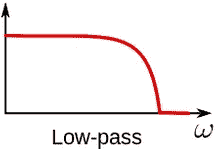
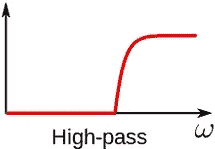
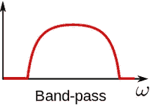
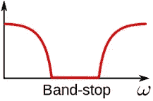
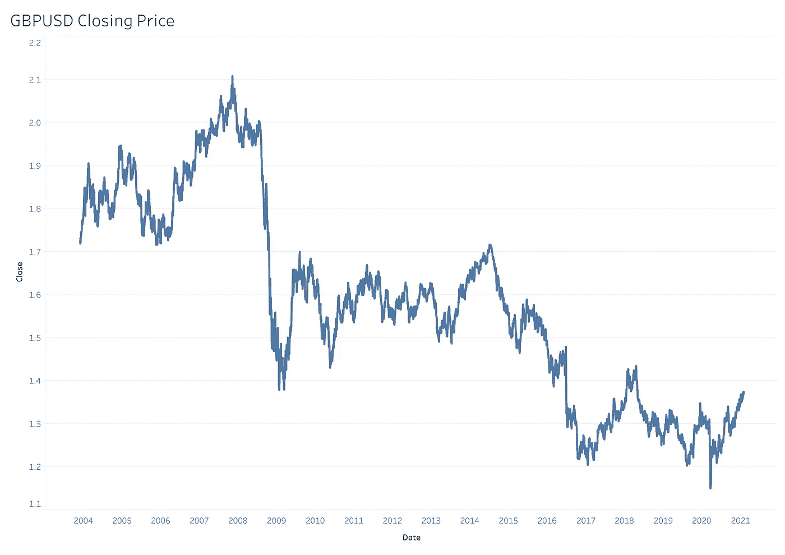
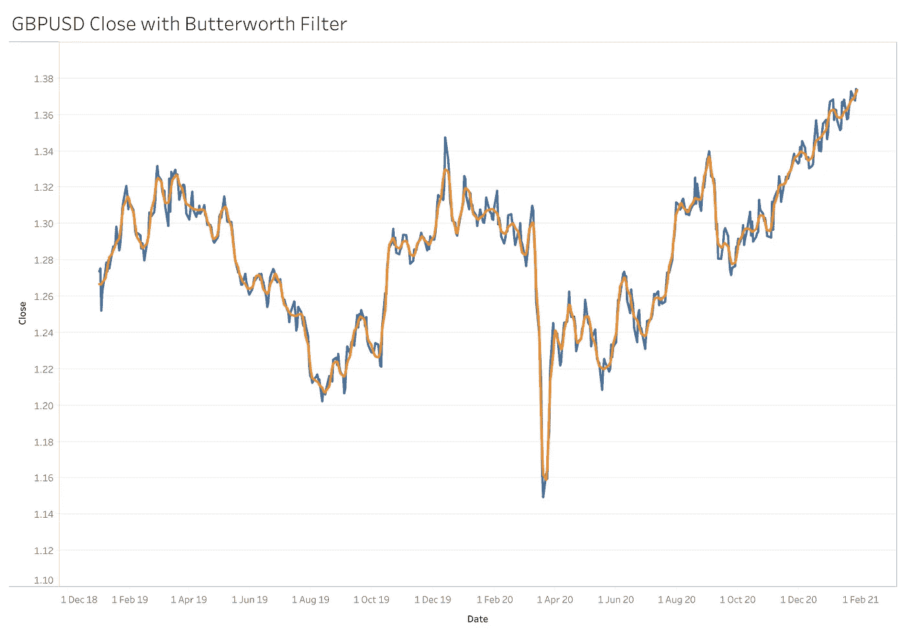
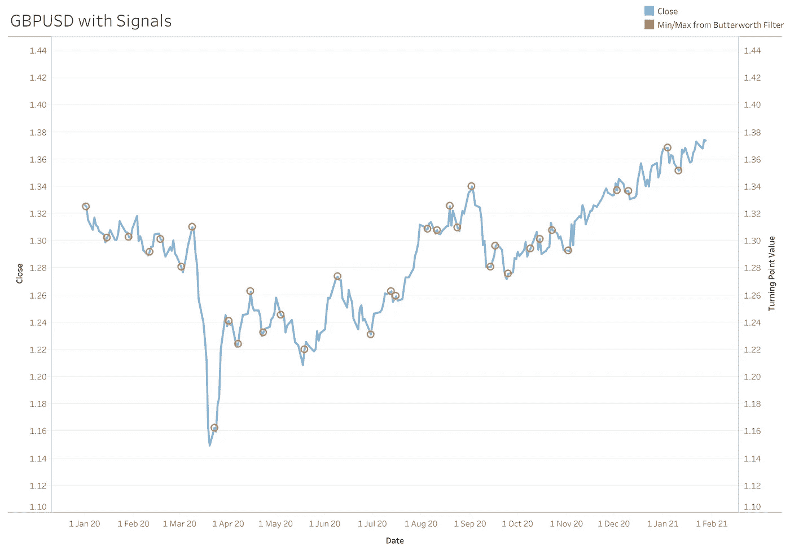

# 算法交易模型——循环方法

> 原文：<https://pub.towardsai.net/algorithmic-trading-models-cyclical-methods-94f211d5250f?source=collection_archive---------1----------------------->

## [数据可视化](https://towardsai.net/p/category/data-visualization)

*如果你喜欢这些内容，我正在发布一份新的算法金融时事通讯，名为 Algo Fin，你可能会感兴趣。这篇时事通讯将探索数据科学和金融之间的联系，最初的重点是货币市场，但我希望在未来建立更多的途径。时事通讯目前是免费加入的，因为我仍在计划为付费订户推出，所以如果这听起来像你可能感兴趣的东西，它绝对值得在这里查看*[](https://algofin.substack.com/p/coming-soon)**！。**

**

*照片由[杰米街](https://unsplash.com/@jamie452?utm_source=unsplash&utm_medium=referral&utm_content=creditCopyText)在 [Unsplash](https://unsplash.com/?utm_source=unsplash&utm_medium=referral&utm_content=creditCopyText) 拍摄*

**在本系列的第四篇文章中，我们将继续总结一些常用的技术分析交易模型，这些模型的数学和计算复杂性将稳步增加。通常，这些模型可能对波动或周期性工具最有效，如外汇对或商品，这是我对它们进行回溯测试的结果。这些模型背后的目标是它们应该是客观的和系统的，即我们应该能够将它们转换成一个交易机器人，它将在每个时间段开始时检查一些条件，并决定是否应该发布买入或卖出订单，或者是否应该关闭已经开放的交易。
请注意，并非所有这些交易模式都是成功的。事实上，他们中的很大一部分是不成功的。这个总结系列的唯一目的是描述不同类型的交易模型背后的理论，而不是关于你应该如何交易的金融建议。然而，如果你确实从这些文章中获得了一些灵感，并决定建立一个自己的交易机器人，请确保你正确地回测了你的策略，包括样本数据的输入和输出，以及虚拟账户中的真实数据。我将在后面的文章中介绍这些定义和我的测试策略。**

## *理论*

*在信号处理中，**滤波器**是一种从信号中去除“不想要的”成分的设备。它从信号中去除被认为是背景噪声的某些频率，以便更清楚地描绘真实的潜在信号。*

*有四大类滤波器，它们由允许通过的频率类型和排除的频率类型决定。*

*   ***低** **通** **滤波器**顾名思义，将允许低频通过并降低高频的重要性*
*   *一个**高** **通** **滤波器**将做相反的事情，允许高频通过并减少低频影响*
*   ***带通** **滤波器**将允许预定义频带内的频率通过。我们为我们的滤波器提供最小和最大频率值，它将只保留那些在范围内的值*
*   *一个**波段** **截止** **滤波器**也需要一个最小值和最大值，但会通过所有大于最大值或小于最小值的频率，基本上是所有带通滤波器不允许的频率*

**

*[低通滤波器](https://training.dewesoft.com/online/course/filters#:~:text=In%20the%20field%20of%20signal,frequency%2C%20order%20(steepness))*

**

*[高通滤波器](https://training.dewesoft.com/online/course/filters#:~:text=In%20the%20field%20of%20signal,frequency%2C%20order%20(steepness))*

**

*[带通滤波器](https://training.dewesoft.com/online/course/filters#:~:text=In%20the%20field%20of%20signal,frequency%2C%20order%20(steepness))*

**

*[带阻滤波器](https://training.dewesoft.com/online/course/filters#:~:text=In%20the%20field%20of%20signal,frequency%2C%20order%20(steepness))*

*当然，还有更复杂的类型，如陷波滤波器(抑制特定频率的滤波器)或梳状滤波器(一系列规则间隔的带通滤波器)，但为了介绍这个主题，我们将坚持基本概念。*

## *应用*

*Butterworth **滤波器**是由物理学家 Stephen Butterworth 于 1930 年首次推出的。我不会详细讨论该滤波器的工作原理，但最重要的一点是，它是一个低通滤波器。巴特沃兹滤波器旨在产生尽可能平坦的输出，忽略高频并返回低频。人们发现，这种过滤器是外汇交易领域的理想选择，因为我们希望看到基本的“低频”周期。我们希望去除高频运动，因为这可能是我们认为只是噪音。*

**

*作者图片*

*当我们看图表时，我们开始看到它的应用范围。如你所见，在过去 18 年的英镑/美元收盘价中，我们看到围绕总体价格趋势的许多微小波动。如果我们是长期或中期交易者，我们不会对趋势的波动感兴趣，但我们想要趋势本身。观察潜在趋势的一个方法是使用移动平均线，这很有用，但也是一个滞后指标。滤波器的好处是它可以实时移除频率。我们可以立即看到趋势的延续和逆转，使我们更容易尽可能接近这些变化做出交易决定。*

*Python 的 SciPy 包提供了一个选项，让我们可以轻松运行巴特沃兹过滤器。你可以在这里找到文档，但是如果你没有物理学背景，你可以把未知值看作我们可以选择调整的参数。*

```
*from scipy import signalfrequency = 1000
cutoff = 100 # Cut-off frequency of the filter
freq_normal = frequency / (cutoff) # Normalize the frequency
b, a = signal.butter(3, freq_normal, ‘low’)
output = signal.filtfilt(b, a, data[‘Close’])*
```

*自然，我们的截止频率必须小于我们的频率值，但是我们有机会调整的是这两个值和滤波器的阶数(signal.butter()方法的第一个参数)。要找到最佳的频率、截止频率和阶数，只需测试不同的值，并找到最符合我们数据的值。根据收盘价绘制输出将是我们对模型表现的直观测量。如果我们想要一个更数学的评估，我们可以看看我们两个变量之间的相关性或 R 值。*

**

*作者图片*

*上图用蓝色显示了收盘价的一部分，用橙色显示了巴特沃斯过滤器的输出。如您所见，过滤器非常紧密地跟随价格。无论如何，这都不是一个完美的拟合，通过更多的微调，您可能会找到一个更好地代表更普遍趋势的过滤器。正如你所看到的，从 2020 年 10 月起，英镑/美元持续升值，但过滤器仍然受到价格小幅下跌的影响。如果我要调整这一点，我会尝试提高截止频率，看看这是否会创建一条直线，跟随价格直线上升。*

## *把分析变成交易策略*

*我想把这个分析更进一步，看看这是否可以变成一个实际的交易策略。我想找出巴特沃斯过滤器的转折点，看看它与图表的实际转折点有多接近。*

**

*作者图片*

*我在收盘数据中运行了一个循环，以检查过滤器返回最小和最大点的位置。这些点与前两天和后两天进行比较，因此值得记住的是，如果我们根据这些信号下订单，我们只能在我们在图表上做出标记的两天后才能这样做。*

*虽然这不是一个精确的数学测量，过滤器返回一些积极的结果。它没有捕捉到每一个转折点，但在它捕捉到的转折点中，它以合理的准确度捕捉到了它们。我们从不期望我们的交易 100%成功，但是如果我们从最小点交易到最大点，看起来我们可以盈利。*

**

*作者图片*

*为了清楚起见，我在上面的图表中又增加了一个小节，因为我现在引入了两个新的标识符。如前所述，我们在确定最小点或最大点和实际交易之间有两天的时间差，因为我们需要这个时间来建立一个转折点。我列出了这些交易可能发生的地方。我们可以在上面的图表中看到，在确定了最低点之后，我们可以买入英镑/美元，在确定了最高点之后，我们可以卖出英镑/美元。*

*这种延迟最终似乎不会对我们产生太大影响。我们仍然可以在价格上涨时买入，在价格继续下跌时卖出。如果你想做所有这些交易，这个策略可能会让你变成一个短线交易者，因为我计算过在 8 个月的时间里，你只用一种货币做了 17 笔交易。但显然有空间。完成我们分析的下一步将是运行精确的回溯测试，以检查模型的有效性，并建立一个自动系统，该系统将返回何时买入或卖出的信号，或者自动进行交易。*

*感谢您花时间阅读这篇文章。如果你喜欢这些内容，我将推出一份新的算法金融时事通讯，名为 Algo Fin，你可能会感兴趣。这篇时事通讯将探索数据科学和金融之间的联系，最初的重点是货币市场，但我希望在未来建立更多的途径。时事通讯目前是免费加入的，因为我仍计划为付费订户推出，所以如果这听起来像是你可能感兴趣的东西，它绝对值得查看[这里](https://algofin.substack.com/p/coming-soon)！。*