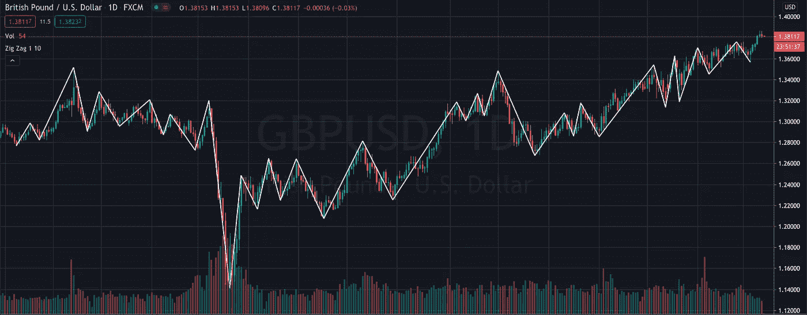
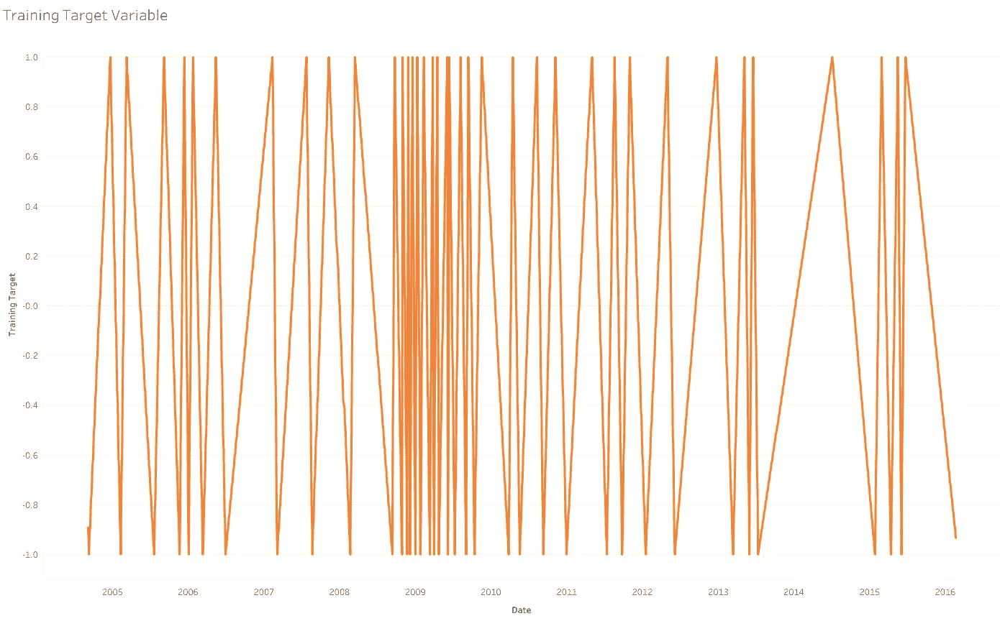
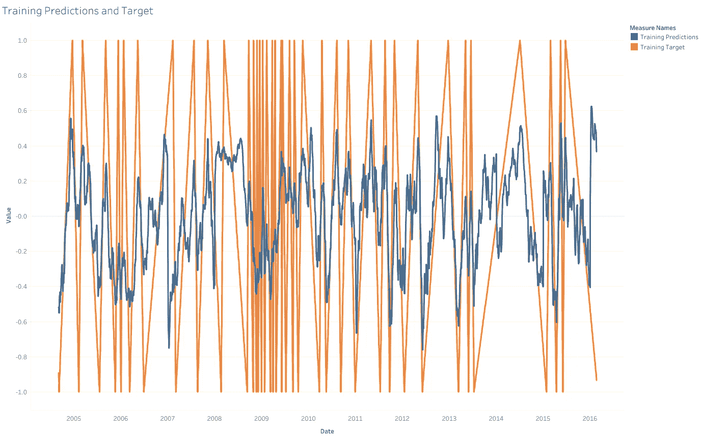
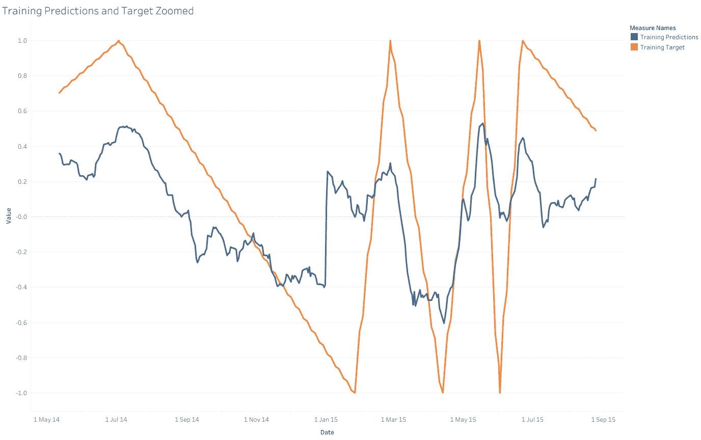
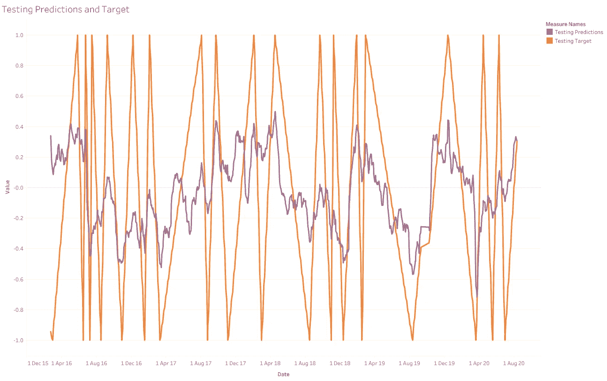
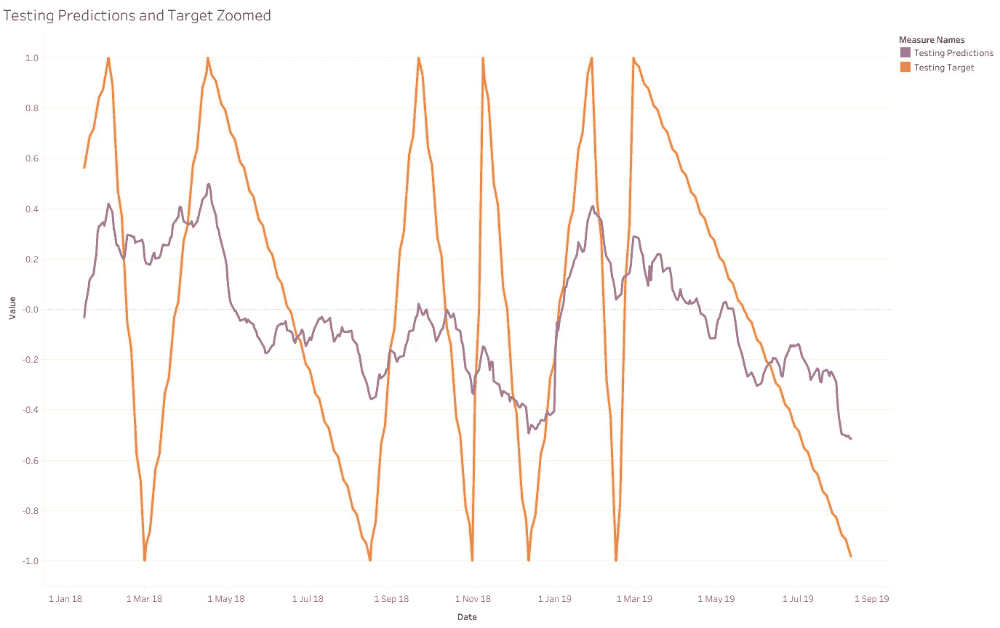
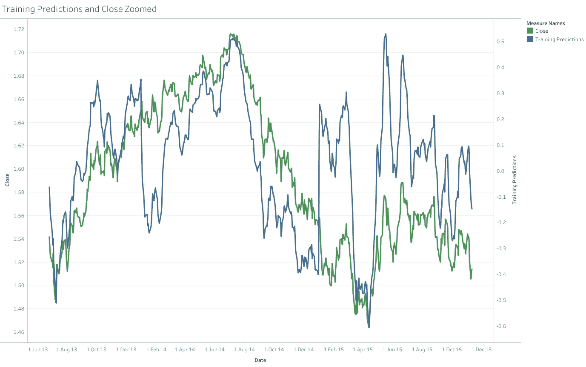
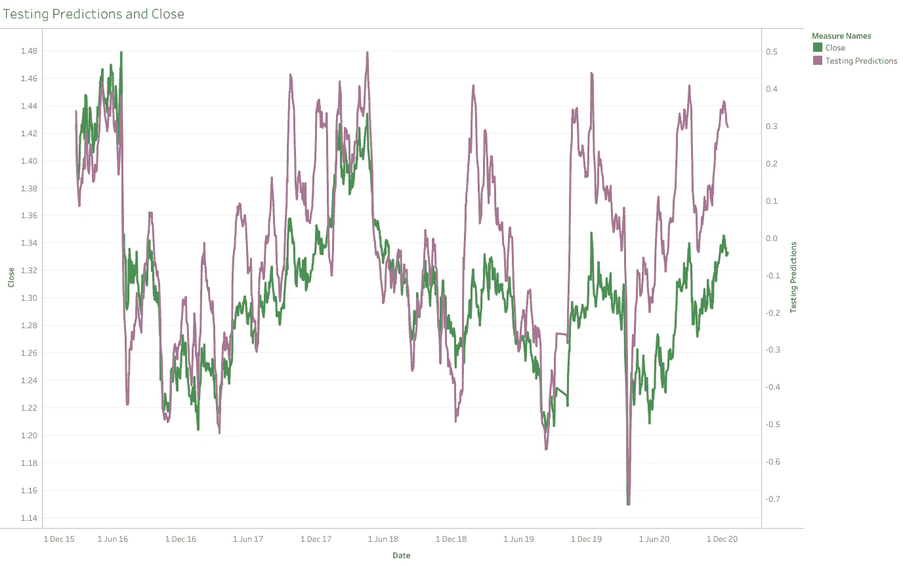

# 算法交易模型——机器学习(第一部分)

> 原文：<https://pub.towardsai.net/algorithmic-trading-models-machine-learning-part-1-284845cb4c84?source=collection_archive---------0----------------------->

## [数据可视化](https://towardsai.net/p/category/data-visualization)，[机器学习](https://towardsai.net/p/category/machine-learning)


照片由 [Johannes Plenio](https://unsplash.com/@jplenio?utm_source=unsplash&utm_medium=referral&utm_content=creditCopyText) 在 [Unsplash](https://unsplash.com/s/photos/lightbulb?utm_source=unsplash&utm_medium=referral&utm_content=creditCopyText) 上拍摄

*在本系列的第五篇文章中，我们将继续总结一些常用的技术分析交易模型，这些模型的数学和计算复杂性将稳步增加。通常，这些模型可能对波动或周期性工具最有效，如外汇对或商品，这是我对它们进行回溯测试的结果。这些模型背后的目标是它们应该是客观的和系统的，即我们应该能够将它们转换成一个交易机器人，它将在每个时间段开始时检查一些条件，并决定是否应该发布买入或卖出订单，或者是否应该关闭已经开放的交易。
请注意，并非所有这些交易模式都是成功的。事实上，他们中的很大一部分是不成功的。这个总结系列的唯一目的是描述不同类型的交易模型背后的理论，而不是关于你应该如何交易的金融建议。然而，如果你确实从这些文章中获得了一些灵感，并决定建立一个自己的交易机器人，请确保你正确地回测了你的策略，包括样本数据的输入和输出，以及虚拟账户中的真实数据。我将在后面的文章中介绍这些定义和我的测试策略。*

## 介绍

我已经写了 4 篇关于算法交易模型背后的理论概念的文章。前面的文章已经讨论了突破、均线、振荡指标和周期方法。第五种模型类型，机器学习方法，由于这个主题的范围而涉及更多，所以这篇文章绝对不是一篇关于 ML 在算法交易中唯一使用方式的白皮书。我在这篇文章中的目标是提供一个框架，它结合了某种形式的计算机学习来预测英镑/美元汇率的未来价格。你可以考虑算法交易模型的第一部分——机器学习，因为这个主题涉及的范围很广，我无法在一篇文章中讲述，我将在未来用不同的观点写更多。

由于这是本系列的第一篇文章，我想使用线性回归概述一个相当简单的应用程序。我的目标是产生一个算法，识别英镑/美元汇率收盘价的最小点和最大点。我从雅虎财经获得了大约 17 年的数据，其中 70%将用于训练，其余 30%用于测试。这里值得注意的是，产生的算法是没有参数调整或评估的结果，它更像是一个展示设计这样一个项目的潜在起点的机会。

## 方法学

这种方法从之字形指示器开始，它可以在大多数知名的图表平台上找到。之字形指标是一种滞后指标，它在图表中标识最小点和最大点。一旦图表下跌了预定的百分比，它就标记一个最高点，当图表上涨了预定的百分比，它就标记一个最低点。通过直线连接这些点，我们可以获得资产的历史形状波动，并去除噪声。下图显示了这样一个例子。



之字形指示器

我用 Python 写了这个项目的代码，有一个简单的 Python 包可以生成 Zig Zag 指示器，你可以在这里访问。您必须将一个 NumPy 数组传递到。peak_valley_pivots()方法，该方法返回一个数组，其中 1 表示最大点，-1 表示最小点，0 表示所有其他点。

```
from zigzag import *
import pandas as pd#Collect data into dataframe
…#Convert data into numpy array
closing_prices = np.asarray(df[‘Close’])#Calculate min/max points
min_max_points = peak_valley_pivots(closing_prices, 0.02,-0.02)#Add as a column to the original df2
df[‘Min/Max Points’] = min_max_points
```

一旦我们有了最小点和最大点，我们就可以用熊猫来创建连接它们的线。interpolate()方法，使用线性插值，该方法将取每个 1 和-1 之间的所有点，并在它们之间分配相等距离的点。

```
#Replace all 0s with NaN values
df['Min/Max Points'] = df['Min/'Max Points'].replace(0,np.NaN)#Interpolate
data['Min/'Max Points'] = data['Min/'Max Points'].interpolate(method = 'linear')
```

这将创建一个如下图所示的图形。



目标变量

这将形成我们的输出。我们希望尽可能接近地模拟这个形状，因为我们知道，当我们的模型达到 1 时，我们正在接近图中的最大值，当我们达到-1 时，我们正在接近最小值。我们的模型越接近这些值，我们就越应该专注于试图识别反转。

一旦我们有了目标变量，接下来的工作就是创建我们的输入。这是实验可以开始的地方，因为对于你的输入是什么没有硬性的规则。事实上，这是问题变得最困难的地方，因为如果你试图建立一个有优势的模型，你需要提供的不仅仅是历史价格，特别是如果你使用一个简单的模型，如线性回归。我将在本文中进一步讨论使用更复杂的模型的潜在适应性和好处，但为了进一步强调前面的观点，而且因为这是在金融领域进行 ML 建模的第一次实验，我确实将一系列历史趋势统计数据作为我的输入。特别是，在对每一年的数据进行标准化后，我使用了前 5 天的价格以及 5、10、50 和 200 周期的简单移动平均线作为输入。这将创建一个如下所示的数据框。


输入数据集样本

## 结果

70%的数据用于训练，30%用于测试。我展示了目标如何与训练和测试数据的预测一致的完整结果，以及这些数据的缩放快照，以使两条线稍微清晰一些。



作者图片



作者图片



作者图片



作者图片

另一个有趣的图表是观察预测值如何在双轴上与实际收盘价对齐。预测值在 1 和-1 之间波动，这解释了为什么我们需要在不同的尺度上绘制这两个值。



作者图片



作者图片

## 评论

在查看之前的图表时，有一点很清楚，那就是模型的复杂性让我们非常失望。回归似乎无法捕捉目标变量的极值，因为它在 0.6 和-0.6 之间波动。

然而，我们从目标变量和收盘价中看到的是，在很大程度上，图表似乎排列得相当好。这种比较不是关于直线直接在彼此之上，因为这只是为了重新调整轴刻度，而是更多地观察数据的实际形状。当我们达到收盘价的最小值或最大值时，预测似乎也是如此。

为了发展这个想法，我将研究更复杂模型的性能，比如神经网络或随机森林。添加更多层的能力带来了分析数据中更深层次关系的机会，并可能为我们提供对之字形指标的更好估计。我也会调查我们投入的质量。简单的移动平均线给了我们趋势的指示，但它是滞后指标，不能给我们太多关于我们是否接近转折点的信息。一种适应可能是在我们的输入中使用不同振荡器的值，因为它们给我们一个当前价格相对于历史数据的数字。关于振荡器的更多信息，你可以查看我以前的文章[这里](https://medium.com/towards-artificial-intelligence/algorithmic-trading-models-oscillators-d79e52300efa)，但这也是我将在下一篇文章中研究的内容。

感谢您花时间阅读这篇文章。如果你喜欢这些内容，我将推出一份新的算法金融时事通讯，名为 Algo Fin，你可能会感兴趣。这篇时事通讯将探索数据科学和金融之间的联系，最初的重点是货币市场，但我希望在未来建立更多的途径。时事通讯目前是免费加入的，因为我仍然计划为付费用户推出，所以如果这听起来像是你可能感兴趣的东西，它绝对值得看看[这里](https://algofin.substack.com/p/coming-soon)！。