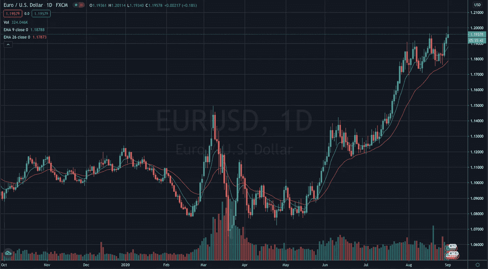
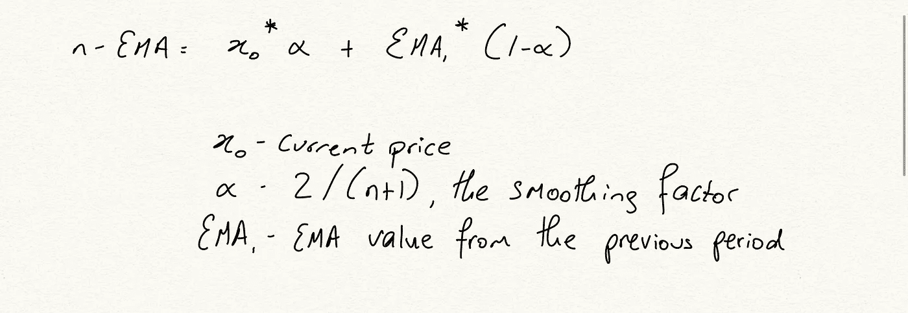
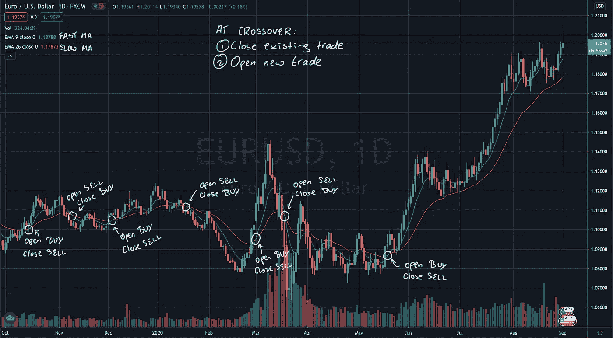
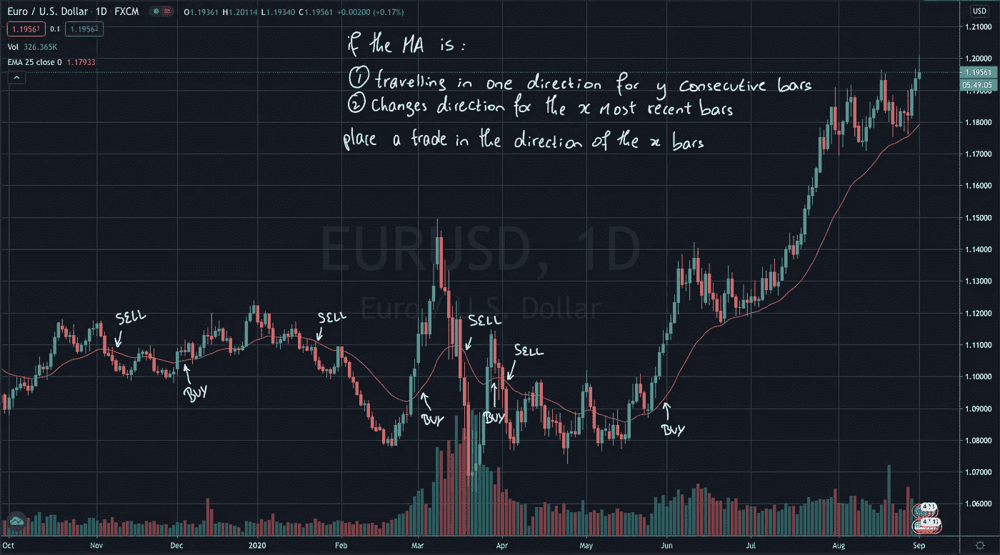
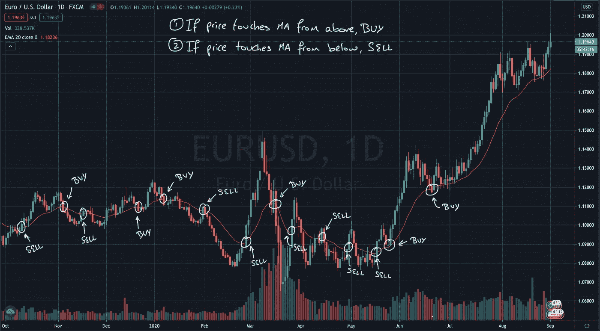

# 算法交易模型——移动平均线

> 原文：<https://pub.towardsai.net/algorithmic-trading-models-moving-averages-36c9dfb955d5?source=collection_archive---------3----------------------->

## [数据可视化](https://towardsai.net/p/category/data-visualization)

图 1–一年的欧元兑美元价格行为，有两条指数移动平均线

*在本系列的第二篇文章中，我们将继续总结一些常用的技术分析交易模型，这些模型的数学和计算复杂性将稳步增加。通常，这些模型可能对波动或周期性工具最有效，如外汇对或商品，这是我对它们进行回溯测试的结果。这些模型背后的目标是它们应该是客观的和系统的，即我们应该能够将它们转换成一个交易机器人，它将在每个时间段开始时检查一些条件，并决定是否应该发布买入或卖出订单，或者是否应该关闭已经开放的交易。*

*请注意，并非所有这些交易模式都是成功的。事实上，他们中的很大一部分是不成功的。这个总结系列的唯一目的是描述不同类型的交易模型背后的理论，而不是关于你应该如何交易的金融建议。然而，如果你确实从这些文章中获得了一些灵感，并决定建立一个自己的交易机器人，请确保你正确地回测了你的策略，包括样本数据的输入和输出，以及虚拟账户中的真实数据。我将在后面的文章中介绍这些定义和我的测试策略。*

当开始尝试算法交易或任何形式的交易模型时，均线模型是最容易理解和实现的。根据我最初的研究，移动平均线模型可以分为三种类型，我们将总结如下。然而，在此之前，我们需要准确定义什么是移动平均线，以及不同类型的移动平均线。

简单地说，移动平均线计算一个时间序列的一系列平均线，目的是去除噪音并向我们展示价格的趋势。我们将详细介绍 3 种常用的移动平均线类型。

简单移动平均法将每个值计算为前 n 个值的平均值。我们称之为 n 周期 SMA，或 n-SMA。

图 2-简单移动平均计算

指数移动平均线和加权移动平均线在计算上是相似的，因为它们都包括对每个数据点应用权重。然而，它们的不同之处在于计算这些权重的方式，即指数和线性。我们的 EMA 中的权重是这样分配的，最近的数据点对 EMA 值有最大的影响，以指数的方式，而 WMA 权重以统一的速度上升(线性)。这两种均线的一个要求是它们的权重总和必须是 1。

图 3——指数移动平均计算

EMA 用平滑因子计算最近数据点的权重，我们称之为 alpha。平滑因子的计算方法是取 2 / (1 + time_period)。对于 10 周期的均线，这个值是 2/(10+1) = 0.1818，对于 20 周期的均线，这个值是 0.0952。该值与前一时段的均线值一起将被代入以下公式，以计算当前均线。

如你所见，如果我们以 10 期均线为例，最近的数据点对均线值的影响约为 18%，而之前的 10 个数据点(由之前的均线代表)的影响约为 72%。

图 4 —加权移动平均计算

形状记忆合金的优点是它为我们提供了更平滑的线条。因为这个原因，它更常用于交易者在更长的时间框架，日线图和周线图上。SMA 不太可能对拉锯做出反应，这让我们对整体市场趋势有了更好的了解。缺点是，SMA 的滞后意味着我们会错过快速捕捉趋势变化。这是 WMA 和 EMA 试图对此问题进行调整的地方。权重系统允许这两条移动平均线对最近的价格变化做出更大的反应，允许我们识别趋势何时向发生变化的确切点移动。

在这一点上值得注意的是，我们可以使用更多类型的移动平均线进行分析，通过强大的机器，我们可以轻松地在许多不同的移动平均线类型上反复测试所有这些策略，以找到最有效的策略。我已经概述了上述三种类型，作为我们可以添加更多类型的平均方法的初始框架，我肯定会在后续文章中详细介绍更复杂的 MAs。敬请期待！

## 战略

因此，我们有 3 个模型，我们可以使用合并移动平均线。当然还有其他的，但我们正在寻找可以快速轻松地融入交易机器人的模型。

1.  移动平均交叉模型
2.  趋势跟踪模型
3.  动态支撑和阻力模型

第一个是非常简单的均线交叉模型。这背后的理论是，当观察较慢和较快的移动平均线的值时，它们交叉的点表明趋势发生了变化。为了将这转化为系统规则，我们在快速移动平均线穿过慢速移动平均线上方时发布买入指令，在快速移动平均线穿过慢速移动平均线下方时发布卖出指令。然后，我们将止损点设置为观察到下一个交叉的点，即信号反转，或者一个固定值，如远离开盘价的特定点数或前 x 个周期平均真实范围的倍数。

图 5 —移动平均交叉模型

第二种模式是趋势跟踪策略。这里我们只需要一条均线，我们观察它的初始方向。一旦我们看到连续 x 根棒线的方向反转，我们就在新的方向交易。这里的理论是，我们已经确定了一个新的趋势，并打算尽可能接近趋势的起点进入市场。如上所述，使用标准停止。

图 6 —趋势跟踪模型

我们将考虑的最终移动平均线模型是一个支撑和阻力策略。在许多情况下，我们可以观察到均线是一个动态支撑和阻力。在上升趋势中，我们可能会在市场中看到许多回落，下降到移动平均线，然后再次反弹，好像移动平均线是支撑位。在下跌趋势中观察到类似的行为，但在这种情况下，移动平均线是一个阻力位。我们的目标是在回调时，按照最初的方向进行交易。如果价格下跌触及移动平均线，我们将下单买入。如果价格上涨触及移动平均线，我们将下单卖出。这种策略的优点是，如果移动平均线是一个动态的支撑或阻力，我们将找到尽可能接近我们希望达到的最佳进场点，因为价格将会立即反弹，并继续长期趋势。将应用标准停止。

图 7 —动态支撑和阻力模型

正如你所看到的，特别是移动平均线反弹策略，有很多优化和增加协议的空间来避免突破。在这个图表的某些区域，20 期均线似乎是一个完美的支撑位，但是在其他情况下，我们的价格突破了这条线，继续向原来的方向移动。

这些是移动平均线模型的基本原理。在后面的文章中，我们将研究如何在 MetaTrader 用于金融市场算法交易的修改后的 C++语言)中编写其中一个模型。