# Kdrama 初创企业人工智能从业者指南

> 原文：<https://pub.towardsai.net/an-ai-practitioners-guide-to-the-kdrama-start-up-56ab95c2afd8?source=collection_archive---------1----------------------->

## [人工智能](https://towardsai.net/p/category/artificial-intelligence)，[观点](https://towardsai.net/p/category/opinion)

## “我们获得了 99.9%的准确率！！!"还有其他需要指出的地方。

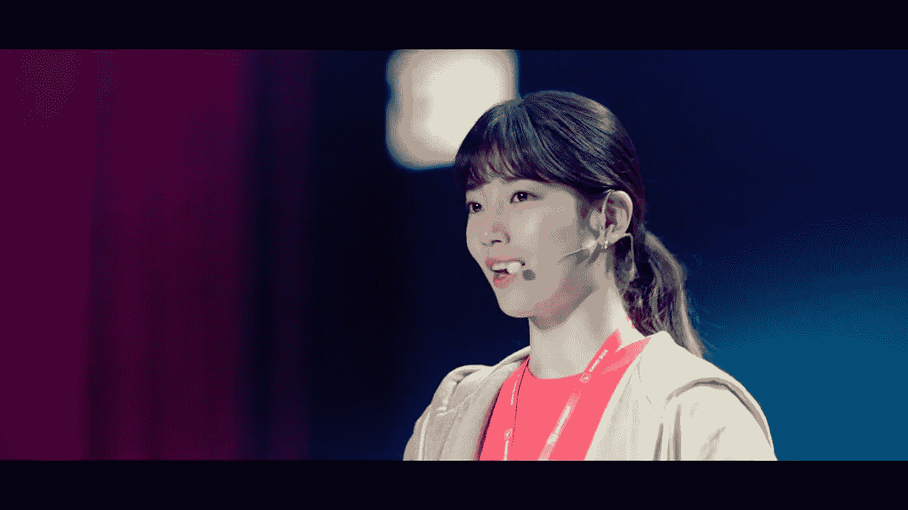

来自第五集。除非另有说明，此图及后续图片均为作者截图。

嗯，更多的是评论，真的。

作为一名对初创公司感兴趣并有构建实时计算机视觉和其他人工智能系统经验的计算机工程师，我与一些同事和朋友进行了相当多的讨论。我想和你分享一些。

*注意:可能的剧透在前面，你可能想在看完这个系列后回到这个帖子。*

**首先，非 AI 的东西。**

*   开始看是因为演员阵容和主题，真的没想到第一集。我个人觉得本来可以拍成电影，就凭它自己。
*   我很惊讶人们怎么会对这样的事情如此两极分化。根据我目前所读到和听到的，两个“团队”的人都可以口头攻击和“憎恨”(1)另一个团队的粉丝，以及(2)将他们对角色的喜欢/不喜欢与演员联系起来。(我可能误解了这一点，因为我在交流时也倾向于互换演员的名字和角色。无论如何，在某种程度上我想这意味着演员们很好地扮演了他们的角色，哈哈。)
*   因此，我的建议是——制作一个病毒式的成功故事的剧本，甚至给 Reddit 版主带来了很多麻烦[:建立两个团队，让结局不确定，给每一方希望，直到最后。这让我想起了两件事:(1)雷德·霍夫曼说，要留意那些投资者说“是”或“不是”的想法，而不是全票通过的想法；(2)我从](https://www.reddit.com/r/KDRAMA/comments/k1yvxs/startup_episode_13/)[个人 MBA](https://personalmba.com/clanning/) 中读到的“结伙”概念，人们倾向于支持和自己想法和背景相似的人。对于故事作者和制作团队来说，也许他们可以使用这些作为他们的衡量标准或某种 KPI:Reddit 上每小时的评论，以及让版主根据这些评论采取行动的时间。(半开玩笑)

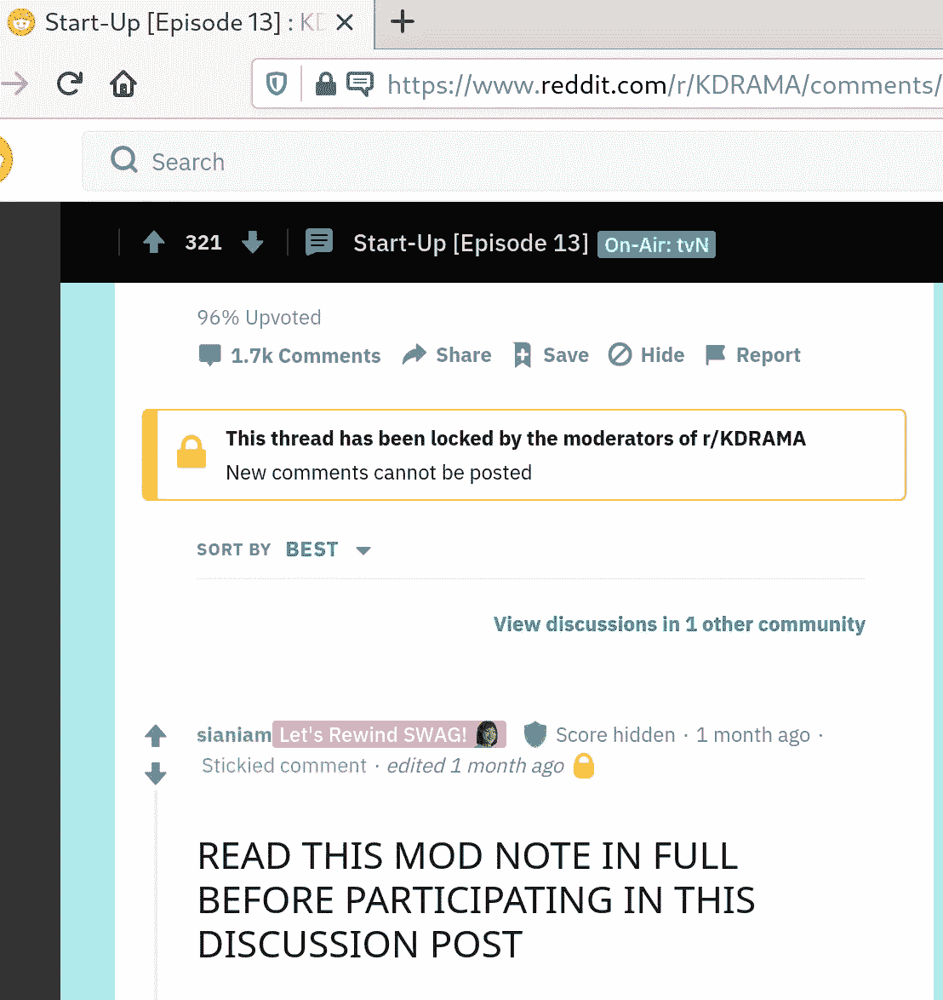

衡量成功的新标准。

*   我喜欢 OST。我想你也会记在脑子里。
*   我和奉承南多桑的朋友分享一个笑话:我还没见过一个 IMO 奖牌获得者和计算机工程师有一双大手，我指的是二头肌。我这么说是因为我是一个培养有竞争力的程序员的人，这些程序员也倾向于参加像 IMO 这样的数学竞赛。也许编剧和导演漏掉了这一点。也可能我只是没遇到足够多的人。(半开玩笑)

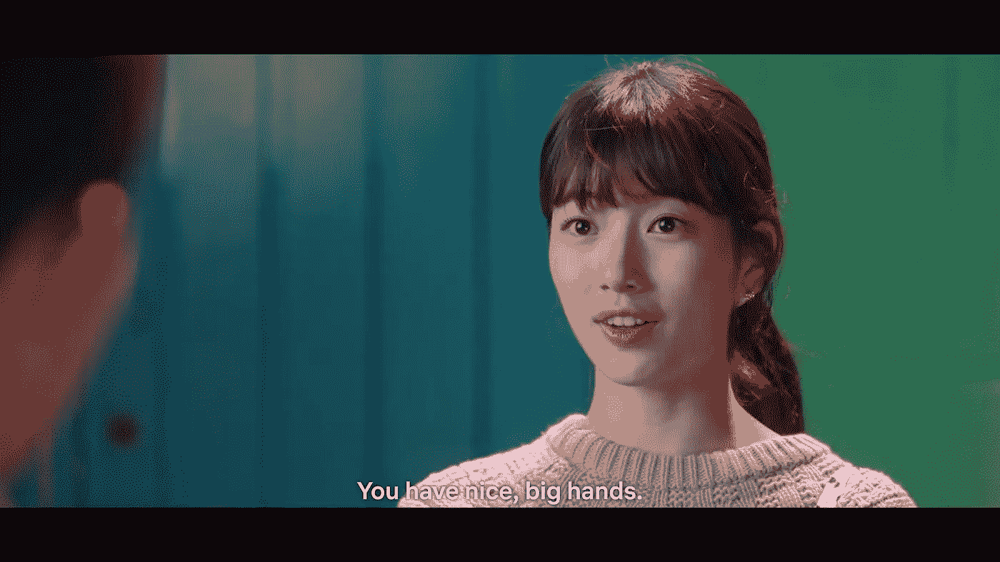

第四集。我喜欢你是因为…

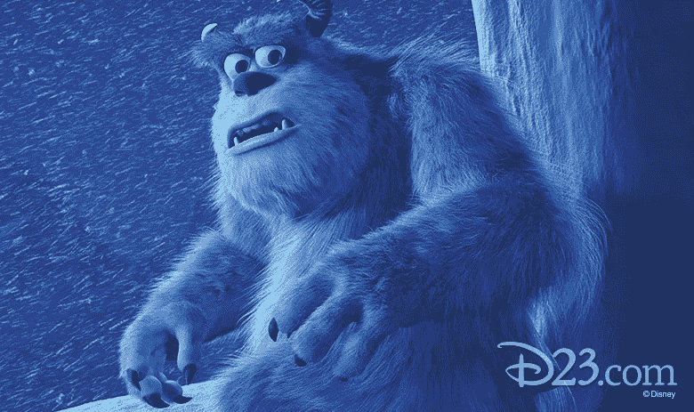

我的手很大，所以…苏西喜欢我？！[来源](https://d23.com/celebrate-a-monster-of-an-anniversary-with-15-things-we-love-about-monsters-inc/)

*   有太多的巧合，但无论如何。我要了。

剧情装甲？不，人们只是碰巧同时在那里。

那些碍事的，我们先过 AI 部分，大致按照在系列中出现的顺序。回顾一下，我承认细节可能会很长，所以请直接跳到您感兴趣的部分。开始了。

**#1。泰山和简**

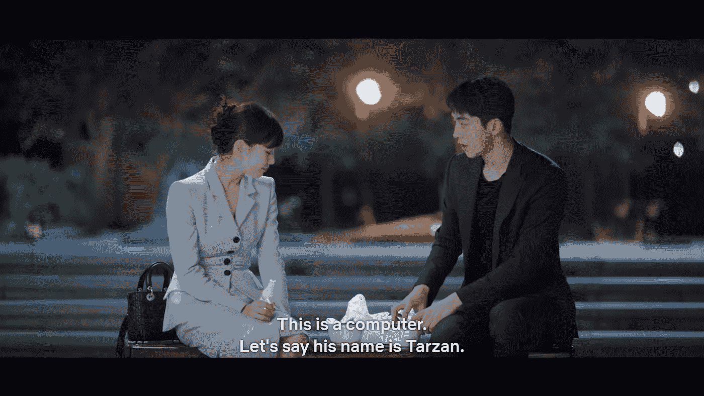

第五集。泰山和简的比喻。

我喜欢这个节目试图向不在该领域工作的人解释人工智能和机器学习的方式:

> "所以泰山继续努力。他为她抓了一条蛇，但是她不喜欢它。有一天，他给了她一只可爱的兔子，这让她很开心。”

这种试错法代表了我们如何多次将不同的图像输入“人工神经网络(ANN)”，直到它*学习*预测一张狗的图像包含一只狗，一张猫的图像包含一只猫，等等。这个学习阶段的另一个术语是*训练*。你用不同的图像训练神经网络，直到它达到期望的精度。

给感兴趣的人提供更多的细节:

*   对计算机来说，图像是数字的行和列(即矩阵)。通常，像素值为 0 表示它是黑色的，而 255 表示 1。对于彩色图像，您有三个矩阵:一个用于红色，另一个用于绿色，最后是蓝色(即 RGB)。你可以使用像这个一样的[颜色选择器。观察 RGB 值，您会发现黑色为(0，0，0)，白色为(255，255，255)，对于任何其他颜色，这些值都在这些数字范围内。](https://www.google.com/search?q=color+picker)

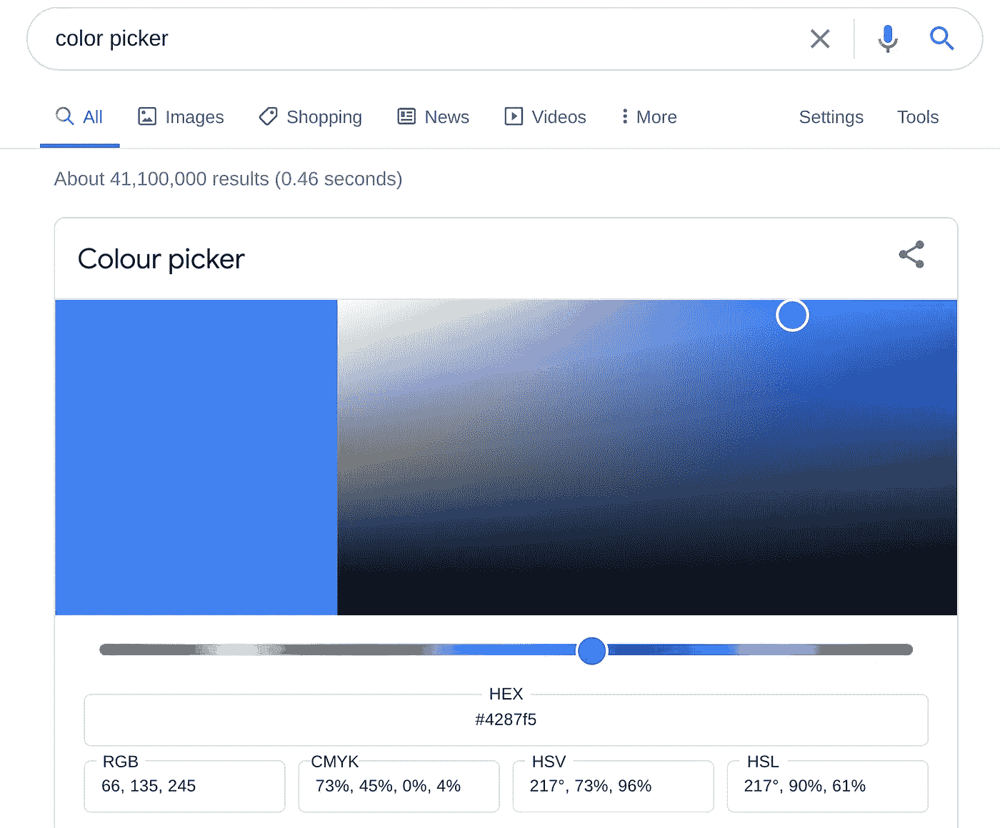

你可以在谷歌上试试颜色选择器。看到 RGB 值是如何从 0 到 255 变化的了吗？

*   安呢？你也可以把人工神经网络想象成一个巨大的矩阵。那么，它们包含哪些价值观呢？嗯，*神奇的*数字。我说神奇是因为你可以把这些数字和输入的图像相乘，相加在一起，当和为 1 时，说明你有一只狗；如果总和为零，那么你有一只猫。如果总和是二，那么就是一个苹果，以此类推。
*   那么我们如何获得这些神奇的价值呢？所以最初，我们不知道它们，我们可以把这些值设置成一个随机数。然而，事实证明，当我们给它一些输入图像，它是错误的，我们可以*做一些数学运算*,使矩阵更接近期望的神奇值。所以我们给它很多图像，做一些数学运算，然后重复。我们*训练*神经网络，这样如果我们乘以并加上任何一个苹果的图像，它将等于 2；一个猫的形象将总和为零，以此类推。
*   这些神奇价值的另一个术语是*重量*。你训练，直到你找到正确的重量。为什么是“重量”？因为你是将事物相乘并相加，所以你可以给它们不同的重要性等级，类似于你如何根据每门学科的单元数来衡量你的综合加权平均分数。例如，乘以红色像素的值越大，可能意味着您的人工神经网络对它们更加关注，以便更容易区分苹果和非红色的猫和狗。

**#2。这实际上是经过充分研究的。**

有这样一个经典场景，两个人被黑了，他们决定用同一个键盘打字来加快工作速度:

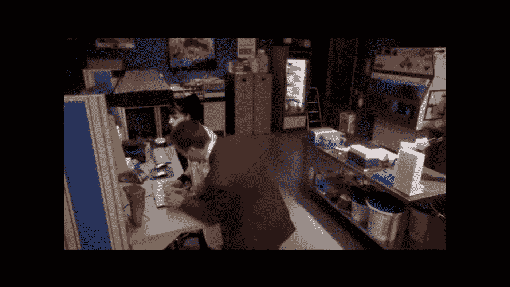

文字对编程。据我所知，不应该是这样的。[来源](https://www.youtube.com/watch?v=u8qgehH3kEQ)

当节目中出现代码片段或黑客攻击场景时，程序员通常会停下来检查所展示的代码，看看它们是否有意义。就连裴苏西也主演的最近一部电视剧《流浪者》也有这个颇有争议的场景:

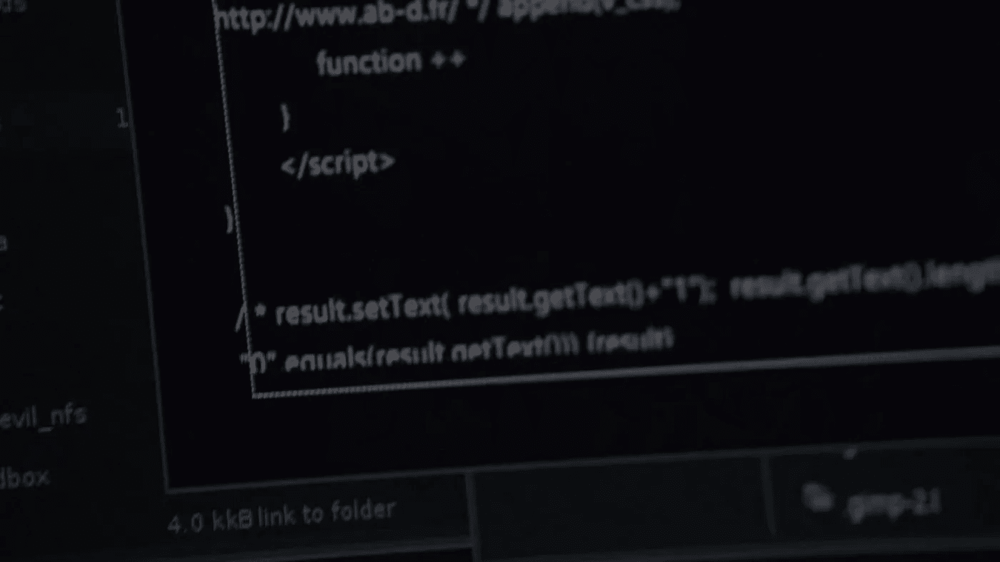

来自《流浪汉》第五集。JavaScript，和一些随机的网站？

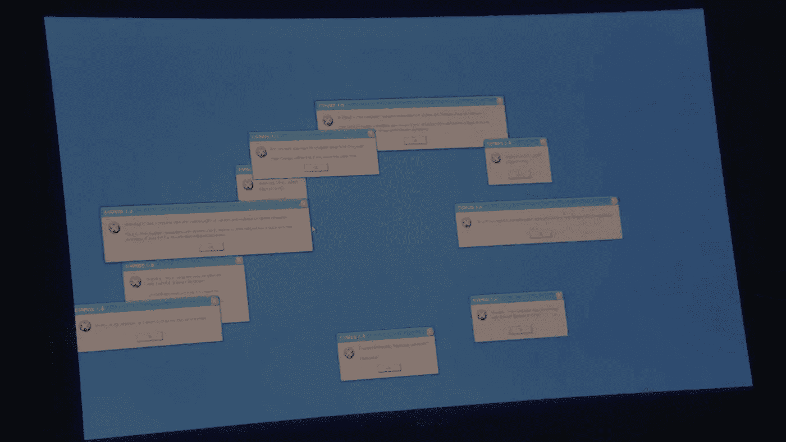

…黑掉看起来像 Windows XP 的东西？

在那个场景中，Suzy 将一个 USB 驱动器插入计算机，出现了一些看起来像 JavaScript 的代码，只是那些标签更常用于构建网站，我也不认为 Windows XP 是用 JavaScript 编写的。嗯，我可能错了。

**目标函数**

回到*创业*，早期我们接触到更多一点的人工智能语言。在第 3 集，多桑向我们介绍了这些术语:

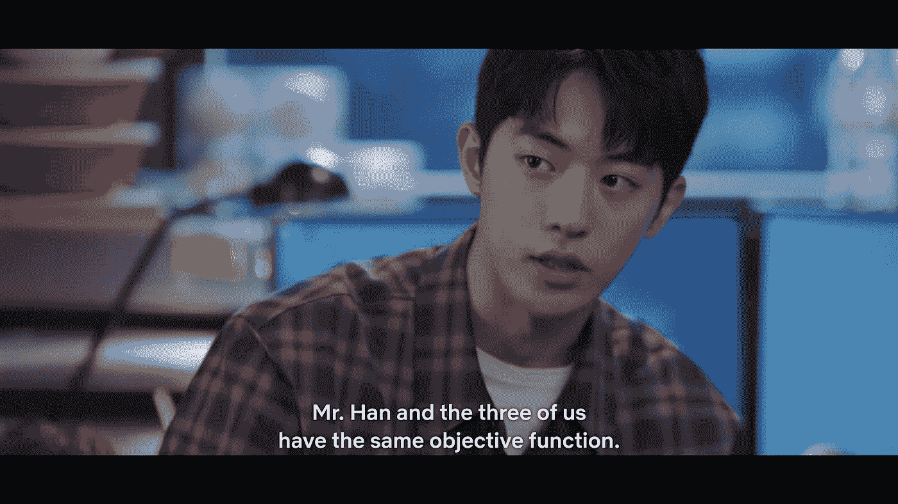

第三集。客观什么？

第三集。请注意背景中的这些:(1)生成器，(2)鉴别器，(3)右上方带有对数和三角形符号的表达式

嗯，我鼓掌，因为他们实际上是合法的人工智能参考！在随意的谈话中是否这样使用它们是另一回事，但是让我们把这个想法放在一边。

出于好奇，我将往回倒一点，但如果你不太关心细节，请随意跳到下一部分。

让我们回到几年前(甚至几十年前)，那时“机器学习”和“神经网络”还不流行，硬件还远远不够好，人们通常将该领域称为数据科学、数据分析或简单的统计学。

这是一个经典的任务——假设我们有这个城市的房价数据，我们想预测几年后，也就是 2025 年的房价。为了便于说明，假设我们的数据在某种货币中是这样的:

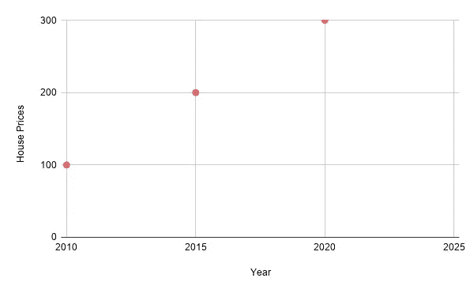

2010 年、2015 年、2020 年的房价。2025 年会是什么样？

我们如何预测 2025 年的价格？对于这个非常理想的数据，我们可以画一条线，就像这样:

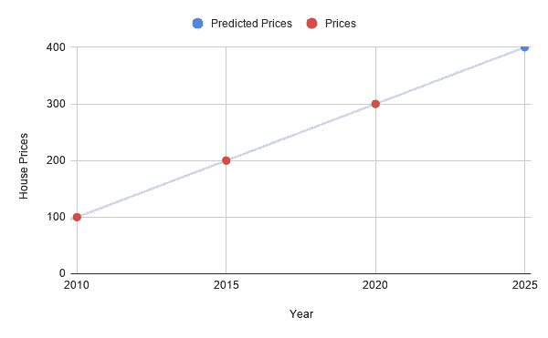

我们用一条线对数据进行建模——我们可以用它来预测未来任何时候的价格！

因此，如果我们想预测 2025 年的价格，我们只需查看相应的价格，在本例中是 400(某种货币)！

但是现在，计算机到底是如何“画”出一条线的呢？一种方法是通过反复试验。另一个是做一些数学推导出一个公式。或者两者的混合。这意味着我们可能会得到一个不太精确的模型，就像这个:

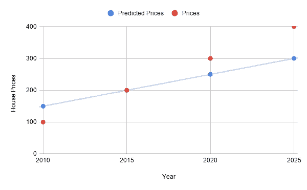

另一个可能的模型，也是一个不太理想的模型。

在这里，我们的模型没有那么好，它预测 2025 年的价格为 300 英镑，这是一个低估！人类可能偶尔会“注视”数据，并说它“看起来”或“适合”正确。但是对于计算机来说，需要一个一致的、量化的度量。对如何做这件事有什么想法吗？我给你点时间考虑一下。

…

我们可以测量距离！为此，我们可以从预测价格(蓝色)中垂直减去实际价格(红色):

减去它们就可以得到垂直距离！

请注意，对于 2010 年，我放置了竖线来表示我取的是绝对值，或者只是结果的大小，这样我们就不必处理负数了。所以这里的总距离是 100。之前的曲线完全吻合的图呢？预测价格与实际价格完全匹配，所以如果我们一起减去它们…

对于前面的图表，实际价格和预测价格之间的距离为零！

…我们发现这条“最佳拟合线”的总距离为 0！早些时候，我们只是通过“目测”知道第一条线更符合数据，但现在我们也想出了一个定量的衡量标准。这一距离的其他术语是“成本”和“损失”。因此，我们的第一个模型的损耗为零，比另一个损耗为 100 的模型要小，也更好。

在*初创*时，有过这一幕:

第五集。双胞胎的图表有一个很好的下降趋势。

麻省理工学院的双胞胎有一个很好的图表。看到 y 轴怎么写“损失”了吗？因此，随着时间的推移(x 轴表示“纪元”，这与训练期间处理的图像数量有关)，他们的模型能够将损失降至最低，这意味着它的表现相当好。我们说他们的模型*收敛了*。

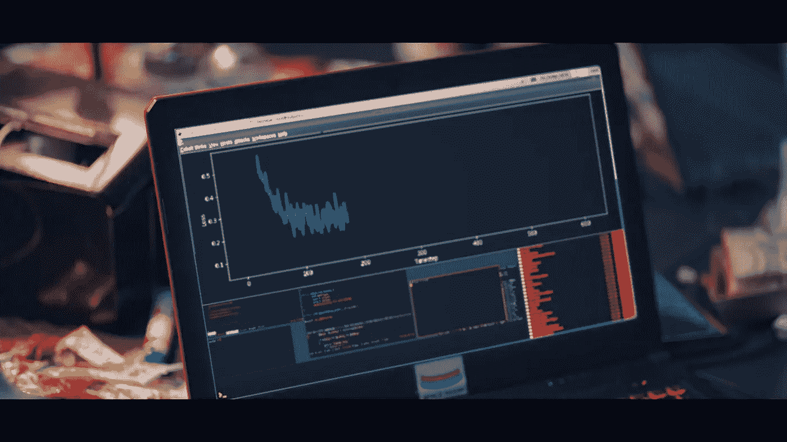

与此同时，对于萨姆森团队来说，他们的团队看起来更加混乱，忽上忽下。

另一方面，对于萨姆桑团队来说，事情进行得并不顺利，他们的损失图一直在上下波动。他们的模式*没有收敛*。是什么导致了这种不一致？我将在下一部分详细讨论。

*小趣闻:在这一集里，他们的图表在几秒钟后就绘制出来了。实际上，培训时间可能会长得多，需要几分钟、几小时甚至几天。这也受到图像数量、神经网络的复杂性和硬件限制的影响。如果你的模型不收敛，你可以做一些调整，然后重新开始，看看它是否收敛。这是为什么机器学习，特别是具有许多或深层的神经网络(“深度学习”)仅在最近几年才取得重大进展的部分原因，尽管其起源早在 20 世纪 90 年代就已被追溯。GPU 或定制人工智能硬件的性能和成本一直是(并将继续是)人工智能研究的瓶颈。*

**最小化损失**

在我们的房价例子中，我不得不手动取 2010 年距离的绝对值，这样我们就不会处理负值。然而，从计算机的角度来看，有比单独查看负值和翻转符号更方便的方法。其中一种方法是取值的平方(即，乘以自身)！因此，我们不用| 100–150 |，而只做(100–150)x(100–150 ),结果会是正数。为了完成这个例子，整个事情现在看起来像这样:

为了方便起见，我们取数字的平方，而不是手动翻转负号。

所以现在总损失的价值不同了，但是我们仍然有一个定量的度量。如果我们对完全通过所有点的第一条线这样做，损失仍然是零，小于 5000，所以我们仍然可以得出结论，这是更好的模型。

除了计算上的便利，使用平方作为损失函数实际上给了我们一个很好的视觉化的神经网络试图做什么。像下面这样的二次方程是什么样子的？

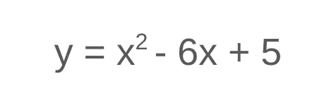

二次方程。他们看起来怎么样？

如果你回忆你的代数或物理概念，这些是抛物线！你可以在像 WolframAlpha 这样的网站上查看和使用它们。或者投篮——这将形成由二次方程支配的抛物线弧。

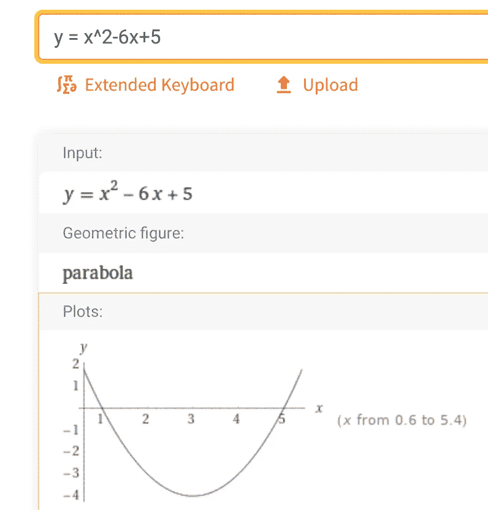

二次方程形成抛物线。你可以使用像 [WolframAlpha](https://www.wolframalpha.com/input/?i=y+%3D+x%5E2-6x%2B5) 这样的工具来可视化它们。

现在，让我们假设根据某个输入值 *x* 计算出的损失是某个二次表达式，由一个普通抛物线来表示，如下所示:

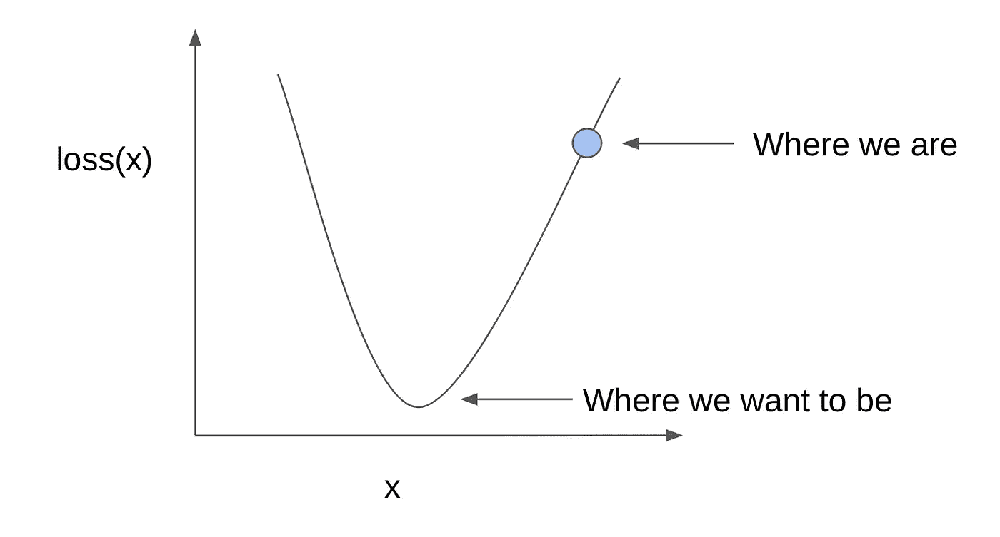

一些抛物线损失图。我们想到达底部。

和以前一样，最初权重都是随机的(因为我们只是猜测)，损失很高，我们处于损失曲线的某个位置。同样，我们希望最小化损失的价值，这将是曲线的底部。我们如何做到这一点？

有一种方法可以考虑:想象你在山里。你想到达山谷或山脚，但是天很黑，你看不到那么远的地方。你能做什么？

…

想到解决办法了吗？这里有另一个提示:想象你是一个弹球，随机放在一个碗里。你将如何到达底部？

嗯，你只要靠着斜坡滚就行了！很简单，对吧？

观察抛物线损失曲线，我们可以画一条切线来强调倾斜度。从计算机的角度来看，我们可以做一些数学运算来量化*斜率*或*倾斜方向*的值。如果斜率的值为正，那么倾斜度向右增加，所以我们想向左移动到底部。如果斜率是负的，那么斜面已经向下了，所以我们可以继续向右。

斜率为正(指向右上角)，所以我们向左走。如果我们在相反的一端，斜率会是负的，指向右下方，所以在这种情况下我们会向右。

而且，就是这样！我们只是继续这样做，直到我们到达底部，在那里损失是最小的。然而还有一个问题——我们应该走多远？我们可以把它设为任意值。然而，如果我们走得太少，那么我们可能需要太长时间才能到达底部——还记得我提到的训练过程可能需要几个小时或几天吗？这是一个因素。

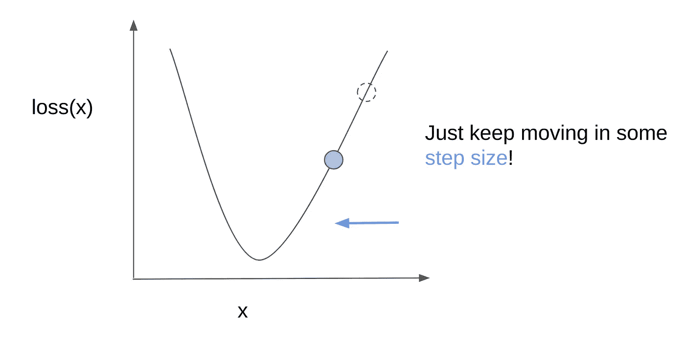

"千里之行始于足下。"但是如果旅程太长，尝试更大的步伐。

另一个担心是，如果步长太小，我们可能会陷入局部凹槽或最小值。回到碗和弹珠，想象碗不是光滑的，而是有小凹槽或小凹穴，弹珠会卡在那里。要通过这样的小洞，弹珠必须“跳过”或“迈更大的步子”才能到达碗的底部。换句话说，趋向于全局最小值而不是局部最小值。

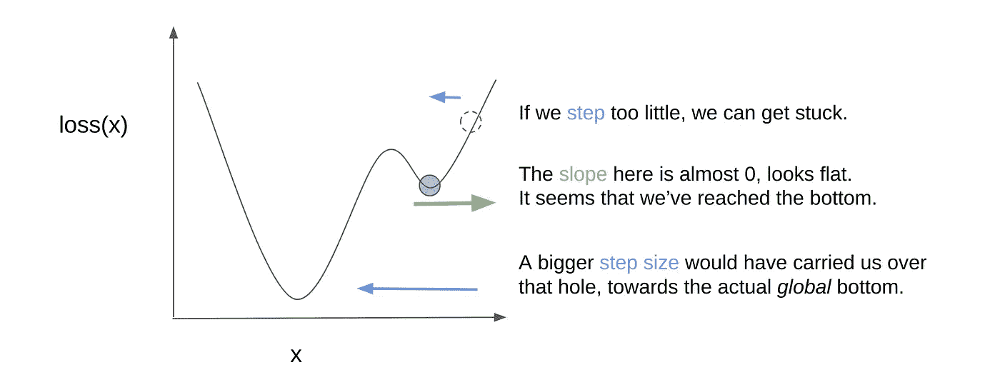

如果我们走得太少，我们可能会陷入局部最小值。

当然，我们可以尽可能地加大步长，对吗？那也会让我们更快到达底部。嗯，我们想要一个相当大的步长，但我们仍然应该小心，不要设置得太大。以下是可能发生的情况。假设我们已经接近全球最小值了:

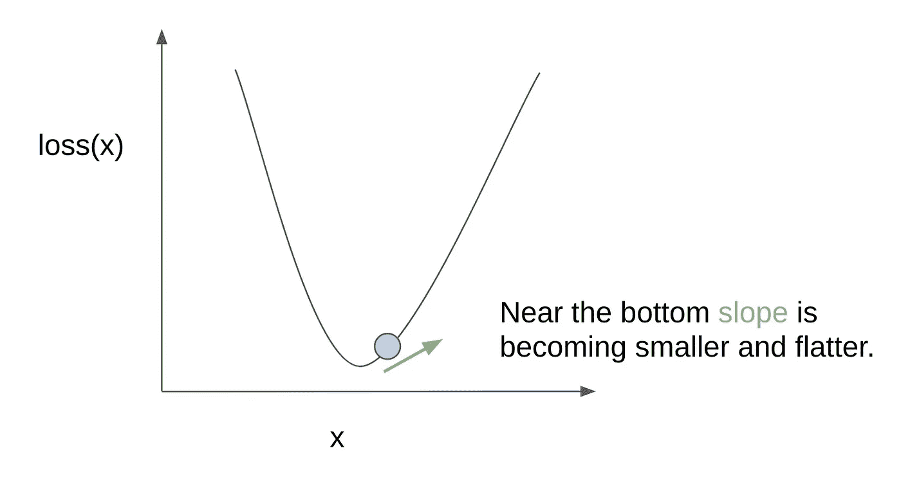

我们快到底部了！只需要再多走一点。

我们知道倾斜的方向，所以我们朝左走，但是如果太大，我们实际上会错过全局最小值:

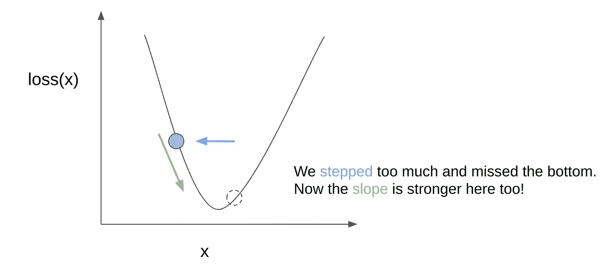

我们踩多了错过了底！

所以现在我们在另一边。更糟糕的是，这里的坡度更陡。一般来说，根据斜坡的陡峭程度来调整步长也是有意义的，因为这可能意味着我们离底部还很远。然而，在这种情况下，情况是这样的:

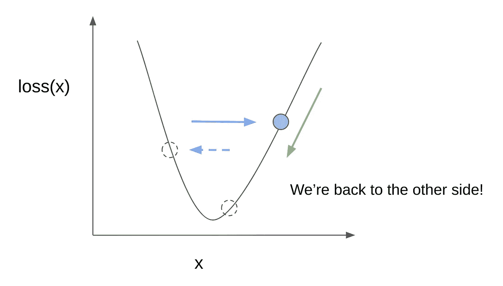

我们刚刚恢复过来。

我们跳回右侧，比原来离底部更远。这种情况可能会持续下去…

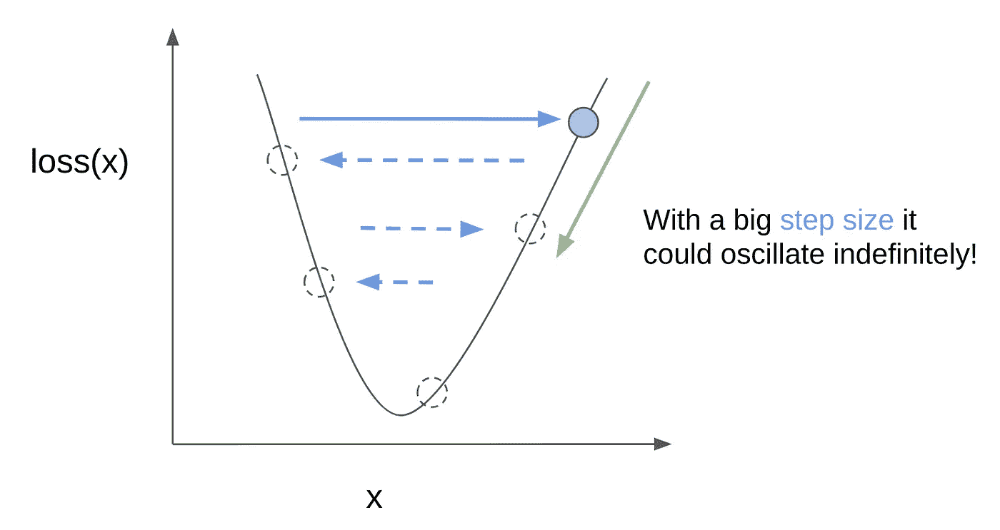

更大的步长可能意味着更快的收敛，但也可能导致不收敛！

在这里，我们清楚地看到，我们没有向底部靠拢，而是继续超调，无限振荡。当 Samsan Tech 的模型未能收敛时，这可能会发生在他们身上。除了步长之外，还有其他可以尝试的技术(例如，考虑到我们到目前为止做得如何的“势头”)，以及其他事情，如清理或预处理数据，甚至只是获得更好和更多的图像。在实践中，它实际上是经验试错法、理论和来自最新文献的经验法则的混合。

***术语琐事***

*   步长也称为*学习速率*。正如我们已经讨论过的，它会影响模型收敛所需的时间(如果有的话)。
*   我们提到了斜率，并在 2D 图中加以说明。用微积分的术语来说，我们要求导，或者对于 3D 和更高维度，也称之为*梯度*。所以，如果你在阅读机器学习的时候遇到了*梯度下降*，那差不多就是我们讨论的内容。根据倾斜的方向向下。
*   我们讨论过最小化一些损失函数，比如绝对值之和，或者平方和。在某些情况下，不是最小化一些表达，而是翻转标志，最大化事物可能更方便。因此，更一般的说法是*优化*(最小化/最大化)某个*目标函数*。换句话说，你的目标是达到这个函数的全局最优(最小/最大)。

我们完事了。咻！不可否认，这涉及了很多内容。如果你达到了这一点，我为你鼓掌，因为这通常会在关于计算机视觉和人工智能的研究生或本科生学期中涉及。

如果你还记得，在我提到的一个场景中，要注意术语“发生器”和“鉴别器”。我们已经学习了神经网络训练和目标函数，但是没有提到生成器。这是因为它们是一种特殊的神经网络，称为生成对抗网络(GANs)。事实上，它们是其他损失函数的一个很好的例子，在那里事情被最大化！其实这里有*两个*神经网络！一个试图最大化，而另一个试图最小化。

如果你感兴趣并准备好了更多，请关注[第二部分](https://medium.com/towards-artificial-intelligence/an-ai-practitioners-guide-to-the-kdrama-start-up-part-2-fe8473c9c122)(下周末出版，[你可以在这里得到通知](https://jddantes.substack.com/p/welcome))，在那里我们将讨论 GANs 及其令人兴奋之处，以及他们在初创企业中取得成功的其他事情，而不仅仅是技术上的！

**致谢**

感谢 Lea 的建议和评论这篇文章的初稿。

[想要更多？获取更多类似故事的个人电子邮件通知，从技术和教育到生产力和自我提高。](https://jddantes.substack.com/p/welcome)

在 [Twitter](https://twitter.com/jddantes) 、 [LinkedIn](https://www.linkedin.com/in/jddantes/) 上联系，获取更频繁、更简短的更新、见解和资源。