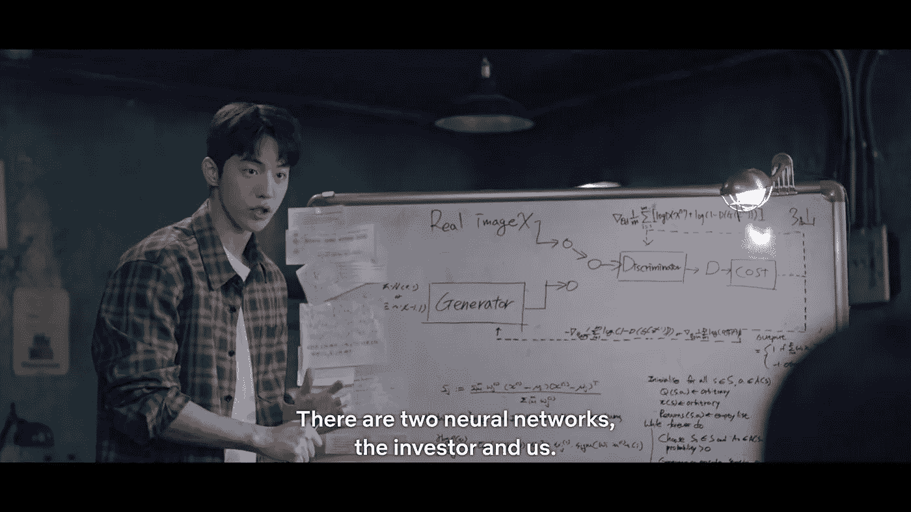
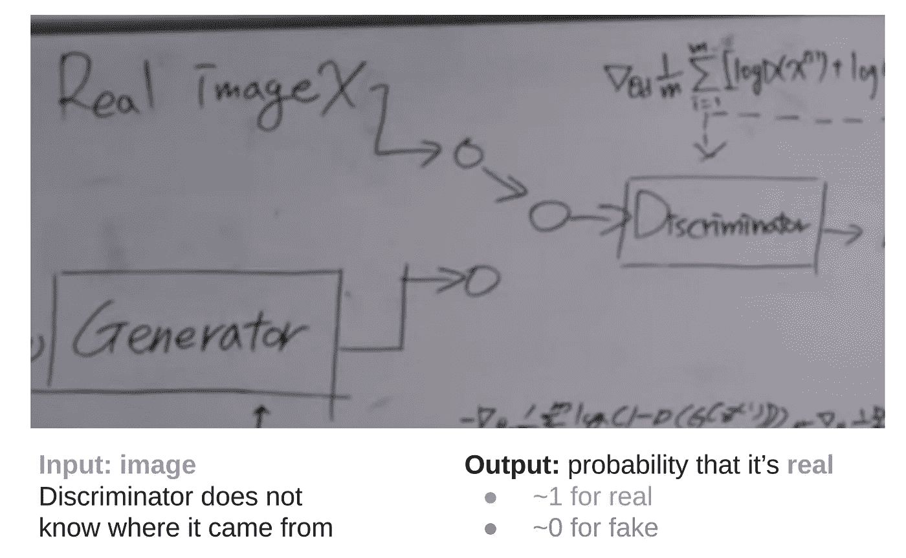
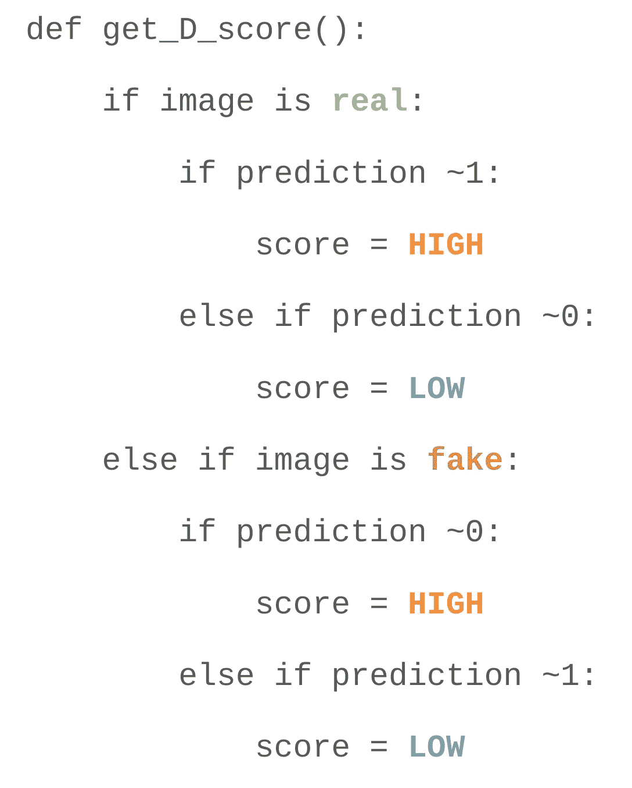
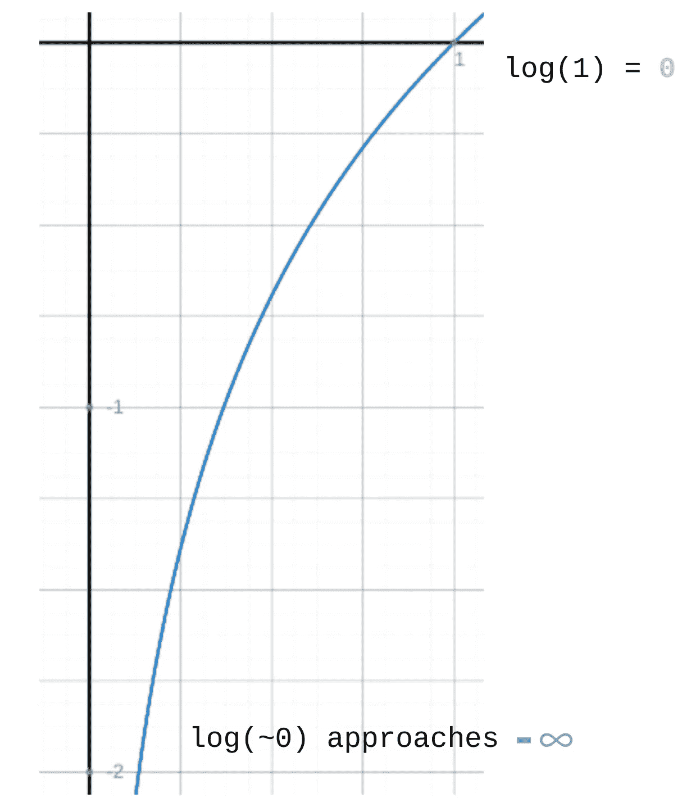
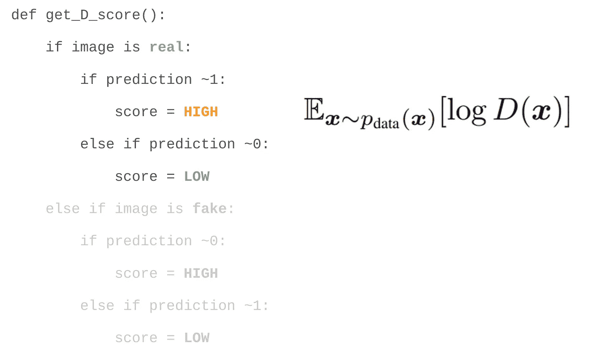
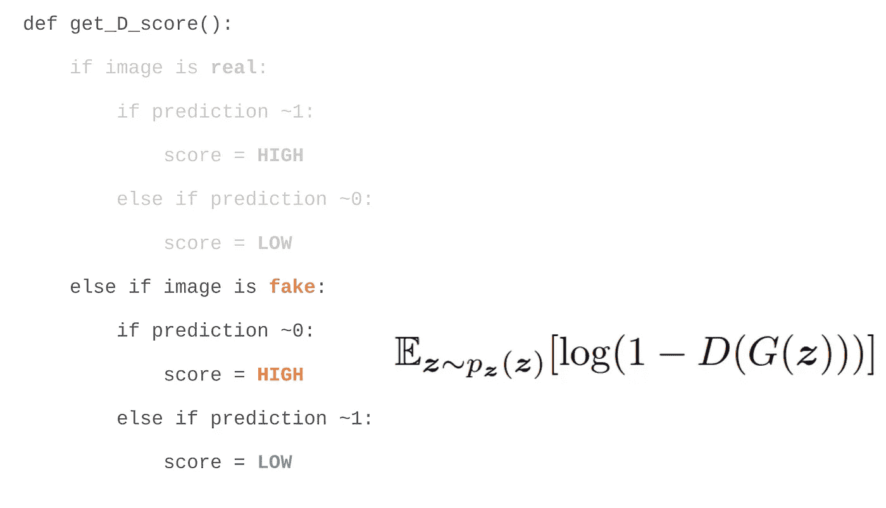
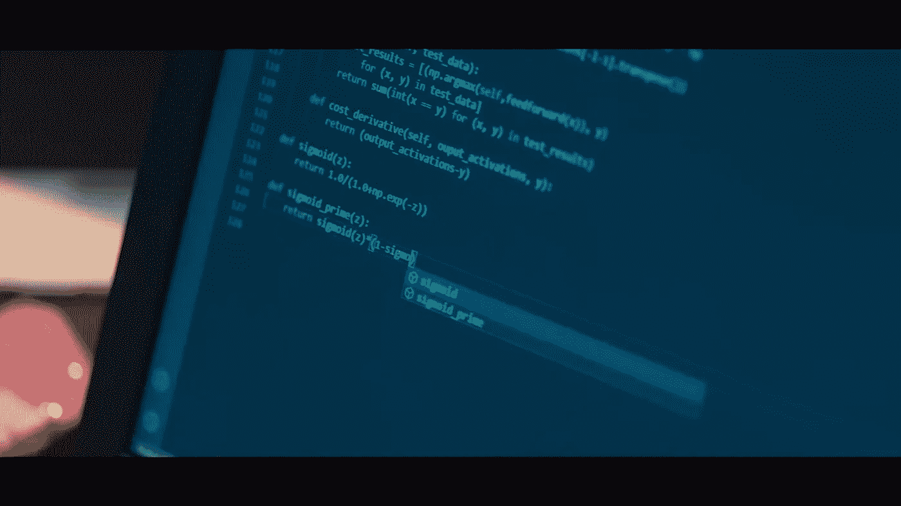
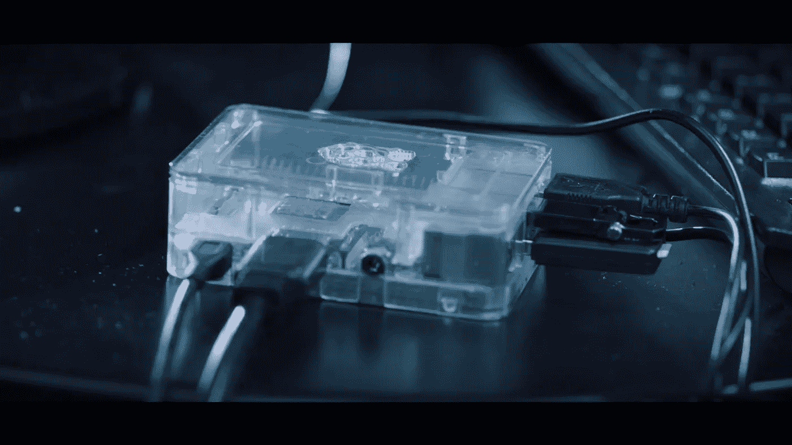
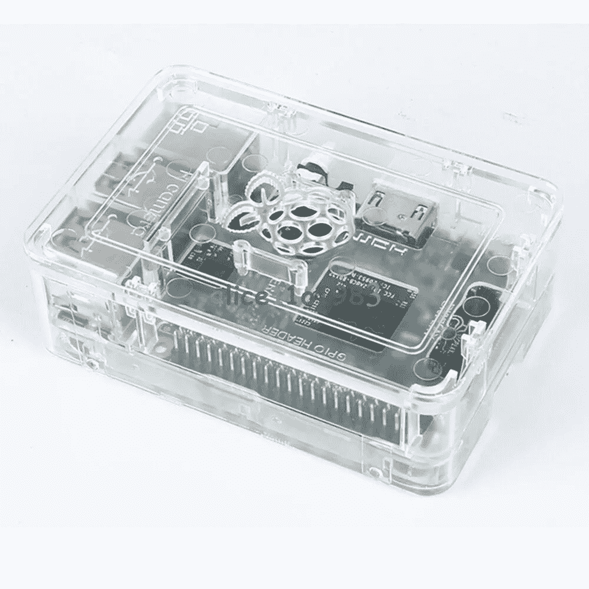
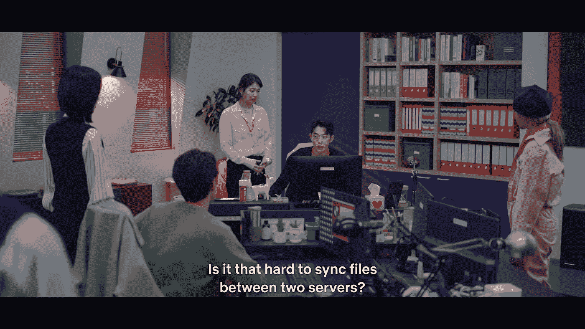

# 人工智能从业者的 Kdrama 启动指南(第二部分)

> 原文：<https://pub.towardsai.net/an-ai-practitioners-guide-to-the-kdrama-start-up-part-2-fe8473c9c122?source=collection_archive---------1----------------------->

## [人工智能](https://towardsai.net/p/category/artificial-intelligence)

## 通过敌对网络获得乐趣。

第七集。谁在换灯泡？我看他们开始敌对了。(抱歉。)图片除特别注明外，均为作者截图。

在[之前的文章](https://medium.com/@jddantes/an-ai-practitioners-guide-to-the-kdrama-start-up-56ab95c2afd8)中，我们谈到了神经网络、训练和损失。现在，我们将深入到生成网络中，除了技术诀窍之外，我们还会多谈一点关于初创企业的内容。

让我们从停止的地方继续吧！

*剧透警告* : *如果你已经完成了这个系列，你可能会想继续。*

**#2 实际上研究得相当充分(续)。**

第三集。注意(1)生成器，(2)鉴别器，以及(3)右上方带有对数和三角形符号的表达式。

让我们回到 Dosan 提到两个神经网络的场景。在白板上你会看到术语*生成器*和*鉴别器*，以及右上角的一些公式和*日志*等等。

这些实际上指的是生成性对抗网络，或 GANs。为什么要生财？与典型的神经网络相反，神经网络获取输入图像并输出类似“狗”或“猫”的分类，而 GANs 则相反。你说你想要一只狗，它的输出是一只狗的图像。实际上，它可以生成一个完整的狗图像的**——从矮小、毛茸茸的博美犬到较大的金毛猎犬。**

****

**一只博美犬。由 [Bundo Kim](https://unsplash.com/@bundo?utm_source=medium&utm_medium=referral) 在 [Unsplash](https://unsplash.com?utm_source=medium&utm_medium=referral) 上拍摄的照片**

**那么这两个神经网络在哪里呢？你可能已经猜到了——生成器是一个神经网络，而*鉴别器*是另一个神经网络。**

**虽然生成器对我们来说是新的，但是鉴别器的功能就像我们已经习惯的分类器一样。给它一个输入图像，它会告诉你它是狗还是猫。除了这一次，输入图像可以来自(1)实际的训练图像，或者(2)由生成器创建的假图像！您可以在白板上的图表中看到这一点。**

****

**鉴别器试图从生成器中猜测图像是真实的(“1”)还是伪造的(“0”)。**

**所以通常我们可以指派神经网络为狗输出“1”，为猫输出“0”；在这种情况下，还有另一个不同之处。鉴别器不是说它是一只狗还是一只猫，而是预测图像是真是假。如果输出为“1”，则鉴别器猜测图像是真实的，而接近“0”的输出则猜测图像是生成器创建的赝品。**

**就是这样！如果你搜索过 GANs，那么你可能已经看到了一个比喻，一个警察试图抓住一个制造假货的罪犯(在这种情况下是生产者)。或者在达尔米的案件中，试图找出 15 年前寄信的真正的多桑人。**

****

**第七集。看来达尔米作为鉴别者不会太有效。**

**因此，鉴别者试图找出差异，以了解它是否是假的。**

****

**第三集。Injae:“你开始融资了吗？”**

**然而，当发电机被抓住时，它会学习，并试图加快它的游戏。**

****

**第三集。如何成为一名优秀的 CEO？说国歌的歌词。**

**在被抓住和学习创造更好的假货的这种来回几次重复之后，生成器变得如此之好，以至于鉴别器完全被弄糊涂了，分不清哪个是哪个。就像之前的达尔米。**

**或者在某些情况下，也许不是。(GANs 可能很难训练到收敛。)**

****

**第九集。甘斯可能很狡猾。不要在家里尝试这个，这对关系不好。(开玩笑，但不是关于训练的部分。)**

****关于*对数*的等式呢？****

**同样，如果你想跳过这一部分，请随意继续。但是如果你对此感兴趣，请继续阅读。:)**

**让我们再回到白板上。我们已经过了生成器和鉴别器，但是还没有碰过右上角的公式。让我们把它放大，但是从[官方报纸](https://arxiv.org/abs/1406.2661)上抓取一个，这样事情就更容易看清楚了:**

****

**来自[论文](https://arxiv.org/abs/1406.2661)的方程式。我们一会儿就来分析一下。**

**没有上下文，这可能看起来令人困惑。我们来分解一下。**

**从鉴别者的角度来看，我们希望被预测为“1”的真实图像以及被正确检测为假图像(标记为“0”)的人工图像具有较高的分数。在伪代码中，它类似于:**

****

**当鉴别器将真实图像标记为“1”时，我们想要鼓励鉴别器，并且在“0”附近伪造图像。**

**然后，在所有的训练图像(无论是真实的还是生成的)上，我们希望总分尽可能高。**

**那么这如何转化为等式呢？还记得在[之前的文章](https://medium.com/@jddantes/an-ai-practitioners-guide-to-the-kdrama-start-up-56ab95c2afd8)中，我们使用了损失的绝对值吗？翻译成伪代码，应该是这样的:**

****

**在第 1 部分中，我们计算出|(100–150)| = 50。我们取绝对值(竖线)，这样数字就不是负数了。**

**但是，除了手动编码拐角情况，原来还有其他方便的数学运算，如平方数字。**

**对于 GANs 的情况，我们也可以尝试这样做。为了表示 if-else 逻辑，我们可以使用什么数学运算或函数在“1”和“0”之间切换？你可能已经猜到了——我们可以使用对数！如果你已经忘了对数是什么，你可以看看这个图表:**

****

**当 x=1 时 log(x)为零，当 x 接近零时接近负无穷大。用 [graph.tk](http://graph.tk/) 或 [WorlframAlpha](https://www.wolframalpha.com/input/?i=log%28x%29) 查看**

**我们趋近于零的对数是负无穷大，一的对数是零。所以如果我们想最大化事物，我们不希望它们趋向负无穷大，而是试图使总和趋向零。所以在我们之前的伪代码中，负无穷大被认为是低分，而接近零的分数是高分。**

**让我们来看看图像是真实的情况。如果预测~1，那么 *log(~1)* = 0(高)。如果预测~0，这是错误的，并且 *log(~0)* 将评估为负无穷大；这是一个糟糕的分数，因此神经网络将学习惩罚这种错误预测。这由我们的目标函数的第一项表示:**

****

**对于真实图像，鉴别器(D)应该输出接近 1 的值。 *log(~1)* = 0(高)。如果它错误地预测它接近 0， *log(~0)* 接近负无穷大(低)，所以分数被扣分。 *Ex~pdata(x)* 的意思就是从真实图像中获取(即训练数据)。**

**图像是生成器创建的假货的情况呢？流程是相似的，但是首先让我们平滑符号。当我们写 *D(x)* 时，这意味着对某个图像的鉴别器的预测 *x* 。同样， *D(x)* = 1 意味着它预测图像 x 是真实的，而 *D(x)* = 0 则猜测它是假的。对于生成器来说，它的输出不是预测，而是图像。所以 *G(z)* 对于某些输入来说 *z* 是一个图像。你不必介意这里的 *z* ，它可以是任何东西，甚至是随机噪声，这样，如果你稍微改变它，你将扫过可能产生的图像的光谱(例如，从博美犬到金毛猎犬)。**

**所以如果鉴别器接受一个生成的图像作为输入，我们把它写成 *D(G(z))* 。对于这个例子，我们不想直接取对数。对于一个合适的鉴别器， *D(G(z))* 应该接近于零(即它捕捉到它是假的)。如果我们直接取对数，那么*log(D(G(z))*=*log(~ 0)*哪个趋近负无穷大(低)。我们将惩罚在捕捉假货方面做得很好的鉴别者。我们能做什么？**

**我们可以把东西翻过来！我们可以只取 *(1 — D(G(z))* 的*圆木*而不取 *D(G(z))* 的*圆木*！这样，事情就会反过来。对于假图像，*log(1—D(G(z))*=*log(1—预测接近于零)* = *log(1)* = 0(高)！**

**因此，我们得到…**

****

**对于假像，我们想在 D 正确输出~0 的情况下得高分。诀窍是在取对数之前，先从 1 中减去，然后翻转它！**

**…适用于假图像。参见 E *z~pz(z)* ？这只是“覆盖所有假图像”的简写(记住 *z* 表示发生器的输入，它可能只是随机噪声)。**

**因此，当我们将它们相加时，我们得到之前的等式，鉴别器希望*最大化*:**

****

**将两项相加。鉴别者要有高分，就像在游戏里一样！**

**现在，生成器希望相反的事情发生——这就是为什么他们被称为*敌对*网络！所以它想把事情最小化…**

****

**对抗性游戏。我们之前已经得到了原始方程！**

**…这是之前的等式！**

**因此，这两个网络是一个两人的极大极小游戏，每个人都在做自己的梯度下降(或上升)。训练在平衡时停止，此时发生器已经变得如此之好，以至于鉴别器无法分辨真假。因此，在这一点上，鉴别器真的只有 50%的准确度——本质上与扔硬币没有什么不同。**

**我们完成了，太好了！你现在可以理解 Dosan 背后的随机涂鸦了。我怀疑你会用它们来谈论人，哈哈。**

****GAN 应用——更多有趣的东西！****

**你可能不会在随意的对话中使用 gan，但它们确实有其有趣的应用。看下图。你能猜出哪个是真的，哪个不是吗？**

****

**哪个是真的，哪个是假的？图片来自这篇[文章](https://medium.com/syncedreview/gan-2-0-nvidias-hyperrealistic-face-generator-e3439d33ebaf)，来自这篇[论文](https://arxiv.org/abs/1812.04948)。**

**你猜对了吗？**

**…**

**嗯，两个都是甘氏创造的假货！很神奇，对吧？更多细节可以参考[论文](https://arxiv.org/abs/1812.04948)和[其他文章](https://medium.com/syncedreview/gan-2-0-nvidias-hyperrealistic-face-generator-e3439d33ebaf)。**

**除了图像，GANs 也可以用于视频！看看这里的 Injae:**

**哦，另一个 Injae 的视频。等等，她看起来有点不一样… [来源](https://www.youtube.com/watch?v=CYD4_if3Psw)**

**…只不过那个人是韩国流行组合成员[周子瑜](https://en.wikipedia.org/wiki/Tzuyu)，而不是真正的女演员[康汉娜](https://en.wikipedia.org/wiki/Kang_Han-na)。**

**我只展示了这些，但实际上，GANs 还有更多应用。如果你想了解更多，我建议你搜索像这样的编译文章 [one](https://jonathan-hui.medium.com/gan-some-cool-applications-of-gans-4c9ecca35900) (或者他的[整个 GAN 系列在这里](https://jonathan-hui.medium.com/gan-gan-series-2d279f906e7b))，或者寻找像[这个](https://github.com/nightrome/really-awesome-gan)或者[这个](https://github.com/nashory/gans-awesome-applications)这样的“牛逼 Git”库。**

**除了有趣之外，GANs 在特定行业也有潜在的用途，比如媒体和图形。还是单纯为了通用机器学习！GANs 可用于生成训练数据以改进神经网络。还记得 Injae 和 Dalmi 的对决吗？GANs 有可能被用于改进检测假币的模型。**

****

**第五集。Injae 的团队使用人工智能创建字体，而 Samsan 的技术试图检测仿冒品。**

**这就是关于甘斯的一切！除了我们已经讨论过的技术内容，该节目还设法纠正了一些小问题，例如:**

*   **Linux (Ubuntu)的使用。开发者(即使是机器学习以外的软件，如网站)倾向于使用 Linux 作为他们的操作系统。与在其他操作系统上开发相比，它不仅是开源的和免费使用的，而且工具和环境作为一个整体通常更容易使用。**

****

**第 11 集。他们实际上使用的是面向开发者的通用操作系统 [Linux (Ubuntu)](https://ubuntu.com/) 。**

*   **实际上是为人工智能使用代码。他们用的编程语言和库其实都是给 AI 用的。在黑客马拉松这一集中，我们看到了很多这样的例子。**
*   **首先，他们使用实际的编程库进行机器学习。 [Numpy](https://numpy.org/) 用于将数据表示为矩阵， [sklearn (scikit-learn)](https://scikit-learn.org/stable/) 用于数据建模， [matplotlib](https://matplotlib.org/) 用于可视化。代码本身是用 [Python](https://matplotlib.org/) 编写的，这是最常用的编程语言之一。**

****

**第五集。他们实际上在使用机器学习的标准工具。**

*   **权重和偏见。从第 1 部分我们已经知道，权重是在对输入(例如，图像像素)求和之前乘以输入的值。我们可以在这个和上加一个额外的数，把事情改变一下，让方程变得更好。这个额外的数字被称为“偏差”项。正如有人指出的，这不应该与你的 [K-pop 偏见](https://www.google.com/search?q=kpop+bias)相混淆。[额外阅读](https://docs.paperspace.com/machine-learning/wiki/weights-and-biases)。**

****

**第五集。权重和偏见。**

*   **我们之前已经看到过“纪元”，它与神经网络看到整个数据集的次数有关。通常，一次检查整个数据集的计算量太大，所以我们将操作分成“批处理”。**

****

**第五集。我们分批做手术，训练几个纪元。**

*   **激活功能。在对加权输入和偏差求和之后，为了数学上的方便，这个和实际上被挤压在一起以将可能的值箝位在最小值和最大值之间。使用 [sigmoid](https://en.wikipedia.org/wiki/Sigmoid_function) 作为数学运算，可以将值固定在 0 和 1 之间(并解释为概率)。还有其他选择；例如，如果您希望最小值是-1 而不是 0，那么[双曲正切函数](https://reference.wolfram.com/language/ref/Tanh.html#:~:text=Tanh%20is%20the%20hyperbolic%20tangent,of%20the%20natural%20logarithm%20Log.)是一个很好的选择。**

****

**第五集。除了[s 形](https://en.wikipedia.org/wiki/Sigmoid_function)之外，还有激活功能选项。**

*   **乙状结肠和乙状结肠质数。我们刚刚提到了 sigmoid 函数，通常写成希腊字母 sigma (σ)。如果您已经检查了 sigmoid 的[定义，您可以验证下面的代码是否匹配σ(x) = 1/(1 + exp(-x))。乙状结肠素呢？回想一下](https://en.wikipedia.org/wiki/Sigmoid_function)[第 1 部分](https://medium.com/@jddantes/an-ai-practitioners-guide-to-the-kdrama-start-up-56ab95c2afd8)，在那里我们讨论了如何通过逆着*斜面*滚动来达到损失曲线的底部。用于指代倾斜度的其他词语有*斜率*、*梯度、*和*导数。*一般如果你有某个数学函数 *f(x)* (读作“x 的 F”)，导数就写成*F’(x)*(注意 *f* 后的撇号)。“F 撇号”听起来太长，所以一般读作“F 撇”。因此，对于 sigmoid 函数，“sigmoid prime”是它的导数，巧合的是，很容易得出σ'(x) = σ(x) * (1 — σ(x))，这在代码中可以看到。更多阅读[此处](https://datascience.stackexchange.com/questions/30676/role-derivative-of-sigmoid-function-in-neural-networks)和[此处](https://math.stackexchange.com/questions/78575/derivative-of-sigmoid-function-sigma-x-frac11e-x)。**

****

**第五集。您可以验证 sigmoid 及其导数是否与其对应的定义相匹配。**

**尽管如此，有几个场景可能会令人惊讶:**

*   **在 Dalmi 和 Injae 的对峙中，他们使用了这些盒子。除了那些看起来像 Raspberry pi(rpi)的，它们是迷你电脑，对家庭自动化项目有用，但对人工智能不太有用。人工智能嵌入式主板更有可能来自 GPU 制造商，或自己制造定制人工智能硬件的公司。当然，机箱就是机箱，也许我们可以说，在初创阶段，他们内部还有其他硬件。或者我猜你真的可以尝试在树莓派上运行神经网络——这可能会更慢，但我想这就是重点。还有一个问题是，将手机应用移植到树莓派有多容易；我们只能说，他们使用了一个单独的原型和/或可以在笔记本电脑和 RPi 上运行的部分代码，而不一定是整个应用程序本身。或者是的，也许他们真的开始着手建立[这样的](https://magpi.raspberrypi.org/articles/android-raspberry-pi)。**

****

**第 11 集。这看起来像一个树莓皮案件。**

****

**通过搜索在网上找到了一个树莓派的案例。所以是的，看起来是匹配的。[链接](https://www.ebay.com/itm/ABS-Raspberry-Pi-Case-Transparent-Updated-for-Raspberry-Pi-3-2-B-/311895488638)。**

*   **然后，他们没有备份代码。很难想象 Dalmi 和 Injae 的团队真的没有备份他们的代码，即使是在本地。或者我们可以说出于安全考虑，他们只在一些远程访问服务器上安装了它？但还是。我想我们可以说双胞胎真的把他们搞砸了。**

****

**第十三集。双胞胎是 sus。这些骗子。**

****

**第十三集。同样的想法。没有备份，真的吗？**

**也就这样了！**

**所以总的来说，创业是经过充分研究的。有几个争论点，但我们可以稍微弥合一下。除了技术诀窍，初创企业还触及了人工智能的其他一些方面，比如你在该领域工作时可能会遇到的经历，以及可能导致道德困境的情况。**

**我们已经介绍了很多，所以我们可以在这里停下来，但是如果你准备好了更多，让我们在这个系列的第三部分也是最后一部分结束，它将在下周末推出！你可以在这里得到更新。**

**如果你想[回到第一篇文章，你可以在这里](https://medium.com/@jddantes/an-ai-practitioners-guide-to-the-kdrama-start-up-56ab95c2afd8)这样做。**

****致谢****

**感谢 Lea 的建议和评论这篇文章的初稿。**

**[想要更多？获取更多类似故事的个人电子邮件通知，从技术和教育到生产力和自我提高。](https://jddantes.substack.com/p/welcome)**

**在 [Twitter](https://twitter.com/jddantes) 、 [LinkedIn](https://www.linkedin.com/in/jddantes/) 上联系，获取更频繁、更简短的更新、见解和资源。**