# 人工智能从业者的 Kdrama 启动指南(第 3 部分)

> 原文：<https://pub.towardsai.net/an-ai-practitioners-guide-to-the-kdrama-start-up-part-3-b6f54458f8f1?source=collection_archive---------4----------------------->

## [人工智能](https://towardsai.net/p/category/artificial-intelligence)

## 从人工智能工程师的生活到道德困境。

第 11 集。AI 与创新的另一面。除非另有说明，此图片和其他图片均为作者截图。

*注意:可能的剧透在前面，你可能想在看完这个系列后回到这个帖子。*

在之前的帖子中，我们已经介绍了一些关于 Kdrama 初创公司做得不错的人工智能技术细节。在[的第一篇文章中，我们谈到了神经网络和图像基础](https://medium.com/@jddantes/an-ai-practitioners-guide-to-the-kdrama-start-up-56ab95c2afd8)(包括训练损失和梯度下降)，而在[的第二篇文章中，我们深入探讨了生成对抗网络(GANs)及其工作原理](https://medium.com/@jddantes/an-ai-practitioners-guide-to-the-kdrama-start-up-part-2-fe8473c9c122)。

在这个系列的第三部分也是最后一部分，我们将继续讨论当你在人工智能中工作时，他们得到的其他方面，例如…

**#3 你的脸是马桶！**

在早期，我们看到萨姆森公司的人向多桑的父亲展示了他们的“世界级”技术。他们试图证明他们的技术是可行的，可以检测和分类人和其他物体。嗯，在很大程度上是这样的，除了当镜头指向父亲并把他归类为厕所的时候。

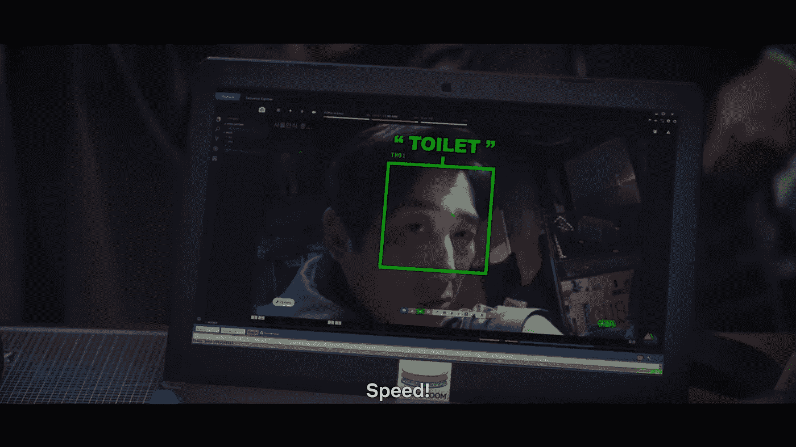

第二集。“你看起来像个马桶。”—世界级的人工智能技术

虽然这是系列中一个有趣的时刻，但事实是这非常接近现实生活！这项技术，以及它如何将人归类为厕所。想知道有多近，请看这段视频:

似乎是合法的。[来源](https://www.youtube.com/watch?v=MPU2HistivI)

YOLOv3 是用于物体检测的流行神经网络之一。制作它的家伙非常有趣，将它命名为“你只看一次”，因为该网络直接一次给出检测框和分类，而早期的方法具有区域提议和后续分类的单独阶段。他还有一个 TED 演讲，现场演示并解释其工作原理。他还有一份[有小马的简历](https://pjreddie.com/static/Redmon%20Resume.pdf)。

很酷吧？如果你仔细观察，你会发现它并不完美。例如，在演示视频中，检测器闪烁了一会儿，将中间的狗归类为泰迪熊。

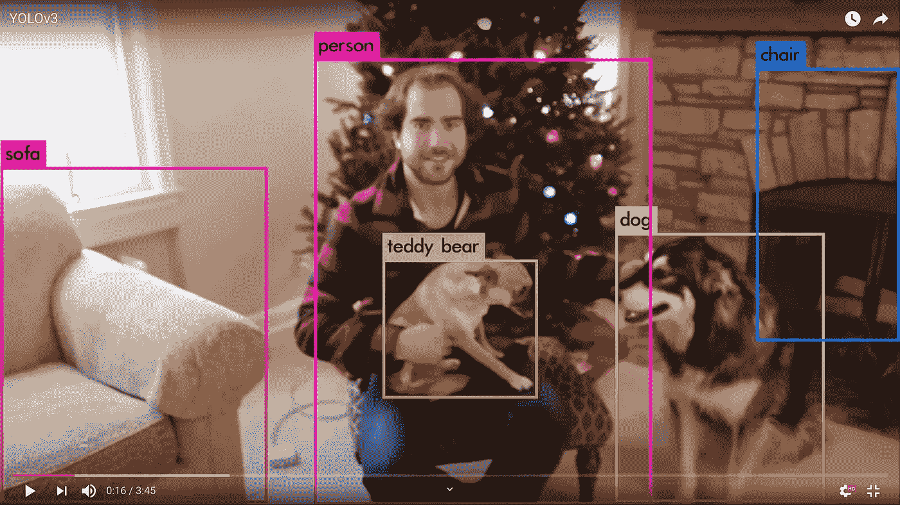

在[视频](https://www.youtube.com/watch?v=MPU2HistivI)中的 00:16。啊，多可爱的泰迪熊啊。等等什么？

为什么会这样？

还记得第一部分中关于神经网络如何获取一幅图像，将事物相乘并相加，当结果为 0 时，你有一只猫，而 1 将是一只狗的讨论吗？让我们稍微调整一下。在 YOLO 的例子中，你得到的不是一个简单的总和，而是一个由数字组成的*数组*或*列表*。第一个可能是一只猫的分数，第二个可能是一只狗的分数，依此类推，你会得到分数最高的那个。这些分数也被限制为 0 到 1 之间的分数值，并且可以被解释为概率。这些分数可能会在视频中每帧闪烁和振荡一点。如果你看过 TED 演讲，你会看到这些分数显示出来:

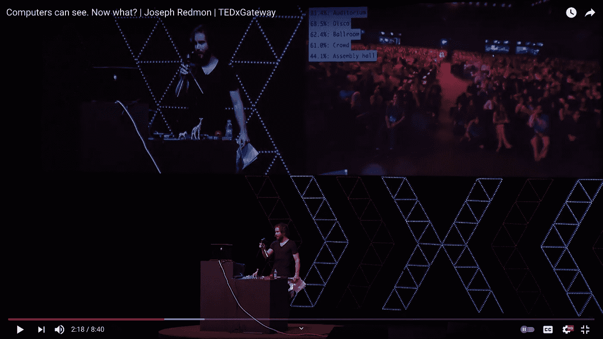

2 点 18 分的 TED 演讲。观察五个预测，每个预测都有自己的分数，以百分比表示。

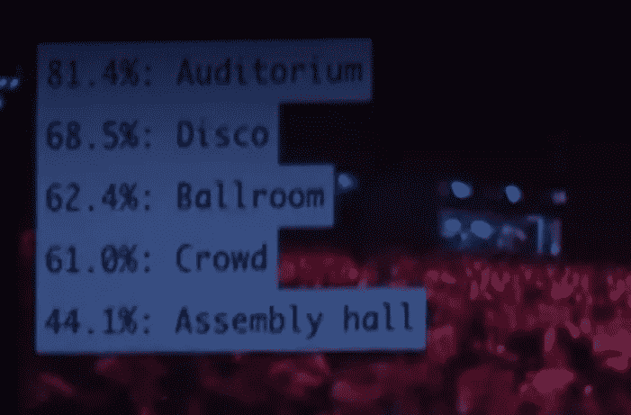

同样的图片，但是放大了预测和它们的分数。

这些分数和预测是每幅图像的*，*所以如果你在 [TED 演讲](https://www.youtube.com/watch?v=XS2UWYuh5u0)中观察，它们实际上会在帧与帧之间闪烁很多。

现在回到那张狗被错误分类的图片，中间的检测可能通常对“狗”有很高的分数，但是对于那个特定的帧，“泰迪熊”的分数超过了狗的分数。事情就是这样。甚至我们人类有时也会误认东西，对吗？尤其是如果他们有相似的特征。

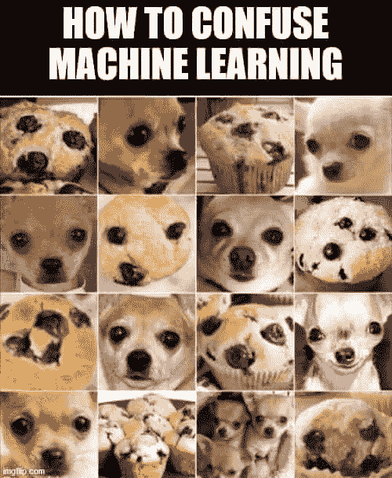

这看起来很美味…什么？[来源](https://twitter.com/LeonyMerks/status/1352530288195162114/photo/1)

我们该如何补救？一种方法是有更多更好的图像进行训练，类似于我们年轻的时候学习东西叫什么。另一种方法是根据经验调整分数阈值。所以，只有当分数高于某个阈值时，我们才说有一只狗，例如，如果分数高于 0.9，或者 90%。我提到的*是经验上的*在实践中，这将受到你的训练数据、摄像机高度、角度、照明和你的具体应用环境等因素的影响。对于高安全性的人脸认证，您可能希望阈值大约为 99.9%。另一方面，如果你想要黑名单上的罪犯的实时警报，那么这个门槛可能会更低；可能会有错误的警报，但最好是谨慎行事，然后仔细检查警报，而不是因为过于小心错误分类而错过目标。

在 startup 中，在达尔米和团队正在为他们的自动驾驶汽车进行测试的场景中，他们提到了“幽灵”的概念。我认为他们指的不是超自然现象的存在，而是像我们刚刚谈论的那样谈论随机的错误检测，或者可能是在这篇[论文](https://arxiv.org/pdf/2007.05280.pdf)中提到的表面反射。

第十五集。如果检测到错误，自动驾驶汽车可能会突然停下来。

在场景中，他们的自动驾驶汽车突然停下来——幸运的是，因为路上有一只真实的猫，而不是幽灵检测。在现实世界中，必须考虑这种随机和极端的情况。一个孩子可能会突然跟随着一个滚到路上的球，而不知道有什么车。

还有[各种级别的自动驾驶](https://en.wikipedia.org/wiki/Self-driving_car#Levels_of_driving_automation)(以及必须通过的相应测试)，有些只需要司机偶尔干预，当然圣杯会是一辆完全自动驾驶的汽车，当它载你到目的地时你可以在里面睡觉。

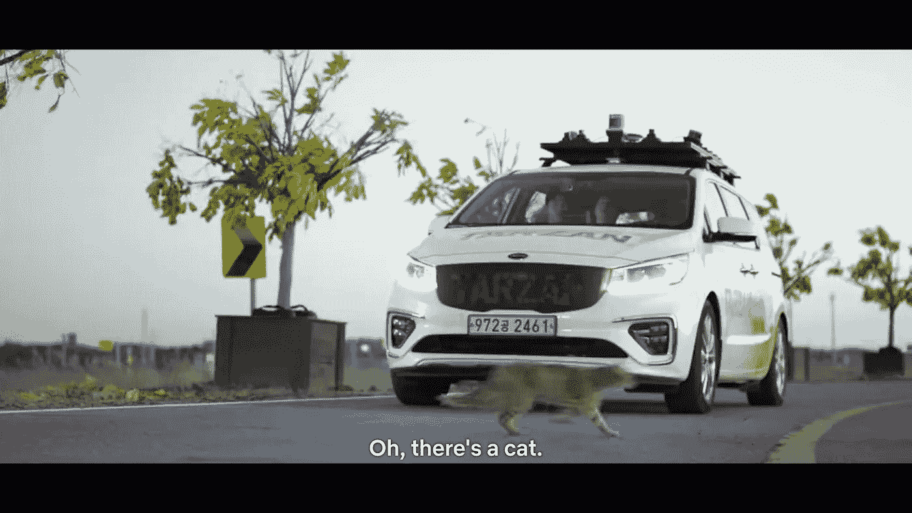

第十五集。自动驾驶汽车必须能够应对最糟糕的情况，比如一个孩子不知不觉地跑向马路，或者在这种情况下，一只流浪猫。

也可能存在道德困境。假设发生了事故，汽车将驶向许多不知情的行人——由于行人更多，汽车应该优先考虑他们而不是乘客吗？但是你还会坐这样一辆被编程的车吗？

此外，对于手动驾驶的汽车，在这种紧急情况下，司机的反应只是一种反射——本能，而不是像工程师为自动驾驶汽车编程那样预先确定的。在这个 [TED 视频](https://www.youtube.com/watch?v=ixIoDYVfKA0)中更详细地讨论了这种情况和其他情况。

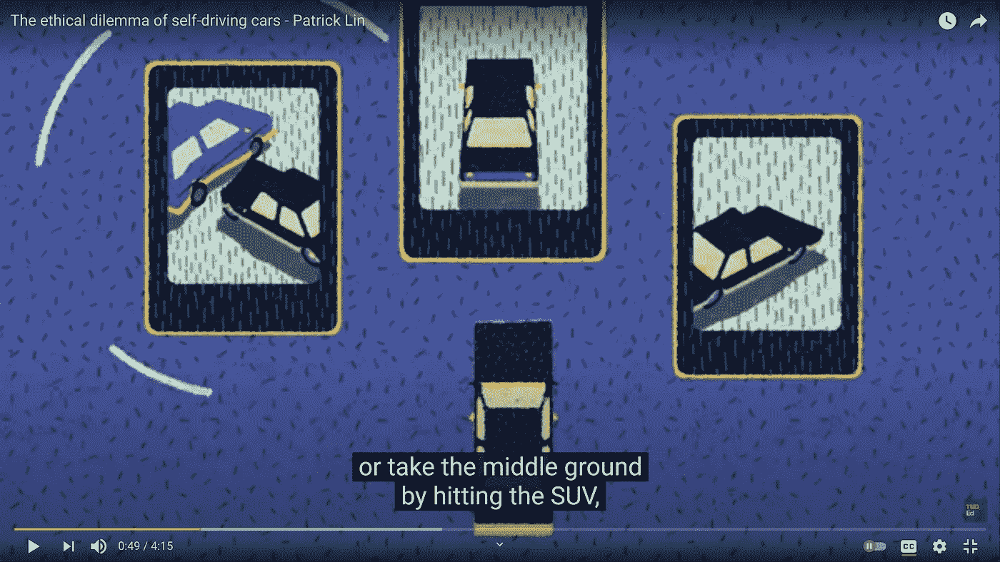

我们甚至应该对汽车在紧急情况下的反应进行编程吗？这在这个 [TED 视频](http://x-special/nautilus-clipboard copy recent:///cfd3b1f5bfcf2c8003c554ab5ff9c07c)中有更多的讨论。

因此，总而言之，在自动驾驶汽车的发展中，必须解决道德问题和政府监管问题。这些都是必须解决的障碍，再加上已经具有挑战性的工程研究，以达到尽可能高的精度。

现在，说到获得最高的准确性，让我们稍微转换一下话题，转而讨论一下这些指标…

**#4。我们有 99.99%的准确率！！！**

抗菌肥皂通常会做出这样的声明。它们可以杀死 99.9%的细菌或类似的东西。然而，对于人工智能来说，这种说法可能会让从业者重新审视该技术的细节，而不是直接吸引他们。

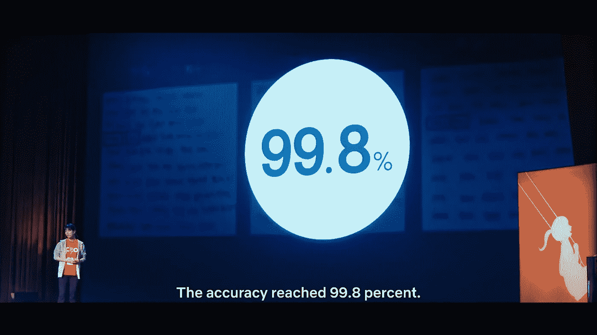

第五集。达尔米声称他们的技术能够达到 99.8%的准确率。

在第五集的黑客马拉松演示中，达尔米声称他们的技术能够达到 99.8%。虽然我不是说这不能做到，只是对于处理和建模数据的人来说，有一种叫做*过度拟合*的东西。

让我们回到之前双胞胎训练模型时的图表。

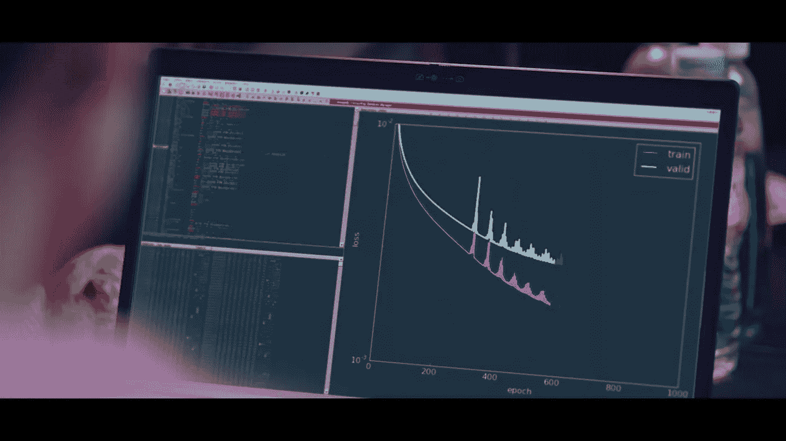

第五集。请注意，有两个图表，一个标记为“train ”,另一个标记为“valid”。

想知道为什么有两个图表吗？如果你靠近点看，你会看到一列标有*列车*，而另一列标有*有效*。这是因为通常情况下，您的数据集分为两部分，训练集和验证集([或简称为“测试”)，但它们可以是不同的](https://stats.stackexchange.com/questions/19048/what-is-the-difference-between-test-set-and-validation-set)集。所以在训练期间，你让你的模型看到来自训练集的图像，让它*学习*并调整神经网络权重(还记得梯度下降吗？).您在测试集上评估性能，但是**而不是**使用这些图像来更新权重。我们为什么要这样做？

让我们看看下面的图表。在左边，你有一个装备不足的模型。该模型没有学习足够的知识，如果你给它一个随机数据点进行预测，误差很可能会很高。

模型可能欠拟合或过拟合，如这里的[所解释的](https://medium.com/greyatom/what-is-underfitting-and-overfitting-in-machine-learning-and-how-to-deal-with-it-6803a989c76)。你也可以[搜索“过拟合图”](https://www.google.com/search?q=overfit+graph)的图片查看更多例子。

下一张图是适当的，它抓住了数据的总体趋势。在这里，曲线非常接近(虽然不完全通过)数据点，损失足够低，你可能有很好的精度与这个模型。

但是，不要过度。在第三张图中，我们可以看到过度拟合的样子。该图精确地穿过数据点，这里的损耗非常低。不利的一面是，由于过多地查看数据，它变得过于偏向于目前所看到的情况，并失去了概括的能力。例如，在图的右侧，曲线的趋势是向下的，但如果你在宏观层面上比较趋势，整个事情实际上应该是向上的，正如充分拟合和稳健的图所示。

这里打个比方。假设你有一架私人飞机，你正在为它雇用一名飞行员。飞行员在考试中表现很好，但问题是飞行员事先知道考试问题，因为这些问题与他在学习时看到的问题非常相似。你会觉得安全，并打赌飞行员在现实世界中会做得很好吗？或者你更愿意有一个参加了考试的飞行员，遇到了以前没有见过的问题，但还是做得很好？如果你的答案是后者，那么神经网络也是一样。

所以对于神经网络，一般来说，你不会真的使用相同的图像来训练和评估它的性能，因为那会产生偏见。你可能还想检查你没有训练太长时间，因为可能会有一个点，训练损失仍然下降，但根据测试集的评估，发现准确性实际上恶化了。

同样，像 Samsan Tech 团队这样的人想出非常高的精确度也不是不可能的，但应该检查他们是否做了正确的设置，并且该模型实际上是健壮的和概括良好的。在实践中，也有标准数据集用于衡量模型的准确性；对于物体检测，突出的是 [COCO](https://cocodataset.org/#home) 和 [PASCAL VOC](http://host.robots.ox.ac.uk/pascal/VOC/) 数据集。作为参考，当 [YOLOv3 发布](https://pjreddie.com/darknet/yolo/)时，它在 COCO 数据集上的平均精度为 55.3%(或简称为 mAP，你可以[在这里](https://jonathan-hui.medium.com/map-mean-average-precision-for-object-detection-45c121a31173)阅读更多关于这个物体检测指标的信息)。从那时起，其他的变体和神经网络已经被开发出来以增加这种准确性。

另一件要提到的事情是，除了标准数据集上的基准，在实践中，当部署实时计算机视觉应用时，还有其他事情要考虑。这些因素包括物理因素，如摄像机的高度和角度、房间内的照明，以及与准确性的权衡，以平衡速度、硬件预算以及预测失误情况下的相关风险和后果。

在这一点上，我们已经涵盖了很多关于人工智能的内容，包括技术性和非技术性的。让我惊讶的是，关于人工智能还有最后一件事被谈论了很多，也是初创公司也提到的。那就是…

**#5。工作置换的问题**

在该系列的后半部分，Injae 展示了她团队的人工智能技术，该技术利用闭路电视自动检测和预防犯罪，远远超出了人类的监控范围。

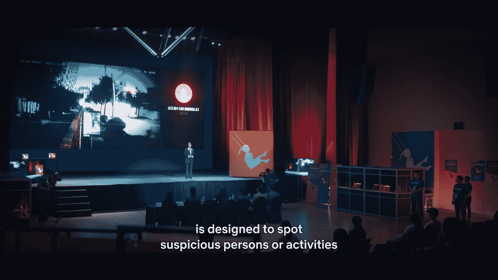

第 11 集。Injae 提出的技术有助于防止更大规模的犯罪。

该解决方案不仅可以提高市民的安全性，而且从运营和业务的角度来看，还可以节省成本。差很多。

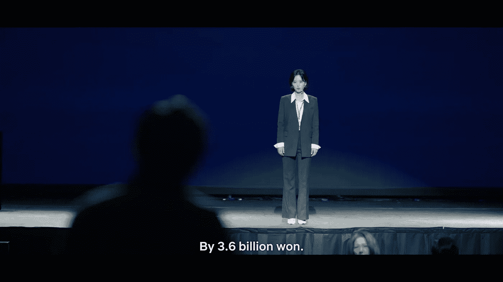

第 11 集。36 亿韩元，约合 300 万美元。那可是一笔不小的开销，或者说是节省！

当然，这些同样的成本节约是以被取代的劳动力为代价的。

第 11 集。劳动力成本节约=岗位置换。

第 11 集。Dosan 的父亲是安全团队的一员，如果人工智能解决方案得以实施，他将受到影响。

作为一个从事人工智能工作的人，我经常遇到这个话题。关于这一点，已经有许多文章、研究和分析。就我个人而言，我认为这不仅仅是一个问题，而是可以分为两个独立的不同的问题:第一个是创新，另一个是工作转型本身。

至于创新，我认为答案通常是走向更好的技术。Injae 实际上提到了这一点:

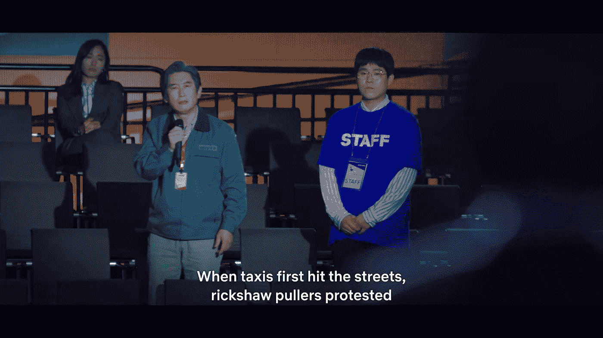

第 11 集。这个问题甚至可以追溯到几个世纪前，远在人工智能之前。

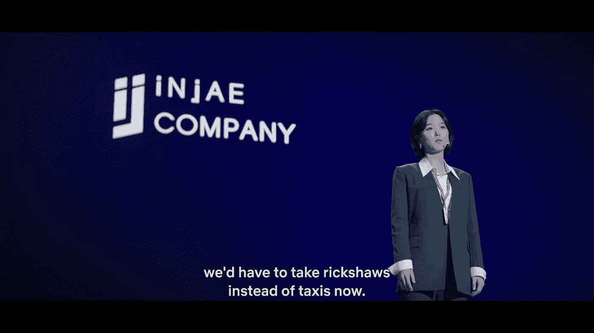

第 11 集。“如果我们优先考虑他们的生计而不是创新，我们现在就不得不乘坐人力车而不是出租车。”

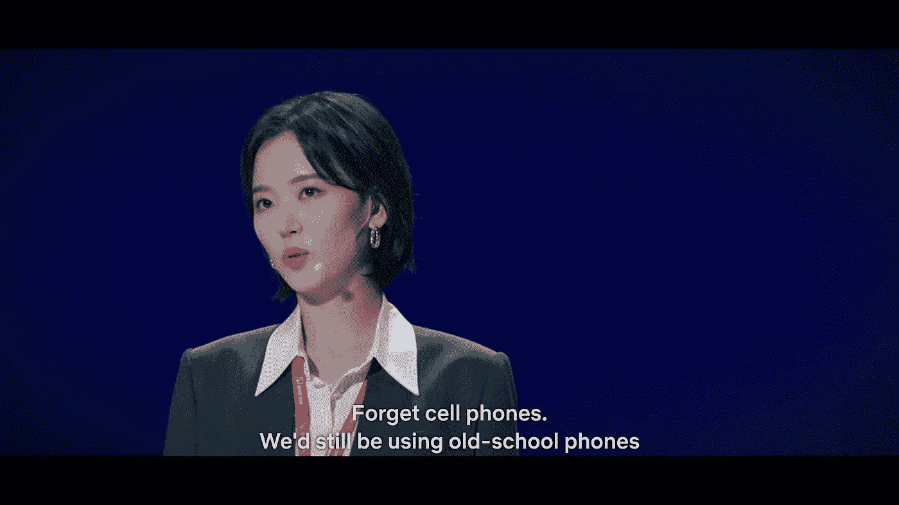

第 11 集。“忘记手机。我们仍然会使用老式的电话接线员。”

如果我们扼杀技术，那么我们今天就不会有汽车，但仍然会使用马，这样与马相关的工作就可以保留下来。

这也不仅仅是我们的事。Injae 指出，这样的选择也会对后代产生影响。

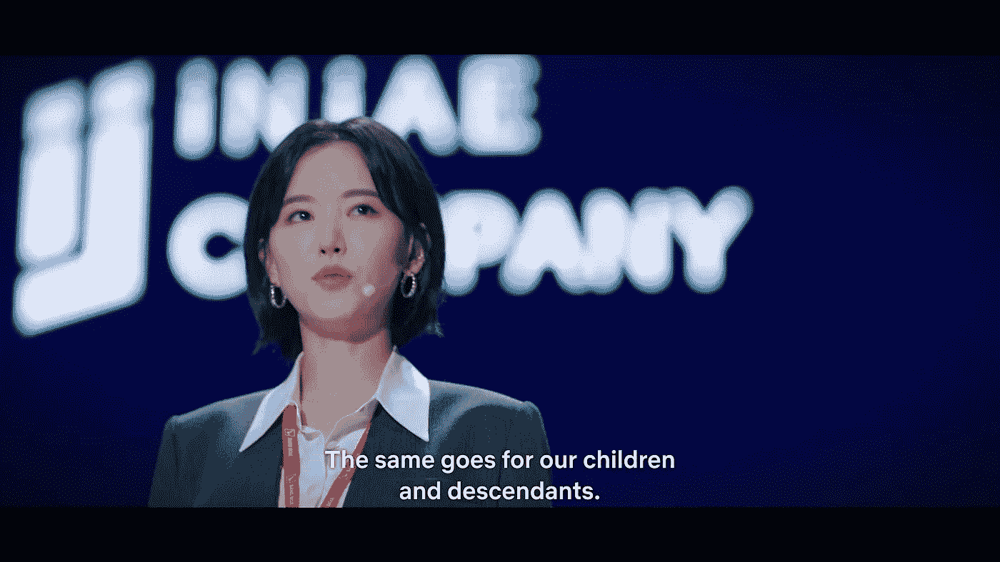

第 11 集。创新不仅影响我们，也影响我们的后代。

现在，一个观察是，这些天来，我们没有那么多与马相关的工作来运送人们，但我们有出租车司机，甚至在零工经济中这个角色已经民主化的平台。这甚至适用于数字产业。当个人电脑出现时，与编辑和重新键入文件相关的工作受到了影响，**但**也因此产生了 1580 万个**净**新工作，占就业的 10%([麦肯锡报告第 40 页](https://www.mckinsey.com/~/media/BAB489A30B724BECB5DEDC41E9BB9FAC.ashx))。

所以工作可能会被取代，但是更多的工作也会被创造出来。

对于人工智能来说，一个巨大的转变可能是关于数据注释。正如我们已经知道的，为了让神经网络工作良好，它们需要大量高质量的图像，而这些图像必须根据计算机视觉任务进行标记。对于一些人来说，只有图像的类别可能就足够了，但对于其他人来说，可能需要在对象周围绘制边界框，标记[身体部位(“关键点”)](https://cocodataset.org/#keypoints-2020)，甚至[按像素分割对象](https://cocodataset.org/#detection-2020)。标签化的训练数据对这个行业非常重要，甚至有公司正在这样做，并且能够达到[独角兽地位(即估值超过 10 亿美元)](https://techcrunch.com/2019/08/05/scale-ai-and-its-22-year-old-ceo-lock-down-100-million-to-help-label-silicon-valleys-data/)！

对我来说，我认为另一个可能发生的机会是，如果手动任务可以自动化并更有效地完成，时间将被释放出来，这样人们就可以学习新的东西并提高自己的技能。他们能够为社会做出贡献，做更多有意义和其他有影响力的事情。

这个话题有很多方面，我们可以继续下去。目前，我只是对初创企业处理这个话题的方式感到满意。

# “如果这个世界上的每个人都像你和我的儿子一样，这个世界将很快成为一个创新的地方。”

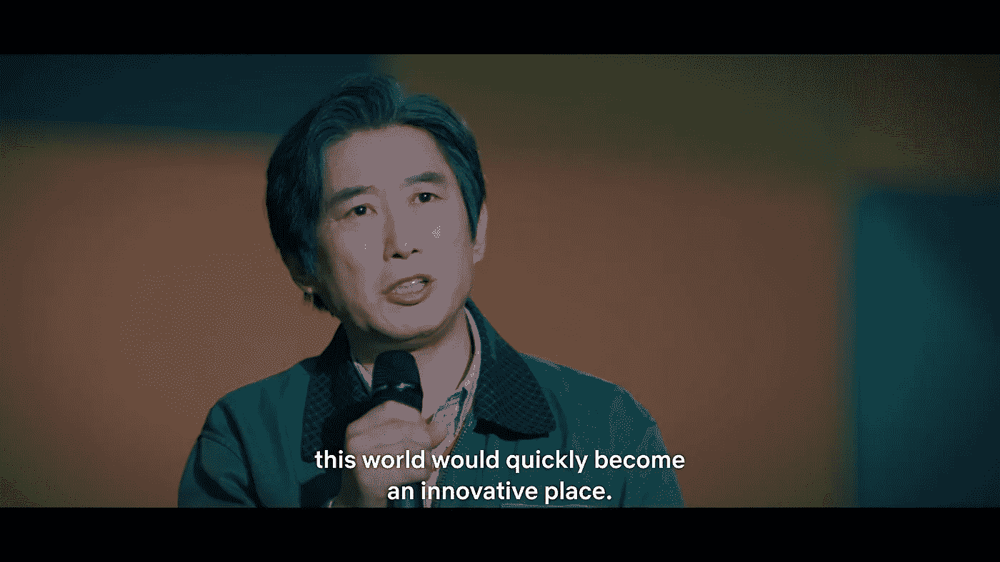

第 11 集。“如果这个世界上的每个人都像你和我的儿子一样，这个世界将很快成为一个创新的地方。”

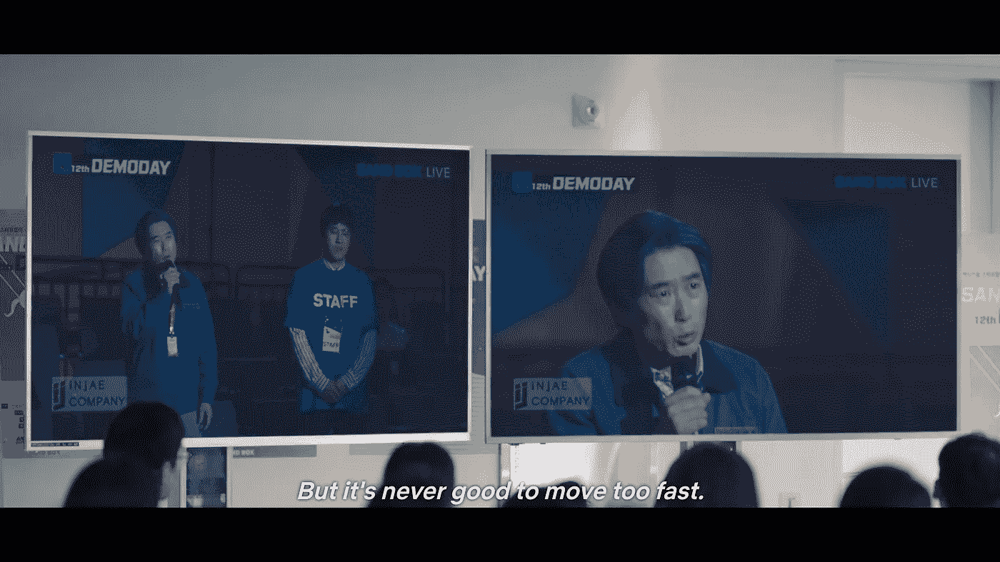

第 11 集。“但进展太快从来都不是好事。”

## “但进展太快从来都不是好事。这种速度会伤害很多人。我们会看到很多人失去工作，无法适应变化。我们需要像我这样的人来让事情稍微慢下来。”

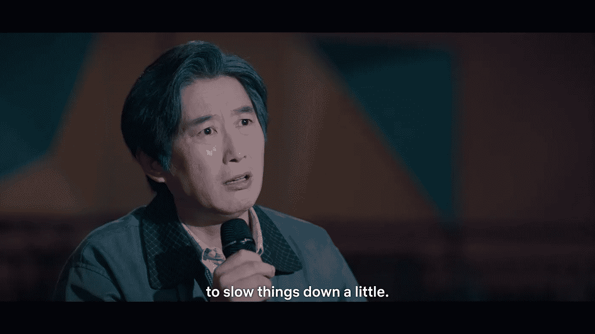

第 11 集。“我们需要像我这样的人来让事情稍微慢下来。”

第 11 集。"帮助找到正确的节奏，让人们调整和生活."

# “…帮助找到合适的节奏，让人们能够调整和生活。”——南成焕

因此，是的，我们应该努力创新，让世界变得更美好，但与此同时，我们也应该考虑我们这样做的速度，并意识到我们的变化如何影响当前的其他人。

咻，那花了一段时间！如果你成功了，恭喜你！希望你已经对人工智能有所了解，包括技术细节和与社会相关的非技术因素。

如果所有这些都激起了你学习更多的兴趣，那么这里有一些资源。

**学习编程**

如果你没学过编程，这是根本。Python 是我个人推荐的——它被设计得干净易学，被用于不同的领域(机器学习、计算机网络和安全、web 开发)。

*   寻找像 codeacademy.com[和](https://www.codecademy.com/)这样的网站。这个是交互式的，你可以在浏览器中自己编码，所以从它开始是很好的。我有一段时间没用这个了，但是我觉得这个和其他网站应该不错。
*   Reddit 非常有用。[寻找类似](https://www.google.com/search?q=reddit+learn+programming+site%3Areddit.com) [/r/learnpython](http://reddit.com/r/learnpython) 、 [/r/learnprogramming](https://www.reddit.com/r/learnprogramming/) 、 [/r/computerscience](https://www.reddit.com/r/computerscience/) 的 subs 。浏览他们的 wiki/FAQ，关注相关的子栏目。
*   VisualGo 由新加坡国立大学的教授开发，包含标准数据结构和算法的交互式可视化。
*   了解大 O 符号。[备忘单](https://www.bigocheatsheet.com/)。
*   [我在这里](https://gitlab.com/jddantes/the-code-project)整理了更多的资源，包括一些主题的文章和一般的编程练习。这些涵盖了初学者的概念，如[循环和数组](https://gitlab.com/jddantes/the-code-project/-/tree/master/arrays-loops)，但也包括更高级(也更有趣！)像[动态规划](https://gitlab.com/jddantes/the-code-project/-/tree/master/dynamic-programming)和[最大流网络](https://gitlab.com/jddantes/the-code-project/-/tree/master/competitive-programming/graphs/max-flow)这样的话题。
*   有一个部分标有[“竞争性编程”](https://gitlab.com/jddantes/the-code-project/-/tree/master/competitive-programming)。如果你不熟悉，这指的是 [*算法*类型的竞赛](https://icpc.global/)，在那里你解决计算机科学/数学问题，而不是黑客马拉松类型的，在那里你在 24 小时内建立并推销一个应用程序或网站。
*   这些竞赛中的问题类似于技术面试中的问题，通常在申请软件工程职位时可能会有帮助(即，即使你的目标不是机器学习的东西)。我计划在将来的某个时候写一些介绍性的文章；你可以关注这个账户，或者[在这里留下你的电子邮件，如果你想在这个账户发布的时候得到更新](https://jddantes.substack.com/p/welcome)。

**学点数学**

在这方面，我没有任何特别喜欢的资源，但是在学习更多关于人工智能的知识之前，你可能需要一些统计学、线性代数和微积分的基础知识。(或者也许只是深入研究人工智能资源，然后在这个过程中了解你需要什么。)

**学习人工智能的资源**

我的建议是，首先学习一般用于数据建模的经典技术，甚至回到硬件不能真正运行神经网络的时候。

这不是一个严格的要求，但我建议您了解以下内容:

*   图像处理技术([空间](https://www.geeksforgeeks.org/spatial-filtering-and-its-types/)和[频率变换](https://hicraigchen.medium.com/digital-image-processing-using-fourier-transform-in-python-bcb49424fd82)，RGB/ [HSV/HSL](https://en.wikipedia.org/wiki/HSL_and_HSV) ，[滤波器](https://en.wikipedia.org/wiki/Digital_image_processing#Filtering)，[边缘检测器](https://en.wikipedia.org/wiki/Edge_detection))。这些经典的手动设计的[过滤器也让](https://cs231n.github.io/understanding-cnn/)洞察到[卷积神经网络(CNN)](https://cs231n.github.io/convolutional-networks/)如今自动完成了什么。
*   逻辑和线性回归
*   随机的树/森林
*   朴素贝叶斯
*   支持向量机
*   k 近邻
*   k 均值聚类
*   广度优先搜索(BFS)、深度优先搜索(DFS)、A*搜索
*   极大极小，阿尔法-贝塔剪枝
*   集成学习(例如 AdaBoost)
*   主成分分析
*   独立成分分析

特别是对于神经网络，也有很多资源，从[媒体文章](https://jonathan-hui.medium.com/deep-learning-series-f6b46d1e568e)、[出版物](https://towardsdatascience.com/)和博客帖子到几个在线课程。我推荐斯坦福大学的这些:

*   [CS229](http://cs229.stanford.edu/) 。经典课程。这实际上涵盖了上面提到的几个主题。
*   。卷积神经网络和计算机视觉。[注意事项](https://cs231n.github.io/)。 [YouTube (2017)](https://www.youtube.com/playlist?list=PL3FW7Lu3i5JvHM8ljYj-zLfQRF3EO8sYv) 。

还有这样的网站:

*   [https://www.fast.ai/](https://www.fast.ai/)
*   [http://neuralnetworksanddeeplearning.com/](http://neuralnetworksanddeeplearning.com/)
*   [https://www.deeplearningbook.org/](https://www.deeplearningbook.org/)。另一个经典，good fellow(GANs 的创造者)等人写的书。这是相当密集的；这本书我还没有完全通读过，但是我上的研究生课程以此为参考。
*   Reddit 还是有帮助的。检查[/r/learn 机器学习](https://www.reddit.com/r/LearnMachineLearning)和相关接头。

这个领域变化如此之快，以至于一个学期教的东西可能与下一个学期不同，所以了解最新的论文和发展是一个好习惯。

我还建议你选择一个你感兴趣的项目或主题，然后开始学习并尝试构建它，不管你是否完全理解细节。

我们不一定了解汽车是如何工作的，但我们知道踩下踏板和刹车会给我们带来价值:到达目的地。不是每个人都需要或想要了解汽车如何工作才能使用它，但对于那些想改进它的人来说，他们可以花时间打开引擎盖，了解发动机及其内部结构。

快乐学习！

如果你没有看过之前的帖子，[你可以从这里开始(第一部分)](https://medium.com/@jddantes/an-ai-practitioners-guide-to-the-kdrama-start-up-56ab95c2afd8)，或者[到第二部分这里](https://medium.com/@jddantes/an-ai-practitioners-guide-to-the-kdrama-start-up-part-2-fe8473c9c122)。

**致谢**

感谢 Lea 的建议和评论这篇文章的初稿。

[想要更多？获取更多类似故事的个人电子邮件通知，从技术和教育到生产力和自我提高。](https://jddantes.substack.com/p/welcome)

在 [Twitter](https://twitter.com/jddantes) 、 [LinkedIn](https://www.linkedin.com/in/jddantes/) 上联系，获取更频繁、更简短的更新、见解和资源。