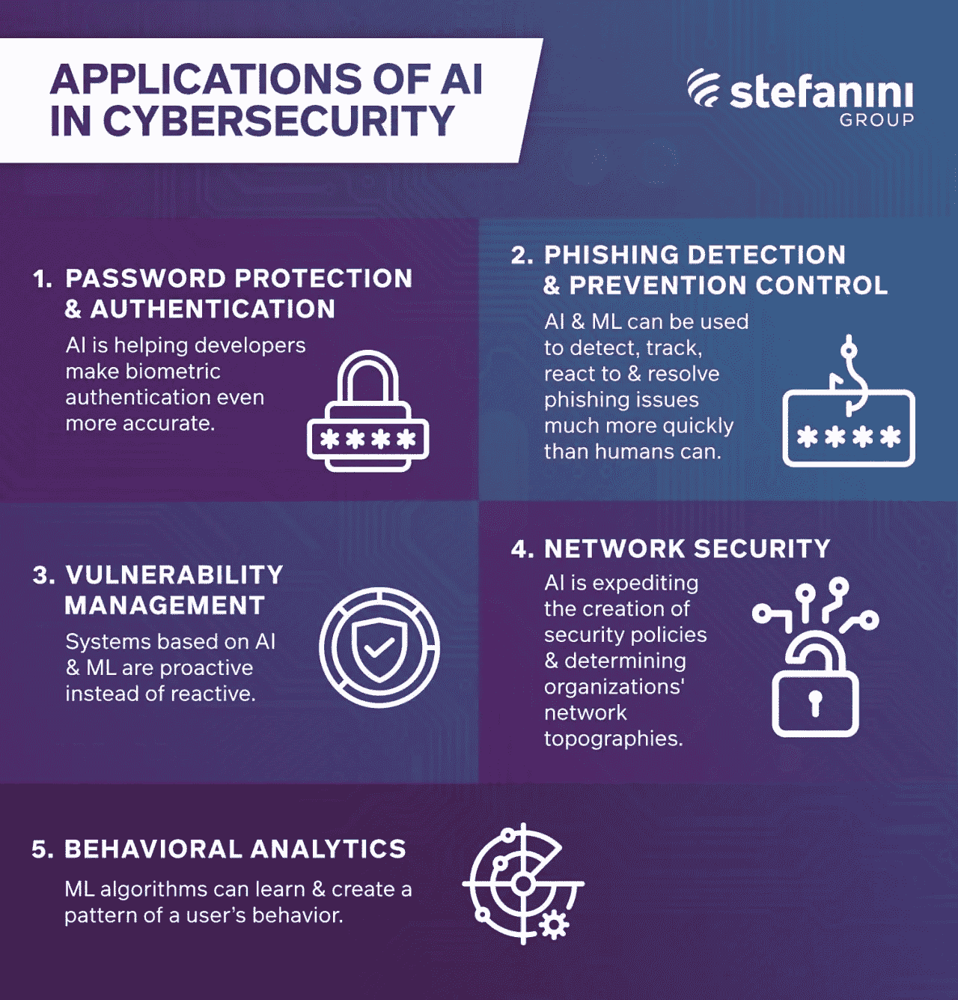
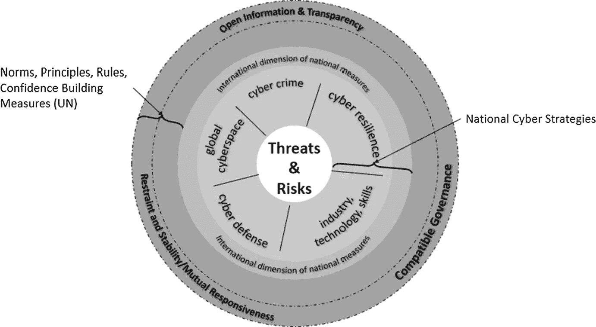

# 网络安全领域的人工智能评估

> 原文：<https://pub.towardsai.net/an-assessment-of-artificial-intelligence-in-the-cybersecurity-sector-244f92e4db4b?source=collection_archive---------3----------------------->

# 介绍

最近，人工智能(AI)技术被用于各种网络安全应用。人工智能在识别异常流量、网络状况感知、监控有害活动和用户访问认证方面的应用。人工智能和网络安全在多个跨学科领域(人工智能)重叠。一方面，深度学习和其他人工智能技术可以用于网络安全，以建立智能模型来实现恶意软件分类，入侵检测和威胁情报感知。另一方面，人工智能模型可能遇到的不同网络风险会干扰它们的决策、学习和样本。

源图像

人工智能(AI)的发展吸引了学术界和实践者的大量关注，为其在公共部门的应用开辟了各种各样有吸引力的选择。因此，越来越需要深入了解基于人工智能的应用程序的范围和影响，以及与之相关的挑战。然而，以前的研究只关注少数人工智能应用和问题。因为没有对基于人工智能的应用和公共部门的困难的全面概述，我们的概念方法评估并汇总了科学文献中的重要概念，以给出人工智能应用和相关问题的综合描述。

源图像

# 人工智能在网络安全中的地位

我们现在可以获得广泛的选择，但由于数字时代，我们也更容易受到许多风险的影响，包括那些可能危及我们个人数据的风险。现在对网络安全的需求比以往任何时候都更大。在过去的 10 年中，由于黑客能够随时从世界任何地方攻击他们的目标，身份盗窃、财务损失和数据泄露事件激增。当与机器学习相结合时，人工智能在网络安全中发挥着越来越重要的作用。据 ZDNet 报道，新的安全解决方案正在使用来自数百万在线活动的大数据来分析和识别危险，包括钓鱼欺诈和新型恶意软件。

来源[https://stefanini . com/en/trends/news/role-of-the-artificial-intelligence-in-network security-to-protect-busi](https://stefanini.com/en/trends/news/role-of-artificial-intelligence-in-cybersecurity-to-protect-busi)

人工智能编程的三个主要步骤如下:

1.  推理:对于每个需要的动作，这种方法侧重于选择最佳算法。
2.  学习:收集数据和制定规则，将知识转化为程序可以完成的动作，这是这个层次所需要的。
3.  自我修正—该组件的主要目标是通过优化算法来有机地提高性能。

人工智能在网络领域的应用为负责保护人民、系统、组织和社区免受当今无情的网络攻击者攻击的企业和政府领导人提供了相当大的优势。在整个网络生命周期中，人工智能执行各种有用的任务，包括监控大量数据以检测偷偷摸摸的恶意攻击，计算与众所周知的漏洞相关的风险，以及在威胁搜索期间提供数据驱动的决策。对于经验丰富的网络专家来说，这些品质是力量的倍增器。

源图像

一个人可能无法识别公司面临的所有风险。由于各种原因，黑客每年发起 1 亿次攻击。未知攻击有可能对网络造成巨大危害。更糟糕的是，如果你不及时发现并阻止它们，它们可能会造成潜在的伤害。采用现代解决方案对于挫败攻击者试验新战术至关重要，例如恶意软件攻击和复杂的社会工程。人工智能已被证明是发现和阻止不可预见的危险伤害组织的最佳安全工具之一。

保护公司网络的秘密是漏洞管理。如前所述，一个典型的组织每天都面临着多种危险。为了安全起见，它必须能够找到、识别并阻止它们。人工智能研究可以通过分析和评估当前的安全解决方案来帮助管理漏洞。由于人工智能检查系统的能力比网络安全专家更快，你解决问题的能力显著提高。它通过识别计算机系统和公司网络中的弱点，帮助组织专注于重要的安全职责。因此，管理漏洞和快速保护公司系统是可行的。

# 网络安全中的人工智能:问题与挑战

AI 面临的最大挑战是安装起来有多贵。由于大多数人工智能仍处于试验和发展的初级阶段，其成本可能会使许多企业望而却步。这将使黑客更容易发动更迅速、更复杂的攻击。犯罪分子可以利用机器学习来确定一些网络攻击失败的原因，并创建更有效和成功的攻击模型，类似于网络监控和观察用户行为模式。模仿知名软件的恶意软件同样可以使用人工智能来生产。它可能被用来执行危险的攻击而不被发现，并发现更多关于目标网络的模式。

来源[https://link . springer . com/article/10.1007/s 11023-019-09508-4](https://link.springer.com/article/10.1007/s11023-019-09508-4)

因为人工智能仍然主要是实验性的，处于起步阶段，它的成本可能会让许多公司望而却步。因此，黑客会发现实施更快、更先进的攻击要容易得多。犯罪分子可以使用机器学习来了解某些网络攻击失败的原因，并通过研究用户行为模式和网络监控来创造更多成功的攻击。AI 面临的最大问题是安装费用。因为人工智能仍然主要是实验性的，处于起步阶段，它的成本可能会让许多公司望而却步。因此，黑客会发现实施更快、更先进的攻击要容易得多。AI 面临的最大问题是安装费用。

它融合了许多不同的学术领域，包括计算机科学、工程学、化学、生物学、物理学、天文学、神经科学和社会科学。人工智能帮助 SOC 团队创建智能工作流，连接和关联来自许多系统的数据，简化他们的操作，并生成可操作的见解。一致、精确和组织良好的数据对于有效的人工智能至关重要。使用人工智能开发的程序然后产生重新训练模型所需的更高质量的数据。由于它们相互补充和协助，网络安全中足球队和人工智能一起发展和进步。人工智能技术与现有技术相结合的能力是一个重要特征。许多领域都受益于人工智能，包括化学和医学，这些领域的常规诊断现在都是由人工智能辅助计算机开始的。

# 结论

人工智能的定义在这篇博客中有所涉及。而 AI 在网络安全行业中又扮演着怎样的角色？再者，基于人工智能的网络安全系统面临哪些问题和困难？尽管如此，作者认为这个领域需要进一步的研究和发展才能变得更好。

在那之前，再见所有的读者。

源图像

## 参考

1.  [https://link.springer.com/article/10.1631/FITEE.1800573](https://link.springer.com/article/10.1631/FITEE.1800573)
2.  [https://www . tandfonline . com/doi/ABS/10.1080/01900692 . 2018 . 1498103](https://www.tandfonline.com/doi/abs/10.1080/01900692.2018.1498103)
3.  [https://link . springer . com/article/10.1007/s 11023-019-09508-4](https://link.springer.com/article/10.1007/s11023-019-09508-4)
4.  [https://link . springer . com/article/10.1007/s 11023-019-09504-8](https://link.springer.com/article/10.1007/s11023-019-09504-8)