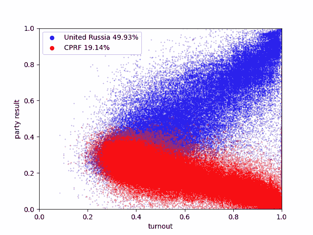
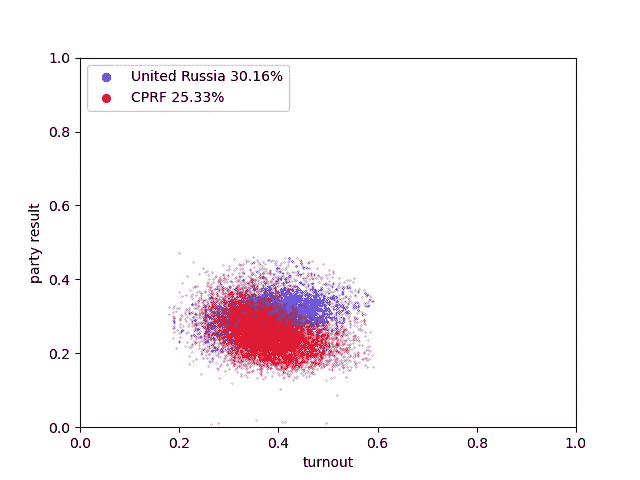
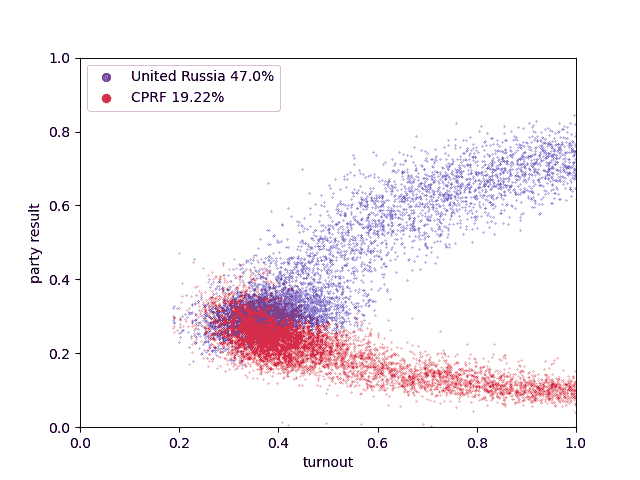
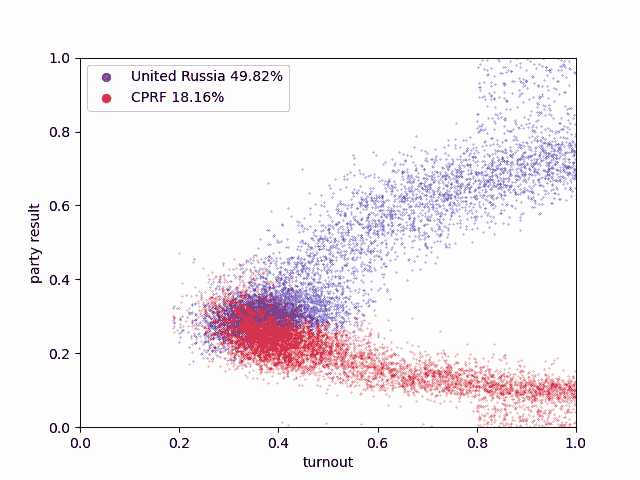
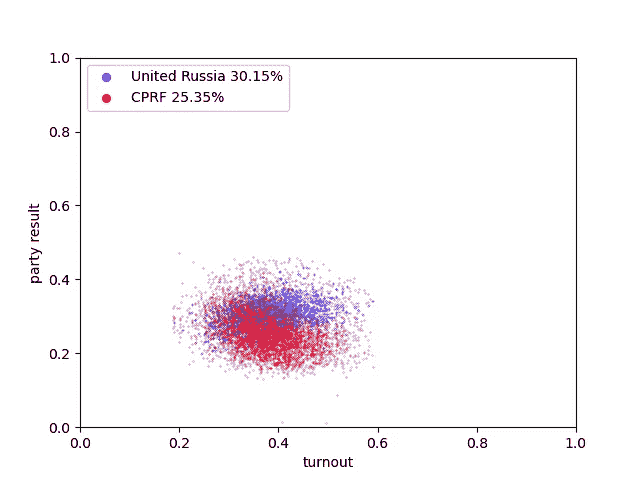
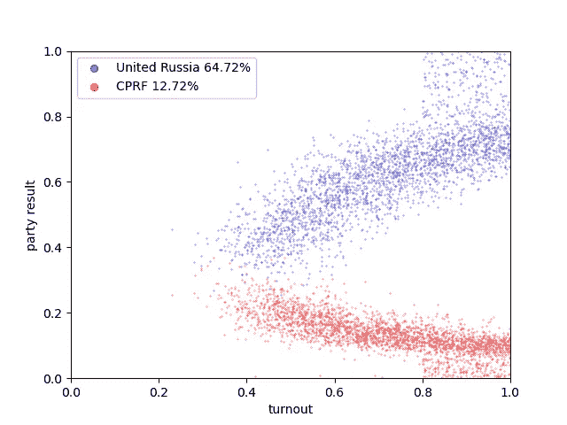
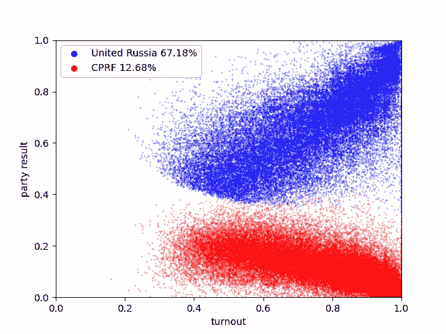
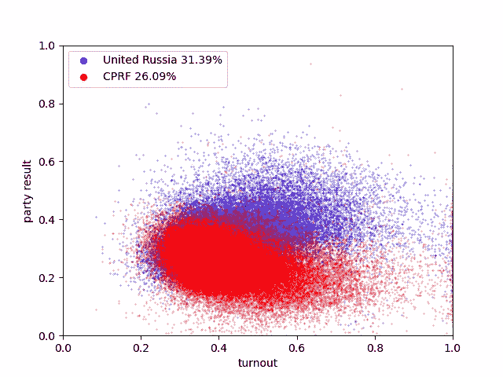
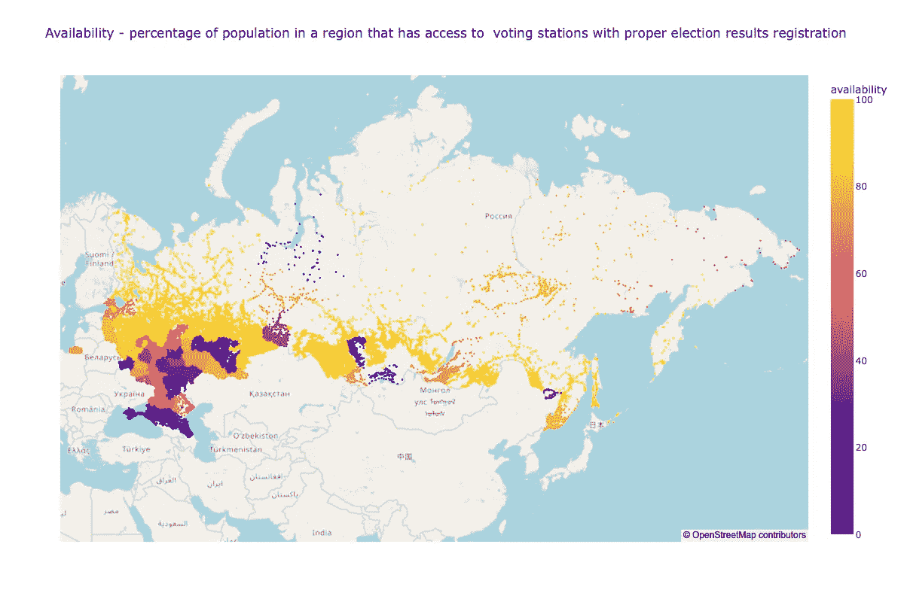

# 使用机器学习找出 2021 年俄罗斯议会选举真实结果的尝试。

> 原文：<https://pub.towardsai.net/an-attempt-to-find-out-real-results-of-2021-russia-parliamentary-elections-using-machine-learning-9ec4cbe7b869?source=collection_archive---------2----------------------->

## [机器学习](https://towardsai.net/p/category/machine-learning)

自 2003 年以来，“统一俄罗斯”党在俄罗斯议会“杜马”中占有多数席位。2021 年，执政党再次赢得决定性胜利，尽管俄罗斯公民的收入已经超过 10 年没有增长。但这有那么决定性吗？当事情涉及政治时，人们很容易找到许多令人信服的论据来证明完全相反的观点。在这种情况下，调查原始数据总是有用的。在本文中，我们将使用 pandas、matplotlib、plotly 和 sci-kit-learn 等知名且可靠的工具来检查 2021 年俄罗斯议会选举结果。我们将模拟两种类型的欺诈:选票人员配置和选票误录。基于模拟结果，我们将教授一个逻辑回归模型，并让它判断 2021 年选举期间是否发生了任何选举欺诈。最后，我们将创建一个表格和一个地图，指出俄罗斯哪些地区更有可能出现正确的选举结果登记问题。

首先，让我们描述一下俄罗斯投票过程的一些基本原则，这些原则在本文的上下文中很重要。俄罗斯的选举不是由国家组织的，而是由独立的选举委员会组织的。这些委员会由兴趣广泛的人组成。总的来说，大约 96，000 个投票站和相应的委员会通常在联邦选举中组成。1000-2000 人，居住在一个紧凑的地区，可以在一个中等规模的投票站投票。几乎任何俄罗斯公民都可以成为该委员会的成员并组织选举。最简单的方法是报名到居住地附近的选举委员会工作。

选举委员会成员代表谁的利益？第一，参加选举的各个政党的利益。因此，举例来说，在许多委员会中，你会发现本文写作时俄罗斯两个最大政党的代表——“统一俄罗斯”(UR)和“俄罗斯联邦共产党”(CPRF)。此外，在委员会中，你可以发现普通公民认为组织高质量的选举是一项重要的任务，并愿意为此牺牲大量的个人时间。有非营利组织试图协调这些公民的活动。例如，全俄保护选民权利公共运动" Golos "被指控接受外国资助，并在 2021 年 8 月选举前一个月被贴上外国代理人的标签。理论上，所有这些多方向的力量应该相互平衡，保证计票质量。在许多地区，这正是正在发生的事情。例如，在莫斯科的大多数线下投票站，这一条件在上次选举中得到满足，俄罗斯联邦共产党以微弱优势获胜。

然而，要让一群人带着他们的代表覆盖所有投票站，每个站点至少需要三个人。在疫情，投票时间增加到三天，所需工时增加了两倍。也就是说，每一方都必须由大约 30 万人代表，每人必须工作大约 30 个小时。即大约 900 万工时。2021 年，俄罗斯的平均工资为每小时 5 美元，仅控制正确的计票就需要超过 4500 万美元。组织选举的群体的资源是不平等的。甚至 2020 年统一俄罗斯党的官方预算是 1.28 亿美元，而俄共的官方预算只有 1700 万。统一俄罗斯党是唯一一个有足够的预算来覆盖所有投票站的代表人数的政党。因此，在有些地区，选举仅由执政党的代表组织。不足为奇的是，在这种投票站，选举结果的登记质量会大大降低。

在 2021 年的选举中，14 个政党被允许参加。然而，大的群体没有一个代表在选票上登记，因为许多著名的反对派政治家不被允许参加选举。在这种情况下，许多选民出于抗议可能会选择共产党，因为它是俄罗斯最大的反对党。今年在许多投票站，CPRF 和乌尔都得到了接近的结果，比较两党的结果非常方便。

选举结果是公开信息，可从俄罗斯中央投票委员会网站获得。在这项研究中，我们将使用来自文件“stations.csv”的结果的解析和翻译版本。这个文件和源代码托管在 [GitHub](https://github.com/Basistiy/parlament2021) 上。让我们加载数据:

```
#%% Load data
import pandas as pd
stations = pd.read_csv('data/edata_eng.csv', index_col=0)
```

该数据集由 96307 个投票站的选举结果信息组成。在进一步的调查中，我们不会考虑选民人数少于 100 人的车站，以排除由来自小数字的人为因素导致的结果:

```
stations = stations[stations['total_voters']>100]
```

在数据集中，也有投票站的结果非常不可能，统一俄罗斯党几乎没有选票，而其他一些小党获得压倒性的结果。就像达吉斯坦共和国的第 1521 号投票站。来到投票站的 1650 人中，有 1617 人投票给“绿党”，没有人投票给统一俄罗斯党。这显然是无意误录的结果。我们将通过仅考虑统一俄罗斯党拥有超过 5 张选票的电台来过滤掉这些电台:

```
stations = stations[stations['ur']>5]
```

此外，我们将过滤掉今年在莫斯科引入的在线投票站。今年形成了非常庞大的在线投票站。每个在线电台的选民超过 100000，而没有离线电台的选民超过 5000。这个原因和其他原因使得在线和离线站点的结果很难比较。

```
stations = stations[stations['total_voters']<10000]
```

这些过滤器将投票站的数量减少到 92018 个。

开始分析数据的最佳方式是将其可视化:



2021 年俄罗斯立法选举的选举指纹。

该图显示了统一俄罗斯党和共产党在 y 轴上的百分比，作为 x 轴上选民投票率的函数。每对圆点代表 92018 个投票站中的一个。有时这样的情节被称为‘选举指纹’[1]。在图上可以看到两个集群。稠密的核心，共产党和统一俄罗斯党的结果非常接近:许多红色和蓝色的点重叠。在较高的道岔上有两条尾巴。随着投票率的增加，统一俄罗斯党的结果增加，而共产党的结果减少。中央投票委员会没有发现任何可疑的结果，这些结果是正式的。然而，典型地，在成熟民主国家的选举中，指纹尾簇是不存在的。在彻底检查了高道岔中的情节后，可以发现网格结构。这可能是选票记录错误的证据。人类有喜欢整数的自然倾向，并且更有可能产生整数结果。很多投票站的投票结果都是圆形的，看起来就像选举指纹上的网格。[2,3]

投票委员会的平衡更可能发生在人口密集的地区，因为对立的政党更容易找到足够的代表来覆盖所有的投票站。

让我们检查一下在俄罗斯 43 个大城市中心附近 5 公里的投票站可以观察到的选举指纹。这些电台选举结果可在“cities_ok_eng.csv”文件中找到:

```
city_stations = pd.read_csv('data/cities_ok_eng.csv', index_col=0)
```

2021 年选举结果的这个子集包含关于超过 1200 万人可以投票的 6602 个投票站的选举结果的信息。在下图中，有一个子集的选举指纹。



大城市选举指纹。

在这个选举结果子集中没有“尾部”聚类。让我们看看，如果我们通过一个简单的循环将选票分配给随机选择的投票城市站，会发生什么:

```
city_stations = city_stations.sample(frac=1)
city_stations['fraud'] = False

i = 0
ur_percent = city_stations['ur'].sum()/city_stations['voted'].sum()
for index, row in city_stations.iterrows():
    if ur_percent < 0.47:
        total_voters = row['total_voters']
        voted = row['voted']
        max_fraud = total_voters - voted
        min_fraud = max_fraud*0.05
        number = int(uniform(min_fraud, max_fraud))
        city_stations.loc[index, 'ur'] = row['ur'] + number
        city_stations.loc[index, 'voted'] = row['voted'] + number
        city_stations.loc[index,'fraud'] = True
        ur_percent = city_stations['ur'].sum()/city_stations['voted'].sum()

city_stations['turnout'] = city_stations['voted']/city_stations['total_voters']
city_stations['ur_percent'] = city_stations['ur']/city_stations['voted']
city_stations['cprf_percent'] = city_stations['cprf']/city_stations['voted']
```



大城市选举指纹后，选票人员配置。

在图中，统一俄罗斯党的结果被限制在 80%。让我们用这个简单循环忽略一些投票站的记录结果:

```
#%% Misrecording of votes till 49.8
city_stations_change = city_stations[~city_stations['fraud']]
for index, row in city_stations_change.iterrows():
    if ur_percent < 0.4982:
        total_voters = row['total_voters']
        random_voted = int(uniform(total_voters * 0.8, total_voters))
        voted = random_voted
        random_er = int(uniform(random_voted * 0.8, random_voted))
        city_stations.loc[index, 'voted'] = voted
        city_stations.loc[index, 'ur'] = int(random_er)
        city_stations.loc[index, 'cprf'] = int((random_voted - random_er)*0.3)
        city_stations.loc[index, 'fraud'] = True
        ur_percent = city_stations['ur'].sum() / city_stations['voted'].sum()

city_stations['turnout'] = city_stations['voted']/city_stations['total_voters']
city_stations['ur_percent'] = city_stations['ur']/city_stations['voted']
city_stations['cprf_percent'] = city_stations['cprf']/city_stations['voted']
```



大城市选举指纹后，选票误录。

就我们在数据框中添加“欺诈”栏来标记有欺诈行为的车站而言，我们可以轻松区分没有欺诈行为的车站:



大城市投票站的选举指纹和适当的结果登记。

对于欺诈:



大城市投票站的选举指纹有适当的舞弊结果。

我们还可以训练一个模型，它将能够预测某个特定投票站是否存在欺诈行为:

```
#%% Teach Logistic Regression model on city stations
from sklearn.pipeline import Pipeline
from sklearn.preprocessing import StandardScaler
from sklearn.linear_model import LogisticRegressionCV
pipe = Pipeline([("scale", StandardScaler()), ("model", LogisticRegressionCV())])
pipe.get_params()
X = city_stations[['ur','cprf', 'voted','total_voters']]
y = city_stations['fraud']
pipe.fit(X, y)
```

现在，让我们将模型应用于包含俄罗斯所有投票站选举结果信息的初始数据集:

```
#%% Apply model to all stations
stations['turnout'] = stations['voted']/stations['total_voters']
stations['ur_percent'] = stations['ur']/stations['voted']
stations['cprf_percent'] = stations['cprf']/stations['voted']
Xx = stations[['ur','cprf', 'voted','total_voters']]
prediction = pipe.predict(Xx)
prediction
stations['prediction'] = prediction
```

模型怀疑在 40219 个投票站中发生了舞弊:



2021 年俄罗斯立法选举投票站选举指纹造假。

但是有 51799 个投票站的选举是公平的:



2021 年俄罗斯立法选举投票站的选举指纹和适当的结果登记。

如果我们假设有欺诈行为的投票站的平均结果与没有欺诈行为的投票站的结果相同，我们可以计算出为获得 49.9%的结果而必须配备的投票数:

```
stations_ok = stations[stations['prediction'] == False]
stations_fraud = stations[stations['prediction'] == True]
ur_true = stations_ok['ur'].sum()/stations_ok['voted'].sum()
ur_fraud = stations_fraud['ur'].sum()/stations_fraud['voted'].sum()
round(stations_fraud['voted'].sum()*ur_true/ur_fraud)
12993185
```

根据模型预测，填充的选票数接近 1300 万。知名选举分析师谢尔盖·什皮尔金(Sergey Shpilkin)表示，统一俄罗斯党的官方选票中约有 1400 万张存在舞弊行为。[4]

我们现在还可以提供一个表格，显示每个地区的调查结果。在表中，我们表示一个称为“可用性”的参数。该参数显示了一个地区的人口中能够进入具有良好选举结果登记质量的投票站的百分比:

如果我们为每个投票站添加可用性功能，我们可以在地图上可视化表格中的信息:



具有可用性功能的 2021 年俄罗斯立法选举投票站地图。

结论:

*   作为选举舞弊模拟的结果，在大城市选举结果子集中的选举指纹中出现了一个新的聚类。该群集与俄罗斯所有投票站的选举指纹的“尾部”群集有许多共同之处。
*   对模拟选举欺诈进行训练的逻辑回归模型表明，2021 年议会结果的尾部聚类中的大多数投票站都有选票填充或选票误录。
*   该模型预测，约有 1300 万张选票被篡改，有利于统一俄罗斯党。
*   俄罗斯南部地区的大多数人口可能无法进入有适当结果登记的投票站。

[1] Thurner S，Klimek P .,[俄罗斯 2021 年选举的选举取证统计表明大规模选举舞弊](https://www.csh.ac.at/wp-content/uploads/2021/10/CSH-Policy-Brief-5-2021-Russian-Elections.pdf) (2021)，CSH 政策简报

[2] Kobak D，Shpilkin S，Pshenichnikov M S，[整数百分比作为选举作假指纹](https://arxiv.org/pdf/1410.6059.pdf) (2016)，应用统计年鉴

[3]科巴克 D，什皮尔金 S，普希尼奇尼科夫 M S，[选举舞弊的统计指纹](https://rss.onlinelibrary.wiley.com/doi/full/10.1111/j.1740-9713.2016.00936.x)？(2016)，意义(皇家学会)

[4]2021 年，莫斯科时报，统计学家声称杜马选举中一半的亲克里姆林宫选票是假的