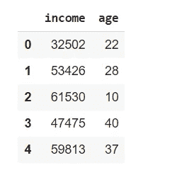
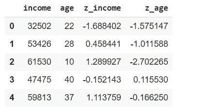
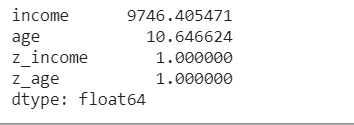
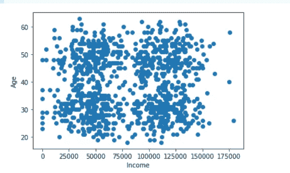
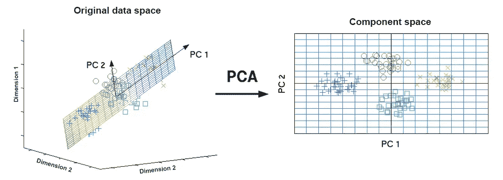
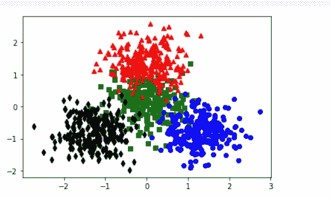

# 营销分析洞察

> 原文：<https://pub.towardsai.net/an-insight-of-marketing-analytics-305902addd07?source=collection_archive---------1----------------------->


# 介绍

许多行业领先的公司已经在使用数据科学来做出更好的决策，并改善他们的营销分析。随着行业数据的扩展、数据源可用性的提高以及存储和处理成本的降低，组织现在可以借助多种数据科学程序来咀嚼大量经常粒度化的数据，并利用这些数据来创建复合模型、交付现代任务以及以更高的准确性获取重要的消费者洞察。对于许多公司来说，在营销分析中使用数据科学原理是一种经济高效、实用的方法，可以观察客户的旅程，并提供更加定制化的体验。

# 客户数据的分段

客户数据细分是根据人口统计或行为数据将目标客户划分为不同群体的过程，以便营销计划可以更精确地针对每个群体进行定制。这也是正确指定营销资源的一个重要部分，因为通过瞄准特定的客户群，营销活动可以获得更高的费用回报。

## 客户细分数据聚类(无监督学习)

无监督学习是一种对客户数据进行细分的现代方法。它非常适合客户数据细分，因为它收集彼此最相似的数据点并将它们组合在一起，这正是良好的客户细分程序应该做的。

**聚类**是一种无监督的机器学习，它看到数据中的组或簇在外部提前知道它们。以下是集群的优势:

*   它可以获得数据分析师无法预见或不熟悉的客户群。
*   它是有弹性的，可以应用于广泛的数据。
*   它减少了对客户人口统计和行为之间联系的广泛专业知识的需求。
*   它可以迅速采取行动，也可以扩展到非常大的数据集。

集群的局限性:

*   创造的客户积累可能不容易解释。
*   如果数据不是基于消费者交付的(例如购买的产品或服务)，那么如何使用所看到的聚类可能并不明显。

## 客户数据中的连接

要使用聚类进行客户细分，必须确定相似性，或者特别注意确定哪种客户是相似的。

示例:

如果公司想要设计销售服装的营销策略，根据顾客倾向于购买的面包质量来细分顾客数据可能没有意义。

客户行为，例如他们过去对营销活动的反应，通常是最重要的一类数据。

## 标准化客户数据

为了能够基于连续变量来确定客户，需要重新调整这些参数，以便数据处于相似的范围内。

示例:

就拿年龄和工资来说吧。这些是非常不同的计算。一个人的工资可以是 90000 美元，年龄可以是 40 岁。因此，就客户关系而言，需要精确地了解其中一个变量的变化与其他变量的变化有多大。为每个变量手动生成这种类型的演示具有挑战性。因此，这需要将数据标准化，在标准范围内对它们进行协调。

Z-score 是一种标准化聚类参数的方法，其步骤如下:

*   减少每个数据点的数据平均值。
*   减少每个数据点的数据平均值。

标准差是对我们的分数的计算。下面的公式用于计算数据点的标准化值:


图:标准化等式

在哪里，

zi =第 I 个标准化值

x =所有值

mean(x) =所有 x 值的平均值

STD(x)= x 值的标准偏差

## 客户年龄和收入数据标准化示例

下面 Python 代码将对客户的年龄和收入数据进行标准化。

导入所有必需的包。

```
import numpy as npimport pandas as pd
```

生成随机的客户收入和年龄数据。

```
np.random.seed(100)df = pd.DataFrame()df['salary'] = np.random.normal(80000, scale=10000, size=100)df['age'] = np.random.normal(50, scale=10, size=100)df = df.astype(int)df.head()
```



客户收入和年龄数据

使用 std 函数同时计算两列的标准偏差。

```
df.std()
```


标准偏差

计算两列的平均值。

```
df.mean()
```


年龄和收入平均值

使用标准偏差和平均值标准化变量。

```
df['z_salary'] = (df['salary'] -df['salary'].mean())/df['salary'].std()df['z_age'] = (df['age'] - df['age'].mean())/df['age'].std()df.head()
```



标准化变量

检查标准化。

```
df.std()
```



年龄和收入的标准化

一旦数据标准化，就需要计算客户之间的相似度。这主要是通过测量特征空间中客户之间的距离来实现的。在二维散点图中，两个客户之间的**欧几里德距离**就是他们点之间的距离。

## 计算客户数据点之间的距离

让我们来计算三个客户之间的距离。

导入所有必需的包。

```
import math
```

创建年龄和收入数据。

```
ages = [50, 40, 30]salary = [50000, 60000, 40000]
```

计算第一个和第二个客户之间的距离/

```
math.sqrt((ages[0] - ages[1])**2 + (salary[0] - salary[1])**2)
```


第一个和第二个客户之间的距离。

计算第一个和第三个客户之间的距离。

```
math.sqrt((ages[0] - ages[2])**2 + (salary[0] - salary[2])**2)
```


第一个和第三个客户之间的距离。

这里，在输出中，第一个和第三个客户以及第一个和第二个客户之间的距离是不同的。

使用平均值和标准差标准化年龄和工资。

```
z_ages = [(age - 40)/10 for age in ages]z_incomes = [(salary - 50000)/10000 for salary in salaries]
```

再次，计算第一个和第二个客户的标准化分数之间的距离。

```
math.sqrt((z_ages[0] - z_ages[1])**2 + (z_salaries[0] - z_salaries[1])**2)
```


标准化后第一个和第二个客户之间的距离

计算第一个和第三个客户的标准化分数之间的距离。

```
math.sqrt((z_ages[0] - z_ages[2])**2 + (z_salaries[0] - z_salaries[2])**2)
```


第一个和第三个客户之间的距离。

这里，标准化之后，第一和第二客户之间的距离以及第一和第三客户之间的距离是相同的。

# k 均值聚类

k-means 聚类是一种非常流行的无监督学习方法，具有非常广泛的用途。它非常熟悉，因为它可以扩展到非常大的数据集，并且在应用程序中运行良好。

k-means 聚类是一种算法，它试图找到将数据点分组为 *k* 个独立组的最佳方式，其中 *k* 是算法的一个参数。然后，该算法反复工作，试图找到最佳分组。

以下是执行该算法的步骤:

*   该算法从随机选取空间中的 *k* 点作为聚类的质心开始。然后，将每个数据点分配给离它最近的质心。
*   质心被刷新为指定给它们的所有数据点的平均值。然后，数据点被重新分配到离它们最近的质心。

重复第二步，直到质心更新后没有数据点改变它们被分配的质心。

## 示例:客户工资和年龄数据的 K 均值聚类

对客户工资和年龄数据执行 K 均值聚类。

导入所有必需的库。

```
import pandas as pdimport matplotlib.pyplot as pltfrom sklearn import cluster%matplotlib inline
```

导入客户的 CSV 数据。

```
df = pd.read_csv('/content/customer.csv')
df.head()
```


客户数据

为薪金和年龄值创建标准化值列，并将它们存储在 z_salary 和 z_age 变量中。

```
df['z_salary'] = (df['salary'] - df['salary'].mean())/df['salary'].std()df['z_age'] = (df['age'] - df['age'].mean())/df['age'].std()
```

绘制客户数据。

```
plt.scatter(df['salary'], df['age'])plt.xlabel('Salary')plt.ylabel('Age')plt.show()
```



绘制客户数据

用四个聚类执行 k-means 聚类。

```
model = cluster.KMeans(n_clusters=4, random_state=10)model.fit(df[['z_salary','z_age']])
```


k 均值聚类

创建一个名为 cluster 的列，其中包含每个数据点所属的分类的标签。

```
df['cluster'] = model.labels_df.head()
```


聚类后的客户数据

绘制数据。

```
colors = ['r', 'b', 'k', 'g']markers = ['^', 'o', 'd', 's']for c in df['cluster'].unique():d = df[df['cluster'] == c]plt.scatter(d['salary'], d['age'], marker=markers[c], color=colors[c])plt.xlabel('Salary')plt.ylabel('Age')plt.show()
```


客户数据的 k 均值聚类

这里是一个数据图，用颜色/形状表示每个数据点被分配到哪个聚类。

# 高维数据和降维

拥有不止两个维度的数据是很常见的。如果我们了解这些客户对促销的反应，他们购买了多少产品，或者有多少人住在他们的家里，那么它将有更多的维度。

当数据具有额外的维度时，可视化该数据变得更加困难。因此，降维就成了问题。**降维**的目的是将多维数据降维，通常降维为二维，以达到可视化的目的，同时尽量保持点与点之间的距离。

主成分分析(PCA)用于执行维数减少。PCA 是一种转换数据的方法。它采用原始维度，并创建新维度来捕获数据中的最大差异。



PCA 功能

## 示例:使用 PCA 对高维数据进行降维

导入所有必需的包。

```
import pandas as pdfrom sklearn import clusterfrom sklearn import decompositionimport matplotlib.pyplot as plt%matplotlib inline
```

导入客户的 CSV 数据。

```
df = pd.read_csv('/content/pca_data.csv')df.head()
```


客户数据

将三列标准化，并将标准化列的名称保存在列表中

```
cols = df.columnszcols = []for col in cols:
  df['z_' + col] = (df[col] - df[col].mean())/df[col].std()
  zcols.append('z_' + col)df.head()
```


标准化数据

对标准化分数执行 k 均值聚类。

```
model = cluster.KMeans(n_clusters=4, random_state=10)df['cluster'] = model.fit_predict(df[zcols])
```

对数据执行 PCA。

```
pca = decomposition.PCA(n_components=2)df['pc1'], df['pc2'] = zip(*pca.fit_transform(df[zcols]))
```

在降维空间中绘制聚类图。

```
colors = ['r', 'b', 'k', 'g']markers = ['^', 'o', 'd', 's']for c in df['cluster'].unique():
  d = df[df['cluster'] == c] plt.scatter(d['pc1'], d['pc2'], marker=markers[c],    color=colors[c])plt.show()
```



主成分分析绘图

在绘图中，x 轴和 y 轴是主要部分，因此不容易解释。但是，通过可视化聚类，我们可以根据它们重叠的程度来了解聚类的好坏。

# 结论

无监督机器学习是执行客户细分的优秀现代技术。K-means 聚类，一种普遍使用的快速且易于扩展的聚类算法。数据处理的研究也是任何数据科学的重要组成部分。呈现高级分析和创建可视化以使处理过程易于理解是理解客户数据的一种极好的技术。Matplotlib 和 seaborn 库是一个很好的创建可视化的库。当我们开发分析管道时，第一步是建立数据模型。数据模型是对我们将要处理的数据源、它们与其他数据源的关联、来自特定数据源的数据将进入管道的确切位置以及格式(例如，Excel 文件、数据库或来自互联网数据源的 JSON 或 REST API)的总结。随着时间的推移，随着数据源和方法的改变，管道的数据模型逐渐出现。传统上，营销数据包括所有三种类型的数据。最初，大多数数据点是从不同的(主要是手动的)数据源开始的，因此一个字段的值可能具有不同的长度，一个字段的值不会等同于其他字段的值，因为有不同的字段名称，一些从相同来源接收数据的行也可能有一些字段的值消失。但很快，由于技术的发展，结构化和半结构化数据变得高度可用，并经常被用于实施分析。如今数据有两种格式——结构化和非结构化。非结构化数据是流行的，不受模式限制。数据处理和争论是数据科学管道的开始，也是非常有价值的部分。如果数据工程师或数据科学家正在准备数据，以获得一些关于数据的领域知识，这通常是很重要的。数据处理也需要创新的解决方案和技术。如果数据工程师确信项目数据排列正确，它将与其他数据源相结合。他们还去掉了重复的和不需要的列，最后，去掉了丢失的数据。执行完这些步骤后，项目数据就可以进行分析和建模了，并且可以不可避免地放入数据科学管道中。