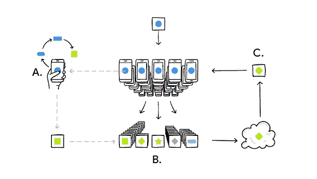
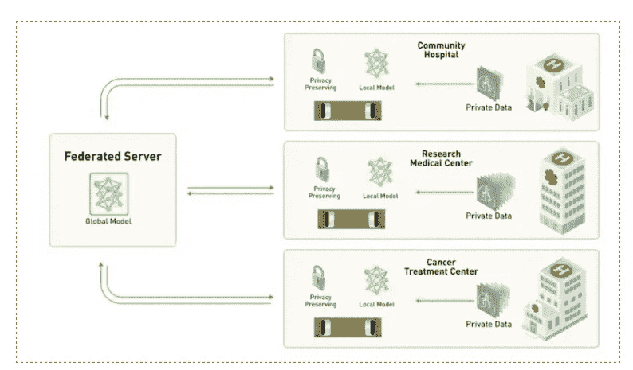
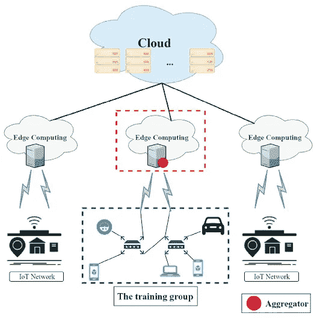

# 联邦学习简介

> 原文：<https://pub.towardsai.net/an-introduction-to-federated-learning-7bed7dfa34bd?source=collection_archive---------2----------------------->

## 通过联合学习实现数据隐私和安全

AI-ML-DL 领域的人们经常问及关于数据和数据安全性的**隐私问题**这是相当符合逻辑的，因为在各种数据集上训练模型后，处理数据及其隐私的策略应该是什么？

由[玛丽娅·扎里奇](https://unsplash.com/es/@simplicity?utm_source=medium&utm_medium=referral)在 [Unsplash](https://unsplash.com?utm_source=medium&utm_medium=referral) 上拍摄的照片

现代人工智能仍然存在两个重大障碍。一个是数据通常作为**孤岛**存在于**不同的业务**中。另一个是数据安全性和隐私性的提升。在当前最热门的学习和训练方法中，我们将数据集引向一个固定的集中式模型，洞察提取在该模型上进行。将数据从一个系统转移到另一个系统，从一个数据库转移到另一个数据库，是一件非常具有挑战性的事情，数据泄露和数据窃取都有可能发生。

**联邦学习**是一种新兴的模型学习方法，可以解决上述所有问题。让我们详细看看联合学习。federated 一词的一个非常暴力的或字典上的意思是" [**在中央政府或组织下团结起来，同时保持一些地方控制**](https://www.google.com/search?q=federated+&sxsrf=ALiCzsaOSuamKWnT9D3zGJF_KeBtYSe3Rw%3A1664176919480&ei=F1MxY6DzHMGG3LUPmZa7gA8&ved=0ahUKEwjg2oOR9rH6AhVBA7cAHRnLDvAQ4dUDCA4&uact=5&oq=federated+&gs_lcp=Cgxnd3Mtd2l6LXNlcnAQAzIECCMQJzIECCMQJzIECCMQJzIECAAQQzIECAAQQzIECAAQQzIECAAQQzIECAAQQzIECAAQQzIECAAQQzoHCCMQsAMQJzoKCAAQRxDWBBCwAzoFCAAQgARKBAhBGABKBAhGGABQ7AhYyhFgqhZoAXABeACAAZ4BiAGtCJIBAzAuOJgBAKABAcgBCsABAQ&sclient=gws-wiz-serp) "这个意思如何与实际的联合学习相关，我们将在博客的下一节中看到。

如果我可以将我的**本地模型带向数据**，而不是将数据带向模型，会怎么样？让我们通过 [google.ai 联合学习博客](https://ai.googleblog.com/2017/04/federated-learning-collaborative.html)的一个简单例子来理解这一点。任何与用户交互的移动应用程序都可以用来训练机器学习模型，该模型试图从用户交互中学习。在许多移动设备上，ML 模型将被同时训练。这种经过训练的模型提供更新，然后将更新传输到中央服务器或模型。工业模型提供的输入将用于更新集中模型。同样，集中更新的模型将被发送到您的设备。

连续模型正在本地更新并将更新的模型发送到服务器进行新的更新[ [源链接](https://ai.googleblog.com/2017/04/federated-learning-collaborative.html)

我们的设备下载当前型号，通过从你手机上的数据中学习来改进它，然后**将变化**总结为一个小的、集中的更新。只有这个模型的更新被发送到云，使用加密的通信，在那里它立即与其他用户更新进行平均，以改进共享模型。**所有的训练数据都保留在您的设备上**，没有单独的更新存储在云中。

解释一下，你没有集中的数据。您的数据分布在不同的位置和设备上，现在您希望训练一个机器学习模型。

据我所知，**数据隐私**和**数据安全**最大的担忧就是在这里得到疏导。数据在用户的位置，更新的模型被发送到中央系统。联合学习的优势在于，你不是将数据引向模型，而是将模型引向数据。在不同的本地边缘或服务器上训练算法，并将其用作来自群体的**数据样本。**

公司可以从精确的机器学习模型中受益，但典型的集中式机器学习系统有局限性，例如**不能在边缘设备上持续学习**以及**在中央服务器上聚集私人数据**。联合学习有助于缓解这些问题。

在传统的机器学习中，使用在集中设置中可访问的所有训练数据来创建中央 ML 模型。当预测可以由中央服务器提供服务时，这种操作没有任何问题。

因为用户期望快速响应，所以移动计算中用户设备和中央服务器之间的通信延迟可能会损害愉快的用户体验。该模型可以安装在终端用户设备中以解决这一问题，但是由于模型是在整个数据集上训练的，所以持续的学习变得困难。

**医疗保健行业的联合学习:**

大型、多样化、高质量的数据集为 AI 算法提供了经验。然而，这样的统计数据在历史上很难找到，尤其是在 T2 的医疗保健行业。

联邦学习的集中服务器方法。【[来源链接](https://blogs.nvidia.com/blog/2019/10/13/what-is-federated-learning/)

医疗组织被迫依赖自己的数据源，这可能会受到患者人口统计、所用工具或临床专业等因素的影响。或者，为了获得所有必要的数据，他们必须结合其他机构的数据。

根据 [BrainTorrent:用于分散联邦学习的点对点环境](https://arxiv.org/pdf/1905.06731v1.pdf)论文，在医学成像上训练深度神经网络的一个常见困难是获得足够的标记数据。由于数据注释既昂贵又耗时，对于单个医疗中心来说，获得足够的样本量来创建自己的定制模型是一项挑战。为了避免这种情况，来自所有中心的数据可能被收集起来并用于训练任何人都可以访问的集中框架。然而，这种策略经常被使用。由于医疗数据的私密性，这是不切实际的。最近开发了联合学习(FL)来实现跨中心的共享预测模型的合作学习**，而不需要数据交换**。在 FL 中，用户在与管理整个训练过程的中央服务器共享他们的模型权重之前，在特定于地点的数据集上本地训练模型几个时期。模型共享不会危及患者的隐私，这一点至关重要。

**物联网中的联合学习:**

物联网(IoT)正在发展，为实时数据收集和机器学习模型部署开辟了新的选择。然而，单个物联网设备可能不具备开发和实施完整学习模型的计算能力。除了引起对数据安全和隐私的关注之外，将连续的实时数据发送到具有强大计算能力的中央服务器会导致巨大的传输成本。根据[论文](https://reader.elsevier.com/reader/sd/pii/S2352864821000195?token=7E35191D952D86F734E152FDC637DB3D02F9ECCCE2F6C680BFB583DDBB5686F9D1A5902007F1D43105E51C817EA31B87&originRegion=eu-west-1&originCreation=20220926045136)，在资源受限的边缘服务器和设备上训练机器学习模型的一种有前途的方法是联邦学习(federated learning)，这是一种分布式机器学习框架。

具有异构边缘的联合学习的系统架构-
供电的物联网系统[ [来源链接]](https://reader.elsevier.com/reader/sd/pii/S2352864821000195?token=7E35191D952D86F734E152FDC637DB3D02F9ECCCE2F6C680BFB583DDBB5686F9D1A5902007F1D43105E51C817EA31B87&originRegion=eu-west-1&originCreation=20220926045136)

然而，现有的大多数研究假设了一种不切实际的同步参数更新方法，其中统一的物联网节点通过稳定的通信链路连接。在本文中，我们创建了一种异步联合学习策略，以提高不同网络下不同物联网设备的训练效率。为了有效地完成学习任务，我们构建了一个**轻量级节点选择算法**和一个异步联邦学习模型。为了参与全局学习聚合，所提出的方法迭代地选择异构物联网节点，同时考虑它们的本地处理能力和通信状态。这篇[论文](https://reader.elsevier.com/reader/sd/pii/S2352864821000195?token=7E35191D952D86F734E152FDC637DB3D02F9ECCCE2F6C680BFB583DDBB5686F9D1A5902007F1D43105E51C817EA31B87&originRegion=eu-west-1&originCreation=20220926045136)总结了物联网设备的数据收集和处理如何产生最先进的结果。

看起来联合学习有很大的潜力。它不仅可以保护敏感的用户数据，还可以聚合许多用户的数据，搜索共同的模式，并随着时间的推移加强模型。它基于用户数据发展自己，保护它，然后作为一个更明智的个体重新出现，再次准备好让自己接受用户的考验！测试和培训变得更加智能！联合学习开创了安全人工智能的新时代，无论是在培训、测试还是信息隐私方面。联邦学习的设计和实现仍然存在许多困难，因为它仍然处于初始形式。设计数据管道和定义联邦学习问题是解决这一障碍的两种有效方法。

## **用于联合学习的开源软件**

[命运](https://github.com/FederatedAI/FATE)

[基质](https://www.labelia.org/en/ppfl)

[PySyft](https://github.com/OpenMined/PySyft)

[PyGrid](https://github.com/OpenMined/PyGrid)

[OpenFL](https://github.com/intel/openfl)

[张量流联合](https://www.tensorflow.org/federated/federated_learning)

[IBM 联合学习](https://www.ibm.com/docs/en/cloud-paks/cp-data/4.5.x?topic=models-federated-learning)

[英伟达克拉拉](https://developer.nvidia.com/blog/federated-learning-clara/)

## **联合学习的有效性**

**数据安全性**:将训练集保存在设备上将**确保数据安全性**并消除模型对数据池的需求。

**数据多样性**:其他问题，比如边缘设备中的网络不可用，可能会阻止企业合并来自众多来源的数据集。联邦学习使得访问各种数据变得更加简单，即使某些数据源只能偶尔通信。

**实时持续学习**:利用客户端数据**持续更新**模型，无需汇总数据。

**硬件有效性**:这种策略使用**不太复杂的硬件**，因为联合学习模型不需要单一复杂的中央服务器来分析数据。

## **参考文献**:

1.  斯特凡诺·萨瓦齐，莫尼卡·尼科利和维托里奥·兰帕， [**通过合作设备进行联合学习:大规模物联网网络的共识方法**](https://www.youtube.com/redirect?event=video_description&redir_token=QUFFLUhqa2V5R1BfVTZnRUl4VVgwSmI4bkxuNlZjSE1MUXxBQ3Jtc0tuck45MWlrQ3VYUkl6V3NKbG1SNllXcXUzSnJMLXFaMi1ZTDJhVnBuWmxiRmFZNFNnYW1XbkE0NHhjcTl2bmZaa21IQ3JoTmxwMXVnS29XU045TnhzdTVRSl8zM0EyU0pmd0hSeXZ1MWJ5NllzNTdnbw&q=https%3A%2F%2Farxiv.org%2Fabs%2F1912.13163&v=k3V-WAUuR9U) **(2019)** ，arXiv:1912.13163 v1【eess。2019 年 12 月 27 日
2.  ViraajiMothukuriaReza，M . PariziaSeyedamin，Pouriyehb，Yan Huanga，AliDehghantanhac，Gautam Srivastava， [**关于联邦学习的安全和隐私的调查**](https://www.youtube.com/redirect?event=video_description&redir_token=QUFFLUhqbHZ6RW1uV0NEXzFCOGV0Z3p2ZWhDSHpDdm1nUXxBQ3Jtc0tsaTl6SHFoWlZhVjFRUW9ZMjFrZXdsZ1lpODVZajdIOGl2TEM0bElibVg5NTBLNjI1ODR1dWNpWlNZUVhZcVNaREUyTmRKV3hpM3gzQnhUamVRbmFmN3ZURXkxbHY2M2c5Q0tWRnViSTdCOUNOUXByRQ&q=https%3A%2F%2Fwww.sciencedirect.com%2Fscience%2Farticle%2Fabs%2Fpii%2FS0167739X20329848&v=k3V-WAUuR9U)**【2021】**，[未来一代计算机系统](https://www.sciencedirect.com/journal/future-generation-computer-systems)，第 115 卷
3.  [Rithesh Sreenivasan](https://www.youtube.com/c/RitheshSreenivasan)[，**什么是联邦学习**](https://youtu.be/k3V-WAUuR9U) (Youtube 视频)
4.  [IstvánHegedűs、Gábor Danner 和 Márk Jelasity](https://www.sciencedirect.com/science/article/pii/S0743731520303890#!) 、 [**分散学习著作:八卦学习与联邦学习的实证比较**](https://reader.elsevier.com/reader/sd/pii/S0743731520303890?token=EE9C7348EA9AF1C28ED772C2884526A7080262FFCE58A23C78081E3E452B9F4B32DF6D7BBB5C179BFBBD7E2DB21CFF4F&originRegion=eu-west-1&originCreation=20220926044928) **(2021)** 、[并行与分布式计算杂志](https://www.sciencedirect.com/journal/journal-of-parallel-and-distributed-computing) ( [第 148 卷](https://www.sciencedirect.com/journal/journal-of-parallel-and-distributed-computing/vol/148/suppl/C))
5.  、Fausto Milletar、Daguang Xu、Nicola Rieke、Jonny Hancox、Zhu、Maximilian Baust、Yan Cheng、S ebastien Ourselin、M. Jorge Cardoso 和 Andrew Feng， [**隐私保护联邦脑肿瘤分割**](https://arxiv.org/pdf/1910.00962.pdf)**【2019 年 10 月】**，英国伦敦大学国王学院生物医学工程与影像科学
6.  Brendan McMahan 和 Daniel Ramage，研究科学家， [**联合学习:没有集中训练数据的协作机器学习**](http://ai.googleblog.com/2017/04/federated-learning-collaborative.html) **(2017)** ，谷歌 AI 博客
7.  [NICOLA RIEKE](https://blogs.nvidia.com/blog/author/nicolarieke/) ， [**什么是联合学习？**](https://blogs.nvidia.com/blog/2019/10/13/what-is-federated-learning/) **(2019)** ，英伟达博客
8.  阿尔法里斯( **2022)** ，[阿芙里斯联邦学习](http://Top 7 Open-Source Frameworks for Federated Learning)

## 如果你觉得这很有见地

如果你觉得这篇文章很有见地，请关注我的 [**Linkedin**](https://www.linkedin.com/in/chinmay-bhalerao-6b5284137/) 和 [**medium**](https://medium.com/@BH_Chinmay) 。你也可以 [**订阅**](https://medium.com/@BH_Chinmay) 在我发表文章的时候得到通知。感谢您的支持！