# 分析总统辩论

> 原文：<https://pub.towardsai.net/analyzing-the-presidential-debates-5aaa7b328452?source=collection_archive---------1----------------------->

## [数据科学](https://towardsai.net/p/category/data-science)

## 探索情感、关键短语提取和推理…

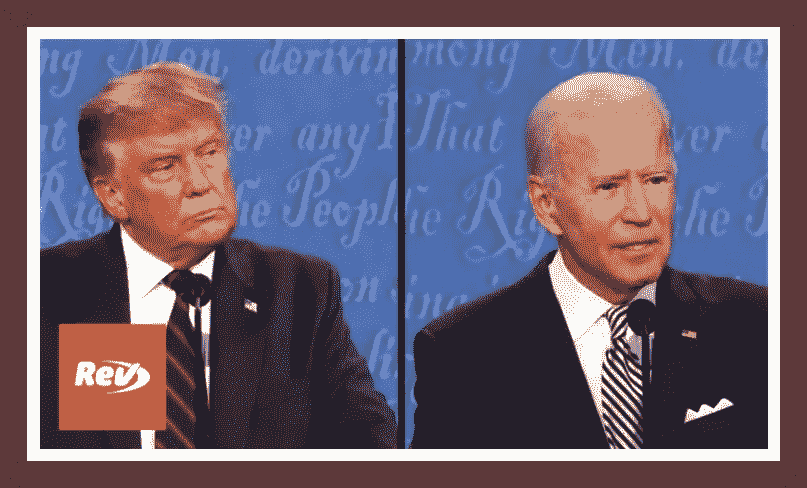

图片来自 rev.com

2020 年是一个*地狱般的一年*，我们已经是第十一个月了。

> 又到了美国人去投票的时候了。

如果你活得够久，你会认识到这些模式…

每一个对立的政治派别，相互遮蔽，丑闻和漏洞可能会突然出现，缺点被放大，批评家制造新闻，承诺被分发'*而不是*-*'并且有一种压倒性的双方都吹捧的'*民族和团结'*'的感觉…*

*但在大多数情况下，我们不会买 *BS！*和通常，我们只是选择两害相权取其轻，因为坦率地说，一个并不比另一个好多少。*

*所以今天，我将分析特朗普总统和拜登副总统的总统辩论…*

# *免责声明:*

> *整个分析由作者完成，使用科学方法，并不假设完美。这是一个个人项目，没有任何政治背景，情绪或潜台词。从这个科学过程中表达的推论完全是作者的，基于数据。*

# *简介:*

*特朗普和拜登对峙了两次。*

1.  *第一次辩论是在 2020 年 9 月 29 日。会议由福克斯新闻频道的 Chris Wallace 主持*
2.  *第二场辩论原定于 10 月 15 日举行，但因特朗普的 COVID19 回合而取消，一周后举行。 [*后发制人*](https://www.newyorker.com/news/daily-comment/at-the-white-house-trump-takes-off-his-mask-and-sends-a-dangerous-message)。这场辩论由 NBC 新闻的克里斯汀·韦尔克主持。*

*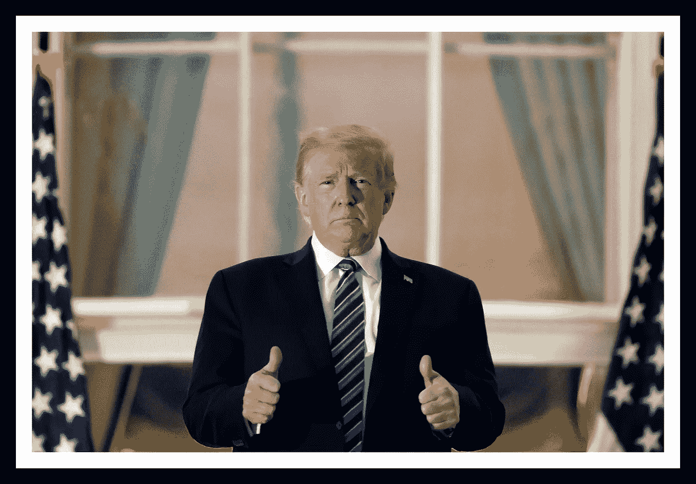*

*特朗普摘下面具说不要害怕病毒|图片来自[纽约客](https://www.newyorker.com/news/daily-comment/at-the-white-house-trump-takes-off-his-mask-and-sends-a-dangerous-message)*

# *1.数据:*

*作为一名数据专家，看完两场辩论后，我真的很好奇，想知道我能从分析这两位参赛者的回答中学到什么。*

> *从他们回答与数百万美国人生活息息相关的问题的方式中，我可能会发现一些有趣的东西…*

*那是我唯一的动力' ***好奇心*** '，于是我着手寻找资料。*

*幸运的是，我偶然发现了 rev.com 的[](https://www.rev.com/blog/transcripts/donald-trump-joe-biden-1st-presidential-debate-transcript-2020)***他们已经完成了整个辩论，所以我运用我的数据技能，从网站上把它刮到了一个 Jupyter 笔记本上。那是容易的部分。困难的部分是为我的分析的不同库和工具所需的每种特定格式准备数据。****

****首先，我导入了所有需要的模块****

****我用我下面定义的方法刮了网站…****

****一种通过请求和漂亮汤库从网站抓取实时数据的方法。****

# ****2.先生们，你们有两分钟时间:****

****如果你看了第一场辩论，你会注意到克里斯很难把两个人都限制在两分钟内。特朗普做得特别狠，相当多的时候，特朗普和拜登之间有交流。****

****让我们看看数据是怎么说的…****

****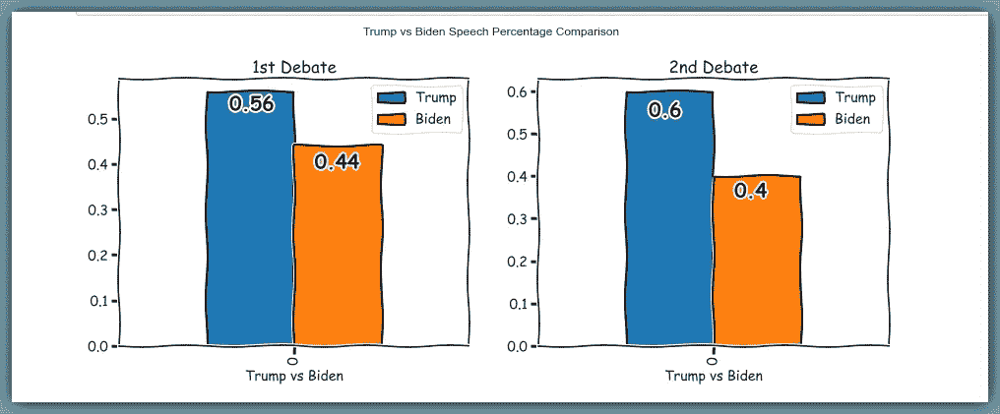****

****特朗普主导辩论…****

****在第一场辩论期间的总回应中，特朗普拥有 **56%** ，而拜登拥有 **44%** ，在第二场辩论中，乔的情况变得更糟，因为特朗普进一步主导了 **60%** 的回应，将 **40%** 留给了乔。****

```
******Trump spoke 314 times in debate one and 193 times in debate two.
Biden spoke 250 times in debate one and 131 times in debate two.******
```

> ******自我提醒:**特朗普可能不是最聪明的，但他肯定会让别人听到他的声音…****

# ****2.词汇多样性:****

****这仅仅意味着在对话或文档中使用的单词的基数或种类。在这种情况下，它会检查特朗普和拜登所说的独特单词数占总单词数的百分比。****

****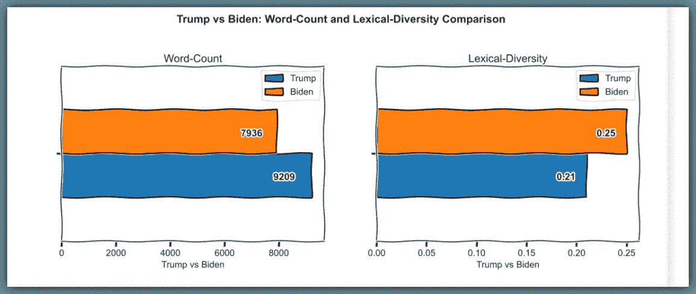****

****数据显示，乔·拜登用词更有创意。他的词汇比唐纳德·特朗普丰富，尽管他一直比特朗普说得少。****

```
******Biden speaks 7,936 total words with 2,020 unique words and a lexical-diversity score of 25%****Trump speaks 9,209 total words with 1,894 unique words and a lexical-diversity score of 21%******
```

> ****自我提醒:拜登可能话不多，但他有一颗创造的心……****

****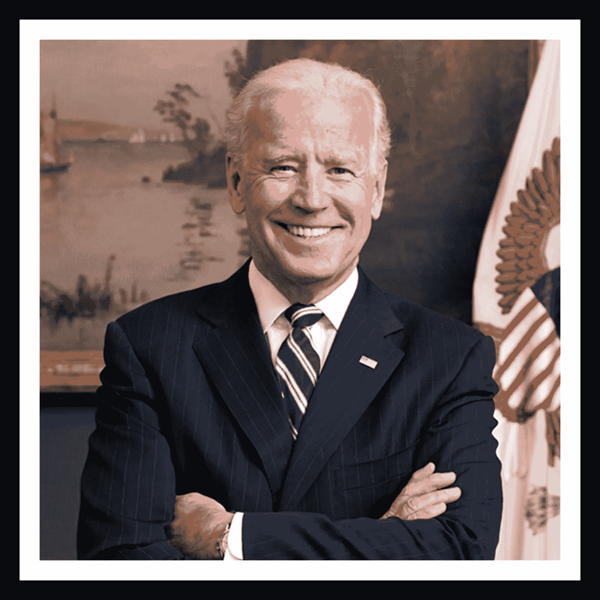****

****拜登的言辞很有创意，他能拿出行动来吗？| [image_credit](https://www.biography.com/.image/t_share/MTc0NjMzNDczMzM0NTg1MzM0/gettyimages-465470375.jpg)****

# ****3.TFIDF:****

****[Term-Frequency-Inverse-Document-Frequency](https://medium.com/towards-artificial-intelligence/tf-idf-refresher-51dd6a3faaa0)可以说是最流行的文本处理算法。它告诉我们，与其他文档相比，某些单词对一个文档的重要性。****

> ****简单地说，TF-IDF 显示了给定一组文档时，一个或多个单词对文档的相对重要性。****

****因此，在这种情况下，我选择将特朗普和拜登的话词汇化，而不是将其词干化…****

```
******def lemmatize_words(word_list):
    lemma = WordNetLemmatizer()
    lemmatized = [lemma.lemmatize(i) for i in word_list]

    return lemmatized******
```

****然后我标记单词，去掉标点符号和停用词…****

****三种方法来分词，去除标点符号和去除停用词。****

****然后我构建了一个简单的 TFIDF 类来计算两个人的 TFIDF 分数。****

****一类 TFIDF 处理函数****

****所以让我们来看看唐纳德·特朗普使用一个词特有的词——云……****

********

****唐纳德·特朗普的十大 TFIDF 词汇****

****很有趣或者说很无趣的是，Trump 在他的十大 TFIDF 中使用了像'*前*'、*建*'、*克里斯*这样的词，这是主持人的名字，我们可以看到他给克里斯出了一个难题。还有的是'*灾*'，叫*'，笼*'，没人*'*'…。******

**让我们看看乔·拜登…**

**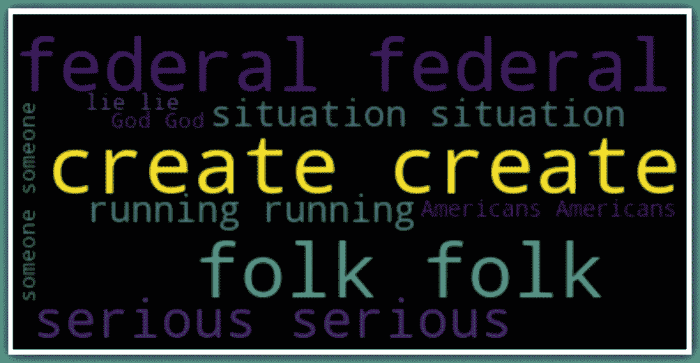**

**乔·拜登的十大 TFIDF 词汇**

**像'*创造*'、*联邦'*、*严肃*、*美国人*、*民间*、*形势*'……看起来，拜登在辩论的结构和主题上比特朗普团队投入了更多的精力。**

# **4.问了一些问题:**

**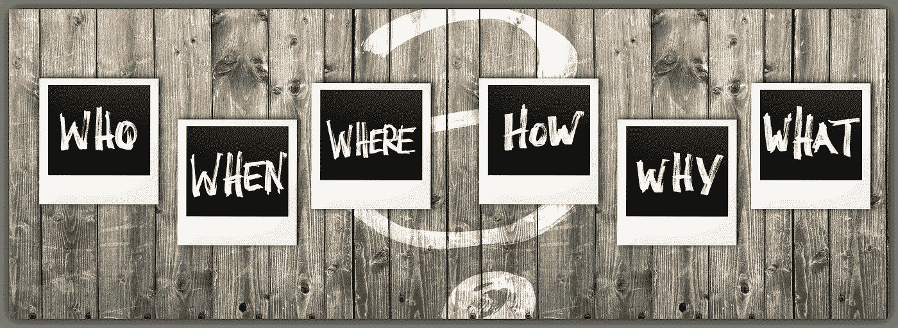**

**图片来自 [pixabay](https://pixabay.com/illustrations/questions-font-who-what-how-why-2245264/)**

**我们必须赞扬克里斯·华莱士和克里斯汀·韦尔克，他们是辩论中出色的主持人。**

**在第一场辩论中，克里斯问了一些有趣的问题，其中一些近乎…**

*   ****最高法院****
*   ****奥巴马医改****
*   ****经济****
*   ****种族/正义****
*   ****执法****
*   ****选举诚信****
*   ****COVID****

**在第二场辩论中，克里斯汀用问题压住它…**

*   ****COVID****
*   ****国家安全****
*   ****美国/美国家庭****
*   **最低工资**
*   ****移民****
*   ****种族/黑人生命问题****
*   ****领导****

# **5.一些答案和推论:**

**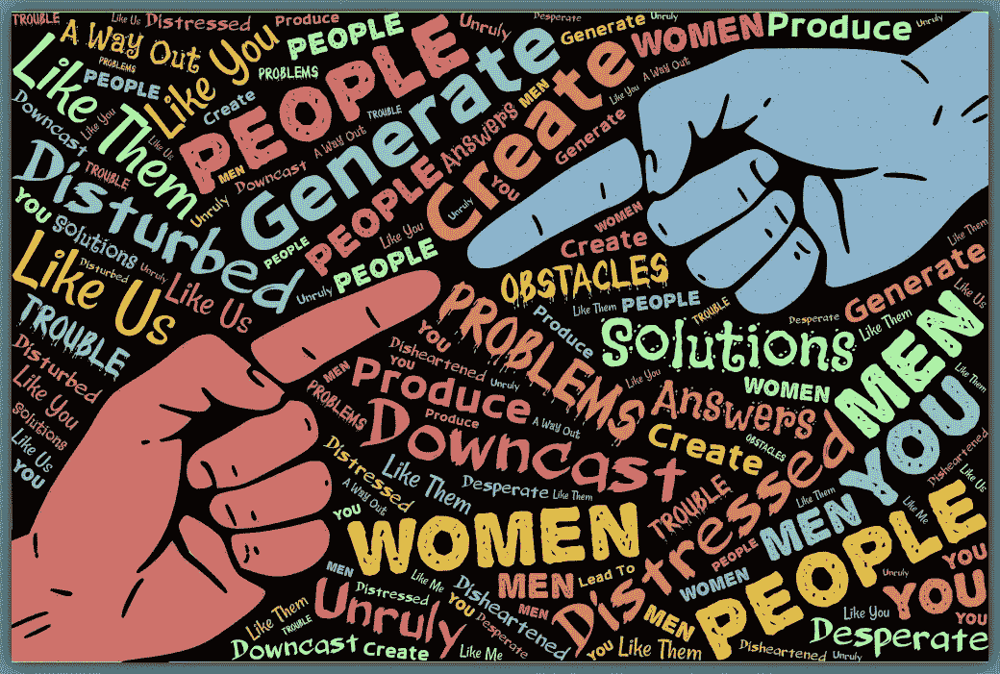**

**图片来自[约翰-海因](https://pixabay.com/users/johnhain-352999/?utm_source=link-attribution&utm_medium=referral&utm_campaign=image&utm_content=2223862)皮克斯拜**

**在这一部分，我将分析特朗普和拜登对三个重要话题的回答**

1.  ****工作、工资和税收****
2.  ****种族主义****
3.  ****美国经济****

> **这一部分的分析非常有趣，涉及到一些库和工具**

*   ****情感分析** : *AzureML 文本分析 python 客户端 SDK***
*   ****用于关键短语提取**:*azure ml Text-Analytics-Client SDK For python***
*   ****对于词性标注** : s *paCY***
*   ****进行可视化** : *Pywaffle，Matplotlib，Seaborn***

**在注册了微软 azureML 门户网站[并获得了我的密钥和端点之后，我创建了两个用于情感分析和关键短语提取的方法。](https://docs.microsoft.com/en-us/azure/cognitive-services/text-analytics/quickstarts/text-analytics-sdk?tabs=version-3-1&pivots=programming-language-python)**

**使用 AzureML TextAnalyticsClient 的情感分析方法**

**使用 AzureML TextAnalyticsClient 的关键短语提取方法**

**接下来，我使用 s *paCY* 库定义了提取*词性(POS)* 标签的方法。这对于理解特朗普和拜登如何构建他们的句子非常重要。**

**一种利用空间库标注词性的方法**

**至此，我已经定义了我的工作结构，现在我需要几个助手函数来将辩论处理成所需的格式，并找到与我的查询匹配的句子。**

**第一个助手函数是搜索函数。这样，给定查询词，如“*乔布斯*”、“*工资*”，它将分别搜索特朗普和拜登的语料库，以提取包含这些查询词的句子…**

**一种在语料库中执行关键字搜索并返回匹配句子列表的方法。**

**另一个是将从 *AzureML 客户端*接收的情感转换为数据帧的功能，另一个是将上述方法一起应用于语料库以返回数据帧，该数据帧具有完整的所有情感和关键短语以及总体情感得分的字典。**

**它将情感分析函数返回的词典列表转换为数据帧**

**方法调用搜索、情感分析和关键短语提取方法…**

**只需几个额外的绘图功能，我们就可以开始了！**

## **A.特朗普和拜登在就业/工资/税收问题上:**

**Trump 用 93 个句子做出回应，总体情绪得分为 **21%** 正面， **72%** 负面， **7%** 中性。**

**拜登用 **127** 句话回应，总体情绪得分 **33%** 正面， **60.3%** 负面， **6.7%** 中性。**

**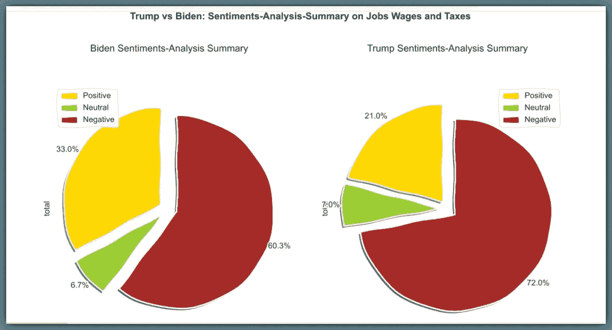**

**特朗普和拜登对就业/工资/税收的情绪分析的双饼图。**

**在上面的两个饼图中，我们可以看到巨大的红色部分表示负面情绪。**

> ****A2** :注意，在一场辩论中，负面情绪永远不应该被当作表面价值，而应该被探究以理解上下文。这可以通过探索提取的句子和关键短语来完成。比如，拜登可能会以严厉批评特朗普的方式开始句子，以支持他的观点。但是这样做会导致情绪分析客户端将这句话记录为过于消极。因此，在评估/反馈会议中，负面情绪只能从表面上看，负面情绪可能表示不满意或不高兴的客户。**

**鉴于上面的 ***A2*** ，川普的情绪得分仍然有点出乎意料……如果他相信自己一直在做好工作，我们会期待他描绘出一幅他一直在做的工作的美好画面。我的意思是，预计拜登会批评特朗普，但由于特朗普是现任总统，掌管着现政府，预计他的回应会更积极。**

**让我们来看看关于工作/工资/税收的特朗普关键词**

**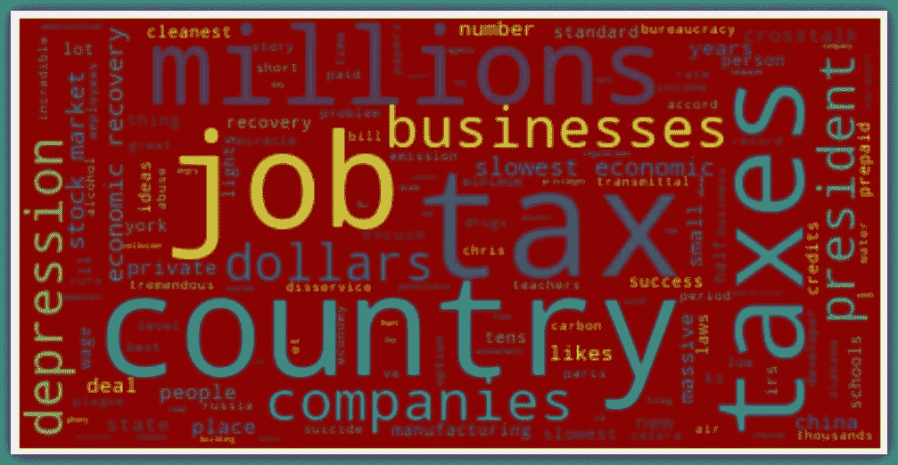**

**唐纳德·特朗普关于就业/工资/税收的言论**

**特朗普谈论“国家*、工作、税收、公司、税收、萧条*”…**

**让我们来看看他对就业/税收/工资的一些积极回应...**

**特朗普谈到了通过提高最低工资来帮助小企业，以及走上成功之路等等。他还回应了支付 750 美元税款的问题，称这是不真实的，称他支付了数百万美元的税款。当拜登质疑他利用税收法案时，他声称该法案是拜登通过的，它只给了“某些个人”折旧和税收抵免的特权。**

**对于特朗普的负面情绪回应…**

**对于负面因素，特朗普谈到人们死亡、自杀和失业。他说抑郁症、酒精和毒品达到了前所未有的水平，这就是为什么他要开放学校和经济。**

**让我们来看看拜登关于就业/工资/税收的关键词**

**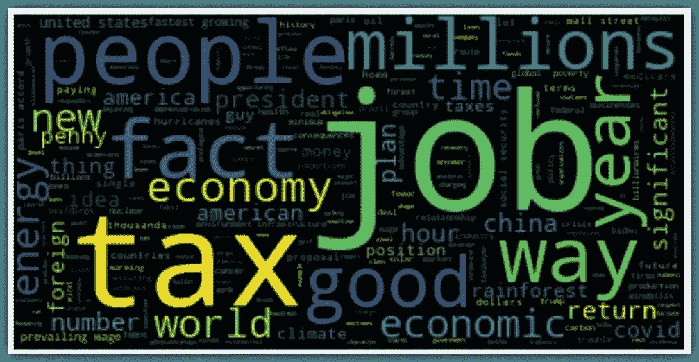**

**乔·拜登关于就业/工资/税收的言论**

**拜登谈论“税收*、工作、人民、数百万、事实、经济、重要*”…**

**让我们看看拜登对就业/税收/工资的一些积极回应…**

**拜登谈到要创造数百万个就业机会，在高速公路上投资 5 万个充电站，以便拥有未来的电动汽车市场。他谈到了对 400 万栋现有建筑和 200 万栋现有住宅进行改造，使它们不会泄漏太多的能源，在这个过程中节省数亿桶石油，并创造数百万个就业机会…**

**关于拜登的负面情绪回应…**

**在这里，他批评特朗普政府说，失去工作的人是那些在前线的人。此外，特朗普在美国几乎有一半的州的 COVID 死亡人数大幅增加，因为他急于开放经济…**

> **总体而言，拜登的负面情绪得分来自于他对特朗普政府的批评，这是意料之中的。特朗普的负面情绪是对拜登、奥巴马和希拉里·克林顿的酸溜溜言论和不友好言论的混合……他称希拉里不诚实，是一种耻辱。**

**让我们看看特朗普和拜登的词类标签。**

**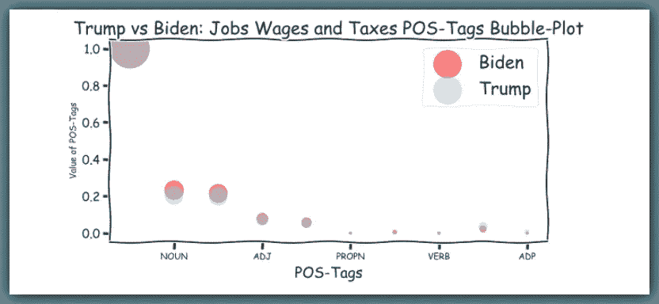**

**特朗普和拜登在就业/工资/税收方面的词性标签泡泡图**

***较大的气泡代表使用最频繁的词性标签*。**

## **B.特朗普和拜登谈种族主义:**

**川普在辩论中从未说过“*种族主义*这个词。他称拜登为种族主义者，并说人们指责他(特朗普)是种族主义者，但他们错了…**

**川普用 **47 个**句子回应，总体情绪得分为 **10%** 正面、 **87%** 负面、 **3%** 中性。**

**拜登用 **89** 句话回应，总体情绪得分 **27.5%** 正面， **67%** 负面， **5.5%** 中性。**

**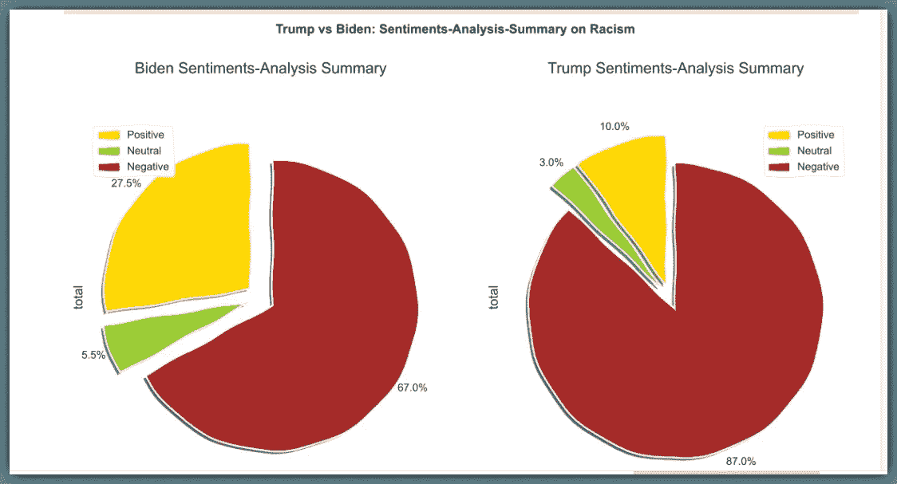**

**特朗普和拜登对种族主义情绪分析的双饼图。**

**川普的句子再次显得过于负面，87%的人对 T21 持否定态度，而拜登的句子持否定态度，67%的人持否定态度**

**让我们来看看描述种族主义时使用的特朗普关键词**

**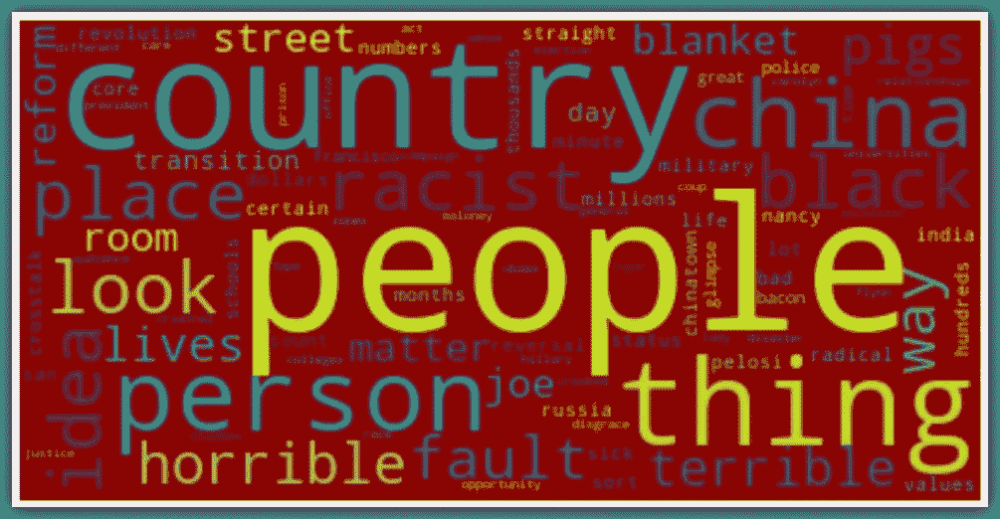**

**唐纳德·特朗普的种族主义词汇云。**

**特朗普使用了诸如“*人，人，可怕的，国家，中国，黑人，种族主义者，可怕的*...**

**对于特朗普的一些积极回应…**

**对于特朗普的一些负面情绪回应…**

**特朗普称拜登是种族主义者，称希拉里·克林顿是邪恶的，并说他第一次听说**黑人生活问题**时，他们在警察面前高喊“*毯子里的猪*”和“*像熏肉一样油炸它们*”，特朗普说，“*那是一件可怕的事情*”...**

**然后特朗普继续说，他是房间里种族主义最少的人，他一直在照顾黑人学院和大学。**

> **自我提醒:特朗普发现很难建设性地解决种族主义问题。他经常认为这是关于他自己的，他没有意识到这是关于整个美国体制的**

**让我们看看乔·拜登的种族主义词汇云…**

**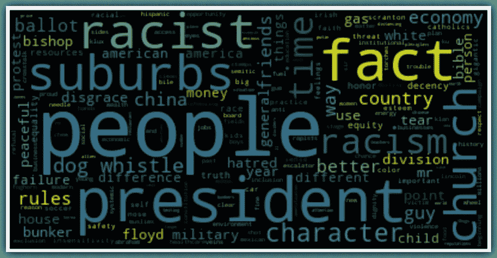**

**乔·拜登的种族主义词汇云**

**在这里，我们看到拜登使用了像“*人民、总统、性格、种族主义者、种族主义、郊区*”……这样的词语来应对种族主义。**

**拜登的一些积极回应是…**

**关于他的优点，拜登谈到大多数人不想伤害任何人，以及他将如何提供经济机会，更好的教育，更好的医疗保健和教育…**

**在鞭挞负面情绪的同时，拜登这样说…**

**拜登提醒特朗普，当乔治·弗洛伊德被杀时，他要求军方对白宫的和平抗议者使用催泪弹，这样特朗普就可以拿着圣经在教堂摆姿势。拜登表示，美国存在系统性的种族主义，他称特朗普是种族主义者，并提醒他现在不是 1950 年了…**

> ****自我提醒:**作为一名黑人，我很高兴拜登公开承认美国存在系统性的种族主义……这一断言是解决问题的唯一正确途径。**

**现在，让我们看看特朗普和拜登在种族主义问题上的词性标签…**

**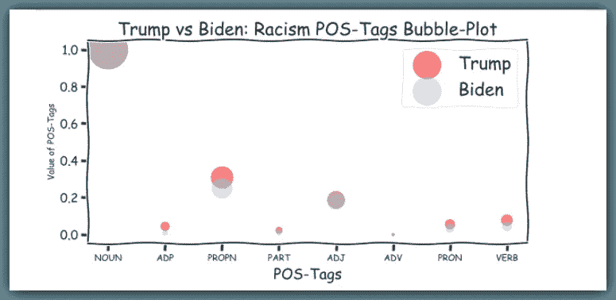**

**特朗普和拜登关于种族主义的词性标签泡泡图**

## **C.特朗普和拜登谈美国经济:**

**Trump 用 44 个句子做出回应，总体情绪得分为 **16%** 正面， **80%** 负面， **4%** 中性。**

**拜登用 56 句句子做出回应，总体情绪得分为 **45%** 正面， **50%** 负面， **5%** 中性。**

**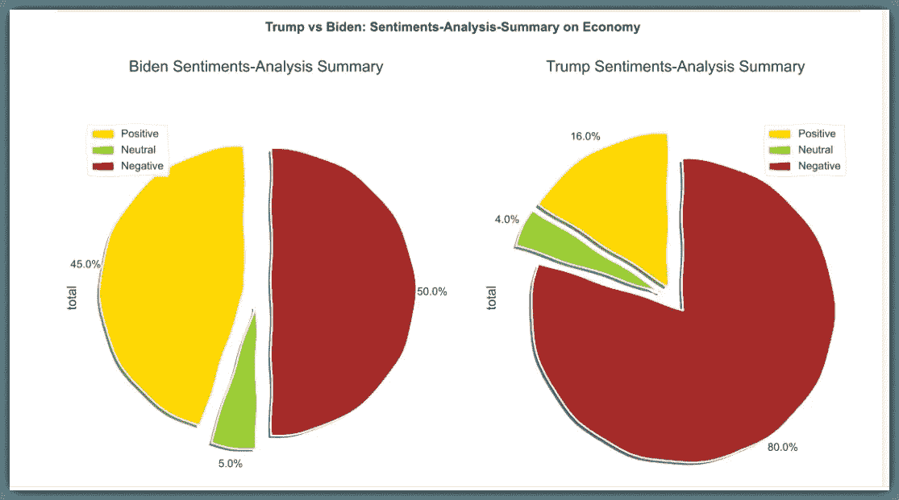**

**特朗普和拜登对美国经济的情绪分析的双饼图。**

**对于第三次参选的特朗普来说，他对美国经济的回应似乎过于消极…**

**让我们来看看关于经济的特朗普关键词**

**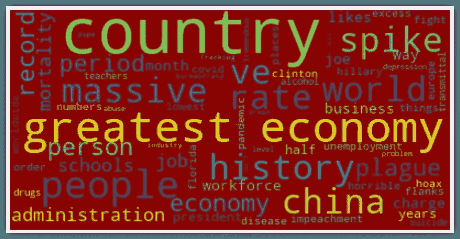**

**特朗普关于美国经济的言论云**

**特朗普使用了像“*历史上最大的经济体、国家、中国、政府、尖峰、庞大、世界* …”这样的词语**

**让我们来看看特朗普的一些积极回应，**

**关于他的积极方面，特朗普表示，由于乔维德，他不得不关闭我国历史上最大的经济体。顺便说一句，它正在重新建造，而且发展得很快。他最后说，在疫情之前，他们的失业率是最低的。**

**让我们来看看特朗普的一些负面回应，**

**特朗普谈到由于“*中国瘟疫*”而关闭经济的负面影响。他指责拜登计划再次关闭经济。他说，如果没有他的努力，就会有 220 万美国人死于这种病毒，而不是现在的 22 万人**

**让我们来看看拜登关于经济的关键词。**

**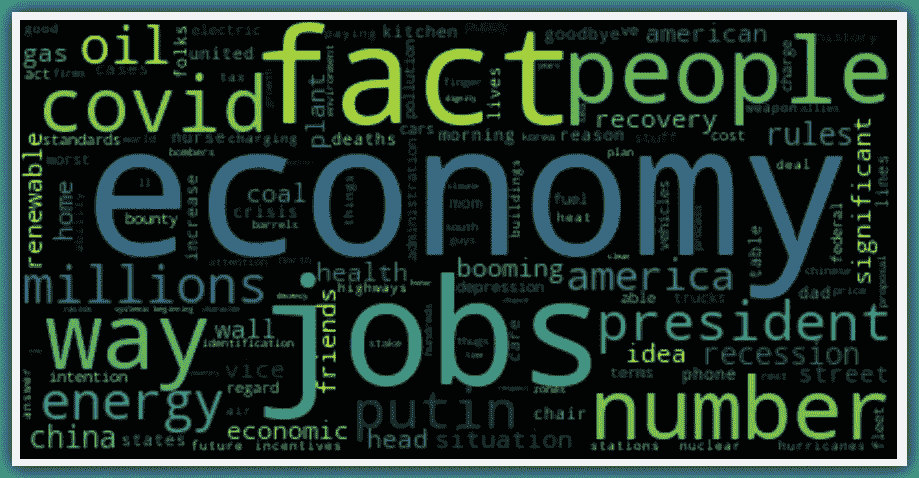**

**拜登谈论*‘经济、就业、事实、人民、能源、covid、数字、普京……*’**

**让我们来看看他对经济的一些积极评价**

**拜登反复谈到通过确保经济由清洁能源运行、推动和推动来创造数百万个新的就业机会。他特别谈到遏制能源泄漏和节省数百万桶石油，这将带来大量新的就业机会。**

**关于拜登对经济的负面情绪回应…**

**从他的负面情绪反应来看，拜登与在疫情中失去亲人的家庭进行了交谈。他挑战川普说，除非他先修复疫情，否则他无法修复经济。他提到了影响美国经济的系统性种族主义。他指责特朗普对经济管理不善，称奥巴马政府交给他一个蓬勃发展的经济，而他却搞砸了。**

**最后，在这一部分，让我们看看特朗普和拜登关于美国经济的词性标签的泡沫图。**

**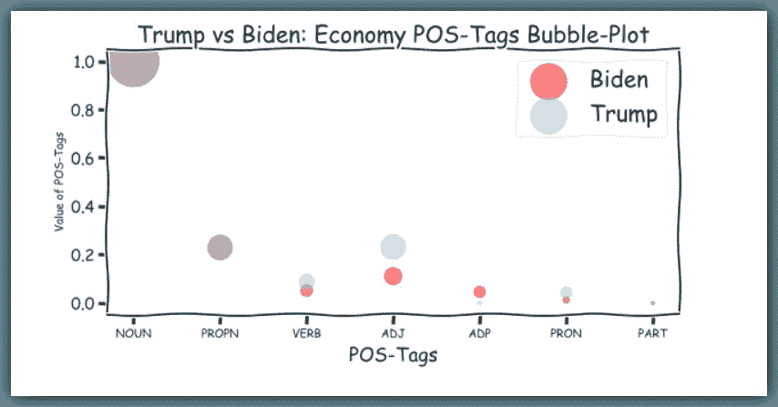**

# **6.贝叶斯推断:**

**因此，我们在这里的任务是找到川普和拜登在辩论中提到我们最关心的词的条件概率( ***P*** )。**

**我们将从头开始构建一个[朴素贝叶斯](https://medium.com/towards-artificial-intelligence/naive-bayes-inference-for-testing-7d96f4fcd62f)分类器，并用它来判断川普和拜登说出我们最关心的话的条件可能性。**

**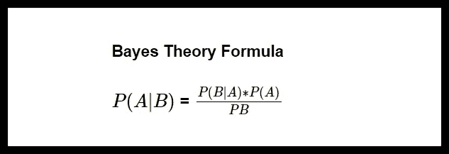**

> ***这仅仅意味着事件 **A** 的*条件 P ，给定事件 **B** 是事件 **B** 的**条件 P** ，给定事件 **A** ，乘以事件 **A** 的**边际 P** ，所有这些除以事件 **B 的**边际 P******

**先来定义一下*先验，*这个简单来说就是川普和拜登参加辩论的 ***P*** 。我说是**各 50%** 。**

```
**p_trump_speech = 0.5
p_biden_speech = 0.5**
```

**现在，我得到了我们关心的一些单词的列表(一些可能被词干化)**

```
**['job','wage','tax','raci','race','economy','drugs','covid',
 'pandemic','vaccine','virus','health','care','dr','doc','citizen',
 'america','black','african','white','latin','hispanic','asian',
 'minorit','immigra']**
```

**接下来，我定义了一个函数来计算特朗普和拜登在辩论中说出的每个单词的条件 ***P*** 。它返回一个完整的数据帧。**

**因此，我得到了数据帧，通过将每个值乘以 10 的一些因子来统一放大它，然后将这些值归一化，它看起来像这样…**

**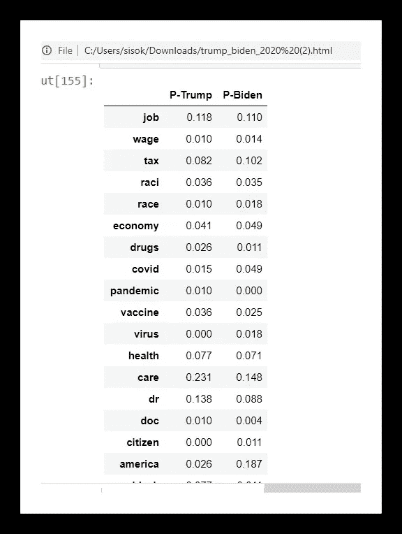**

**最后，我定义了一个贝叶斯推理方法来计算特朗普和拜登给定这些词的条件概率。**

**因此，特朗普的支持率为 46.5%，拜登的支持率为 53.5%**

****

**华夫图显示特朗普和拜登说出一些我们关心的话的概率…**

**因此，从这些辩论中，考虑到我们关心的话题，谁更有可能讨论它们…希望，解决它们并提供解决方案？贝叶斯法则认为拜登的可能性更大，差距很小 **53.5% — 46.5% = 7%** 乔·拜登…**

> **这绝不是对选举结果的预测，也不是影响选民决定的手段，这只是我从总统辩论中推断出来的观点。**

**但是当然，我们知道对美国来说，生活不仅仅是两场辩论。**

**上帝保佑美国，上帝保佑非洲，上帝保佑世界…**

****干杯！！****

# **关于我:**

***Lawrence 是技术层的数据专家，对公平可解释的人工智能和数据科学充满热情。我相信分享知识和经验是最好的学习方式。我同时持有 IBM 的* ***数据科学专业*** *和* ***高级数据科学专业*** *证书和 IBM 的******数据科学讲解徽章*** *。我已经使用 ML 和 DL 库进行了几个项目，我喜欢尽可能多地编写我的函数。最后，我从未停止学习和尝试，是的，我已经写了几篇被强烈推荐的文章。*****

****请随时在以下网址找到我****

****[Github](https://github.com/Lawrence-Krukrubo)****

****[**领英**](https://www.linkedin.com/in/lawrencekrukrubo/)****

****[**推特**](https://twitter.com/LKrukrubo)****