# 异常检测用例:信用卡欺诈检测

> 原文：<https://pub.towardsai.net/anomaly-detection-use-case-credit-card-fraud-detection-e15091c8e51d?source=collection_archive---------0----------------------->

## [机器学习](https://towardsai.net/p/category/machine-learning)


由[保罗·费尔伯鲍尔](https://unsplash.com/@servuspaul?utm_source=medium&utm_medium=referral)在 [Unsplash](https://unsplash.com?utm_source=medium&utm_medium=referral) 上拍摄的照片

> 欺诈者最大的责任是确信欺诈太聪明而不被发现。路易·j·弗里

事实是，欺诈交易很少发生；他们代表了一个组织内活动的一小部分。挑战在于，如果没有合适的系统和工具，很小一部分活动就可能很快变成巨大的财务损失。罪犯很狡猾，经常改变他们的策略。这篇文章重点介绍了欺诈分析如何构建能够学习、适应和发现新模式的系统来防止欺诈。

# 什么是异常检测


来自 [Pexels](https://www.pexels.com/photo/eggs-in-tray-on-white-surface-1556707/?utm_content=attributionCopyText&utm_medium=referral&utm_source=pexels) 的[丹尼尔·雷切](https://www.pexels.com/@daniel-reche-718241?utm_content=attributionCopyText&utm_medium=referral&utm_source=pexels)的照片

异常检测识别偏离数据集正常行为的数据点、事件和/或观察值。相关应用的一些可行例子是飞机引擎中振动强度和发热的变化、识别黑客信号、检测欺诈性信用卡交易等

# 什么是异常？

在数据挖掘中，异常检测是对引起疑问的罕见事件或观察的识别。异常可以大致分为以下几类:

1.  ***点异常:*** 数据的单个实例如果离其余的太远就是异常的。一个典型的例子是根据支出类型检测信用卡欺诈。

**②*。上下文异常:*** 异常是上下文特有的，在时序数据中是习惯性的。一个可行的例子是，在节日期间，每天花 150 美元买食物是合理的，但在其他情况下可能是奇怪的。

***3。集体异常:*** 一组数据实例集体帮助检测异常。例如，从数据库中意外复制文件可能会被标记为潜在的网络攻击。

异常检测与[噪声去除](https://en.wikipedia.org/wiki/Noise_reduction)和[新奇检测](https://en.wikipedia.org/wiki/Novelty_detection)类似，但并不相同。

# 异常检测技术

## 1.统计方法

识别数据中不规则性的最简单方法是标记偏离分布的常见统计属性的数据点，包括平均值、中值、众数和分位数。

## 2.机器学习方法


来自 [Slideshare](https://www.slideshare.net/nrubens/outliers-and-inconsistency)

因此，人工智能(AI)的应用为系统提供了根据经验自动学习和改进以检测这些异常的能力。在欺诈检测中使用机器学习背后的动机是因为两个主要原因。

1.  速度
2.  适应性

与人类相比，机器基本上更有能力快速检测模式。此外，随着欺诈者改变他们的战术和策略，机器可以更快地学习新的模式。

有许多机器学习技术可以使用，但是对于本文的上下文，我们将使用 Catboost 算法。

**什么是 CATBOOST？**


来自 [Catboost 网站](https://catboost.ai/)

CatBoost 是决策树上**梯度提升的算法。它由 Yandex 的研究人员和工程师开发，用于搜索、推荐系统、个人助理、自动驾驶汽车、天气预测和 Yandex 的许多其他任务。它在开源库中。**

**为什么选择 CATBOOST？**

该图书馆专注于:

1.  无需参数调整，质量卓越。
2.  精确度提高。
3.  快速预测。
4.  快速和可扩展的 GPU 版本。
5.  分类特征支持。

**CATBOOST 安装**

只有 64 位版本的 Python 支持安装。它主要有两个依赖 [Numpy](https://numpy.org/) 和[六个](https://six.readthedocs.io/)。它可以由两个流行的 Python 包管理器安装— [Conda](https://docs.conda.io/en/latest/) 和 [PyPI](https://pypi.org/)

康达安装:

```
conda install catboost
```

PyPI 安装

```
pip install catboost
```

喝杯咖啡，让我们用代码来检测信用卡欺诈


Marc Mintel 在 [Unsplash](https://unsplash.com?utm_source=medium&utm_medium=referral) 上拍摄的照片

*本文使用的代码、数据集和其他资源可以在*[***Github***](https://github.com/codebrain001/Credit-Card-Fraud-detection)***上找到。***

## 导入包和读取数据

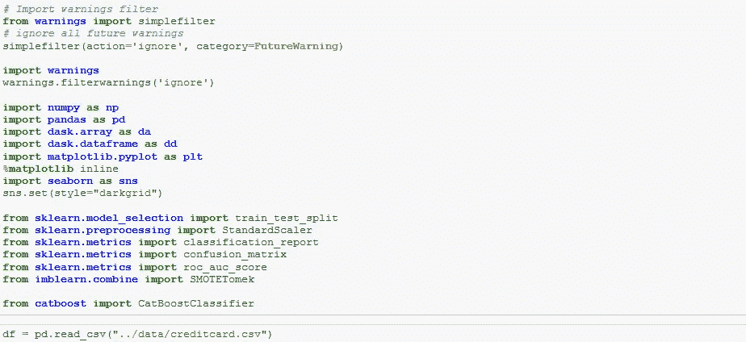

这里，我们从导入这个项目需要的所有 python 库开始。

*   `warning`:用于抑制 python 包中不推荐使用的函数的警告控件。
*   `pandas` & `numpy`:分别用于数据角力和科学计算。
*   `dask.array` & `dask.datafram`:针对 numpy 和熊猫的可扩展性
*   `matplotlib` & `seaborn`:用于图形和图表的可视化。
*   `classification_report`、`confusion_matrix`、&、`roc_auc_score`:用于评估预测的性能指标和报告。
*   `SMOTETomek`:采样技术。
*   `train_test_split`:拆分数据。

为了使用`dask.array`和`dask.dataframe`，必须安装。要一次安装所有的 **dask** 软件包，使用下面的代码片段，使用 [Conda](https://docs.conda.io/en/latest/) 或 [PyPI](https://pypi.org/) 软件包管理器。

```
# Via Condaconda install dask# Via PyPIpython -m pip install "dask[complete]"    # Install everything
```

## 探索和预处理数据

这一部分非常重要，因为我们准备和争论数据以获得洞察力。

**获得数据集的概述**

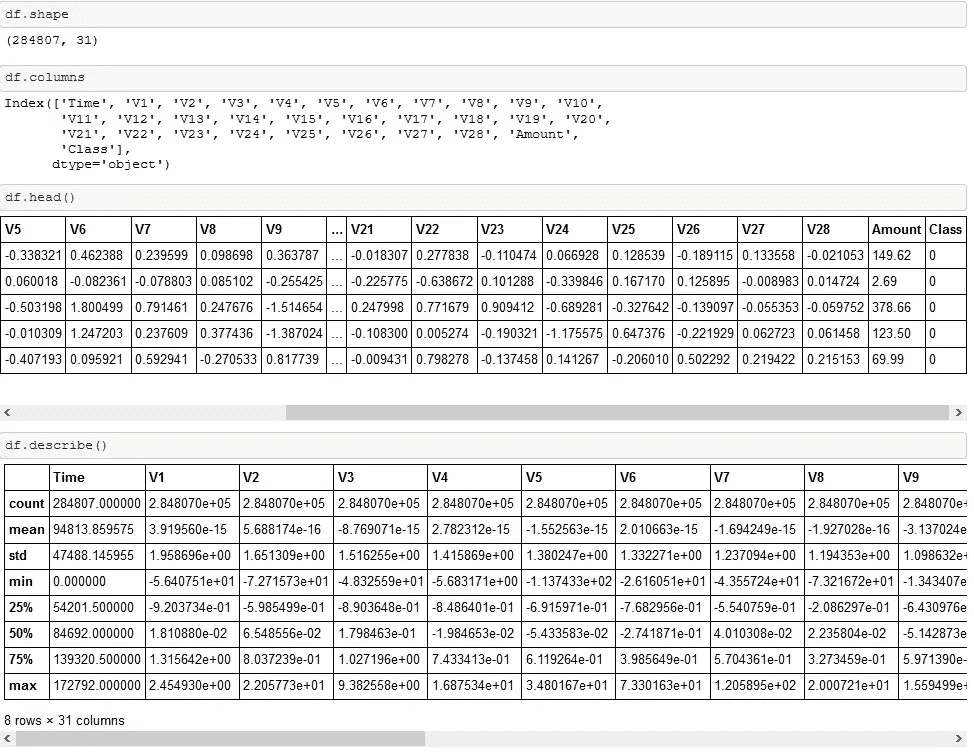

可以观察到数据集有 31 个特征。数据集的描述可以在[这里](https://www.kaggle.com/mlg-ulb/creditcardfraud)找到。还可以研究数据集的描述性统计的概述。


处理**缺失数据**很重要，因为许多机器学习算法不支持带有**缺失值的数据。**来自分析的数据集没有任何缺失值。

特征分布有助于理解您正在处理的是哪种特征，以及您期望该特征具有什么值。您将看到这些值是集中还是分散。

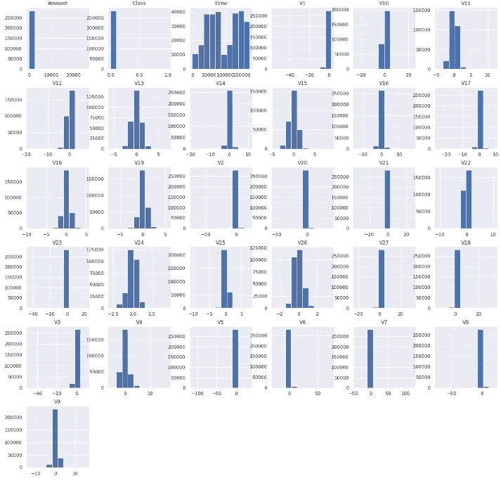

为了理解特征之间的变化，重要的是绘制相关矩阵，以了解相对于另一个变量具有高相关性和低相关性的变量。

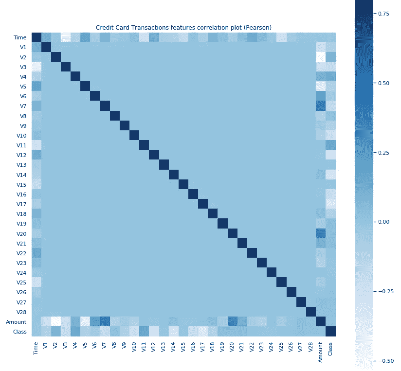

上述相关矩阵表明，V1 到 V28 五氯苯甲醚成分之间没有任何相关性，但是，如果我们观察到类别与 V 成分之间存在某种形式的正相关和负相关，但与时间和数量没有相关性。

## 研究欺诈行为

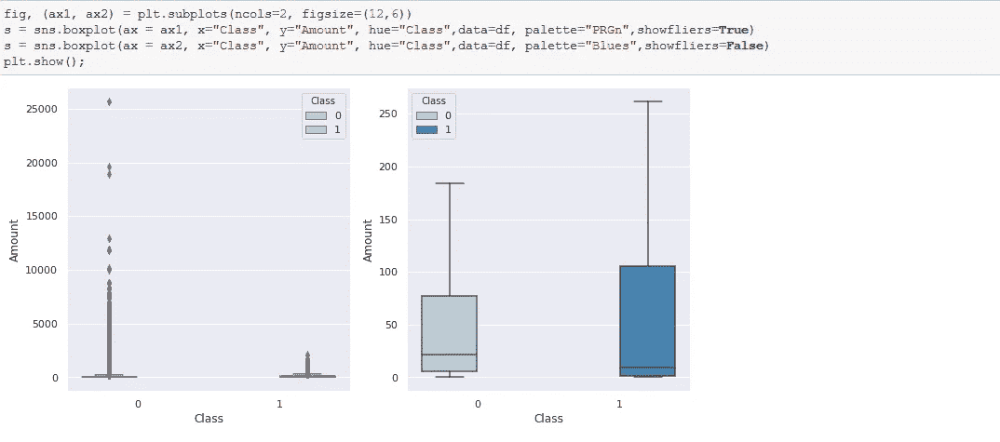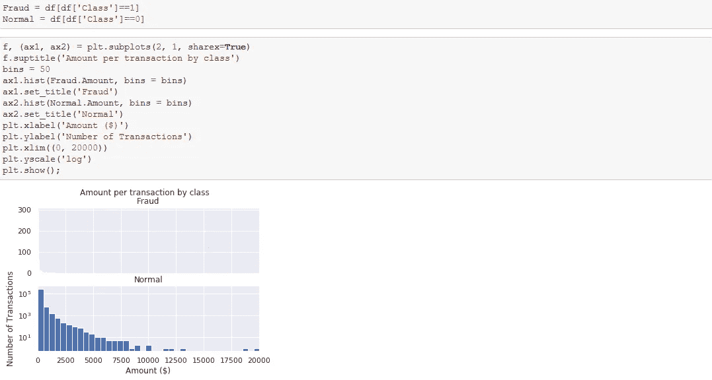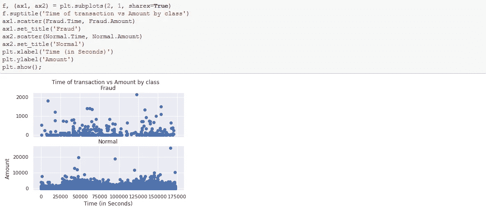

此分析显示了这些欺诈活动引发的频率和金额范围。

***N/B:*** *类*`*0*`*`*1*`*分别表示不欺诈和欺诈。**

## *Dask 可扩展性*

*欺诈检测操作在各种金融系统中至关重要，为了建立更好的模型，需要更多的数据来训练机器学习模型。欺诈检测不是一次性的操作，因此可扩展性是随着时间的推移提供高效系统的关键。这就是 [**Dask**](https://dask.org/) 发挥巨大作用的地方。*

**

*来源:D [请教](http://dask.org)*

*[Pandas](https://pandas.pydata.org/) 已经成为在 [Python](https://www.python.org/) 编程语言中用于数据争论和分析的最受欢迎和喜爱的数据科学工具之一。由于算法和本地内存限制，熊猫在大数据方面有自己的局限性。然而， [Dask](https://dask.org/) 是一个开源的免费 Python 库。Dask 提供了在**性能和可伸缩性**方面扩展 Pandas、 [Scikit-Learn](https://scikit-learn.org/stable/) 和 [Numpy](https://numpy.org/) 的方法。在本文的上下文中，数据集必定会不断增加，这使得 Dask 成为理想的工具。*

*因此，为了展示这些可伸缩性和性能特性，我们将在模型构建阶段并排比较 pandas 和 dask 的执行时间和性能。*

***平衡数据***

*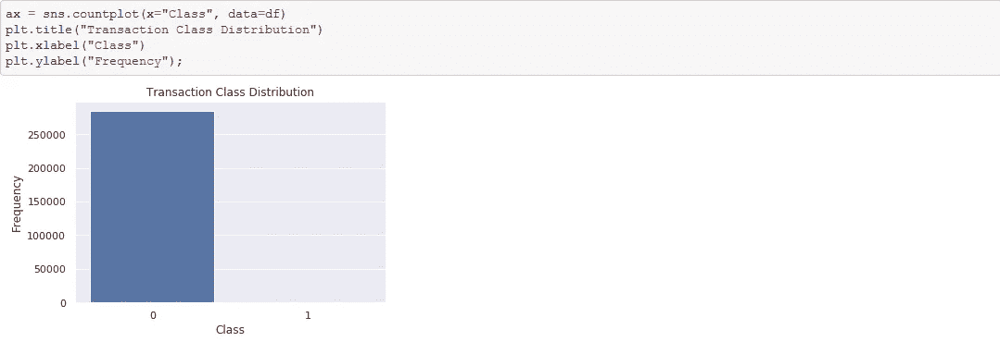*

*可以观察到`Class`特征的数据集分布非常不平衡。在这种情况下，使用传统机器学习算法开发的预测模型可能会有偏差和不准确。处理这种情况的两种基本方法是通过:*

1.  *欠采样*
2.  *过采样*

*在本出版物中，将使用`[SMOTETomek](https://imbalanced-learn.readthedocs.io/en/stable/generated/imblearn.combine.SMOTETomek.html)`过采样技术。值得注意的是，为了避免数据泄漏，所使用的采样技术应该应用于数据的训练部分。*

****为熊猫:****

*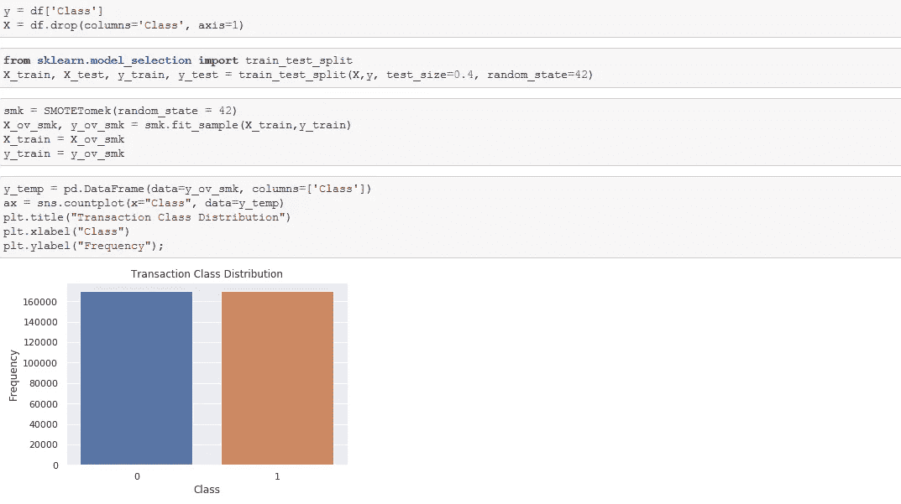*

****为 Dask:****

*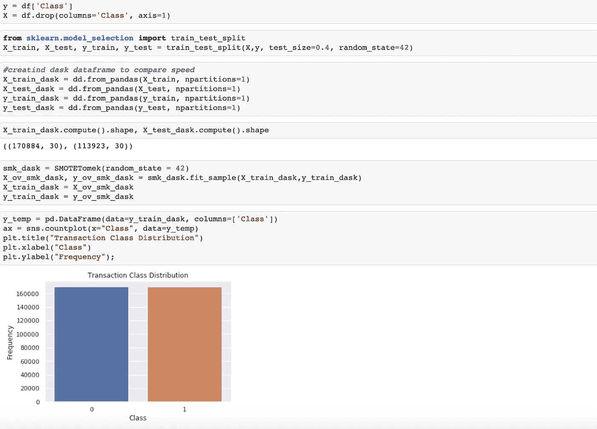*

***特征缩放***

*这是数据预处理中的一个重要步骤，以便在特定范围内对数据进行规范化。有时，它有助于加速算法中的计算。*

****对于熊猫:****

**

****为 Dask:****

**

## *模型拟合*

*这里的训练数据适合已经调优的 Catboost 模型。这一步是一个迭代过程，时间成本很高。这里，我们将使用`datetime`来计时执行时间。*

****为熊猫:****

*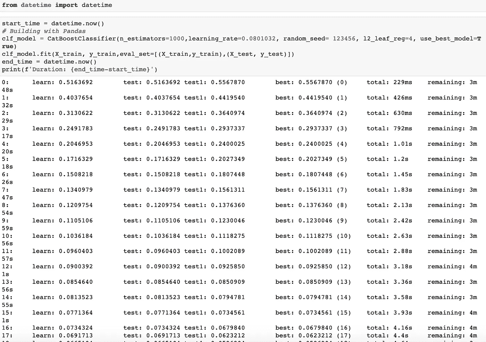**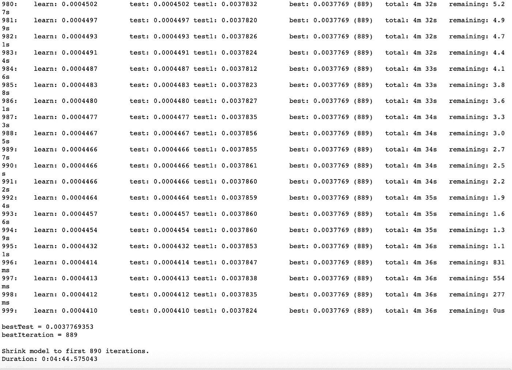*

****为 Dask:****

*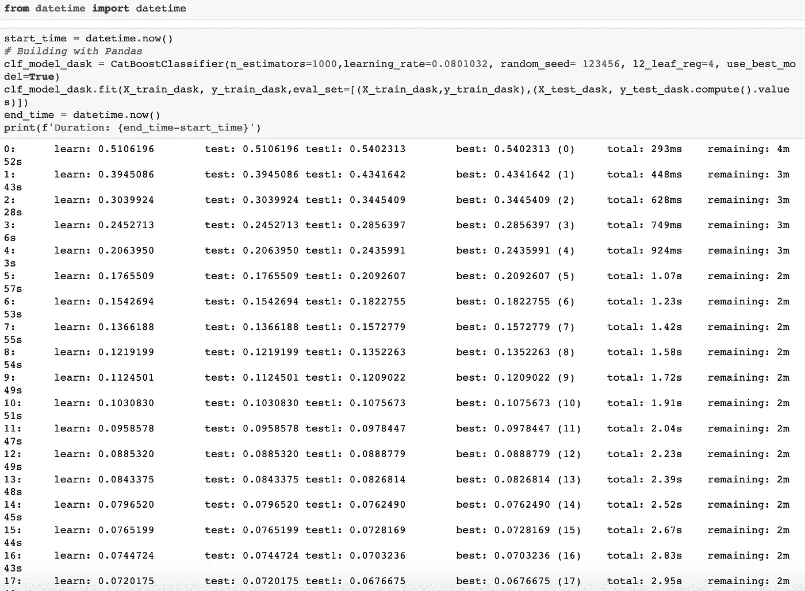**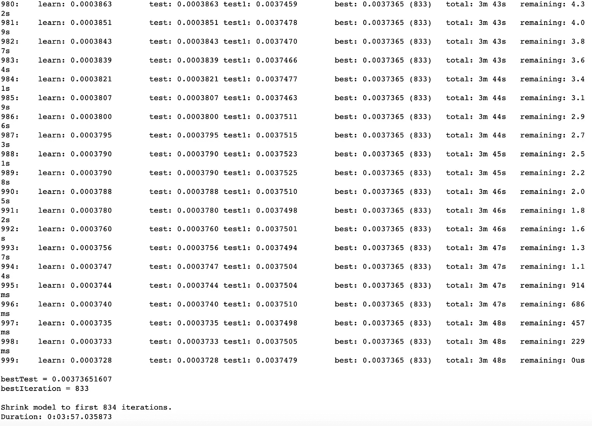*

*很明显 **Dask** 的执行时间比 **Pandas** 快约 3 分 57 秒，执行时间约为 4 分 44 秒。注意，用于执行的参数在比较过程中保持不变。*

***预测和评估***

****为熊猫****

*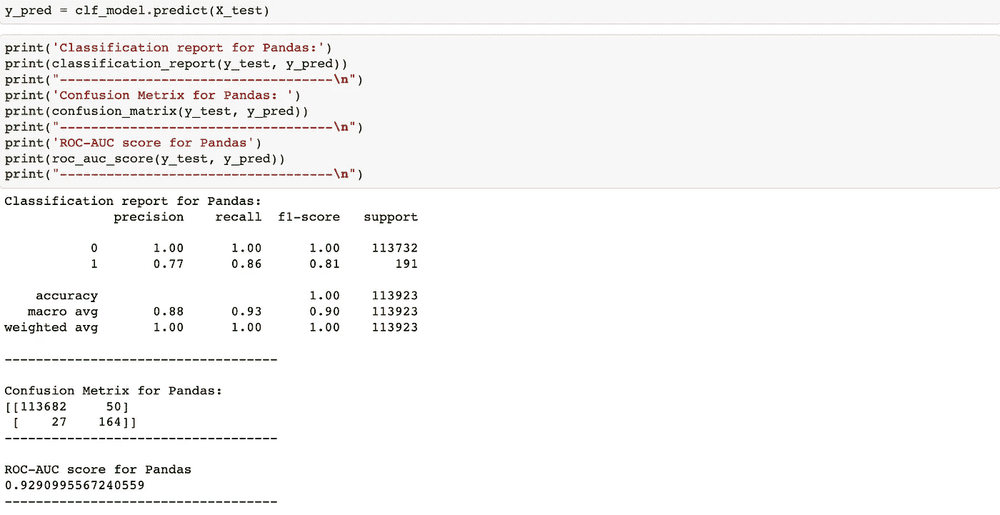*

****为达斯克****

*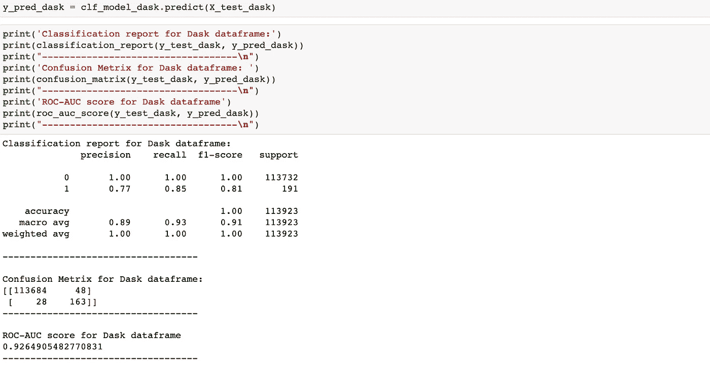*

*可以观察到，两个数据帧的模型性能非常相似，因为它在精确度、召回率、f1 分数和 roc-auc_score 上具有优异的分数。*

*我希望这篇文章将强调如何欺诈分析和机器可以用来打击信用卡欺诈。感谢您的阅读。*

## ***参考文献***

1.  *[https://www . research gate . net/publicati/220565847 _ Anomaly _ Detection _ A _ Survey](https://www.researchgate.net/publication/220565847_Anomaly_Detection_A_Survey)*
2.  *[https://www . research gate . net/post/what _ is _ the _ different _ between _ outlier _ and _ anomalies](https://www.researchgate.net/post/what_is_the_different_between_outlier_and_anomalies)*
3.  *[https://en.wikipedia.org/wiki/Anomaly_detection](https://en.wikipedia.org/wiki/Anomaly_detection)*
4.  *[https://machine learning mastery . com/how-to-identify-outliers-in-your-data/](https://machinelearningmastery.com/how-to-identify-outliers-in-your-data/)*
5.  *[https://www . kdnugges . com/2017/01/3-methods-deal-outliers . html](https://www.kdnuggets.com/2017/01/3-methods-deal-outliers.html)*
6.  *[https://medium . com/the-data-dynasty/anomaly-detection-in-Google-analytics-a-new-kind-of-alerting-9c 31 c 13 e 5237](https://medium.com/the-data-dynasty/anomaly-detection-in-google-analytics-a-new-kind-of-alerting-9c31c13e5237)*
7.  *[http://ceur-ws.org/Vol-2289/paper12.pdf](http://ceur-ws.org/Vol-2289/paper12.pdf)*
8.  *[http://ceur-ws.org/Vol-2289/paper12.pdf](http://ceur-ws.org/Vol-2289/paper12.pdf)*