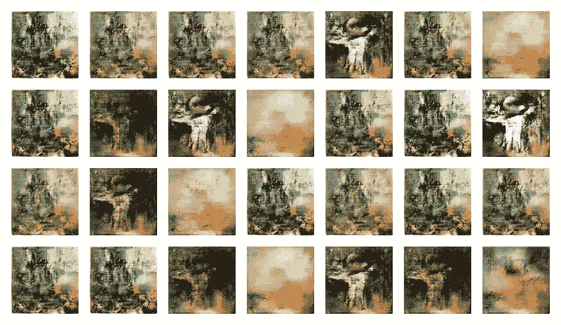
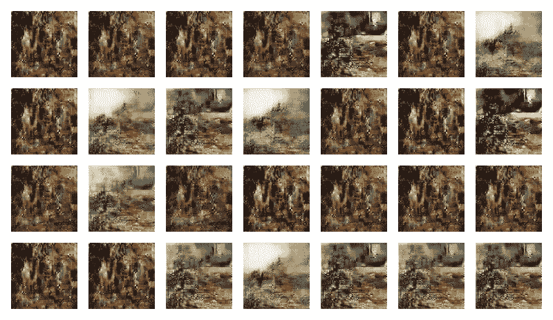

# 你是一个熟练的数据科学家吗？

> 原文：<https://pub.towardsai.net/are-you-a-skilled-data-scientist-3eaced66e4bc?source=collection_archive---------1----------------------->

## [职业生涯](https://towardsai.net/p/category/careers)

## 精通和一般数据科学家的区别不是你想的那样！

我采访了许多处于职业生涯不同阶段的数据科学家，我问他们的一个问题是 ***他们如何跟上人工智能和深度学习*** 快速变化的世界。

作者提供的图片(这些是我正在运行的 GAN 在大约 300 张属于印象派和立体派的输入图片上生成的中间图片:)

这个问题有两个目的:

1.  它告诉我他们对分析世界的了解程度，并为进一步的对话提供了节点。
2.  这是一扇通向他们世界的窗户，通过它我可以窥见他们解决问题的能力。

我们生活在一个头衔繁多的世界里，从数据科学家到数据传道者，从数据工程师到数据生态学家(我直到几天前才听说这个头衔)。由于哈佛的文章和随时可用的强大计算机器，该领域出现了与该领域相关的任何事物的单调热潮。这种膨胀提高了许多人的技能，并创造了许多与数据分析相关的有用的微观社区。随着问题的急剧扩大，我们确实有一个主要的问题。

这个领域相对较新，所以很多人创建了他们自己的 DS(数据科学家)角色和职责的定义，并把它们当作一个福音；定义的范围可以从全栈开发人员到某个坐在地下室通宵黑客攻击的 ***数据忍者*** 。无论你有什么样的定义，坚持下去，因为总有一天你的定义和你都会受到考验，而试金石会让你当场就知道你的结果。

D 日通常会给你带来一个你从未见过的问题，Stackoverflow、GitHub 或其他网站不会来救你。唯一能拯救你的是你的内在技能，包括正常呼吸的能力、编程和创造性解决问题的能力。列表中还有一个不太被提及的词，它与 DS 中的术语“科学家”一致。

> **技能是多方面的，是能够:**
> 
> **1。快速解析深奥简洁的科学文献。**
> 
> **2。理解并起草一个关于中心思想的算法。**
> 
> **3。根据您选择的测试数据对其进行编程，并检查一致性。**

所有这些导师、博客、视频频道都可以帮助你掌握基本概念，让你起步，但几乎没有人告诉你如何利用你的知识，以及当你面临看不见的挑战时该怎么做。

> 大约一个月前，当我们处理来自石油钻井平台的音频数据时，我们还没有找到解决方案，于是我们决定重新调整最初的策略。我们阅读了一篇关于[分类迁移学习的论文](https://arxiv.org/pdf/1805.02043v2.pdf)，我使用了我的 Spotify 播放列表数据作为种子，我们编写了快速而肮脏的代码来加强我们的假设，即我们应该专注于频谱图，而不是处理原始音频、波形或仅傅立叶变换数据。
> 
> 我不会散布一个错误的说法，说在我们找到方法后，世界变得更加美好，到处都是独角兽。我们不断碰到这样或那样的问题，但都是朝着正确的方向。后退一步并改变策略的决定是稳健模型的关键点，是首先阅读并实施该文件的决定的产物。

优秀的数据科学家和普通的数据科学家之间的区别不在于谷歌搜索的技能，而在于找到相关研究论文或文献，看看它是否能解决你的问题的能力。它为你提供了更多的分析能力，筛选出了可行的策略，剔除了你或你的团队可能付出努力的多余方向。

所以，用任何头衔来装饰你自己，用机器个性开发者、数据忍者或松鼠(我的几个朋友开的一个内部玩笑:)这样的关键词来修饰你的简历，但是对维持现状或过去成就的恐惧不应该阻止你探索真相和进行实验，因为这就是数据科学的意义所在。

你可以仔细思考它，并就这篇论文是否符合要求进行哲学讨论，但你只有在以下情况下才能找到答案:

1.  *你会得到你的那杯咖啡，*
2.  *插上耳机(如果你喜欢的话，可以戴耳机)，*
3.  *挺直你的背，*
4.  开始把那张纸翻译成代码。