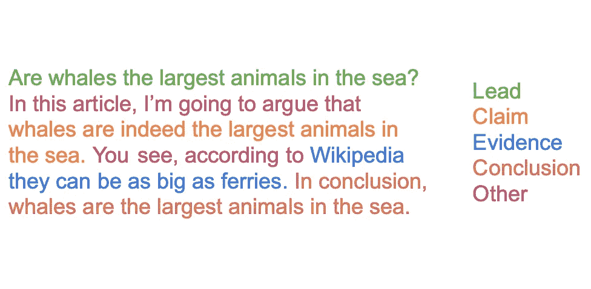
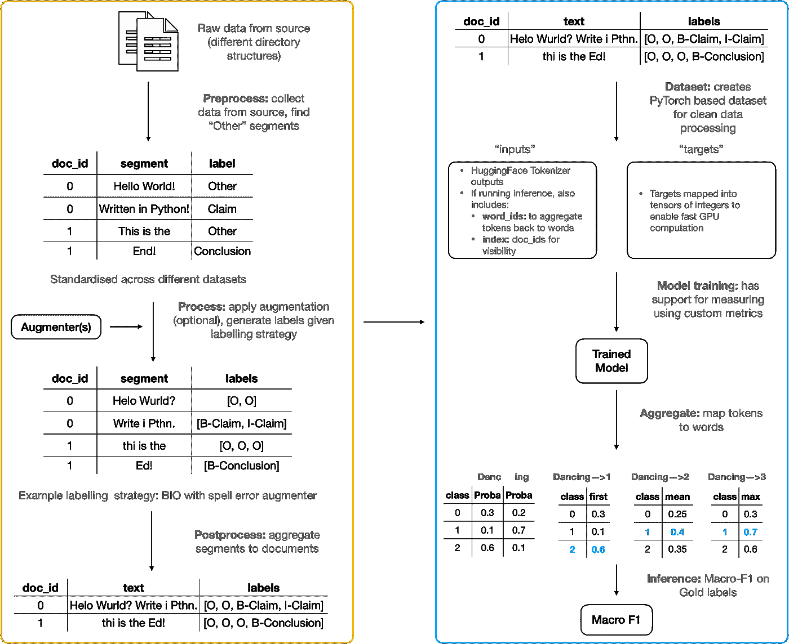
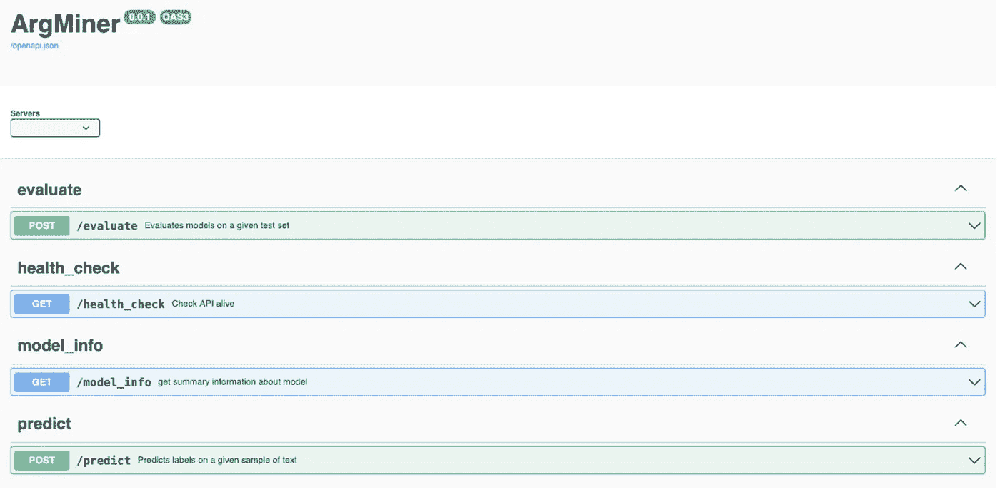

# ArgMiner:端到端参数挖掘

> 原文：<https://pub.towardsai.net/argminer-end-to-end-argument-mining-9b1e69872103?source=collection_archive---------1----------------------->

## 一个基于 PyTorch 的包，用于对 SOTA 参数挖掘数据集进行处理、扩充、训练和执行推理

论点挖掘任务的图示

论点挖掘(AM)是从文本中提取论点成分的任务，通常作为自动化写作评估系统的一部分。这是 NLP 中非常热门和令人兴奋的领域。用最基本的术语来说，一个好的 AM 模型获取一段原始文本，并正确地将其中的序列标记为它们所属的论元成分(这在封面照片中以图片形式显示)。虽然这个问题在历史上被视为语义分割问题，但最新的(SOTA) AM 技术将其视为长文本序列上的命名实体识别(NER)问题。

尽管该领域有着悠久的历史，但关于 NER AM 数据集的文献相对较少，Christian Stab 和 Iryna Gurevych 的 [Argument 注释论文](https://tudatalib.ulb.tu-darmstadt.de/handle/tudatalib/2421)是 2014 年以来唯一的贡献。这一点在最近(截至 2022 年 3 月)随着说服(用于[反馈奖 Kaggle 竞赛](https://www.kaggle.com/competitions/feedback-prize-2021/overview))和 ARG2020 数据集( [GitHub 页面](https://github.com/EducationalTestingService/argument-component-essays/))的发布而得到了改善。正因为如此，虽然 AM 在单个数据集上取得了成功，但对 AM 模型的跨数据集性能却知之甚少。因此，也没有关于对抗性训练如何提高 AM 模型的跨数据集性能的研究。关于 AM 模型对对立例子的鲁棒性的研究也是缺乏的。

每个数据集都以不同的格式存储，这使得上述挑战变得更加复杂，从而很难对实验数据的处理和扩充进行标准化(快速查看反馈奖竞赛的笔记本可以证实这一点，因为大部分代码都是用于处理数据的)。

本文介绍了 ArgMiner，这是一个基于 PyTorch 的包，用于使用基于 Transformer 的模型对 SOTA 参数挖掘数据集进行标准化数据处理、数据扩充、训练和推理。本文首先概要介绍了包的功能，然后介绍了 SOTA 数据集。然后详细描述 ArgMiner 的处理和扩充特性。最后，简要讨论了论证挖掘模型的推理和评估(通过 Web 应用程序)。这篇文章以一些结束语结束。

# 简而言之就是 ArgMiner

ArgMiner 的主要特性总结如下:

*   提供处理器从源中提取 SOTA 数据集，而无需编写任何额外的代码
*   处理器可以在单词和子单词级别生成以下标记方法{io、bio、bieo、bixo},而无需额外的代码行
*   处理器有一个内置特性，可以在不改变数据处理流水线的情况下实现定制扩展
*   提供 PyTorch 数据集，用于使用任何 HuggingFace 标记分类模型进行参数挖掘微调
*   为高效的训练和推理提供了管道

下图显示了 ArgMiner 端到端的工作:

# 处理和扩充

## **数据集**

*   **议论文注释(AAE):** 这是在在线论文反馈论坛 [essayforum](https://essayforum.com/) 上找到的 402 篇论文的集合。它有 3 个论证成分:**主张**、**主要主张**、**前提**。数据集可以在 TUDarmstadt [数据存储](https://tudatalib.ulb.tu-darmstadt.de/handle/tudatalib/2421)中找到；原 [p](https://aclanthology.org/C14-1142.pdf) 论文在 [ACL](https://aclanthology.org/C14-1142.pdf) 上，后续论文在 [MIT Press Direct](https://direct.mit.edu/coli/article/43/3/619/1573/Parsing-Argumentation-Structures-in-Persuasive) 上。
*   说服:这是美国 6-12 年级学生写的大约 15000 篇文章的合集。它有 7 个论点组成:**引**、**立场**、**主张**、**反诉**、**反驳**、**证据**、**结论**、**陈述**。数据集可以通过 [Kaggle 反馈奖](https://www.kaggle.com/competitions/feedback-prize-2021/overview)比赛访问。
*   这是 145 篇中学生作文的合集。它有两个论证成分:**主张**和**前提**。数据集可以在 [GitHub](https://github.com/EducationalTestingService/argument-component-essays/) 上公开获得，这项工作的论文在 [ArXiv](https://arxiv.org/pdf/2103.04518.pdf) 上。

这些数据集以不同的方式存储和处理。例如，AAE 和 ARG2020 数据集具有。包含两种类型信息的 ann 文件:1)自变量成分，其形式为:[自变量 _ 成分 _id，自变量 _ 成分 _ 文本，跨度 _ 开始，跨度 _ 结束，文本]和 2)自变量关系，其形式为:[关系 _id，关系 _ 类型，自变量 _ 成分 _1，自变量 _ 成分 _2]。参数挖掘不需要参数关系，因此需要移除这些关系。此外，实际的 essay _ ids 是文件本身的名称，所以解析它的代码需要考虑它。数据是附带的。txt 文件的原始文章文本以及。与 ARG2020 不同，AAE 数据集附带了用于分割数据的训练测试 id。

另一方面，说服数据集有一个更复杂的目录结构，train 和 test 目录包含原始的。txt 随笔。关于参数组件的实际信息包含在 train.csv 中，其格式如下:[essay_id，discourse_id，span_start，span_end，discourse_text，discourse_type，discourse_type_num，predictionstring]。

没有一个数据集实际上指出文章中不是论点部分的部分，即所谓的“其他”类。然而，NER 问题通常需要这样做(否则你是选择性地查看文章中的信息，而不是整篇文章)。所以管道需要从文章中提取这些片段。

为了以标准化的格式处理这些千差万别的原始文本，ArgMiner 采用了三个阶段:**预处理**、**过程、**和**后处理**。这些将在接下来的章节中详细描述。

## 预处理:从源中提取数据

该步骤获取原始格式的数据(针对每个数据集)，并使用 **span_start** 和 **span_end** 特性和原始文本来生成具有以下结构的数据帧: **[essay_id，text，argument_component]。**

这实现了向前移动以生成 NER 标签或扩充数据的标准方法。这些处理器都基于一个基本的数据处理器类，该类具有保存和应用训练-测试-分割的内置特性，因此可以轻松地从中创建新的处理器。

## 处理:生成标签和(可选)扩充数据

既然数据是标准格式，用户可以请求为数据生成 NER 风格的标签。在这一步结束时，数据集将看起来像这样:**【论文 id，文本，参数组件，NER 标签】**。

然而，有时人们可能对扩充数据感兴趣，无论是为了对抗训练还是测试对抗例子的鲁棒性。在这种情况下，用户可以简单地提供**任何获取一段文本并返回一段增加的文本的函数。**这意味着其他 NLP 增强库如 [textattack](https://github.com/QData/TextAttack) 和 [nlpaug](https://github.com/makcedward/nlpaug) 可以轻松使用。当使用增强器时，数据首先在

## 后处理:将序列聚合到文档

既然已经创建了标签，最后一步就非常简单了。在这里，任务是简单地通过它们的 doc _ ids 连接片段。这个阶段的结果输出是一个数据帧，其形式为:**【论文 id，完整论文文本，NER 标签】**。使用内置的训练和测试特性，进行训练测试分割也非常容易。

# PyTorch 数据集

我不会详细说明它的代码是如何工作的，但我会强调为什么它很棒:

*   PyTorch 数据集旨在从。后处理()阶段。此时，变量 **strategy_level** 可以确定标记策略是否应该应用于一个**字**或**令牌**级别(见本节末尾)。
*   数据集将类标签扩展到子标签。与 Kaggle 上的例子相比，这是一个巨大的改进，因为它是矢量化的，可以有效地使用 GPU。
*   数据集创建一个映射，将扩展标签缩减到它们的核心标签，以便进行推理(例如，“B-Claim，I-Claim，E-Claim”都被缩减为索赔，以便进行推理，如果不确定，我强烈推荐我的关于 NER 推理的[教程](/an-in-depth-tutorial-on-the-f-score-for-ner-55e944bd28ce)

它使用起来也很简单，因为它是基于 PyTorch 的，所以您可以很容易地将其集成用于培训。举个例子:

> **一个简单的标签示例:**考虑一个经典的(非参数挖掘)NER 示例，带有句子“我是 Johannes Schmidt”。假设令牌是 I，am，Jo，hann，es，Sch，mi，dt。一个标准的生物标签方案将给出:I → O，am →O，Jo →B-PER，hann →I-PER，es →I-PER，Sch →I-PER，mi →I-PER，dt →I-PER。然而，你可能也想给 B-{}单词的任何标记加上 B-{}标签。这将是**的字级**。于是**汉恩**和 **es** 都获得了 B-PER 标签。最后，ArgMiner 支持 **bixo** 标签方案，该方案将一个 **X** 分配给参数组件的所有子标签，这意味着所有的 **hann** 、 **es** 、 **mi** 和 **dt** 都将获得标签“ **X**

# 推理

ArgMiner 还提供了用于训练模型和运行推理的函数。但是，您也可以编写自己的训练循环。

ArgMiner 的定义特性是推理函数被编写为高效的(在可能的情况下使用 GPU 和矢量化)和批处理的(因此非常适合低内存设置)，这意味着推理函数也可以在针对验证数据的训练期间使用。

推理循环对于训练数据调试也非常有帮助，因为它允许您添加想要度量的其他指标。然后将这些应用于张量，并在从子音还原为单词后应用于张量，这可以给你一个指示，告诉你性能到底在哪里下降。

另一个让这个推理循环与我见过的其他循环不同的特性是，当从标记映射回单词时，能够轻松地选择聚合级别。例如，给定两个标记“Unit”和“ed ”,每个类都有概率，您可以使用单词“Unit”的最佳概率、最佳平均概率或最佳最大概率将它们聚合为“United”。

总的来说，与反馈奖竞赛中使用的推理方案相比，这种推理方案提供了几个优点。

> 在我的另一篇文章中可以找到关于这个项目使用的推理的深入教程。

# Web 应用程序

ArgMiner 附带了一个 web 应用程序，用于查看您的模型(或 HuggingFace 中的任何模型)给出的输出，还用于评估模型在您自己编写的自定义数据集上的性能。这是一种有用的(非正式的)方法，可以通过特定的例子来探测模型，看看它在做什么。

# 结束语

*   很长一段时间以来，论点挖掘文献在数据集上很少，但随着说服和 ARG2020 的发布，这种情况有所改变
*   对于论点挖掘中的知识转移以及鲁棒性，还需要做大量的研究。从数据处理的角度来看，这通常很困难，因为存在不同的源数据格式、多种表示数据的方法，以及由于使用不相等的段进行表示和推断而导致的效率问题
*   ArgMiner 是早期版本 Access 中的一个包，它标准化了对 SOTA 参数挖掘数据集的处理、扩充、训练和执行推理

## 一些限制和正在进行的工作

虽然这个包的核心已经准备好了，但是还有一些细节需要解决，还有一些缺失的特性。这些描述如下:

*   ARG2020 数据集的数据处理器
*   增强功能目前只能将文本作为输入。进一步的改进也将着眼于标准化其他特性，例如，如果只对特定的类进行扩充。这对于理解模型非常有用，特别是确定特定的转换如何影响模型输出
*   扩展数据处理器类，以允许分层训练-测试分割，以及基于其他特征的分割，例如课程学习的长度，零射击学习的类

## 号召 NLP 爱好者

如果你对参数挖掘和 NLP 感兴趣，并且你觉得这篇文章很有趣，我很乐意和你聊天，并把你添加为这个项目的合作者。我希望将这个项目进行得更深入，超越早期的 Access 版本，并将一些代码库重构为更通用的 NLP util 库，以及 NLP 诊断和数据健壮性库/应用程序(我对合并以下项目感兴趣:[数据制图](https://arxiv.org/abs/2009.10795)和[信息论数据集难度](https://kawine.github.io/assets/dataset_difficulty.pdf))。这些是我非常兴奋的长期计划，但作为一名单独的开发人员却无法做到。如果你有兴趣，请通过 [LinkedIn](https://www.linkedin.com/in/namiyousef96/) 联系我。

> 这个项目的资源库在 [GitHub](https://github.com/namiyousef/argument-mining) 上公开发布

*所有图片均由作者提供，除非另有说明。*