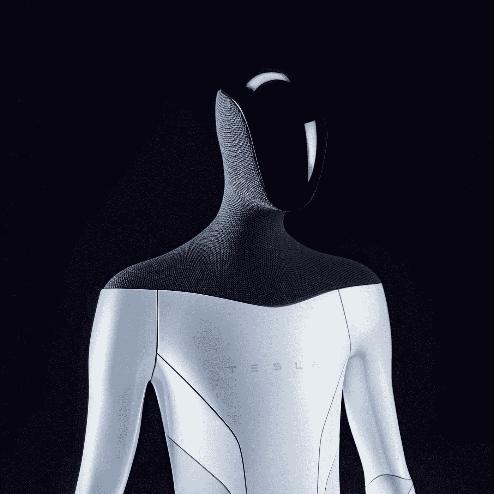

# 人形机器人的目标是什么

> 原文：<https://pub.towardsai.net/artificial-intelligence-579a2947d532?source=collection_archive---------2----------------------->

## [人工智能](https://towardsai.net/p/category/artificial-intelligence)

## 人形机器人是特斯拉希望成为使用先进人工智能技术领导者的下一个领域

摄影:特斯拉

特斯拉和埃隆·马斯克的目标是推出一款名为“特斯拉机器人”的新产品，在以下领域帮助人们:

*   人们感到不安全的危险任务
*   可以自动化以降低成本的重复性任务
*   很难找到一个人来做或被社会普遍接受的枯燥任务，由机器人来完成。正如埃隆·马斯克所说，名为 Optimus 的特斯拉机器人旨在做人们不喜欢做的工作。

特斯拉机器人(Tesla bot)是埃隆·马斯克(Elon Musk)在特斯拉人工智能日(Tesla AI Day)上展示的一款基于人工智能的高度复杂的未来产品。**这款产品利用了特斯拉汽车的所有传感能力，比如摄像头，以及目前特斯拉完全自动驾驶功能中使用的人工智能硬件和算法。**与马斯克的其他产品类似，特斯拉机器人也可能是一款革命性的产品。

# 安卓机器人

Android 机器人是一种与人类非常相似的人形机器人。我们已经知道，机器人是为研究活动而制造和使用的。这些种类的机器人更像人类，例如，拥有像人类一样的头发和皮肤。**它们旨在取代人际关系，与旨在利用人类并承担人类任务的类人机器人形成对比。**

# 感官能力

当将人类感官与机器人传感器进行比较时，许多传感器功能(如距离测量、温度、摄像头、麦克风阵列)会收集环境数据。类人机器人至少需要图像和语音数据，每种数据分别由摄像头和麦克风阵列采集。

要拥有一个尽可能接近人类感官的机器人，我们必须把五种感官都设计得像人类一样。但是其中一些感觉，如触觉、嗅觉或味觉，太复杂了，我们需要更多的传感器来实现这些技能。**人工智能有助于使用摄像头等传感器来识别物质和** [**预测**](https://techcrunch.com/2019/06/17/mit-develops-a-system-to-give-robots-more-human-senses/?guccounter=1&guce_referrer=aHR0cHM6Ly93d3cuZ29vZ2xlLmRlLw&guce_referrer_sig=AQAAAKgoRse5mrfwPKudL4cDkkQungDCc1_FSOKBwWuMkcx-mtGTYc7-dUdvfEMFMQrWTsu1UpuVSdJgdP_z_anDNuW2-wQVZhBoQ3ugPwuHEui7PGL4db1Ky_WCe8OZJnHJT6MvOp7QKJzeOFxusk4GQz8XC-nuGQDJBEUGuKtrhF1X) **触觉。**

# 数据保密

人形机器人是社会的一部分，在移动时，它会收集我们的私人数据，并将其存储在本地或全局内存中。这些信息包括声音、图片，甚至我们的行为。随着社会中机器人数量的增长，可以收集更多的数据。每个人都有权控制自己的私人数据。新方法使用区块链技术来分散机器人收集的数据，并保护我们的个人数据。

# 特斯拉正在寻找…

> 特斯拉思考这样一款产品的目标是什么？

特斯拉声称通过替代机器人制造电动汽车来解决劳动力短缺问题。这可能是一个 24/7/365 不间断工作的极好解决方案，无需与工会代表进行任何不必要的讨论。

> 这是特斯拉制造人形机器人所追求的目标吗？

许多专家怀疑特斯拉汽车目前的自动驾驶技术是否足够成熟，可以用于人形机器人的制造。但从技术角度来看，如果你能限制你给机器人的任务数量，这是可行的。**唯一关键的问题是安全角度，因为与目前生产线上的固定机器人相比，人形机器人可以自由移动，如果发生故障，可能会损害人或环境。**

> 自动驾驶汽车更容易生产还是自动驾驶汽车更容易生产？

特斯拉声称，该公司制造轮子上的机器人，由于特斯拉已经拥有人工智能、电池、传感器和致动器技术，制造人形机器人应该不会太难。

除了制造带有许多传感器的复杂汽车，还有另一种解决方案。汽车应该是安全的但不一定是智能的。智能可以在机器人身上实现，并用作新的驱动力。有了这个解决方案，**特斯拉可以为其产品组合增加一个新产品，同时仍能销售电动汽车。**制造自动驾驶汽车对汽车制造商来说不是一个好策略，因为他们只从销售汽车中获利，自动驾驶汽车将大幅减少生产和销售的汽车数量。

> 人形机器人和 SpaceX 路线图有关系吗？

**另一个场景是将人形机器人送上火星，建造基础设施，为人类准备合适的生活环境。将人送上火星是非常冒险的，使用人形机器人可能是一个降低火星上突发事件风险的好主意。**

看起来埃隆·马斯克对未来世界有着精确的愿景。**可持续能源，居住在其他星球，人人互联网，现在特斯拉 bot 作为智能机器与人互动。特斯拉机器人是在生产线上做工人还是坐在车里做司机并不重要。**

# 人工智能非常接近通用 AI

无论特斯拉在寻找什么，特斯拉机器人都朝着建立人工通用智能(AGI)又前进了一步。与其专注于完美地完成一项任务，不如更灵活地像人一样学习，像人一样同时做更多的任务。这一步是远离弱人工智能，实现灵活的人工智能，像人类一样，可以学习新的东西，并使用它来完成另一项任务。

这种想法比制造包括许多传感器和许多安全机制的昂贵汽车更具成本效益。在这种情况下，汽车只有支持驾驶员的辅助功能，没有机器人功能。作为第 4 级的自动化概念，人形机器人可以被设计成在某些领域执行任务，但仍然具有学习能力。

今天，通用机器人是一个复杂的产品，就像多年前通用计算机面临的挑战一样。**我们设法开发了通用计算机，现在新的目标是创造和实现一个通用机器人，类似于现在人人都可以使用的通用计算机。**

**AGI 只能通过基于已经学习的模型的学习来实现，而不是从零开始，正如目前通过机器学习或深度学习模型所做的那样。迁移学习大概是人形机器人的关键。**现在可用的机器人嵌入了许多 AI 模型。我们不应该设计一个同时优化所有模型的机器人，因为人类也有极限，人类在学习新技能时也是不同的。

埃隆·马斯克(Elon Musk)一直表明，他想要彻底改变世界；虽然一直有营销的味道，但总的来说，他在改变世界方面做得非常成功，我们期待从他身上看到更多。

你怎么想呢?请在下面分享你的想法！