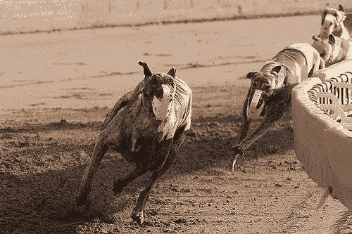
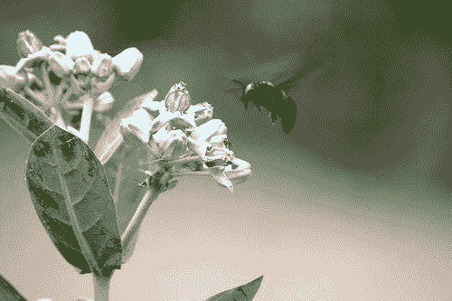
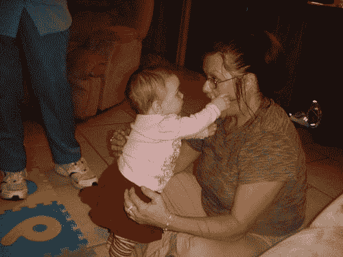
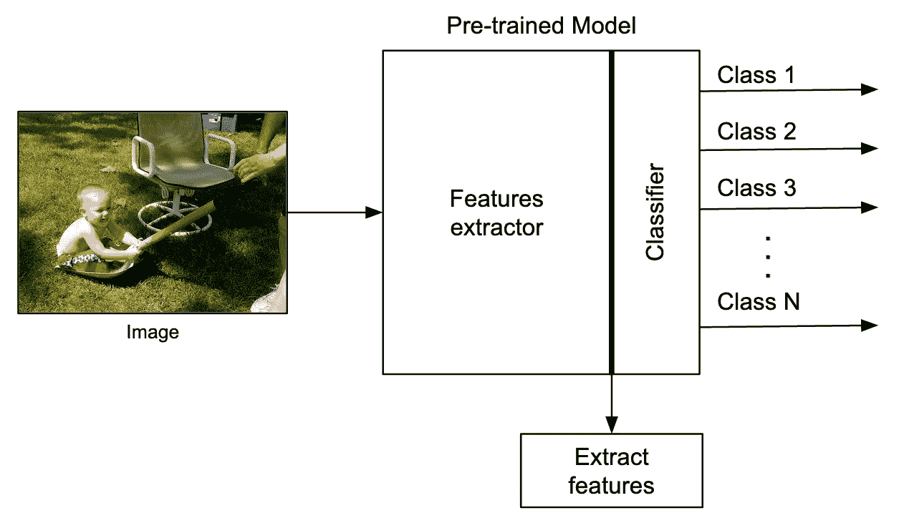
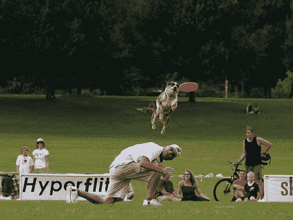

# 人工智能如何给你的照片加标题？

> 原文：<https://pub.towardsai.net/artificial-intelligence-6d47bedbed3e?source=collection_archive---------4----------------------->

## 假人图像字幕的概念指南

拉杰·拉纳在 [Unsplash](https://unsplash.com/@theranaman?utm_source=unsplash&utm_medium=referral&utm_content=creditCopyText) 上的照片

看下图。

图片来源:Flickr 8k 数据集。2712787899_d85048eb6a.jpg

如果我让你描述一下这幅图像，你可能会说“有一个年轻的女人坐在窗台上，手里拿着一个黑色的钱包，看着自己的指甲”。“这充分描述了图像内容。图像字幕是描述图像内容。一个合适的标题不仅可以帮助一个正常人欣赏图像，还可以帮助盲人想象图像是关于什么的。字幕是一种技能——不恰当的字幕会导致错误的解读。我们可以训练一个 AI 模型来为任何图像生成醒目的标语(标题)吗？在这篇文章中，我将描述图像字幕背后的完整概念，为其开发一个机器学习模型需要什么，最后为那些铁杆开发者提供完整的实现。

# 基本必需品

任何机器学习模型的基本需要是数据集。除非你有一个合适的数据集来训练算法，否则你甚至不能开始 ML 开发。幸运的是，Flickr 已经发布了这样一个数据集供公众使用。他们的资料库里有数百万张照片。他们没有给这些照片贴标签——没有说明。然而，他们已经付出了一些额外的努力来为更多的图像编写说明——他们有两个训练数据集，一个包含 [8K](https://github.com/jbrownlee/Datasets/releases/download/Flickr8k/Flickr8k_Dataset.zip) 图像，另一个包含 [30K](https://www.kaggle.com/hsankesara/flickr-image-dataset) 图像。对于所有这些图片，他们提供了多种说明——每种大约 4-5 个。让我们看几个例子。

1.带有说明的图像(*来源:下载的数据集*

图片来源:Flickr 8k 数据集。2738255684_0324ed062d.jpg

*   一群灰狗在一条土路上奔跑。
*   灰狗在沙地跑道上赛跑，穿绿色衣服的狗领先。
*   *赛狗绕着曲线跑。*
*   这些马正在泥路上赛跑。
*   三只戴着口套的灰狗在跑道上绕着一个转弯处比赛。

2.带有说明的图像(*来源:下载的数据集*)

图片来源:Flickr 8k 数据集。3443351431_7b4061df5c.jpg

*   一只蜜蜂在白花上盘旋。
*   一只黑蓝色的昆虫飞过一朵白色的花。
*   *一只黑色昆虫接近一朵花。*
*   *一只蓝色的昆虫正在一株开花植物的花期附近飞翔。*
*   蜜蜂在花的上方盘旋

3.带有说明的图像(*来源:下载的数据集*)

图片来源:Flickr 8k 数据集。3145967019_1a83ebf712.jpg

*   三个女人在喝酒，拥抱。
*   *三个女人正在摆姿势拍照*
*   三个女人一起微笑着摆姿势，其中一个举起了手势。
*   三个女人一起摆姿势拍照。
*   三个微笑的女人，一个背着双肩包，一个拿着蓝色的杯子，一个在用手语拍照。

他们给了每张图片提示性的说明，如每张图片右侧所示。这是我们的训练数据集——图片总数为 30K，每张图片有 4-5 个适当的标题。

我们的下一个任务是理解如何将图像中的内容与人类创造的说明联系起来。

# 将图像内容与字幕相关联

再次考虑 Flickr 数据集中给定的图像。

*图片来源:Flickr 8k 数据集。3143980056_7a64a94b58.jpg*

这张图片的一个建议标题是“*一个婴儿在和一个女人玩耍。”*让我们试着分析一下这个标题。句子包含三个关键词——*婴儿*、*女人*、*玩*。我们今天拥有的对象检测模型将检测两个对象，婴儿和女人。然而，他们将错过这次行动。图像上的评论员用单词*播放*连接了这两个物体。希望你能理解如何创建标题？首先，我们需要一个人工智能模型来识别照片中的主要物体。其次，我们需要一个经过 NLP(自然语言处理)训练的模型，将这些单词连接在一起，形成一个合理的陈述。因此，我们在这里使用了两个人工智能领域——计算机视觉和 NLP。这两者的融合有助于创建合适的字幕。现在，让我们来看看这两种技术。

# 目标检测

物体检测是一项相当成熟的技术。我们有几个良好的预训练模型，可以识别和分类成千上万种不同类型的对象。YOLO 就是这样一个预训练模型，它以高精度检测对象，并将检测到的对象分类为 20 个主要类别，例如猫、汽车、人等等。还有其他型号，如 InceptionV3、VGG-16 等等。

所有这些对象检测模型分两部分运行。在第一部分中，它提取特征来识别图像中的对象。然后，他们通过分类器运行这些识别出的对象，将它们分组到不同的类中。因为我们只对识别的对象感兴趣，所以我们将忽略模型的分类。幸运的是，该模型允许我们提取中间输出。下图描述了这一点。

*图片来源:作者*

我们从图像中提取特征，选择高度重要的对象，并形成英语语句来连接这些对象，以创建有意义的标题。我现在将解释这是如何做到的？

# 创建有意义的标题

考虑下图。你在里面看到了什么物体？

*图片来源:Flickr 8k 数据集。256283122_a4ef4a17cb.jpg*

狗、人、飞盘、观众是一些被检测的对象。你不能简单地创建一个这些物体的列表，然后说照片显示了“*狗、人、飞盘和一些观众。*“这显然不是一个好的图片标题。一个更好的标题应该是“*一只狗跳过一个人去抓一个圆盘。*“然而，另一个更好的说法是”*一只狗跳过一个戴白色帽子的人去抓一个橙色的飞盘。*“你甚至可以添加观众，让标题看起来像——”*几个人站在或坐在草地上，看着一只狗跳过一个人去抓一个橙色的飞盘。*

从这些讨论中，你很容易理解获得图像上下文对于创建更有意义的标题是非常重要的。这就是 NLU(自然语言理解)的全部内容。到目前为止，我已经描述了我们的图像标题模型的第一个任务，那就是获取图像中的对象列表。下一步是创建一个英语语句，建立这些对象之间的关系。

 [## 每当 Poornachandra Sarang 发布内容时，都会收到一封电子邮件。

### 每当 Poornachandra Sarang 发布内容时，都会收到一封电子邮件。通过注册，您将创建一个中等帐户，如果您没有…

medium.com](https://medium.com/subscribe/@profsarang) 

# 选择自然语言处理/NLU 模型

和物体检测一样，NLP 背后的技术已经相当成熟。今天，我们谈论 NLU(自然语言理解)。NLP 始于文本分析——标记化、用于减少特征计数的词袋方法、以机器可理解的格式表示标记等等。NLU 技术超越了这一点。我们训练 NLU 模型理解英语语句中的上下文。他们使用 TF-IDF、Attention、Transformers 等技术来识别最相关的单词。一个预先训练的 NLU 模型现在将能够围绕这些重要的单词生成有意义的句子。考虑到早期的一个人、一只狗和一个飞盘的形象，这三个物体在描述这个形象中起着主要的作用。注意力机制会更关注这些物体而不是旁观者。TF-IDF 或 Attention 如何工作超出了本文的范围。对你来说，重要的是要明白，一个经过训练的 NLU 模型会根据那些重要的单词(物体)创造出一个有意义的句子。如果你听说过 GPT3/4，它是一个甚至可以写小说的模型，更糟糕的是，它甚至可以制造假新闻。

为了总结整个过程，我现在将呈现字幕算法的鸟瞰图。

# 图像字幕算法

1.  加载预训练模型，如用于特征提取的 InceptionV3
2.  通过忽略分类层来创建您自己的模型
3.  在 Flickr(或任何其他)数据集上训练模型
4.  创建标题数据集中给定单词的词汇表
5.  为训练和测试准备数据集
6.  定义具有嵌入式注意机制的编码器/解码器人工神经网络架构
7.  模特培训
8.  对看不见的图像的推断

我们可以描绘完整的模型，如下所示:

*图片来源:作者*

# 最后的想法

我已经描述了 AI 如何为图像添加字幕以便普通人理解的完整过程(dummy？)如果您不向开发人员展示实现，他们会感到不舒服。所以，对于那些铁杆开发者，欢迎你们来看看我的 GitHub [库](https://github.com/Apress/artificial-neural-networks-with-tensorflow-2/tree/main/ch10)中的实现。对于那些想知道我在实现中使用了什么的人来说，这是一个预训练的 InceptionV3 模块，用于我的编码器/解码器中的特征提取和 Bahdanau 注意。

再见，下次再见！

# 信用

[**Pooja Gramopadhye**](/@poojagramo)—复制编辑

> 阅读我即将发布的故事[加入 Medium](https://medium.com/@profsarang/membership)