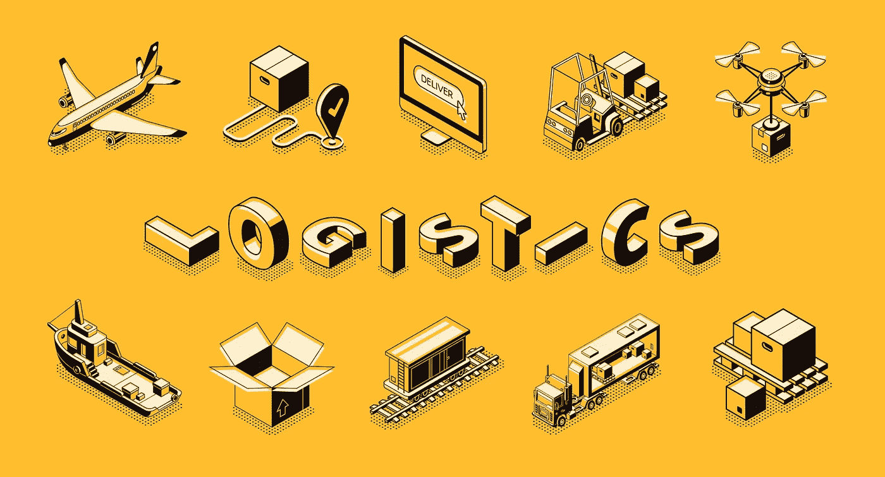
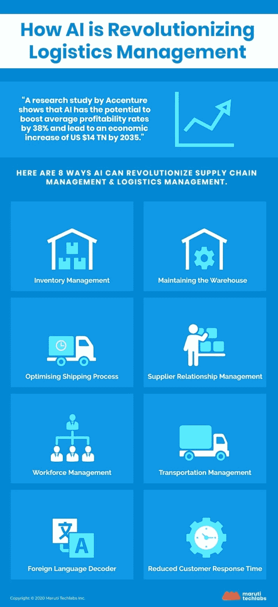

# 物流中的人工智能——最大化运营效率

> 原文：<https://pub.towardsai.net/artificial-intelligence-in-logistics-maximizing-operational-efficiency-e58ed5dacfbc?source=collection_archive---------0----------------------->

随着供应链行业日益增长的复杂性和互联性，人工智能和机器学习等技术已经成为物流管理的核心。全球各地的公司越来越多地实施人工智能来简化和优化物流和库存管理的处理。

> 计算机可以一次处理大量的数据，否则人类不可能在一个决策过程中处理这些数据。这就是为什么人工智能是供应链管理的福音。

使用大量数据集和应用智能算法，机器可以分析无限的可能性，从而制定有效的战略。人工智能将人为错误的风险降至最低。

> 简而言之，在 AI 的帮助下，运营效率可以最大化，成本可以最小化。根据该领域的高管和专家的说法，预测是明确的——人工智能将继续存在，并将在未来几年进一步改变这些领域。

以下阐述了人工智能变革供应链和物流管理的八种方式-

# 存货管理

没有正确维护的库存，任何企业都无法正常运营。库存过多和不足都是有害的。有了正确的库存管理系统，一个公司可以只专注于销售他们的产品，而不是管理其存储。

人工智能在库存管理中的一个至关重要的需求，除了它确保库存维持的能力之外，是它预测需求的能力。算法现在能够研究大量数据中的客户需求，并了解哪些商品很快会有需求，哪些商品可能不会引起足够的关注。这被称为“需求预测”,在世界各地的企业和在线平台上广泛使用。因此，企业可以提前做好准备并相应地进行盘点，而不是依赖实时需求。这已被证明是人工智能在物流领域最具革命性的方面。

# 维护仓库

随着人工智能中面部识别的兴起，机器现在能够处理安全问题。通过跟踪所有进出仓库的人，无人仓库很容易保持安全。此外，设备可以通过读取包装上的条形码来跟踪货架上的商品和离开仓库的商品，并相应地更新库存。

无人仓库受到了在线销售游戏巨头们的青睐。到目前为止，它们已经被证明在模拟人工仓库的方法中是有用的，同时通过消除人为错误而更加有效。

# 优化运输流程

当物品离开库存时，人工智能的有效性不仅仅会降低。它还用于预测最佳可能的运输路线。机器使用图论来预测运输路线，可以在最快和对公司最具成本效益之间取得平衡。这对于服务于多个客户的公司来说尤其方便，因为运输路线将被预测以最小化成本，同时最大化到达尽可能多的客户。

人工智能还能够预测交通状况和高峰时段的情况。这些都是影响公司发货时间的因素。通过避免高峰时段的交通和安排在交通最不繁忙的时段交付，可以确保他们的交付主管花更少的时间在路上等待，花更多的时间交付给更多的人。因此，有效性，进而利润最大化。

# 供应商关系管理

航运和物流管理并不是 AI 帮助维护的供应链流程的唯一阶段。任何企业最重要的一个方面就是它的供应商。确定合适的供应商并维护与这些供应商相对应的每个项目的清单是至关重要的。当根据需求补充库存或重新调整项目需求时，与供应商的关系是交易顺利进行的决定性因素。

人工智能可以监控供应商参数，如成本、信用评分、可量化的过去经验(如交付速度)，并为任何给定的情况创建最佳可能选项列表。这确保了业务的顺利运行，以及 it 和供应商之间的关系保持高效、公正和友好。

# 劳动力管理

有了一个有效的人工智能来管理你的供应链，对管理人员的依赖就会降到最低。然而，这不是人工智能在劳动力管理中的唯一用例。今天，人工智能被有效地用于招聘员工、对他们进行在职培训、监控日常表现、对他们的表现进行评级以及区分他们的优势和劣势，以确保每个员工都被分配到他们最适合的任务。

人工智能可以帮助一个组织更有效地规划其招聘和培训过程。这使得公司内部的日常交易能够顺利进行。这也使得工作分配更加合理，从而让员工更加快乐。

# 运输管理

许多企业通常与船运公司签订合同来运送他们的货物。一些更著名的公司，如亚马逊，也有自己的运输部门。正如我们已经讨论过的，当涉及到航运的时间和效率管理时，人工智能使整个体验更加顺畅。然而，人工智能还能做更多的事情。人工智能可以带走人类问题产生的所有问题。

每当有人驾驶送货卡车时，他们能够发挥作用的时间是有限的。在同一条路线上安排多个司机来满足 24×7 运输系统的需求是很昂贵的。这就是物流中的人工智能可以通过自动化全部驾驶功能来证明是一个救生员的地方。世界上门到门送货业务的巨头之一，亚马逊，已经对自动送货车表现出了极大的信心。[截至 2019 年，亚马逊对特斯拉竞争对手 Rivian 和自动驾驶初创公司 Aurora 的投资总额超过 10 亿美元。](https://www.therobotreport.com/amazon-autonomous-vehicle-invest/)如果这是可以预测的，我们可以有把握地假设，人工智能将逐渐在构建交通管理解决方案中发挥更加重要的作用。

# 外语解码器

世界是一个地球村。尽管有语言和文化的障碍，世界的每个地方都在消费其他地方提供的一切。作为当今的企业，你应该迎合全球的观众。因此，沟通不畅是一个常见的问题。不仅仅是公司和客户之间的沟通不畅，理解不同的产品或市场趋势也是一个问题。

但是，有了 AI，这个障碍就不存在了。此外，人工智能客户支持系统和聊天机器人也能够更好地处理外国客户，而不必麻烦企业雇佣太多的离岸支持高管。总的来说，人工智能让工作变得更容易。

# 缩短客户响应时间

人工智能的一个方面是，世界各地的企业正在利用它进军客户服务。[聊天机器人](https://marutitech.com/bot-development-services/)已经将客户响应时间减少到几乎为零，并将任何企业需要支持的客户服务代表的数量减少到最低限度。除了总是直奔主题、礼貌和实用之外，聊天机器人在与外国客户打交道时也是一种福气。他们不是企业支持的语言的母语使用者。人工智能确保了更快更有效的客户服务，聊天机器人是人工智能在物流领域的首批进步之一。

# 物流管理中的人工智能——需要改进

我们长期以来一直在讨论将人工智能作为企业供应链管理的一部分的优势。但是人工智能在物流的某些领域仍然需要改进。将人工智能集成到你的系统中的一个最大的缺点是让它们与大多数成熟企业工作的所有遗留软件一起工作。还有就是技能差距的问题。大多数在公司工作的员工都不太熟悉支持人工智能和人工智能系统的新时代脚本语言。这意味着企业必须找到合适的人才来管理他们的运营。

此外，目前形式的人工智能还不能完全自给自足。它仍然需要人的监督。鉴于人工智能系统处理的数据量巨大，系统中的任何错误都是至关重要的，如果他们完全依赖人工智能系统而没有备份，那么系统中的任何错误都可能会使企业遭受损失。与任何计算机软件一样，可能存在影响系统的安全问题。

然而，随着时间的推移，用[正确的专业知识](https://marutitech.com/)训练和更新人工智能模型可以为确定供应链管理领域的优势铺平道路。

# 一些使用人工智能的领先公司

# [劳斯莱斯](https://www.rolls-royce.com/media/press-releases/2017/03-10-2017-rr-joins-forces-with-google-cloud-to-help-make-autonomous-ships-a-reality.aspx)

早在 2017 年，劳斯莱斯就与谷歌合作建造自动驾驶船只。使用人工智能，就像自动驾驶汽车一样，他们试图创造可以在最少船员的情况下运行的船只。这个想法是用智能机器取代船员，这些智能机器可以装卸货物，在海洋中航行，而不需要人工干预。最终目标是使货物的运输和交付更加快捷。

# [UPS](https://www.pressroom.ups.com/pressroom/ContentDetailsViewer.page?ConceptType=Factsheets&id=1426321616277-282)

领先的包裹递送公司之一 UPS 使用名为 ORION(道路集成优化和导航)的人工智能 GPS 为其车队找到最快和最具成本效益的路线。根据客户、司机和车辆提交的数据，ORION 使用一种算法来检测每次送货的最佳路径。这是一个实时系统，根据当前的交通和其他条件修改路线。

# [大理石](https://www.marble.io/)

Marble 是一家物流公司，它将这一想法又向前推进了一步。它使用与自动汽车(LIDAR)运行在同一人工智能系统上的机器人将货物送到人们的家门口。它降低了司机的风险，对环境友好，是完成工作的一种快速和经济的方式。

# [血统](https://www.lineagelogistics.com/innovation-in-action/lineage-applied-sciences-team)

Lineage 使用人工智能来管理其仓库。该算法预测哪些物品将在仓库中停留更长时间，哪些将很快离开。基于这一点，停留时间长的东西放在后面，移动速度快的放在前面。使用这种方法，Lineage 的效率提高了 20%以上。

# 今后

在物流中使用[人工智能是一个相对较新的概念，尽管它似乎正在蓬勃发展，但截至目前只有极小比例的企业在使用它。在过去的五到六年里，](https://marutitech.com/artificial-intelligence-in-logistics/)[使用人工智能的组织数量几乎增加了两倍。到 2021 年，大约 80%的即将到来的技术将在人工智能中奠定基础。对人工智能的最大投资是作为供应链管理一部分的客户关系。超过 60%的人更喜欢与聊天机器人互动，而不是实际的客服代表。](https://cmo.adobe.com/articles/2018/9/15-mindblowing-stats-about-artificial-intelligence-dmexco.html#gs.zbe6tt)

> 尽管供应链已经占据了它的一大块体积，但人工智能几乎不限于仓库和自动驾驶汽车。当网飞或 YouTube 向你推荐一个视频，或者脸书向你展示一次类似于你已经关注了几个月的假日旅行时，它就会出现。人工智能是在我们的固定伙伴的背景下工作的，也就是我们的手机。AI 无处不在。

任何没有在物流中利用最佳人工智能的企业，无论是航运和物流管理还是运输管理解决方案，都只是放弃了增长和跟上竞争的机会。为您的企业选择正确的人工智能解决方案是走向未来成功的第一步。