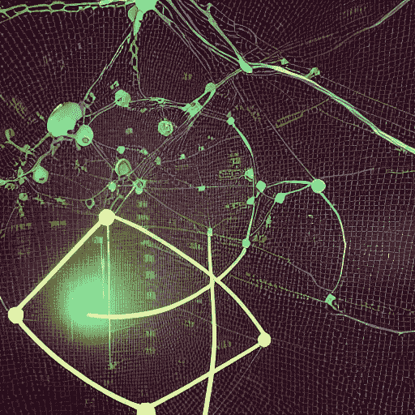
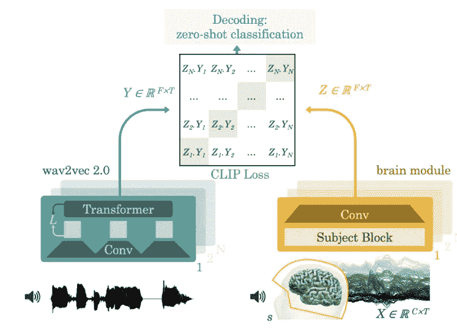
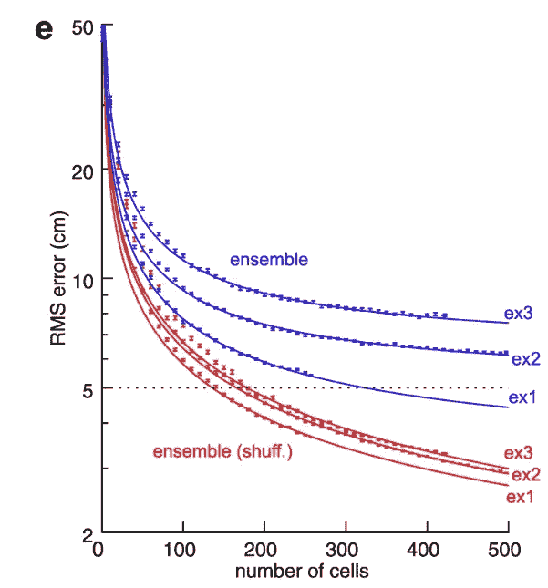

# 在神经科学、数据科学和机器学习的十字路口——第一版

> 原文：<https://pub.towardsai.net/at-the-crossroad-of-neuroscience-data-science-and-machine-learning-edition-1-e9dcfce56148?source=collection_archive---------3----------------------->

由[稳定扩散](https://beta.dreamstudio.ai/home)图像生成器使用标题作为提示创建的图像

欢迎阅读这份双周刊/月刊，在这里我回顾并总结了一些最近发表的研究论文。不同版本涵盖的所有论文都会以这样或那样的方式与机器学习、数据科学和神经科学相关联。

第一版将集中讨论三篇论文，涵盖以下主题:

*   单词在大脑活动中被编码了吗？一种新的深度学习架构，用于从脑电图记录中解码语音[1]。
*   大脑是如何回忆信息的？RNN 架构模仿了回忆信息任务时神经记录的一些特性[2]。
*   相关性如何影响神经网络中包含的信息？使用支持向量机解码器研究大脑记录中的噪声和相关性[3]。

# 从非侵入性大脑记录中解码语音——a . Defossez 等人[1]

单个单词在大脑活动中被编码了吗？作者使用 M/EEG 记录(非侵入性)结合深度学习架构来执行神经数据的零射击分类。该模型由两部分组成:

*   提取语音信号的上下文表示的预训练自我监督模型
*   代表大脑活动的卷积网络

图片改编自 arXiv 预印本([链接](https://arxiv.org/abs/2208.12266) ) [1]

这种完整架构的训练是使用对比损失方法来执行的。这种被称为 CLIP 的学习试图匹配两种不同形式的潜在表征，在这种情况下，是语音表征和大脑活动表征。对于每个正样本，采样 N - 1 个负样本，以便网络在训练期间学习将低概率映射到这些样本。这导致数据增加，因为网络将学习同时减少对错误答案的响应概率，而不是仅仅增加对正确样本的响应概率。

值得注意的是，作者试图使用回归成本函数，但提到[1]:

*我们推断回归可能是无效的损失，因为它偏离了…从大脑活动中解码语音*

我想阅读更多的研究论文，提及训练中出错的步骤，以及他们如何克服这些错误！

经过训练后，该网络能够在 3 秒钟的脑磁图信号上达到令人印象深刻的 72.5%的准确率(和 44%的最高准确率)，当指示哪个是与该大脑活动片段最可能对应的单词集时。这是神经科学人工智能领域令人兴奋的发展，因为它开辟了一条使用非侵入性大脑记录对语言进行实时解码的道路。

# 工作记忆任务期间前额叶大脑活动的递归神经网络模型——e . pi wek 等人[2]

在回忆信息时，大脑活动是如何组织的？最近对猕猴外侧前额叶皮层的记录[3]表明，刺激在延迟期间存在于垂直的神经子空间中。然而，在提示了应该考虑哪种刺激之后，这种表示转移到一个公共子空间，在该子空间中，提示处于平行平面中。

图片改编自 bioRxiv 预印本([链接](https://www.biorxiv.org/content/10.1101/2022.09.02.506349v1) ) [2]

在这篇论文中，作者研究了递归神经网络(RNN)在回忆任务中是否能表现出这种表征的转变。利用随机梯度下降对网络进行训练，该随机梯度下降基于最小化神经和网络活动之间的差异以及任务中的性能的成本函数。这是必要的，以确保网络不只是再现动态，而且实际上也在解决任务。

训练后，RNN 在提示出现之前呈现正交(独立)几何图形(b 图，上图)。这有助于最小化保存在内存中的不同项目之间的干扰。然而，在后线索间隔期间，RNN 中的表征以类似于实验结果的方式向平行子空间移动。这是有用的，因为现在可以使用相同的机制来执行信息的读出。

这项研究揭示了当 RNN 发展出与神经活动相似的几何结构时，大脑如何学习不同的表征属性。在训练期间在神经记录中寻找神经几何的转变打开了理解生物学习是否遵循与训练 rnn 相似的原则的大门。

# 神经整体活动中的噪声相关性限制了海马空间表征的准确性——o . Hazon 等人[4]

已知海马神经元编码环境中动物或对象的位置。然而，生物神经网络的一个固有特征是在活动中存在噪声和可变性。这就引出了一个关于网络编码能力的直接问题:神经元的噪声相关性会影响位置的解码吗？

事实上，如果噪声不相关，则有可能对所有神经元的所有动态进行平均，噪声将被平均，从而导致位置的准确解码。相反，在噪声相关的情况下，神经元的响应可能在进行平均时恶化，从而导致不准确的解码。因此，神经网络中单元之间的噪声相关性问题对于获取它们在信息检索中的效率是必要的。

作者分析了小鼠中多达 500 个同时存在的神经元的空间表示的准确性。为了获得噪声相关性对空间解码精度的影响，他们构建了支持向量机(SVM)来使用神经活动估计位置。为了测量噪声相关性对位置解码的影响，他们比较了具有混合跨试验神经活动(没有噪声相关性)和具有相关性的支持向量机的解码准确性。

图片改编自开放存取论文([链接](https://www.nature.com/articles/s41467-022-31254-y) ) [4]

他们表明，在噪声相关的情况下，解码误差达到渐近误差(大约 5cm，见上图)，但在不相关的情况下不会。因此，海马神经元表现出限制信息的噪声相关性，这是在量化任务学习期间的信息增加时需要考虑的必要特征。

# 参考

[1] Défossez，Alexandre 等人，“从非侵入性大脑记录中解码语音” *arXiv 预印本 arXiv:2208.12266* (2022)。

[2]皮威克、埃米莉亚·p、马克·斯托克斯和克里斯托弗·p·萨默菲尔德。"工作记忆任务中前额叶脑活动的递归神经网络模型." *bioRxiv* (2022)。

[3] Panichello，Matthew F .，和 Timothy J. Buschman。"共享机制是控制工作记忆和注意力的基础."*性质*592.7855(2021):601–605。

[4] Hazon，Omer 等，“神经集合活动中的噪声相关性限制了海马空间表征的准确性。”*自然通讯*13.1(2022):1–13。

*如果你想让我评论一篇特定的研究论文，请不要犹豫，把它发给我在 kevin.berlemont@gmail.com 的办公室，这样我可以看看它是否适合这篇时事通讯。*