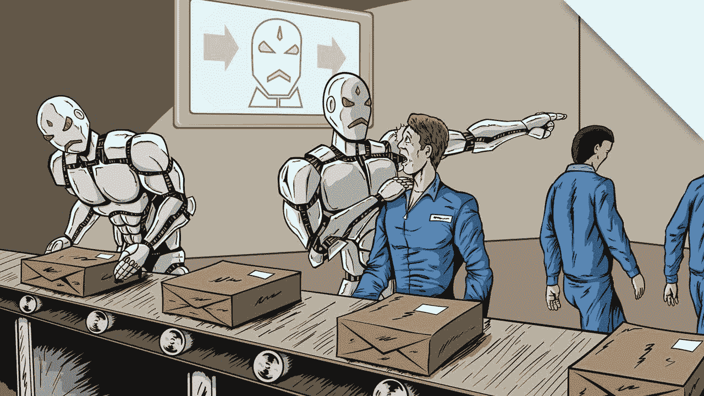
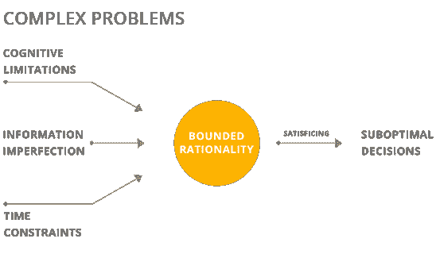
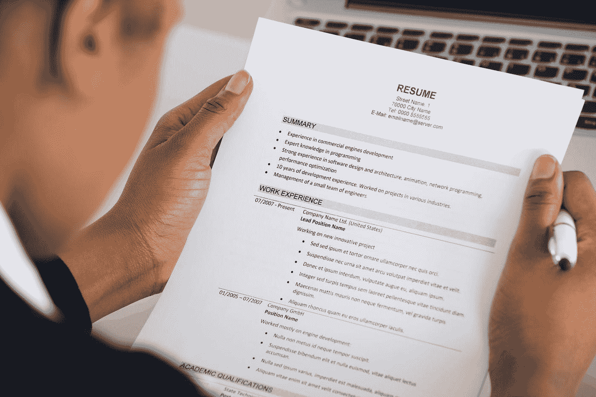
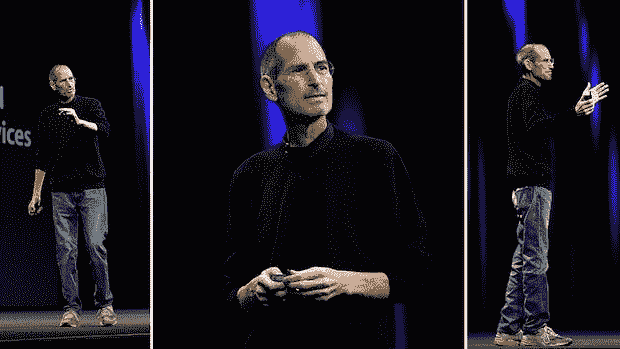
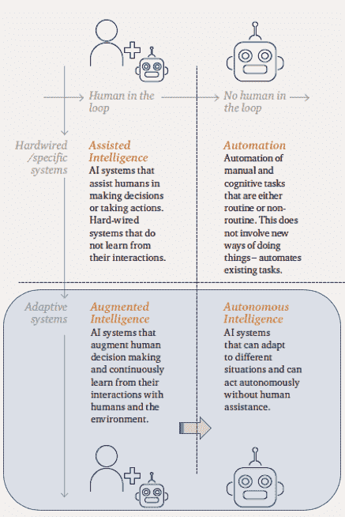
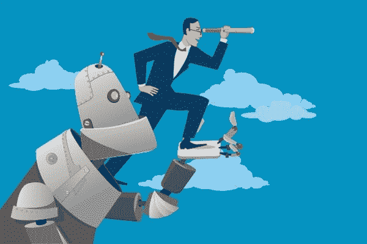
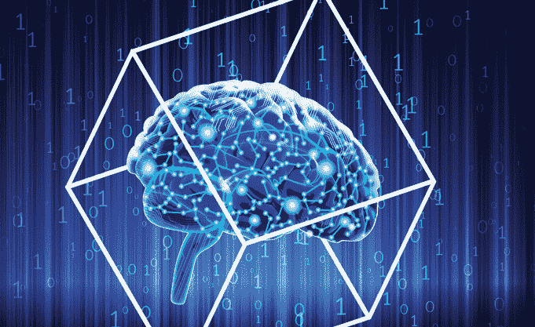

# 自主化:工作的未来

> 原文：<https://pub.towardsai.net/autonomization-the-future-of-jobs-330d36deb4db?source=collection_archive---------0----------------------->

# 决策案例

是啊，又一篇关于就业前景的文章！我的意思是它总是安全和容易的:如果有人正确地预测了这种类型的事情，他们会被记住，他们可以吹嘘它，如果他们犯了严重的错误，没有人会注意到！

在那个精彩的介绍之后，我要告诉你，你将要读到的内容本身并不是一个预测。相反，我试图从理论上回答当自主化成为一种规范时，工作会发生什么的问题。如果你想知道什么是自治，我之前已经在这里写了关于它的文章，但是不要担心，随着你继续阅读这篇文章，它会变得更加清晰。

以下是我的理论中论点的总结:

1-自主化，不像自动化，将会扰乱昂贵的活动，不管它们是*重复*还是*非*。

对公司来说，决策是一项容易产生成本的活动。鉴于决策者需要在短时间内处理大量信息，这变得更加困难。

3-无人帮助的决策可能存在偏见、公平等问题。

4-增强/自主决策(ADM)可以克服这些问题，但其风险应该降低。这是我们小组正在研究的最有趣的课题之一。

# 现状

每个机器人流程自动化(RPA)供应商和许多“未来主义者”都已经谈到简单和重复的任务(例如，文档处理、贷款处理、索赔处理)将在不久的将来完全自动化(如果还没有实现的话)。当你阅读这份[报告](https://www.capgemini.com/consulting-fr/wp-content/uploads/sites/31/2017/08/robotic_process_automation_the_next_revolution_of_corporate_functions_0.pdf)时，提供自动化服务的公司(姑且称之为*自动化提供商*)的关注点变得更容易理解了，该报告称“后台办公人员将高达 80%的时间花在重复性的手动任务上，降低了绩效和积极性。”因此，遵循帕累托原则，自动化提供商沿着“让我们自动化消耗 80%工人时间的 20%的流程，从而实现大约 90%的[成本节约](https://www.prnewswire.com/news-releases/software-robots-can-reduce-operating-costs-by-90-300217347.html)”的思路思考通过这样做，到 2030 年，三分之二的工作将至少有 30%的活动实现自动化。因此，如果你是一名电话推销员、会计、保险承保人、报税员、信贷员、出纳员、出租车司机等等，你可以猜测对你所拥有的一些技能的需求将会继续减少。

我敢打赌，我们大多数人可能已经知道或猜到了上述“预测”。我的观点是，到目前为止，自动化提供商的目标(有充分的理由)是自动化一些被称为“琐碎的许多”的东西。然而，还有一个更有趣的影响领域即将出现，一个人们没有谈论的领域——“至关重要的少数人”。也就是说，尽管人们关注的焦点是降低公司的直接人工成本(花在重复性事情上的时间)，但一个经常被忽视的成本来源是机会成本:“为了获得或实现其他东西而必须放弃的利益、利润或价值。”

# 决策和机会成本

让我们从一个例子开始:假设你有 1000 美元，打算存一年。你有两个选择，要么把它放在你的床垫下，要么把它放在银行里，每年收取 2%的利息。如果你决定选择第一个选择，你的机会成本将是 200 美元(如果你把钱存在银行而不是放在床垫下，你可能会得到这个数额)。

任何决策活动通常都有机会成本，有些可以忽略不计，有些非常重要。现实是，由拥有最佳信息和意图的聪明、负责任的人做出的重要决定，有时存在无可救药的缺陷。与此同时，*机会成本通常不会出现在公司的财务报表中*,因为有时很难计算如果在决策时选择了替代方案，成本会是多少。总机会成本是一个公司中所有琐碎和非琐碎决策的总和。这表明决策作为一项活动在任何公司都是多么重要。

问题是，如果你是任何级别的决策者，并且做出了好的决定，你就增加了做出更大决定的机会。也就是说，虽然您的资源(时间、您可以访问和处理的输入量、心智能力等等)没有变化，但是您要处理的输入量可能会因为问题域大小的增加而增加。这意味着更多的选择、更多的数据、更少的时间来进行详尽的研究，以及更大的风险，通常会给公司带来巨大的成本。

> 作为决策者，如果你做出了好的决定，你就增加了做出更大决定的机会。问题:虽然你作为一个人的能力没有改变，但由于问题的规模增加，你要处理的输入会变得更大。

[司马贺](https://en.wikipedia.org/wiki/Herbert_A._Simon)诺贝尔经济学奖得主将此解释为有限理性:大多数时候，当我们做决定时，我们无法获得所有需要的信息，但即使我们有，我们的大脑也只能正确处理一定数量的信息。人类的思维必然会限制自己。正如西蒙所说，它受到 [*认知极限*](https://www.economist.com/news/2009/03/20/herbert-simon) 的限制。随着公司在不同主题上生成和收集的数据量的增加，我们的认知极限将成为决策中的一个主要风险。事实上，这是迄今为止没有任何自动化提供商针对的公司活动类型的另一面！

# 无辅助决策

对于战略决策，有两种著名的管理风格:最大化和满意。第一种努力寻求期望最大利益的最佳选择，而第二种，*satisficing*(单词 satisfacting 和 Sufficing 的组合)旨在获得令人满意或适当的结果，而不是最佳解决方案。在这一领域已经做了很多研究，表明最大化者往往是[不太乐观](https://www.ncbi.nlm.nih.gov/pmc/articles/PMC5808237/)并且拥有[较低的自尊](https://www.scientificamerican.com/article/the-tyranny-of-choice/)。总的来说，有数据支持的共识是，最大化不可避免地导致失败的战略决策，而满意及其使用显然有助于战略决策的成功。

现在，我的问题是:所有的研究都是基于这样一个假设，即我们作为人类将独自做出这些决定(没有任何帮助),由于我们的*认知限制*,我们需要找到一个让每个人都开心的妥协*。*让我们来看看决策中“最佳实践”的一些典型结果:

# 公平

假设你计划在你的公司雇佣一名新员工。你创建了一个招聘广告，收到了大量的简历，其中 20 份似乎是不错的候选人。问题是你没有足够的时间面试 20 名候选人。你采取一种令人满意的策略，开始面试，比如说在第七次面试时，你看到一个看起来令人满意的候选人。

作为一名经理，这听起来很合理，但作为一名候选人，如果你是 13 个没有面试的人之一，你肯定会觉得受到了不公平的待遇。这种情况的另一个问题是，你可能会因为没有雇佣下一个甚至没有面试过的超级明星而给你的公司造成巨大的机会成本。

# 认知偏差

进化给了我们一个大脑，它在基于模式识别做出决策方面令人惊叹，这种模式识别将我们从危险中拯救出来:最好识别一只老虎，而不是成为它的晚餐！当在截止日期前工作时(这是大多数公司的常见原因)，模式识别系统可以很容易地在潜意识里拯救我们。回到招聘的例子，看着某人的简历，想“我以前见过这种类型的候选人”，当简历看起来有点像你的一个表现不佳的员工。这可能是[认定偏差](https://en.wikipedia.org/wiki/Sampling_bias)的一个典型案例。

当我们想要快速行动或处理太多信息时，有更多的认知偏差通常会影响我们的决策。需要明确的是，认知偏差是一种系统性错误，它导致我们的大脑走捷径，从而导致不合逻辑的思维或行为。诺贝尔奖获得者[丹尼尔·卡内曼](https://en.wikipedia.org/wiki/Daniel_Kahneman)在他的书*快速思考，慢速思考*中解释说，我们的大脑中有两个过程(系统)专门用于决策:系统 1 不由自主地运行，专门用于快速思考，并在我们每次做需要快速思考和反应的活动时处于控制之中(例如，阅读人们的面部表情)。当我们面临一个需要信息处理的问题(一个困难的数学问题或填写税务表格)时，系统 2 自发地工作，缓慢地思考并处于控制之中。当处理时间压力或大量信息时，我们的大脑选择系统 1 而不是系统 2 作为应对机制。

另一个例子:最近，你与一家猎头公司合作，通过这家猎头公司，你雇佣了一名员工，这名员工在与客户打交道时犯了一个非常严重的错误，导致他被解雇。如果对于你目前的招聘，你认为“我不会和猎头一起去”，那么你更看重的是你最近的经历，而不是猎头是有效招聘渠道的潜在证据。这被称为[可用性偏差](https://en.wikipedia.org/wiki/Availability_heuristic)。同样，类似于面试的情况下，我们需要在短时间内记住某人或某事，同时试图处理大量新信息，这很容易引发认知偏差，如[社会比较偏差](https://en.wikipedia.org/wiki/Social_comparison_bias)、[轶事谬误](https://yourlogicalfallacyis.com/anecdotal)和[群体外同质性](https://en.wikipedia.org/wiki/Out-group_homogeneity)。

最后一个著名的认知偏差通常会导致巨大的机会成本，它与对创新想法做出决策以及人们拒绝与既定信念相矛盾的新证据的倾向有关。没有什么比 Ignaz Semmelweis 自己的故事更能解释这一点了:19 世纪中期，他观察到在他的医院里由医生接生的母亲的死亡率与在附近诊所里由助产士接生的婴儿的死亡率有令人不安的差异(当由医生接生时，死亡率高得惊人！).Semmelweis 利用了许多科学上合理的做法，并从调查两家诊所之间的差异开始，这导致了他的假设，即进行尸检然后接生的医生将细菌转移给了母亲，因为他们没有洗手(是的，这在当时不是一种常见的做法)。他甚至进行了实验，证明用含氯溶液洗手可以显著降低感染率。然而，Semmelweis 洗手的想法受到了怀疑和敌意，并与“医生是绅士，绅士的手是干净的”的论点相抗衡，感觉他们作为绅士的社会地位受到了威胁！

# 决策疲劳

在他们的书《意志力:重新发现人类最大的力量》中，[鲍梅斯特](https://en.wikipedia.org/wiki/Roy_Baumeister)和[蒂尔尼](https://en.wikipedia.org/wiki/John_Tierney_(journalist))解释说，我们每天做出的大量决定(即使是平凡的决定)会导致经历“决策疲劳”，这会导致冲动的选择。这就是为什么我们更容易在一天的晚些时候做出糟糕的选择(例如，更有可能在晚上吃披萨、油腻的食物或更多的甜点)。

决策疲劳的影响已经在不同领域的各种研究中显示出来。例如，一项关于法律案件结果的研究表明，在一天开始时，法官可能会在大约 65%的情况下做出有利的裁决。然而，随着法官做出更多的决定，并在休息前接近决定阶段的结束，罪犯获得有利裁决的可能性稳步下降到零。然而，在每一次中断之后，它又回到了 65%左右！

信息过载很容易导致决策疲劳。对抗决策疲劳的一个策略是通过一个预先定义的系统来尝试一天中做决定的次数，这个系统会给你决策，而不是你来做。这一策略已经被一些公众人物所接受。这就是为什么史蒂夫·乔布斯、马克·扎克伯格和巴拉克·奥巴马选择每天穿相似的衣服来减少他们必须做出的决定。

# 增强/自主决策

多年来，机器一直被用于关键领域，作为自动化或辅助人类决策的手段。例如，计算机辅助诊断(CAD)已经在许多国家使用，通过自动检查病人的档案(例如，肺结核的胸部放射照相)对病人进行初步筛选。再比如飞机的自动驾驶功能，几乎可以在起飞和降落之间完全驾驶飞机。然而，在几乎所有情况下，一旦情况的复杂性增加，那些自动化系统就变得不切实际了。就在几年前，一些公司开始研究自主化而不是自动化，一个著名的例子是特斯拉推广的自动驾驶汽车想法。

那么，有什么不同呢？我们来看看下图。迄今为止，自动化提供商的重点一直是辅助智能和纯自动化。这两个类别都受到自动化本质上是静态的且通常是硬连线的这一事实的困扰，这意味着它不能通过与自动化系统外部的任何事物进行交互来适应新的情况或学习新的东西。

改编自*普华永道* [博客](https://blog.pwc.lu/dyk-artificial-intelligence-drive-gdp-gains/)

我认为，重点需要放在机器人可以从人类或其他系统学习并适应变化的基本情况上。然而，为了能够拥有一个端到端的链，覆盖图顶部案例的基本技能需要是您的系统所固有的(我想说的是，执行自动化的机制不同于它的决策部分，虽然是独立的，但您需要大脑来做出决策，也需要四肢来执行您的决策)。我认为，这种大脑与肢体、系统 1 与系统 2、满足者与最大化者的分离，是走向增强决策(ADM)的第一步。增强形式的 ADM 可以是这样一个系统，它为其人类对手提供可管理数量的计算决策备选方案，等待他执行更高层次的决策，这可能涉及抽象推理、情商、同理心、解释等。

我认为，展望未来，自动化决策的需求将显著增加。像 [X-Matik](https://x-matik.com/) 和 [Comma.ai](https://comma.ai/) 这样的公司已经开始将驱动程序作为外部组件提供，这是将自动化(在驾驶的情况下)从自动化机制中分离出来的一步。

ADMs 的好处是显而易见的。与我们人类相比，机器可以在短时间内分析来自分散来源的大量数据，具有更高的带宽。所以，不需要满足来应付环境。以下是辅助决策的一些其他高级优势:

*   流行度:知识和规则可以在 ADM 之间立即共享，这是埃隆·马斯克所说的舰队学习:“*整个特斯拉舰队就像一个网络一样运作。当一辆车学会了什么，他们都学会了。*“一般来说，ADM 比人类进化得更快。
*   没有决策疲劳:ADMs 像其他机器一样，不会疲劳，也不会因为饱和而停止工作
*   不容易产生偏见:机器没有感情或意识形态，而且在很大程度上，也不迷信。因此，与人类不同，它们不太容易产生一些众所周知的偏见。
*   准确性:机器通常可以更精确地输出计算结果，而且不容易出现测量错误。
*   速度:类似于计算机优于大脑的优势，ADM 将具有更快的速度，因为它能够执行快速计算。
*   可伸缩性:一个 ADM 可以很容易地复制到多个 ADM。
*   降低成本:ADMs 的总拥有成本在基础设施、开发、操作和维护的所有方面都必然会降低。

# 风险

所以，我们刚刚描绘的 ADM 的好处并不那么美好。几乎上面列出的每一个好处都有一个陷阱。但最大的风险是，由于 ADM 的速度和规模，即使是很小的问题也可能被放大成巨大的风险。

以下是 ADMs 面临的几类风险:

*   偏见:根据 ADM 的实现，它所做的决策可能会受到用于训练 ADM 的数据的巨大影响。由于现实世界的数据容易出现我们人类所具有的所有偏见、成见和偏好，ADM 可能会因学习这些数据而遭受损失。
*   可操作性:ADM 容易受到敌对攻击，这种攻击利用了对情况描述的轻微修改(很容易被人类检测到),可以欺骗 ADM，这取决于它的实现。
*   回音室:ADM 容易产生回音室，也可能产生回音室。如果某一类型的推荐决策的结果作为对同一系统的反馈(退化的反馈回路)具有显著的权重，则 ADM 更有可能在将来做出/推荐类似的决策。
*   道德:ADM 的价值观可能与其用户不一致，可能没有适用于所有用户的通用“价值”体系。

# 将来的

2015 年，在 NIPS 和 ICML 会议(最负盛名的机器学习会议)期间，约 350 名发表的研究人员预测，人工智能直到 2028 年左右才会击败最优秀的人类围棋选手。我们都知道这有多准确(2016 年 AlphaGo 击败了[围棋大师柯基](https://www.zdnet.com/article/googles-alphago-retires-after-beating-chinese-go-champion/))。我并不是说这可以用任何可证明的方式来概括，但它肯定会使下面的[预测](https://www.bbc.com/worklife/article/20170619-how-long-will-it-take-for-your-job-to-be-automated)更有趣:卡车司机到 2027 年将成为多余的，人工智能到 2031 年将超过人类的零售能力，到 2049 年写出畅销书，到 2053 年做外科医生的工作。

我认为，在不久的将来，面向流程的工作将会受到 RPA 的影响。事实上，流程提供商公司(如 SAP、Oracle、IBM 等)将开始考虑向其客户提供“虚拟流程工人”作为电子劳动力。要实现这一目标，投资 RPA 是不够的。虚拟流程工作者需要能够处理新情况、适应新情况、做出决策等等。这就是为什么 ADMs 只会越来越重要。如果我们把所有这些放在一个预测中*自治*(使自动化自治的过程将会上升)。

自主化的目标是在缺乏人际互动的情况下创造一种类似人际互动的体验(而不是将人类从体验中移除)。举个浅显的例子，不是每个人都有足够的钱雇一个私人助理来处理他们的日程安排(让我们假设这就是私人助理的工作)。Siri、Alexa 和 Cortana 在一定程度上为你提供了类似人类的交互。作为自治化大旗下的一个话题，ADM 有必要走出那种浅薄的经验。

自主化是一个多学科的主题，它包括来自不同领域(如神经科学、心理学、免疫学、经济学、哲学、计算机科学)的思想的交叉授粉和交叉检查，以帮助我们创建拥有类似人类能力的实体，如决策、收集洞察力以及在实现目标时进行合作或竞争。

> 自主化的目的不是将人类从我们的体验中移除，而是在缺乏的时候增加一种类似人类的体验！

# 感兴趣吗？

你可以通过 Linkedin @pirzadeh 联系我。有许多伟大的研究人员和技术人员认识到了这个主题的重要性，并正在推动它向前发展，如果你有兴趣关注他们，我推荐你关注剑桥大学未来智能中心的副研究员@Jess Whittlestone、谷歌的决策科学家@Cassie Kozyrkov 和微软的首席研究员 Solon Barocas。